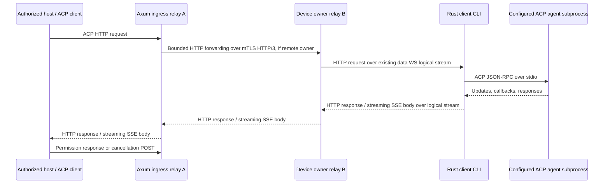

# ACP over HTTP through the device tunnel

Status: implementation design, researched 2026-09-09. Nothing in this document starts an agent today. ACP means **Agent Client Protocol**. A remote host will use the relay's HTTP endpoint to operate an explicitly exported agent supervised by the Rust client CLI.

## Compatibility target

Use stable **ACP v1** JSON-RPC messages. Its established local transport is newline-delimited UTF-8 JSON on a subprocess's stdin/stdout. The official transport page still describes Streamable HTTP as a draft. [ACP v1 transports](https://agentclientprotocol.com/protocol/v1/transports)

For the remote HTTP binding, target the upstream **Streamable HTTP & WebSocket Transport RFD**. This is an experimental upstream transport, not a claim of a finalized standard. Prefer the official Rust `agent-client-protocol` and `agent-client-protocol-http` crates behind a narrow adapter. Pin exact dependency versions and the upstream transport source in the implementation PR; a package version is not an ACP wire version. [Transport RFD](https://agentclientprotocol.com/rfds/streamable-http-websocket-transport), [Rust SDK](https://github.com/agentclientprotocol/rust-sdk)

**Corrected 2026-09-17 (M8-01, defect M8-C01).** This paragraph previously named "its last listed revision, **2026-05-04**" as the baseline. That was already wrong on the 2026-09-09 reading that produced this document: the RFD's revision history ends at **2026-07-02**, with 2026-06-05 before it. The pinned revision is 2026-07-02, at an immutable commit, and the one point where the pinned SDK goes beyond it is recorded in [sources.md](sources.md#acp).

ACP v2 remains draft and changes prompt completion semantics. Keep it disabled until a separate version profile and fixtures exist; never interpret a v2 prompt acknowledgment as v1 turn completion. [ACP v2 announcement](https://agentclientprotocol.com/announcements/acp-v2-draft)

MCP provides tools/resources to agents; ACP controls an agent conversation, including updates and requests back to its client. Share bounded HTTP forwarding infrastructure with [MCP](mcp.md), but keep initialization, permissions, cancellation, session state, and compatibility tests separate. MCP-over-ACP is a separate optional upstream feature and is outside the first ACP milestone.

## Routing and ownership



The client CLI owns the ACP HTTP connection/session state, callback registry, and child process. Run its HTTP handler as an in-process Rust service against tunneled requests; **no inbound device port or loopback HTTP listener is required**. Reuse the SDK's Axum/Tower integration where its tested API permits this. A compatibility spike must demonstrate streaming request/response bodies without starting a listener.

Each HTTP exchange is one logical tunnel stream. An SSE GET keeps its stream open while POST exchanges use other streams. All payload bytes travel on the existing device data WebSocket; the control WebSocket carries admission, bounded cancellation metadata, and health only. Scheduled rotation preserves these streams. The device remains at two steady-state sockets, with the documented temporary third socket during rotation.

Use the [shared `http-forward/1` encoding](http-forwarding.md): bounded JSON request/response heads, raw body records, END, and the outer tunnel FIN/RESET. It fixes field/record sizes, directional ordering, path/header validation, streaming and failure behavior. Preserve HTTP boundaries independently of tunnel frame boundaries; backend credentials stay local. ACP lifecycle and session/callback state remain separate from that codec.

Ingress derives tenant/principal from host authentication. Owner forwarding carries canonical tenant, principal, device, service, grant version, epoch, request ID, and deadline in authenticated internal metadata. Ignore consumer-supplied internal identity headers. The owner validates its lease/fence; the CLI binds each HTTP request to that context and intersects the grant with local policy. See [cluster.md](cluster.md). Device-to-relay WebSockets use device mTLS; peer HTTP/3 uses relay mTLS; host HTTP uses its independent scoped bearer/API credentials. None substitutes for the others.

Keep one child per authorized ACP transport connection by default. Several sessions within it belong to one principal and one service/workspace policy. Never share a child between users merely because its executable and working directory match. Connection and session IDs are opaque routing identifiers, never credentials.

## Public HTTP contract

The selected service is the agent/workspace export. Its advertised endpoint is:

```text
/v1/devices/{device_id}/services/{service_id}/acp
```

The upstream draft baseline is:

| Exchange | Intended behavior |
| --- | --- |
| POST `initialize`, no connection header | JSON response, HTTP 200; server returns `Acp-Connection-Id` |
| GET with `Acp-Connection-Id` | Connection-scoped SSE for connection messages |
| GET also with `Acp-Session-Id` | Session-scoped SSE for that session |
| Other POST | HTTP 202; JSON-RPC result arrives on its GET stream |
| Session-scoped POST | Both identity headers; body session ID must agree |
| DELETE with connection header | HTTP 202; terminate the connection |

Use HTTP/2 for the external Streamable HTTP profile. POST uses `application/json`; GET accepts `text/event-stream`. The draft rejects batches with 501 and also offers a WebSocket upgrade on the same endpoint. External WebSocket compatibility can follow the HTTP milestone; it is independent of the mandatory device WebSockets. [Upstream HTTP binding](https://agentclientprotocol.com/rfds/streamable-http-websocket-transport)

**The pinned SDK does not reject batches** (M8-C02). Its 2.0.0 release added batch preservation across the HTTP and WebSocket transports, so it accepts and routes what the RFD answers with 501. Agent Tunnel's profile follows the RFD, which is the stricter behaviour; a later chunk that runs the SDK's own client or server through this profile meets the disagreement and must decide it explicitly rather than discovering it.

Agent Tunnel policy adds authentication and bounded admission around that binding. Authenticate every request, SSE subscription, and status lookup, including renewed credentials for an existing connection. Bind connection/session ownership to the authenticated principal, tenant, device, service, and policy revision. Renewing a token cannot transfer a connection to a different principal. Revocation or token expiry closes its event streams and begins child cleanup.

Check content type, method shape, required headers, body/header consistency, negotiated capabilities, pending-request limits, and exact session ownership before dispatch. Return 400 for inconsistent routing, 401 for missing/invalid credentials, 404 for nonexistent or inaccessible connection/session, 406/415 for representation errors, 409 for conflicting live requests/subscribers, 413 for oversized messages, 429 for quota exhaustion, and 503 for offline/unavailable routes. Errors that occur after dispatch preserve an ambiguous outcome where appropriate.

Expose bounded service discovery metadata for `acpProtocolVersions`, `httpTransportProfile`, supported content/callback capabilities, limits, and an authorized workspace's agent-visible `cwd`. These are Agent Tunnel manifest fields, not additions to ACP's `initialize` response. Do not disclose host absolute paths beyond the granted export.

Start with a server-to-server host profile using Authorization headers. Browser access is a separate gate: explicit Origin allowlist, non-wildcard CORS, credential policy and CSRF tests, streaming fetch capable of headers, and no bearer tokens in URLs. Native EventSource's header limitations must not be solved with query-string secrets.

## A complete v1 conversation

These are original synthetic examples using the verified ACP v1 field shapes. Headers and HTTP status are outside the JSON-RPC payload. No custom JSON wrapper surrounds ACP messages.

Initialize the allowlisted export and open its connection GET before creating a session:

```json
{"jsonrpc":"2.0","id":"init-1","method":"initialize","params":{"protocolVersion":1,"clientCapabilities":{},"clientInfo":{"name":"tunnel-fixture","version":"0.1.0"}}}
```

The SDK negotiates capabilities and the bridge refuses an unsupported result version. Only advertise client filesystem, terminal, authentication-terminal, or elicitation capabilities when the host actually implements them and service policy permits them. An empty capability object in this example deliberately requests none of those optional surfaces. [Initialization](https://agentclientprotocol.com/protocol/v1/initialization)

After successful initialization, POST with the returned connection header:

```json
{"jsonrpc":"2.0","id":"new-1","method":"session/new","params":{"cwd":"/workspace/demo","mcpServers":[]}}
```

The connection GET receives:

```json
{"jsonrpc":"2.0","id":"new-1","result":{"sessionId":"session-demo"}}
```

`cwd` is the absolute agent-visible path of a configured workspace. It must match the service's allowed workspace; the host cannot select arbitrary paths. Start with empty consumer-supplied `mcpServers` and reject nonempty values, remote commands, environment overrides, and extra workspace roots. Later configured MCP attachments require their own policy and capability gate. [Session setup](https://agentclientprotocol.com/protocol/v1/session-setup)

Open the session GET with both headers before POSTing:

```json
{"jsonrpc":"2.0","id":"prompt-1","method":"session/prompt","params":{"sessionId":"session-demo","prompt":[{"type":"text","text":"List the synthetic fixture files."}]}}
```

The session GET can carry both updates and requests from the agent:

```json
{"jsonrpc":"2.0","method":"session/update","params":{"sessionId":"session-demo","update":{"sessionUpdate":"agent_message_chunk","content":{"type":"text","text":"Reading the fixture listing."}}}}
```

```json
{"jsonrpc":"2.0","id":"permission-1","method":"session/request_permission","params":{"sessionId":"session-demo","toolCall":{"toolCallId":"tool-1","title":"Read fixture directory"},"options":[{"optionId":"permit-one","name":"Allow once","kind":"allow_once"},{"optionId":"deny-one","name":"Reject once","kind":"reject_once"}]}}
```

The host POSTs its response to that same endpoint with both headers:

```json
{"jsonrpc":"2.0","id":"permission-1","result":{"outcome":{"outcome":"selected","optionId":"permit-one"}}}
```

Validate the response against the outstanding callback, principal, session, direction, and offered option. `allow_once` is an option kind, not the top-level response outcome. Tool titles/descriptions cannot grant access. Default policy requires an explicit allowed response; timeout/disconnect never means permission. [Permission contract](https://agentclientprotocol.com/protocol/v1/tool-calls)

The prompt's final response is delivered on the session GET:

```json
{"jsonrpc":"2.0","id":"prompt-1","result":{"stopReason":"end_turn"}}
```

To cancel, POST the notification below; it has no request ID:

```json
{"jsonrpc":"2.0","method":"session/cancel","params":{"sessionId":"session-demo"}}
```

The bridge resolves pending permission callbacks with `{"outcome":{"outcome":"cancelled"}}`, forwards cancellation, and waits for the original prompt response. Accept remaining updates until that response. A confirmed cancelled turn has `stopReason: "cancelled"`; a lost process cannot confirm cancellation. [Prompt lifecycle](https://agentclientprotocol.com/protocol/v1/prompt-turn)

Support `$/cancel_request` separately where the pinned SDK implements it, with direction-aware correlation. It does not replace `session/cancel`. [Request cancellation](https://agentclientprotocol.com/protocol/v1/cancellation)

## Correlation, callbacks, and operation outcomes

Scope JSON-RPC IDs by `(tenant, principal, device, service, connection, direction)`. Keep their string/number type. IDs need only be distinct while outstanding in their direction; identical host and agent IDs must coexist. Map each request to its session explicitly; responses often contain no `sessionId`. Session method callbacks return through POST and must not be mistaken for new invocations.

Maintain one bounded callback table per connection. The first valid response resolves a callback atomically; duplicate/late responses cannot repeat a decision. Route permission and supported elicitation requests to the host. Forward optional filesystem/terminal callbacks only when negotiated and explicitly permitted: those refer to the ACP client's environment, which is the remote host, not implicitly the enrolled device. Device VFS is a separate service. Default terminal/auth-terminal capabilities are disabled; never automatically execute agent-provided commands or open authentication URLs.

Use the existing Agent Tunnel operation facility for bridge outcomes, outside ACP:

```text
GET /v1/operations/{operation_id}
```

For JSON-RPC requests, generate an operation ID before dispatch and expose it in `X-Agent-Tunnel-Operation-Id` on the HTTP response. Persist/retain only the bounded outcome metadata promised by the shared operation store. Record request correlation, admission, dispatch, and terminal result separately. HTTP 202 means accepted by the bridge, not that an agent finished or committed an action.

States follow [protocol.md](protocol.md): `accepted`, `running`, `succeeded`, `failed`, `cancelled`, `outcome_unknown`. Store a sanitized error code and whether dispatch may have happened. `succeeded` describes the ACP request completing, not proof that every underlying tool succeeded. An ACP error or cancellation also cannot roll back earlier effects. Status lookup requires the original grant; an absent/expired record never proves the operation was not executed.

Do not retry POST automatically after forwarding might have begun, including initialization, prompt, session creation, permission response, or DELETE. JSON-RPC IDs are correlation IDs, not durable idempotency keys. A duplicate ID while still pending receives a conflict before dispatch; reuse after completion is legitimate ACP and cannot be treated as cross-restart deduplication. If the HTTP acknowledgment and operation ID were lost, report delivery uncertainty and end/reconcile the connection; never manufacture an exactly-once guarantee. GET/status may retry only under their documented lifecycle.

## Reconnect and failure policy

The initial HTTP profile has **no SSE Last-Event-ID replay**. Tunnel byte replay during a retained device stream is different and deduplicates before the HTTP handler. Ordinary data-socket rotation therefore leaves ACP connections, sessions, requests, callbacks, and GET streams intact.

Allow exactly one connection subscriber and one subscriber per active session. Reject a second with 409; do not silently replace or fan out. Require the connection GET within 10 seconds of initialization and a session GET within 10 seconds of its creation; reject session prompts until that subscriber is ready. Charge pre-subscription messages to the same bounded queues.

Once an established required SSE stream breaks, terminate that ACP transport connection in v0: refuse new prompts, resolve pending permissions as cancelled, request cancellation of active turns, close streams, and clean up the child. A reconnect must initialize anew. This conservative lifecycle prevents silent output gaps when the draft offers no resume cursor. An SDK's ability to reopen GET alone is not evidence that missing events were recovered. Record this policy in discovery and prove how the selected upstream client surfaces it.

Agent-native `session/load` or `session/resume` is optional application recovery, only with its negotiated capability and an authorized stored session/workspace mapping. A raw session ID from another connection is insufficient. First release can deny cross-connection loading until the agent's history store is proven to isolate users. Loading history never resubmits an ambiguous prompt.

If device control/owner state is lost, apply the tunnel's bounded resume/fencing policy. Do not restart a child to hide a transport failure. A recoverable retained stream can continue; a reset connection or lost process marks dispatched unresolved work `outcome_unknown`. Relay failover does not recreate lost HTTP request bodies, live SSE delivery, or agent memory. Redis peer records do not provide ACP persistence.

## CLI process policy and cleanup

An ACP service configuration will contain a stable service ID, absolute executable, fixed argument vector, local secret references, workspace/sandbox profile, allowed ACP methods/capabilities, maximum children/sessions, and deadlines. These are planned fields; existing example TOML does not implement them. The CLI's local export/disable/stop commands govern exposure. Host HTTP input cannot install agents, select an executable, add arguments, inject environment, or switch workspaces.

Run as the configured unprivileged identity. Use a dedicated child state directory per principal/connection and an explicit minimal environment; never inherit unrelated device secrets. Provider login is local provisioning, separate from host relay authentication. Permission callbacks are not a security sandbox: a coding agent may access files or execute commands itself. A restricted workspace guarantee requires a tested OS sandbox/container/VM profile with filesystem, process, and network restrictions. Until one exists, label that platform's ACP export as trusted-agent execution and do not claim filesystem confinement from `cwd` alone.

One supervisor task owns child startup, stdio, session/callback state, cancellation, and shutdown. Use bounded channels and a pure lifecycle model (`starting`, `ready`, `draining`, `stopped`, `failed`). A separate reader must keep handling agent callbacks while a prompt is pending; no mutex may remain held across arbitrary child/network I/O. Keep stdout protocol-only and drain stderr into a capped diagnostic sink, with payload logging off by default.

On shutdown, revocation, deadline expiry, subscriber loss, or disabled export: stop admission; cancel pending permissions/turns; allow a bounded grace period; close stdin; terminate the child process group/job; then kill and reap remaining descendants. Include platform-specific process-tree tests. A child crash closes the transport and invalidates live sessions; never automatically replay its input into a replacement child. Retain only scoped outcome metadata and remove temporary files/handles according to local policy.

## Initial bounds and diagnostics

These configurable starting values need load validation and must fit the tunnel's aggregate budgets:

| Limit | Starting value / behavior |
| --- | --- |
| ACP JSON message including one stdio line | 1 MiB; reject before unbounded reassembly |
| Sessions per ACP connection | 8; one active v1 prompt per session |
| Pending host requests / agent callbacks | 16 each per connection |
| Buffered ACP output across sessions | 2 MiB per connection, also charged to device/global budgets |
| Child startup / initialize | 10 seconds each |
| Permission response | 60 seconds, then cancel the prompt and pending permission |
| Prompt wall time | 30 minutes default; explicit policy override |
| Output credit stall | 30 seconds, then cancel/close; never drop an event and continue |
| Idle connection | 15 minutes without application activity; SSE heartbeats do not extend it |
| Cancellation / child exit grace | 10 seconds each, then forced cleanup |
| Outcome metadata retention | 10 minutes after terminal state, capped by tenant/global quotas |

Reserve bounded capacity for cancellation and permission replies so output backpressure cannot deadlock the bridge. Apply per-device/principal child limits before spawning. Cap stderr and never block child exit waiting for an unbounded log consumer.

Trace the HTTP request ID, operation ID, tenant/device/service, owner epoch, logical stream, ACP connection/session, request direction, method, queue age, dispatch boundary, and outcome. Do not log prompts, agent thought chunks, files, images, permission bodies, credentials, or raw stderr by default. Measure active children, pending permissions, request latency, output stall time, cancellation latency, restarts, and unknown outcomes without unbounded-ID metric labels.

## Implementation slices and acceptance gates

1. **Pin and prove the binding:** select the official Rust HTTP/core SDK releases and record immutable transport/schema sources. Run an official HTTP client against an in-process deterministic stdio agent through the handler. Verify exact SSE event encoding, connection headers, `session/new`/`load` response routing, 202 semantics, deletion, and unsupported profiles. Resolve RFD shorthand against the normative v1 schema; never copy its abbreviated `request_permission` example as a real method name.
2. **Pure lifecycle and supervisor:** test ID direction/type collisions, permission response races, session readiness, capability enforcement, one active prompt per session, deadlines, stderr floods, malformed/oversized stdout, child startup failure, and process-tree cleanup. Use synthetic fixtures with no model credentials.
3. **Real tunnel vertical slice:** official host HTTP client → Axum → rotating device WebSockets → in-process HTTP handler → fixture agent. Initialize, create sessions, prompt, stream, permission allow/reject/cancel, complete, and DELETE. Keep at least two sessions active through three rotations without lost updates, duplicate callbacks, repeated side effects, or extra device sockets.
4. **Cluster and isolation:** use three relays, force ingress to a non-owner, route POST and long-lived GET over mTLS HTTP/3, rotate peer keys, kill the owner, and revoke grants. Two users reuse identical ACP IDs; unauthorized sessions, forged internal identity headers, stale owners, and mismatched session headers must never reach another process.
5. **Failure and operability:** drop HTTP acknowledgments, break each SSE stream, stop consumers reading, exhaust quotas, deny callbacks, crash children after recorded fake side effects, and interrupt device control. Prove terminal/unknown states and no automatic prompt replay. Confirm packet/trace evidence shows HTTP/SSE uses the existing data socket, and that no local inbound port is open.

Release gates require real pinned SDK interoperability, bounded-memory evidence, clean CLI installation and process cleanup on each supported OS, and documented capability coverage. Rust validation remains `cargo fmt --all -- --check`, `cargo clippy --workspace --all-targets --locked -- -D warnings`, and `cargo test --workspace --locked`. Future live-agent smoke tests use dedicated workspaces/VMs with explicit credentials; no test controls the user's active desktop.

## Pinned in code (M8-01)

`crates/tunnel-acp` resolves the profile points this document leaves open. It is pure: no sockets, no child process, no Axum, no clock. **It establishes no interoperability**; the exact artifacts, their checksums and the revision reconciliation are in [sources.md](sources.md#acp).

- **Profile identifier** `acp-http-v1`, selected the way MCP's profiles are: relay `[http_forward]` configuration plus the catalog service capability `http_forward_profile`.
- **Routes.** `POST`, `GET` and `DELETE` at the single export-local path `/acp`. `PUT`, `PATCH`, `HEAD` and `OPTIONS` are not routed; a trailing slash, a different case and any query are refused by the codec.
- **HTTP/2 only.** An HTTP/1.1 consumer is `HttpVersionNotAllowed`, which carries `HTTP_UNSUPPORTED_FEATURE` — a distinct rule and code from an unadvertised route, and from a batch.
- **Request headers**, each a singleton: `content-type`, `accept`, `acp-connection-id`, `acp-session-id`, `tunnel-principal-binding`. The last is not an ACP header: the ingress derives it per principal, exactly as for `mcp-2025-11-25`, and it is request-direction only.
- **Response headers**, each a singleton: `content-type`, `cache-control`, `x-accel-buffering`, `acp-connection-id`. A response may **not** carry `acp-session-id`: a new session's identifier is returned in the `session/new` response body, and a second header-borne source of session identity would not be validated.
- **Message rules.** One strict JSON object (duplicate member names compared after unescaping, invalid UTF-8, lone surrogate escapes, raw control characters, depth above 64 and trailing data all refused), `jsonrpc` exactly `"2.0"`, an `id` that is a string or an integer, and `params` an object. A top-level JSON array is a **batch** and is refused with **501** by its own code, decided from the first non-whitespace byte, so a malformed batch is still refused for being a batch.
- **Version negotiation.** Only protocol version 1. Any other integer, v2 included, is refused with its own code and a `supported: [1]` payload, in both the `initialize` request and its result; a non-integer is a separate shape rule.
- **A v2 prompt acknowledgement is not a v1 turn completion.** A `session/prompt` result with no `stopReason` is refused by a rule of its own rather than deserializing as a finished turn. The accepted path runs the pinned crate's own `PromptResponse` deserializer and `StopReason` vocabulary.
- **Methods.** `initialize`, `session/new`, `session/load`, `session/prompt`, `session/cancel`, `session/update` and `session/request_permission`, every name read from the pinned schema's tables rather than retyped. There is no prefix or wildcard rule. The RFD's abbreviated `request_permission` resolves against the normative `session/request_permission` for reading the RFD, and **is not itself an accepted method**.
- **Limits.** Finite and bounded: 1 MiB request body, 1 MiB JSON response, 64 MiB cumulative SSE response, with ceilings and no unlimited sentinel.
- **Evidence.** `scripts/acp-guard-deletion.py` defeats each of these rules in turn; 31 of 31 measurable guards turned a test red, and the one remaining guard — `unstable_protocol_v2` staying off — is enforced by the compiler and reported separately rather than counted as a red test.
- **Not proven.** Everything else. No HTTP handler, no SSE stream, no connection or session state, no child process, no tunnel, and no run against any ACP implementation.

## Implemented in code (M8 chunk 2)

Chunk 2 adds the **pure lifecycle** (`crates/tunnel-acp/src/lifecycle.rs`), the **supervisor** (`crates/tunnel-acp-export`) and a **deterministic synthetic stdio agent** (`crates/tunnel-acp-fixture`). It adds no HTTP, no SSE, no session over the wire, no tunnel, no relay and no run against any ACP implementation; those remain chunks 3 to 5. Everything chunk 1 declined to claim is still unclaimed.

- **The lifecycle is clock-free.** `CallbackTable::observe(now)` and `AcpConnection::subscriber_wait(id, now)` take a caller-supplied monotonic reading, exactly as `tunnel-http-forward`'s `RecordDeadline` does. No library path reads `Instant`. The only clock is the supervisor's, on the impure side of the boundary.
- **JSON-RPC ids are scoped by `(tenant, principal, device, service, connection, direction)`**, and keep their JSON type. Identical host and agent ids coexist; two tenants may reuse one id on the same device and service; `"1"` and `1` are different requests; a duplicate id in one scope is refused **before dispatch** by `ACP_DUPLICATE_PENDING_ID`; and an id reused after completion is accepted, because that is legitimate ACP and not cross-restart deduplication.
- **A callback resolves exactly once.** The first valid response removes the entry atomically; a duplicate, late or forged response finds nothing and is refused by `ACP_UNKNOWN_REQUEST_ID`. A resolution counter is asserted to stay at one across a duplicate that would have reversed the decision.
- **A permission timeout resolves as cancelled, never approved.** The expiry path constructs `PermissionOutcome::Cancelled` and has no branch that produces a selection. It is **observed and elapsed**: against a bound shortened to 150 ms, the measured elapsed was **160 ms** (supervisor clock) with the test's own wall clock at 160 ms, and the **agent itself** recorded receiving `cancelled` in a workspace marker file — the supervisor's belief about what it sent is not evidence that the agent received it. A late host approval after the deadline is refused.
- **The bounds are exact at the boundary and refused one beyond:** 8 sessions per connection and 16 pending requests per direction, both in the pure table and against a real child (one turn asking for seventeen permissions admits sixteen and refuses the seventeenth with `ACP_PENDING_LIMIT`, while the host direction still has only the one prompt outstanding). One active prompt per session, with a second refused by `ACP_PROMPT_ALREADY_ACTIVE` rather than by any other rule.
- **The child lifecycle is a transition table**, not a label: `starting`/`ready`/`draining`/`stopped`/`failed`, where `stopped` is reachable only through `draining` and a child that vanished while still admitting work is `failed`. No event leaves a terminal state.
- **The child's stdout is protocol-only.** An oversized line is refused *before* the append, so it is never reassembled; a malformed line, a **batch** and an unaccepted method each end the child by their own `AcpRule`, and the test asserts the rule rather than that something ended. Each kills the child.
- **A stderr flood is drained and counted without blocking child exit.** 4 MiB flooded, 4 MiB counted exactly, the cap reported once, the turn still completed and the child still exited. Nothing of stderr is retained, forwarded or logged.
- **A process-group `SIGKILL` on every end the supervisor lives to see**, through `rustix`, keeping `forbid(unsafe_code)` — including the ends that run none of this crate's async code. A `/bin/sh` wrapper's `sleep` grandchild is confirmed dead **by reading the process table** in five different endings: after `drain()`, after the child was killed for bad output, after the child **exited by itself**, after the `Supervisor` was **dropped without draining**, and after the **tokio runtime was torn down** with the supervisor still live. The last three were added by the M8-C07 review, which found three processes still alive after a guard run: the deadline ticker looped forever holding an `Arc<ChildHandle>`, so the handle's `Drop` never ran, and the group signal existed only inside a task that a torn-down runtime drops rather than runs. The signal is now sent **synchronously in `ChildHandle::drop`**, and `nothing_holds_the_child_handle_once_the_child_is_gone` reads a counter proving no supervisor task outlives its child. A drop without `drain()` is what connection loss will look like in chunk 3, so this is the path that matters most. **The claim is deliberately "every end the supervisor lives to see", because one route is outside it: the device process itself dying.** On a `SIGKILL`, a `process::exit` or a crash, no `Drop` runs at all; the child sees stdin at end of file and exits, but nobody signals its group and a grandchild is orphaned. That is not closable in-process — it needs a kernel parent-death facility (Linux has `PR_SET_PDEATHSIG`; macOS has none) or a real containment boundary — and it is recorded on M8-C07 as the sibling of the escaping descendant, untested here.
- **`drain()` is not a graceful shutdown.** It does not close stdin and gives no grace period; `docs/acp.md`'s bounded grace period is not implemented. `Stopped` therefore records *who ended the child* — the supervisor, deliberately, having drained first — not *how the process died*.
- **Process-tree containment is NOT claimed, and was measured.** The fixture's `detached` mode calls `setsid` and leaves the group. After the group `SIGKILL` (one group kill recorded), `a_descendant_that_calls_setsid_survives_the_process_group_kill` reads the process table and finds the descendant **alive, in its own process group, and not a zombie** — the state check matters because `kill -0` succeeds on an unreaped corpse, so an outcome-only assertion would stay green for the wrong reason if a future containment did kill it. It survived *because* it left the group. That is M3-09's hole, inherited here and recorded as M8-C07 rather than assumed away. Group signalling is Unix-only.
- **macOS is the only host.** Nothing here ran on Linux or Windows.
- **Evidence.** `scripts/acp-guard-deletion.py --suite m8c2` defeats each rule in turn, including the three cleanup mechanisms, each witnessed by a **surviving process** rather than by a counter. The script grew a third refusal in this chunk: a timed-out run is `NOT EVIDENCE (timed out)`, not `RED (hung)` — the old spelling was counted in neither the red tally nor the unusable filter (M8-C06). The filter itself was then inverted and shared with `scripts/fs-guard-deletion.py` as `scripts/guard_outcomes.py`: `RED`, `REFUSED BY COMPILER` and `DOCUMENTED GREEN` are usable and **everything else fails closed**, because a deny list of prefixes had let four spellings through, `still green` included (M8-C08). `DOCUMENTED GREEN` exists because failing closed changed the **exit contract of the filesystem harness**, which verified M4 rows cite: sixteen of its cases are green *by design*, each with a written reason, and a harness must distinguish those from a case nobody can explain. Sixteen were marked and measured; two in `gate3` were deliberately left unmarked as **not established**, because guessing would turn an open question into a documented finding. That inversion earned its keep immediately — it caught a guard case of this chunk's own that was not load-bearing, which is why `nothing_holds_the_child_handle_once_the_child_is_gone` exists.
- **Not proven.** Everything else: no HTTP handler, no SSE stream, no session over the wire, no tunnel, no relay, no real ACP client, and no non-macOS host. The M8-C02 batch disagreement is met only on the **stdio** side; its acceptance is about the SSE stream, so that row stays open.

## Implemented in code (M8 chunk 3)

Chunk 3 adds the **in-process HTTP/SSE bridge**: `crates/tunnel-acp-export`'s
`bridge::AcpExport`, an `HttpHandler` registered through
`HttpHandlers::with_acp_exports` and served over `tunnel-http-bridge`'s gate-2
`forward`/`serve` path. It adds no tunnel, no relay, no cluster and no
principal; those remain chunks 4 and 5. Everything chunks 1 and 2 declined to
claim is still unclaimed.

- **A complete v1 conversation, driven by the official pinned client.**
  `agent-client-protocol` / `agent-client-protocol-http` `=2.1.0` — the same
  artifacts chunk 1 pinned — speaks cleartext HTTP/2 with prior knowledge to a
  loopback gateway, through `forward`/`serve`, to the synthetic fixture agent:
  `initialize` → 200 with `Acp-Connection-Id`; the connection GET;
  `session/new` answered **202** with its result routed to the connection GET;
  the session GET; `session/prompt` answered **202** with its result arriving
  on the session GET; `session/update` chunks; `session/request_permission`
  reaching the host, whose POSTed response resolves it; `stopReason:
  "end_turn"`; and the client's own DELETE. This is the first thing in this
  repository that is interoperability evidence rather than a table asserting
  itself.
- **No claim terminates on an HTTP status.** `docs/acp.md` says 202 means
  accepted by the bridge and nothing more, so every claim about a prompt, a
  session or a permission anchors to a message observed on the wire.
  `stopReason` is read from the message the client received. The permission
  outcome is read from a marker file **the agent itself wrote**, recording what
  it received rather than what the bridge believes it forwarded. A status is
  asserted only where the bridge *refused* and nothing was dispatched — and
  each of those also asserts that nothing reached the agent.
- **Wire order is taken at the transport.** The gateway taps every response
  body before any client handler sees it, and the session stream's order is
  asserted as a sequence: the permission callback, then the chunk reporting its
  outcome, then the turn's result. The client's own handler record is compared
  as a **multiset only**. M3-03 recorded rmcp delivering log sequence 4 before
  3 with the wire intact; a handler-order assertion would measure the SDK's
  concurrency rather than this bridge's ordering.
- **The SSE encoding is byte for byte.** Every event is exactly `data:
  <compact>\n\n`, asserted by rebuilding the recorded stream from its parsed
  payloads and comparing the bytes — so an extra field, a keep-alive comment or
  a different terminator fails rather than being tolerated. There is no `id:`
  field and therefore no `Last-Event-ID` replay, which is this profile's stated
  position.
- **One subscriber per connection and per session, structurally.** A stream's
  queue has one receiving half and a subscriber *takes* it; a second GET finds
  nothing to take and is refused **409**. The same mechanism closes an expired
  session's window, so a late GET is refused rather than silently reopening.
- **The subscription deadlines are observed, not asserted against a constant.**
  The watchdog records the elapsed time it actually ran with the bound it
  exceeded, in **microseconds** — milliseconds are the bound's own unit, and a
  watchdog firing at 300.4 ms reports 300 once truncated, which reads as equal
  rather than as exceeded. One test runs at the **real documented ten seconds**
  and waits them out; the rest shorten the bound so the mechanism is cheap to
  measure. A connection whose GET never arrives is ended and its child is gone
  **from the process table**.
- **A prompt before its session subscriber is refused**, `docs/acp.md`'s own
  rule, with the refusal shown to be the readiness rule and not something else:
  the same prompt succeeds once the subscriber is there, and its `stopReason`
  is read off the wire.
- **The host cannot choose a workspace or attach MCP servers.** A `session/new`
  whose `cwd` is not the configured workspace, and one with a nonempty
  `mcpServers`, are both refused before anything reaches the agent, and no
  session is opened by either.
- **No inbound device listener exists, read from the socket table.** `serve`
  takes no address, so there is no call whose absence could be asserted.
  `tests/no_listener.rs` runs a whole conversation and asks the operating
  system for this process's listening sockets — with a positive control that
  binds a real one first — and also compares the socket count against a
  baseline taken **after** a warm-up conversation, because `tokio::process`
  makes the runtime build its own signalling socket pair the first time it
  spawns anything. That pair is Tokio's, and counting it as a listener would be
  wrong in the other direction.
- **M8-C05 is decided: strip at the bridge, and say so.** The pinned SDK's
  server sets `Acp-Session-Id` on every session-scoped SSE response
  (`agent-client-protocol-http` 2.1.0 `http_server.rs`, `handle_get`); this
  profile follows the RFD, which names only `Acp-Connection-Id` on responses
  and returns a new session's identifier in the `session/new` response body.
  The allowlist is **not** widened. The consequence is recorded rather than
  hidden: **this device's session-scoped SSE responses are not byte-identical
  to the pinned server's.** What the chunk proves is that they do not need to
  be — the pinned *client* reads that header on no response, and completed a
  whole v1 conversation without it. The half that remains open is a bridge that
  **fronts or mirrors** the SDK's own server, which this chunk does not do; that
  is a different direction — the header arrives on the request-parsing side and
  needs its own decision — and it is tracked as **M8-C10** rather than left
  implicit in this one.
- **The batch disagreement is closed in both directions.** A host that POSTs a
  JSON-RPC array is refused **501** by the batch rule's own code, and nothing is
  dispatched. A batch arriving on the *device's* SSE stream is refused by that
  same rule at the child boundary — the child's own `batch_output` and
  `invalid_output` counters each read 1, so the refusal is observed where it
  happens rather than inferred — and because a connection has exactly one child,
  a child that dies this way **closes its transport**: the connection is removed,
  every target is closed, and a later GET is answered 404. That is `acp.md`'s own
  policy below, now implemented rather than merely stated.

  An earlier draft of this bullet recorded the device half as **"cannot be proven
  without a product change"**, reasoning that the response head is already on the
  wire so no status can carry the refusal. That reasoning was about the wrong
  question: M8-C02's acceptance never asked for a mid-stream 501, it asked the
  bridge to *guarantee the stream never carries a batch and prove it with a child
  that deliberately emits one*, which is provable and now proved. The correction
  is recorded rather than silently applied, because "cannot be proven" is a claim
  like any other and this one was wrong. What stays open is narrower and is on
  M8-C02: whether the profile should refuse such a child at admission instead.
- **Evidence.** `scripts/acp-guard-deletion.py --suite m8c3` defeats each of
  this chunk's rules in turn: **17 of 17 turned a test red**. Its sibling
  `--suite m8c3-relay`, which needs a different crate and a different test
  command, is **2 of 2**. Both classify their outcomes with the shared
  `scripts/guard_outcomes.py` allow list, so anything but `RED`, `REFUSED BY
  COMPILER` or `DOCUMENTED GREEN` fails closed.

  **Two rules were exempted from that in the first draft, and both exemptions
  were wrong.** The 202 rule was called unmeasurable "because nothing here
  terminates on a status"; the mutation that matters is not `202 → 200` but a
  **lying 202** — accept the POST and never deliver the result — which is
  constructible, reddens several tests, and is precisely the rule "no claim
  terminates on a status" exists to protect. "No inbound listener" was called
  unguardable; a listener bound inside the export's own constructor is a
  perfectly good case, and the positive control inside `no_listener.rs` checks
  the *detector*, not the export path. Both are cases now. The one rule exempted
  from the standard everything else was held to turned out not to need the
  exemption.
- **There is no principal in this chunk.** `docs/acp.md` derives a principal at
  the relay ingress, and the in-process gate-2 bridge has no ingress in front of
  it: every request carries no `tunnel-principal-binding` at all. That is the
  M3-01/M3-02 precedent exactly. The bridge compares the value for equality
  with the one its connection was opened with and never interprets or derives
  one, so a connection here is bound to "no principal" and refuses any other
  value — which is a mechanism, not a principal-binding claim.
- **macOS is the only host.** Nothing here ran on Linux or Windows.
- **Not proven.** The tunnel, a relay, the cluster, rotation, peer hops, two
  users and cross-tenant isolation (chunks 4 and 5). Subscriber loss on an
  established stream, output credit and an HTTP-level `outcome_unknown` —
  M8-03's remaining half. `session/cancel` is forwarded and cancels that
  session's outstanding permissions, but no test drives a cancelled turn.
  `session/load` is an accepted method of the profile and is **refused 501** by
  the bridge, because `docs/acp.md` requires a negotiated capability and an
  authorized stored session mapping first. The idle, prompt-wall-time and
  output-stall bounds of the limits table are not implemented.

## Implemented in code (M8 chunk 4)

Chunk 4 puts ACP on the **real three-relay production cluster**: the device is
owned by relay-a and the consumer enters at **relay-c**, a non-owner ingress, so
every exchange crosses the private mTLS HTTP/3 peer hop and the device's own
data WebSocket. The gate is `verify-m8-acp-real-path`, registered in the new
`scripts/m8-harness-verify.sh`. Chunks 1 to 3 had no tunnel, no relay and no
principal; those arrive here. Two users, cross-tenant isolation, revocation,
owner loss and peer-key rotation remain chunk 5.

- **A whole v1 conversation over the real route, with no claim terminating on a
  status.** The consumer speaks **HTTP/2**, because `acp-http-v1` admits nothing
  else. `initialize` answers 200 with `Acp-Connection-Id`; the session
  identifier is read from the `session/new` result **on the connection GET**,
  which is where the RFD puts it, not from the 202 that accepted the POST;
  `session/prompt` answers 202 and its `stopReason` is read off the session GET.
  M8-C05's decision is re-observed against a live session-scoped stream through
  a real relay: the response carries no `Acp-Session-Id`.
- **The principal binding needed no new mechanism, and that is the finding.**
  The relay ingress derives the binding and the owner **re-derives it
  independently** and refuses a mismatch with `HTTP_INVALID_HEAD` /
  `not_dispatched`; the gate is
  `export.profile.request.headers.allows("tunnel-principal-binding")`, and
  `acp-http-v1`'s `REQUEST_HEADERS` already carried that header from chunk 1.
  So M3-04's landed mechanism extends to ACP with **no relay change at all**,
  and the export compares the value for equality exactly as
  `tunnel_mcp_export` does. What chunk 3 recorded as "a mechanism, not a
  principal-binding claim" is now a real authenticated principal.
- **Permission allow, reject and cancel over the real route — and the offered
  option was never validated.** `docs/acp.md` has always said "Validate the
  response against the outstanding callback, principal, session, direction, and
  **offered option**", and the offered-option half did not exist: any
  `optionId` at all resolved a callback, so a host could answer with an option
  the agent had no branch for. That is **M8-C11**, found by this gate. The
  callback table now records what the agent offered and refuses a selection
  outside it, and the refusal **leaves the callback outstanding** so an invented
  option cannot consume the host's real decision. A response for the wrong
  connection, and one answering nothing outstanding, are each refused while a
  genuine callback is pending — and the refusals are read as **rules off the
  wire**, `ACP_OPTION_NOT_OFFERED` and `ACP_UNKNOWN_REQUEST_ID`, not as "not a
  202", because a 404 from a bad route and a 503 from a rotation freeze are both
  "not a 202" and neither is the rule firing. The wrong-connection case is
  deliberately a bare **404 with no rule**: a foreign connection must be
  indistinguishable from one that never existed — and the genuine answer then succeeds, so the
  refusals are not passing because the callback had already gone. Each outcome
  is read from the marker the **agent itself** wrote.
- **`session/cancel` reaches `stopReason: "cancelled"`**, read off the wire,
  with the agent's own marker recording that it received `cancelled`, and an
  update accepted **after** the cancellation and **before** the original
  prompt's result — `docs/acp.md`'s "Accept remaining updates until that
  response".
- **Subscriber loss terminates the ACP transport, and each required stream is
  broken independently.** This is `docs/acp.md`'s v0 policy and was M8-03's open
  half. It **replaces a chunk-3 behaviour that did the opposite**, and the
  replacement is a deliberate change rather than a correction: chunk 3 kept the
  connection alive on a lost subscriber and said in terms that "the fix is not
  the documented policy". `docs/acp.md` names five consequences and all five are
  asserted **separately**, for a broken session stream and again for a broken
  connection stream: the transport ends **by the subscriber-loss rule** and not
  by a child ending or a deadline; the pending permission resolves `cancelled`
  and none is approved — read from the **bridge's** counter rather than the
  agent's marker, the one place this chunk rests on a parent's report, and
  defensible only because the child is killed moments later and cannot be
  asked; a new prompt is refused; the *other* required stream is
  closed and **errors** rather than ending cleanly; a reconnect must initialize
  anew; and the child is gone **from the process table**. A stream that never
  arrived is still the subscription deadline, which is a different rule.
- **An explicit unknown outcome, read from the agent's own ledger.** A child
  that crashes after an instrumented synthetic side effect leaves the consumer's
  stream errored with no `stopReason` ever arriving. The effect is counted from
  `crates/tunnel-acp-fixture`'s **append-only on-disk ledger**, written and
  `fsync`ed by the agent process at the moment the effect happens — not from a
  harness counter that increments where the harness *believes* it dispatched,
  which could not tell one effect from two with one unrecorded attempt. It reads
  exactly one, and one again after a settle window, and the export classifies
  the unresolved prompt `outcome_unknown` through `tunnel_acp::terminal`.
  **This case is demonstrated but not reliable, and the claim is limited
  accordingly.** The consumer-visible end of that stream is bimodal: 50-53 ms in
  22 of 25 runs, and ~58.7 s in the other 3 — membership records expiring rather
  than the device's RESET arriving. The device side is sound in every observed
  run; what is unreliable is the consumer learning promptly. Because a 58.7 s
  case cannot finish inside the accommodation's 60 s records, the gate fails
  about **12%** of runs, and it is **not yet suitable for unattended use**. That
  is **M8-C14**, filed rather than tuned around: the gate's wait was corrected
  from 30 s to 70 s only so the evidence can tell "terminated slowly" from
  "never terminated", and the measured latency is recorded. **The no-replay claim is
  bounded at the moment of observation**, exactly as `http-forwarding.md` gate 4
  bounds its own: a replay issued later would not be observed.
- **`RESULT_STATUS` for ACP terminals** is `crates/tunnel-acp/src/terminal.rs`,
  reading the closed vocabulary from `tunnel_protocol` rather than retyping it.
  **The export applies the rule**, which is what makes it a rule rather than a
  table: `PromptTicket::completion` builds the terminal from the pinned
  `StopReason` where that type is already in scope, and the bridge counts the
  outcome the rule gives. The gate reads those counters — one `succeeded`, one
  `cancelled`, one `outcome_unknown` across its cases — instead of evaluating
  the function itself, which is what an earlier draft of the gate did and which
  observed nothing at all. **The connector's own `RESULT_STATUS` path does not
  consume this mapping**, so nothing here reconciles the connector's status with
  the export's classification; that is not done and is not claimed.
  A completed turn is `succeeded` whatever its stop reason — `docs/acp.md` says
  `succeeded` is about the request completing — a confirmed cancellation is
  `cancelled`, a refusal before dispatch is `failed`, and a lost process after
  dispatch is `outcome_unknown`. `StopReason` is `#[non_exhaustive]` upstream,
  so the wildcard arm maps to **`outcome_unknown`, not `succeeded`**: a variant
  nobody here has read is not a completion anybody verified.
- **Connection capacity copies M3-04's session table rather than re-deriving
  it**: `MAX_TRACKED_CONNECTIONS` 256, `MAX_CONNECTIONS_PER_BINDING` 32,
  refuse-never-evict, and the decision taken **before the child is spawned** so
  the export never starts an agent it could not track. Evict-oldest is a
  cross-principal denial channel — eviction picks by age, not by owner — and the
  per-principal share is what stops one principal filling the table. The rule is
  the free function `admits`, so the denial property is tested as arithmetic
  rather than by spawning 257 child processes.
- **The output-credit stall is bounded, measured and terminal.** 30 s by
  default; against a bound shortened to 400 ms the measured elapsed exceeded it,
  read from the dispatcher's own measurement rather than from the constant it
  was configured with. `docs/acp.md`'s "never drop an event and continue" is the
  half with teeth: the connection ends with the message unsent rather than the
  event being skipped, because this profile has no `Last-Event-ID` replay to
  fill the hole and the consumer could not learn of it.

### The M7-C80 accommodation, and what it costs these claims

**In-flight peer streams die at a membership re-sign.** A same-key membership
version bump invalidates every peer admission and every stream riding it, and
`http-forwarding.md` gate 4 records that a long-lived SSE response through a
non-owner ingress therefore **does not survive a membership re-sign**. ACP is
nothing but a long-lived SSE response through a non-owner ingress: every
connection here holds a connection GET open for its whole life.

M3 worked around this by re-signing only at case boundaries, at most every 15 s,
and **this gate does the same**. The accommodation is visible in the gate's own
code — `Gate::boundary` is the only place in the file that re-signs — and it is
named in the gate's `NOT_COVERED`, which the validator requires the evidence to
carry.

**It is a harness accommodation, not a property of the product.** This gate does
**not** claim that an ACP connection survives normal cluster operation. A
membership refresh in production would break every ACP connection on a non-owner
ingress, and **M7-C80 is open for exactly that reason**. The accommodation was
sufficient: no case saw a re-sign land mid-case, `max_membership_age_at_case_end`
stayed far inside the records' 60 s lifetime, and the window was never widened
to make a run pass.

**M7-C85 was not reached.** That wedge — a consumer-cancelled exchange never
releasing its OPEN journal entry, 128 per session — needs 128 cancellations on
one device session, and this gate's seven cases produce far fewer. It is a
plausible thing for a longer ACP gate to hit, and it stays open.

### Rotation-freeze refusals

M3-15 is open and undecided: a POST landing in a QUIESCE→COMMIT freeze is
answered `503 PEER_UNAVAILABLE` with `not_dispatched`, the same body the relay
returns for every owner-not-ready condition, and ACP is worse off than MCP
because its subscription deadlines are ten seconds. The gate copies
`verify-m3-mcp-cloud-client`'s discipline: every refusal is counted, correlated
against an **observed** connector rotation phase, resent only while it coincides
with a freeze and only up to a budget derived from the gate's own rotation
policy, and the first refusal that does not coincide is recorded and **fails the
run by name**. A case that did not execute is reported as not executed and never
folded into a pass count — the completeness rule runs before the per-case rules
so that a case which never ran names itself rather than producing six unrelated
failures. In the recorded runs there were **no refusals at all**.

### Evidence

`python3 scripts/acp-guard-deletion.py --suite m8c4`: **14 of 14** defeated
guards turned a test red, plus **one documented green** reported separately. The
documented green is the `StopReason` wildcard: no test can construct the future
variant it protects against, because every variant the pinned schema defines is
matched by name and a future one does not exist to be written down. It becomes
measurable the day the pin moves. The ACP harness gained the `EXPECT_GREEN`
mechanism `scripts/fs-guard-deletion.py` already had (M8-C08) rather than
counting it or exempting it.

**Two rules turned out not to be load-bearing, and are recorded as such rather
than left as guards nobody checks:** the subscription half of
`established_and_broken` is implied by the parked body, and the dispatcher's own
loss branch is a latency path the connection watchdog already covers. Both are
kept, both are commented, and neither is claimed as guarded.

**A chunk-3 test was found reddening at random** across the suite: its 300 ms
subscribe bound applies to the connection GET as well as the session GET, and on
a loaded machine the connection's own window closed first, so the session's
window never expired and the test failed for a reason unrelated to what it
measures. The bound is now 5000 ms and the test asserts the connection's window
did not close, so a recurrence fails by name. 1500 ms was tried first and
was still too tight under a full five-suite guard run.

### Not proven

Two users, cross-tenant isolation, grant revocation, owner loss and peer-key
rotation (chunk 5). **An ACP connection carried across a completed scheduled
rotation**: `rotations_completed` is recorded per run and
disclosed from the field, never asserted in prose.  An earlier draft said the
runs observed 0 *because* every case finishes well inside the rotation
interval; M8-C14's characterisation disproves that — failing runs observe **8**,
and the count is incidental to case duration rather than determined by it.  The
true statement is the narrow one: **no run here carries an ACP connection across
a completed rotation**, whatever number a given run recorded. The output-credit stall and the
permission deadline over the **real route** — both are measured in
`tunnel-acp-export` against the export's own queue and clock, and the carrier in
front of the export has flow control of its own that this gate does not drive to
saturation. **Bounded per-hop queues at the ingress, owner and device hops**: no
case here saturates a hop, so no hop bound is asserted rather than asserted
vacuously. The connection-capacity table at its real bounds. The
`X-Agent-Tunnel-Operation-Id` header and the operation facility. `session/load`,
still refused 501. macOS is the only host, and the only agent is this
repository's own synthetic fixture; no ACP **server** has been run.

## Implemented in code (M8 chunk 5)

Chunk 5 is the gate `verify-m8-acp-cluster`, registered beside chunk 4's in
`scripts/m8-harness-verify.sh`. It takes the same three-relay production
cluster — device owned by **relay-a**, consumer entering at **relay-c**, every
exchange across the private mTLS HTTP/3 peer hop — and adds the six things
chunk 4 listed as chunk 5's, plus the one chunk 4 recorded that it could not
claim at all.

### Three completed rotations, with two sessions live across them

**This is the headline, and it turned out to be provable without any product
change.** Chunk 4's "Not proven" said: "**An ACP connection carried across a
completed scheduled rotation**: `rotations_completed` is recorded per run and
disclosed from the field, never asserted in prose." That is now asserted, and
the reason it is possible is a distinction the earlier record did not draw:

- A **scheduled device data-socket rotation** (`tunnel_protocol::rotation`)
  replaces the device's data WebSocket, fencing, draining and replaying its
  logical streams. `docs/acp.md` has always said this "leaves ACP connections,
  sessions, requests, callbacks, and GET streams intact".
- A **membership re-sign** (`membership_runtime.rs`) invalidates every peer
  admission and every stream riding it. **That** is M7-C80.

They share no code: nothing in the rotation state machine touches membership
and nothing in `membership_runtime.rs` touches `RotationState`. So the demand
is met without weakening what "kept active" means, without routing the consumer
to the owner relay, and without re-signing in a way that misses a live stream:
the consumer stays at the non-owner ingress, the rotations are real scheduled
rotations driven by the connector's own policy timer, and membership is simply
not re-signed between the moment the streams open and the moment the third
rotation completes.

What the case holds and what it measures:

- **Two sessions on one connection**, each with its own subscriber, each
  carrying a completed warm-up turn before the window and a turn **held open on
  a pending permission callback** across it. So a prompt, a callback and a
  pending response all span each drain.
- **Three completed rotations**, from the connector's counter and the owner
  relay's own independent counter, which must agree. `wait_for_rotation`
  requires the candidate to be gone, the active generation to have advanced and
  the active socket to have moved, so a half-finished attempt cannot be counted.
- **The anti-cheat `verify-m7-i08-synthetic-rotation` uses**: the window must be
  at least `interval × 3` long. Recovery activations bump the same counter, so
  a window shorter than the schedule counted recoveries rather than rotations.
- **No lost updates, no duplicate callbacks, no repeated side effects.** Per
  session: the callback is observed **exactly once**, an update arrives before
  the window and another after the held callback is answered, and the held
  turn's `stopReason: "end_turn"` is read off the wire — **correlated by
  JSON-RPC id**, not by "any message carrying a stopReason". That correlation
  is load-bearing and was a real bug in the first draft of this gate: a held
  stream keeps every message it has seen, so the loose picker matched the
  *warm-up* turn's `end_turn` still sitting in the buffer and reported it as
  the held turn's result. One session passed anyway, for the wrong reason.
- **The side effect is counted from the agent's own append-only ledger**, one
  per held turn, and again after a settle window. This needed a fixture
  addition: every ledger-writing directive before this one also **crashed** the
  agent, so a turn that must survive three rotations and then finish had no way
  to record a durable effect. `effect` and `effect-permission` are that
  addition, and they are the only reason this claim rests on what the agent
  wrote rather than on the harness counting SSE messages.
- **The documented socket count.** Every device socket passes a `TcpProxy`, so
  the count is read from underneath the tunnel: **two at every settled steady
  state** and a peak of **three**, with a distinct data-socket address per
  rotation. The device tunnel session id and owner epoch are unchanged, so
  these are rotations and not a reconnect.

**Recorded run:** 3 rotations, connector and owner agreeing, in **11,223 ms**;
steady-state sockets `[2, 2, 2]`, peak 3, five distinct data-socket addresses;
both turns `end_turn`; one callback each; side effects 2 and 2 after settle;
no leftover processes.

### The ceiling this does not escape, and what would be needed to

A peer admission's deadline is `min(trust_deadline, peer_deadline)` **anchored
at admission and never extended** — `membership_runtime.rs` says so in terms:
"never extended by a later checkpoint receipt". The fixture signs records at
60 s, which is the product maximum (`tunnel_cluster::membership::
MAX_RECORD_LIFETIME`). Re-signing invalidates the admission (M7-C80); letting
the record expire invalidates it too, through the same cancellation token with
`TrustExpired` instead of `MembershipChanged`. From a live stream's point of
view the two are indistinguishable.

**So an ACP connection on a non-owner ingress cannot outlive one membership
record, and no re-sign policy changes that.** This gate's rotation case is
bounded by `ROTATION_CEILING` to finish inside one record rather than escaping
the limit, and the gate's `NOT_COVERED` says so with the run's own numbers.
M8-C14 reached the same ceiling from the other side, by expiry rather than by a
re-sign.

The product change that would lift it is the one M7-C80 already names, plus its
sibling: allow a same-key, same-binding version bump with a non-shrinking trust
deadline to **re-bind** an existing admission to the new record version rather
than invalidating it, and let a refreshed record **extend** the admission
deadline it was anchored to. Both halves are needed — the first alone still
leaves expiry fatal. Neither is attempted here.

### Two users in two tenants

Two tenants, two devices, two owners (relay-a and relay-b), two ACP exports,
entering at the same non-owner ingress.

- **Identical ids, both types.** Both principals send `session/new` with the
  string id `"1"` and then a prompt with the **number** `1`, and the two
  exports independently issue the **same session identifier**. Each reply
  arrives on its own caller's stream **exactly once** — a cross-routed answer
  would show as two on one stream, which a per-stream "did it finish" check
  would miss.
- **Connection ids are the one identifier that cannot be made to collide, and
  that is recorded rather than asserted around.** A connection id is
  `acp-{epoch:016x}-{sequence:x}` with a per-export epoch, so two separately
  started exports cannot mint the same one and no consumer can make them. The
  reusable-identifier property is therefore met the way the product allows: a
  **live** connection id from tenant A, presented in tenant B's context by
  tenant B's own principal, is refused **byte-identically** to an id that never
  existed. An earlier draft asserted the collision itself, which would have
  been asserting something the gate cannot cause.
- **Byte-identical, not merely "both refused".** Every refusal is compared
  against the same request naming `ffffffffffffffffffffffffffffffff`, on the
  same route with the same credential, field for field: status, every response
  header except `date`, and the body bytes. M3-04's `Answer` is the precedent.
  Both a second principal **of the same tenant** — the sharpest probe, since
  nothing but the principal binding separates it — and a principal of the other
  tenant are indistinguishable from the fiction. The status is pinned to
  **404**, so the comparison cannot pass by both probes being some unrelated
  error, and the genuine owner's own next turn still completes, so the refusals
  are not passing because the connection had already gone.
- **Nothing reached another process.** Tenant B's export opened exactly one
  session — its own principal's. A refusal that had already started a child
  would be a leak whatever it answered.

### Three forged heads, each refused before a byte reaches the device

A forged `tunnel-principal-binding` (shaped exactly like a real one, sixteen
bytes of lowercase hex, so the refusal cannot be for being malformed), a forged
`x-agent-tunnel-owner`, and a forged internal identity claim
(`x-agent-tunnel-tenant-id` naming the *other* tenant, plus
`x-agent-tunnel-principal-id`). All three answered **400** with
`not_dispatched`; the ingress's own `ingress_rejected_before_admission` rose by
three; and the export's `connections_opened` was **unchanged**, which is the
claim that matters — a forged `initialize` that got through would have opened a
connection and started a child.

### Revocation, interruptions, and saturation

- **Grant revocation** withdraws the admitted exchange, and the relay's own
  exchange record classifies it **`execution: unknown`** — read from the
  product's classification rather than inferred from a status. A later request
  is `404 SERVICE_NOT_FOUND` / `not_dispatched`, nothing is dispatched
  afterwards, and **the withdrawn turn never acquires a `stopReason`**. The
  victim is a **third** principal, M3-04's precedent: an earlier draft revoked
  the principal every other case drives, and every case after it met
  `404 SERVICE_NOT_FOUND`.

  **A revocation withdraws more than one exchange, and they are not classified
  alike.** The held session GET, whose turn was dispatched and whose result
  will never arrive, is `unknown`; the connection GET, which the device
  demonstrably received, is `dispatched`. Both are correct. The gate diffs the
  relay's aborted-exchange set across the revocation, so only exchanges *this
  revocation* withdrew are considered — reading "the most recent aborted
  record" is not correlation, because the saturation case has left aborted
  records of its own by then — and asserts the withdrawal **contains** an
  `unknown`. An earlier version demanded a single value and failed about one
  run in two on a classification the product was getting right.
- **Peer-key rotation** (the ingress relay's peer pins withdrawn, and the
  ingress→owner path dropped so a pooled connection cannot carry the stream on
  regardless of the pin set) and **owner loss** (the owner relay stopped) each
  produce an **explicit interruption** — the stream *fails*, rather than ending
  cleanly, because a clean end would say the turn finished — and **neither ever
  produces a `stopReason`**. Fabricating one is the failure these two cases
  exist to exclude, and it fails the run by name.
- **Both forwarding segments saturated concurrently**, sampled in one loop so
  "concurrently" is a measurement rather than an arrangement. Chunk 4 listed
  bounded per-hop queues as "not asserted rather than asserted vacuously"
  because no case saturated a hop. Recorded run: the ingress→owner hop at
  **195,933** bytes in flight and the owner's receive side at **195,717**,
  against a **196,608**-byte peer credit window — both at ~99.6% — while a live
  SSE stream on a separate transport still completed a turn read off the wire.
  Each segment is reported by the larger of the two directions it can back up
  in, because asserting one named direction per segment would have measured
  whichever one this fixture happens to fill.

### Rotation-freeze refusals

M3-15 is open and this gate inherits chunk 4's discipline, with one correction
it forced. The gate runs the device at a **3-second** rotation interval — the
configuration floor, and the production fixture's own setting — so it meets far
more freezes than chunk 4 does. Chunk 4's gate applies the refusal discipline
to **POSTs only**, and a session GET that lands in a QUIESCE→COMMIT freeze
fails the run as though the route were broken, counted in neither refusal
tally. That is **M8-C15**, filed rather than worked around; this gate counts
and correlates refusals in both directions. Its resend budget is derived from
**its own** rotation policy rather than imported from chunk 4's: the freeze
spans the handshake window *and* the candidate's overlap, and at a 3-second
interval chunk 4's budget ran out inside a genuine freeze. A refusal that
exhausts its budget, or never correlates, now **fails by name with the freeze
correlation attached** rather than being handed back as a bare 503 for the
caller to describe as a broken route. In the recorded runs there were **no
refusals at all**: `not_dispatched_refusals` and `not_dispatched_retries` both
zero across six consecutive green runs.

### Evidence

`python3 scripts/acp-guard-deletion.py --suite m8c5`: **32 of 32** defeated
guards turned a test red, no documented greens and no compiler refusals. The
figure was **re-run at the final revision before being written down**, per
M8-C12: every figure this harness produces is provisional until re-run, because
a random red from an unstable test in the crates it runs leaks into it.

**Two of those guards were not load-bearing when first written, and the suite
said so.** The first run reported **30 of 32** with two `still green`:
defeating "three completed rotations are required" and "the window must finish
inside one membership record" reddened nothing, because both fields are also
quoted in the rotation disclosure, so the falsification test tripped the
*disclosure* rule and never reached the rule under test. The test now rebuilds
the disclosure from the mutated run, so each rule is measured in isolation, and
the disclosure rule keeps its own separate test. A third run reported **31 of
32** with one `COULD NOT APPLY: guard text not found` — the revocation rule's
text had changed and its case still named the old one, which the harness
refuses to count either way rather than reporting a false red. Both are
recorded rather than quietly fixed: the allow-list failing closed (M8-C08) is
what caught the first, and the ambiguity refusal the second.

Chunk 5's guards are **validator rules** rather than codec rules, so the suite
runs the harness's own library tests: `every_claim_can_fail_on_its_own` asserts
that each claim can fail on its own, and a rule that has been deleted or
neutered stops rejecting its own falsification and that test names it. The
suite deliberately does **not** run the gate itself — the gate needs Redis,
three relays and about fifty seconds, so running it once per case would exceed
the harness's 600 s per-case ceiling and would make every figure a measure of
the fixture's stability rather than of the guard.

### Not proven

- **Per-OS process-tree cleanup is not claimed.** macOS is the only host any of
  this has run on, and M8-C07's descendant that leaves its process group is not
  reached at all. This is M4's precedent: say so, rather than imply coverage.
- **No OS sandbox guarantee.** Until a tested sandbox profile exists the export
  is **trusted-agent execution**, and filesystem confinement is not claimed from
  `cwd` alone.
- **No real-agent interoperability.** The only agent is this repository's own
  synthetic fixture and no ACP **server** has been run; the roadmap gate's
  real-agent clause is dedicated-VM work.
- **An ACP connection outliving one membership record**, for the reason set out
  above. This is a real ceiling, not an untested corner.
- **M7-C85 was not reached.** That wedge needs 128 consumer cancellations on
  one device session. This gate produces far more than chunk 4 did, but roughly
  twenty — an order of magnitude short — so it stays open and this gate says
  nothing about whether a cancelled exchange is reclaimed. The figure is
  disclosed from the connector's `open_journal_entries` rather than asserted.
- The connection-capacity table at its real bounds; the permission deadline and
  the idle, prompt-wall-time and output-stall bounds over the real route; the
  `X-Agent-Tunnel-Operation-Id` header and the operation facility;
  `session/load`, still refused 501.

## Research provenance

The linked official pages were read on 2026-09-09. Source history exposed protocol commit `b4eddcd86937c972e65240e5199403f6d8a8cc2c` and SDK commit `7d8291d42236023c683bfc52f13d27746cda59ea`. The SDK commit explicitly distinguishes stable v1 builders from draft v2 APIs. These are observed source references, not a dependency lock or a claim that every immutable transport file was fetched. The first slice must pin and verify exact crate/schema/transport contents before implementation advertises compatibility. [Protocol history](https://github.com/agentclientprotocol/agent-client-protocol/commits/main), [SDK reference](https://github.com/agentclientprotocol/rust-sdk/commit/7d8291d42236023c683bfc52f13d27746cda59ea)
