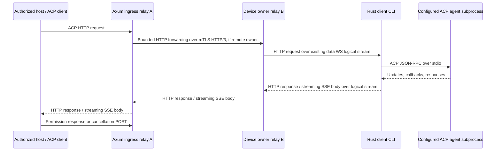

# ACP over HTTP through the device tunnel

Status: implementation design, researched 2026-09-09. Nothing in this document starts an agent today. ACP means **Agent Client Protocol**. A remote host will use the relay's HTTP endpoint to operate an explicitly exported agent supervised by the Rust client CLI.

## Compatibility target

Use stable **ACP v1** JSON-RPC messages. Its established local transport is newline-delimited UTF-8 JSON on a subprocess's stdin/stdout. The official transport page still describes Streamable HTTP as a draft. [ACP v1 transports](https://agentclientprotocol.com/protocol/v1/transports)

For the remote HTTP binding, target the upstream **Streamable HTTP & WebSocket Transport RFD**. This is an experimental upstream transport, not a claim of a finalized standard. Prefer the official Rust `agent-client-protocol` and `agent-client-protocol-http` crates behind a narrow adapter. Pin exact dependency versions and the upstream transport source in the implementation PR; a package version is not an ACP wire version. [Transport RFD](https://agentclientprotocol.com/rfds/streamable-http-websocket-transport), [Rust SDK](https://github.com/agentclientprotocol/rust-sdk)

**Corrected 2026-09-17 (M8-01, defect M8-C01).** This paragraph previously named "its last listed revision, **2026-05-04**" as the baseline. That was already wrong on the 2026-09-09 reading that produced this document: the RFD's revision history ends at **2026-07-02**, with 2026-06-05 before it. The pinned revision is 2026-07-02, at an immutable commit, and the one point where the pinned SDK goes beyond it is recorded in [sources.md](sources.md#acp).

ACP v2 remains draft and changes prompt completion semantics. Keep it disabled until a separate version profile and fixtures exist; never interpret a v2 prompt acknowledgment as v1 turn completion. [ACP v2 announcement](https://agentclientprotocol.com/announcements/acp-v2-draft)

MCP provides tools/resources to agents; ACP controls an agent conversation, including updates and requests back to its client. Share bounded HTTP forwarding infrastructure with [MCP](mcp.md), but keep initialization, permissions, cancellation, session state, and compatibility tests separate. MCP-over-ACP is a separate optional upstream feature and is outside the first ACP milestone.

## Routing and ownership



The client CLI owns the ACP HTTP connection/session state, callback registry, and child process. Run its HTTP handler as an in-process Rust service against tunneled requests; **no inbound device port or loopback HTTP listener is required**. Reuse the SDK's Axum/Tower integration where its tested API permits this. A compatibility spike must demonstrate streaming request/response bodies without starting a listener.

Each HTTP exchange is one logical tunnel stream. An SSE GET keeps its stream open while POST exchanges use other streams. All payload bytes travel on the existing device data WebSocket; the control WebSocket carries admission, bounded cancellation metadata, and health only. Scheduled rotation preserves these streams. The device remains at two steady-state sockets, with the documented temporary third socket during rotation.

Use the [shared `http-forward/1` encoding](http-forwarding.md): bounded JSON request/response heads, raw body records, END, and the outer tunnel FIN/RESET. It fixes field/record sizes, directional ordering, path/header validation, streaming and failure behavior. Preserve HTTP boundaries independently of tunnel frame boundaries; backend credentials stay local. ACP lifecycle and session/callback state remain separate from that codec.

Ingress derives tenant/principal from host authentication. Owner forwarding carries canonical tenant, principal, device, service, grant version, epoch, request ID, and deadline in authenticated internal metadata. Ignore consumer-supplied internal identity headers. The owner validates its lease/fence; the CLI binds each HTTP request to that context and intersects the grant with local policy. See [cluster.md](cluster.md). Device-to-relay WebSockets use device mTLS; peer HTTP/3 uses relay mTLS; host HTTP uses its independent scoped bearer/API credentials. None substitutes for the others.

Keep one child per authorized ACP transport connection by default. Several sessions within it belong to one principal and one service/workspace policy. Never share a child between users merely because its executable and working directory match. Connection and session IDs are opaque routing identifiers, never credentials.

## Public HTTP contract

The selected service is the agent/workspace export. Its advertised endpoint is:

```text
/v1/devices/{device_id}/services/{service_id}/acp
```

The upstream draft baseline is:

| Exchange | Intended behavior |
| --- | --- |
| POST `initialize`, no connection header | JSON response, HTTP 200; server returns `Acp-Connection-Id` |
| GET with `Acp-Connection-Id` | Connection-scoped SSE for connection messages |
| GET also with `Acp-Session-Id` | Session-scoped SSE for that session |
| Other POST | HTTP 202; JSON-RPC result arrives on its GET stream |
| Session-scoped POST | Both identity headers; body session ID must agree |
| DELETE with connection header | HTTP 202; terminate the connection |

Use HTTP/2 for the external Streamable HTTP profile. POST uses `application/json`; GET accepts `text/event-stream`. The draft rejects batches with 501 and also offers a WebSocket upgrade on the same endpoint. External WebSocket compatibility can follow the HTTP milestone; it is independent of the mandatory device WebSockets. [Upstream HTTP binding](https://agentclientprotocol.com/rfds/streamable-http-websocket-transport)

**The pinned SDK does not reject batches** (M8-C02). Its 2.0.0 release added batch preservation across the HTTP and WebSocket transports, so it accepts and routes what the RFD answers with 501. Agent Tunnel's profile follows the RFD, which is the stricter behaviour; a later chunk that runs the SDK's own client or server through this profile meets the disagreement and must decide it explicitly rather than discovering it.

Agent Tunnel policy adds authentication and bounded admission around that binding. Authenticate every request, SSE subscription, and status lookup, including renewed credentials for an existing connection. Bind connection/session ownership to the authenticated principal, tenant, device, service, and policy revision. Renewing a token cannot transfer a connection to a different principal. Revocation or token expiry closes its event streams and begins child cleanup.

Check content type, method shape, required headers, body/header consistency, negotiated capabilities, pending-request limits, and exact session ownership before dispatch. Return 400 for inconsistent routing, 401 for missing/invalid credentials, 404 for nonexistent or inaccessible connection/session, 406/415 for representation errors, 409 for conflicting live requests/subscribers, 413 for oversized messages, 429 for quota exhaustion, and 503 for offline/unavailable routes. Errors that occur after dispatch preserve an ambiguous outcome where appropriate.

Expose bounded service discovery metadata for `acpProtocolVersions`, `httpTransportProfile`, supported content/callback capabilities, limits, and an authorized workspace's agent-visible `cwd`. These are Agent Tunnel manifest fields, not additions to ACP's `initialize` response. Do not disclose host absolute paths beyond the granted export.

Start with a server-to-server host profile using Authorization headers. Browser access is a separate gate: explicit Origin allowlist, non-wildcard CORS, credential policy and CSRF tests, streaming fetch capable of headers, and no bearer tokens in URLs. Native EventSource's header limitations must not be solved with query-string secrets.

## A complete v1 conversation

These are original synthetic examples using the verified ACP v1 field shapes. Headers and HTTP status are outside the JSON-RPC payload. No custom JSON wrapper surrounds ACP messages.

Initialize the allowlisted export and open its connection GET before creating a session:

```json
{"jsonrpc":"2.0","id":"init-1","method":"initialize","params":{"protocolVersion":1,"clientCapabilities":{},"clientInfo":{"name":"tunnel-fixture","version":"0.1.0"}}}
```

The SDK negotiates capabilities and the bridge refuses an unsupported result version. Only advertise client filesystem, terminal, authentication-terminal, or elicitation capabilities when the host actually implements them and service policy permits them. An empty capability object in this example deliberately requests none of those optional surfaces. [Initialization](https://agentclientprotocol.com/protocol/v1/initialization)

After successful initialization, POST with the returned connection header:

```json
{"jsonrpc":"2.0","id":"new-1","method":"session/new","params":{"cwd":"/workspace/demo","mcpServers":[]}}
```

The connection GET receives:

```json
{"jsonrpc":"2.0","id":"new-1","result":{"sessionId":"session-demo"}}
```

`cwd` is the absolute agent-visible path of a configured workspace. It must match the service's allowed workspace; the host cannot select arbitrary paths. Start with empty consumer-supplied `mcpServers` and reject nonempty values, remote commands, environment overrides, and extra workspace roots. Later configured MCP attachments require their own policy and capability gate. [Session setup](https://agentclientprotocol.com/protocol/v1/session-setup)

Open the session GET with both headers before POSTing:

```json
{"jsonrpc":"2.0","id":"prompt-1","method":"session/prompt","params":{"sessionId":"session-demo","prompt":[{"type":"text","text":"List the synthetic fixture files."}]}}
```

The session GET can carry both updates and requests from the agent:

```json
{"jsonrpc":"2.0","method":"session/update","params":{"sessionId":"session-demo","update":{"sessionUpdate":"agent_message_chunk","content":{"type":"text","text":"Reading the fixture listing."}}}}
```

```json
{"jsonrpc":"2.0","id":"permission-1","method":"session/request_permission","params":{"sessionId":"session-demo","toolCall":{"toolCallId":"tool-1","title":"Read fixture directory"},"options":[{"optionId":"permit-one","name":"Allow once","kind":"allow_once"},{"optionId":"deny-one","name":"Reject once","kind":"reject_once"}]}}
```

The host POSTs its response to that same endpoint with both headers:

```json
{"jsonrpc":"2.0","id":"permission-1","result":{"outcome":{"outcome":"selected","optionId":"permit-one"}}}
```

Validate the response against the outstanding callback, principal, session, direction, and offered option. `allow_once` is an option kind, not the top-level response outcome. Tool titles/descriptions cannot grant access. Default policy requires an explicit allowed response; timeout/disconnect never means permission. [Permission contract](https://agentclientprotocol.com/protocol/v1/tool-calls)

The prompt's final response is delivered on the session GET:

```json
{"jsonrpc":"2.0","id":"prompt-1","result":{"stopReason":"end_turn"}}
```

To cancel, POST the notification below; it has no request ID:

```json
{"jsonrpc":"2.0","method":"session/cancel","params":{"sessionId":"session-demo"}}
```

The bridge resolves pending permission callbacks with `{"outcome":{"outcome":"cancelled"}}`, forwards cancellation, and waits for the original prompt response. Accept remaining updates until that response. A confirmed cancelled turn has `stopReason: "cancelled"`; a lost process cannot confirm cancellation. [Prompt lifecycle](https://agentclientprotocol.com/protocol/v1/prompt-turn)

Support `$/cancel_request` separately where the pinned SDK implements it, with direction-aware correlation. It does not replace `session/cancel`. [Request cancellation](https://agentclientprotocol.com/protocol/v1/cancellation)

## Correlation, callbacks, and operation outcomes

Scope JSON-RPC IDs by `(tenant, principal, device, service, connection, direction)`. Keep their string/number type. IDs need only be distinct while outstanding in their direction; identical host and agent IDs must coexist. Map each request to its session explicitly; responses often contain no `sessionId`. Session method callbacks return through POST and must not be mistaken for new invocations.

Maintain one bounded callback table per connection. The first valid response resolves a callback atomically; duplicate/late responses cannot repeat a decision. Route permission and supported elicitation requests to the host. Forward optional filesystem/terminal callbacks only when negotiated and explicitly permitted: those refer to the ACP client's environment, which is the remote host, not implicitly the enrolled device. Device VFS is a separate service. Default terminal/auth-terminal capabilities are disabled; never automatically execute agent-provided commands or open authentication URLs.

Use the existing Agent Tunnel operation facility for bridge outcomes, outside ACP:

```text
GET /v1/operations/{operation_id}
```

For JSON-RPC requests, generate an operation ID before dispatch and expose it in `X-Agent-Tunnel-Operation-Id` on the HTTP response. Persist/retain only the bounded outcome metadata promised by the shared operation store. Record request correlation, admission, dispatch, and terminal result separately. HTTP 202 means accepted by the bridge, not that an agent finished or committed an action.

States follow [protocol.md](protocol.md): `accepted`, `running`, `succeeded`, `failed`, `cancelled`, `outcome_unknown`. Store a sanitized error code and whether dispatch may have happened. `succeeded` describes the ACP request completing, not proof that every underlying tool succeeded. An ACP error or cancellation also cannot roll back earlier effects. Status lookup requires the original grant; an absent/expired record never proves the operation was not executed.

Do not retry POST automatically after forwarding might have begun, including initialization, prompt, session creation, permission response, or DELETE. JSON-RPC IDs are correlation IDs, not durable idempotency keys. A duplicate ID while still pending receives a conflict before dispatch; reuse after completion is legitimate ACP and cannot be treated as cross-restart deduplication. If the HTTP acknowledgment and operation ID were lost, report delivery uncertainty and end/reconcile the connection; never manufacture an exactly-once guarantee. GET/status may retry only under their documented lifecycle.

## Reconnect and failure policy

The initial HTTP profile has **no SSE Last-Event-ID replay**. Tunnel byte replay during a retained device stream is different and deduplicates before the HTTP handler. Ordinary data-socket rotation therefore leaves ACP connections, sessions, requests, callbacks, and GET streams intact.

Allow exactly one connection subscriber and one subscriber per active session. Reject a second with 409; do not silently replace or fan out. Require the connection GET within 10 seconds of initialization and a session GET within 10 seconds of its creation; reject session prompts until that subscriber is ready. Charge pre-subscription messages to the same bounded queues.

Once an established required SSE stream breaks, terminate that ACP transport connection in v0: refuse new prompts, resolve pending permissions as cancelled, request cancellation of active turns, close streams, and clean up the child. A reconnect must initialize anew. This conservative lifecycle prevents silent output gaps when the draft offers no resume cursor. An SDK's ability to reopen GET alone is not evidence that missing events were recovered. Record this policy in discovery and prove how the selected upstream client surfaces it.

Agent-native `session/load` or `session/resume` is optional application recovery, only with its negotiated capability and an authorized stored session/workspace mapping. A raw session ID from another connection is insufficient. First release can deny cross-connection loading until the agent's history store is proven to isolate users. Loading history never resubmits an ambiguous prompt.

If device control/owner state is lost, apply the tunnel's bounded resume/fencing policy. Do not restart a child to hide a transport failure. A recoverable retained stream can continue; a reset connection or lost process marks dispatched unresolved work `outcome_unknown`. Relay failover does not recreate lost HTTP request bodies, live SSE delivery, or agent memory. Redis peer records do not provide ACP persistence.

## CLI process policy and cleanup

An ACP service configuration will contain a stable service ID, absolute executable, fixed argument vector, local secret references, workspace/sandbox profile, allowed ACP methods/capabilities, maximum children/sessions, and deadlines. These are planned fields; existing example TOML does not implement them. The CLI's local export/disable/stop commands govern exposure. Host HTTP input cannot install agents, select an executable, add arguments, inject environment, or switch workspaces.

Run as the configured unprivileged identity. Use a dedicated child state directory per principal/connection and an explicit minimal environment; never inherit unrelated device secrets. Provider login is local provisioning, separate from host relay authentication. Permission callbacks are not a security sandbox: a coding agent may access files or execute commands itself. A restricted workspace guarantee requires a tested OS sandbox/container/VM profile with filesystem, process, and network restrictions. Until one exists, label that platform's ACP export as trusted-agent execution and do not claim filesystem confinement from `cwd` alone.

One supervisor task owns child startup, stdio, session/callback state, cancellation, and shutdown. Use bounded channels and a pure lifecycle model (`starting`, `ready`, `draining`, `stopped`, `failed`). A separate reader must keep handling agent callbacks while a prompt is pending; no mutex may remain held across arbitrary child/network I/O. Keep stdout protocol-only and drain stderr into a capped diagnostic sink, with payload logging off by default.

On shutdown, revocation, deadline expiry, subscriber loss, or disabled export: stop admission; cancel pending permissions/turns; allow a bounded grace period; close stdin; terminate the child process group/job; then kill and reap remaining descendants. Include platform-specific process-tree tests. A child crash closes the transport and invalidates live sessions; never automatically replay its input into a replacement child. Retain only scoped outcome metadata and remove temporary files/handles according to local policy.

## Initial bounds and diagnostics

These configurable starting values need load validation and must fit the tunnel's aggregate budgets:

| Limit | Starting value / behavior |
| --- | --- |
| ACP JSON message including one stdio line | 1 MiB; reject before unbounded reassembly |
| Sessions per ACP connection | 8; one active v1 prompt per session |
| Pending host requests / agent callbacks | 16 each per connection |
| Buffered ACP output across sessions | 2 MiB per connection, also charged to device/global budgets |
| Child startup / initialize | 10 seconds each |
| Permission response | 60 seconds, then cancel the prompt and pending permission |
| Prompt wall time | 30 minutes default; explicit policy override |
| Output credit stall | 30 seconds, then cancel/close; never drop an event and continue |
| Idle connection | 15 minutes without application activity; SSE heartbeats do not extend it |
| Cancellation / child exit grace | 10 seconds each, then forced cleanup |
| Outcome metadata retention | 10 minutes after terminal state, capped by tenant/global quotas |

Reserve bounded capacity for cancellation and permission replies so output backpressure cannot deadlock the bridge. Apply per-device/principal child limits before spawning. Cap stderr and never block child exit waiting for an unbounded log consumer.

Trace the HTTP request ID, operation ID, tenant/device/service, owner epoch, logical stream, ACP connection/session, request direction, method, queue age, dispatch boundary, and outcome. Do not log prompts, agent thought chunks, files, images, permission bodies, credentials, or raw stderr by default. Measure active children, pending permissions, request latency, output stall time, cancellation latency, restarts, and unknown outcomes without unbounded-ID metric labels.

## Implementation slices and acceptance gates

1. **Pin and prove the binding:** select the official Rust HTTP/core SDK releases and record immutable transport/schema sources. Run an official HTTP client against an in-process deterministic stdio agent through the handler. Verify exact SSE event encoding, connection headers, `session/new`/`load` response routing, 202 semantics, deletion, and unsupported profiles. Resolve RFD shorthand against the normative v1 schema; never copy its abbreviated `request_permission` example as a real method name.
2. **Pure lifecycle and supervisor:** test ID direction/type collisions, permission response races, session readiness, capability enforcement, one active prompt per session, deadlines, stderr floods, malformed/oversized stdout, child startup failure, and process-tree cleanup. Use synthetic fixtures with no model credentials.
3. **Real tunnel vertical slice:** official host HTTP client → Axum → rotating device WebSockets → in-process HTTP handler → fixture agent. Initialize, create sessions, prompt, stream, permission allow/reject/cancel, complete, and DELETE. Keep at least two sessions active through three rotations without lost updates, duplicate callbacks, repeated side effects, or extra device sockets.
4. **Cluster and isolation:** use three relays, force ingress to a non-owner, route POST and long-lived GET over mTLS HTTP/3, rotate peer keys, kill the owner, and revoke grants. Two users reuse identical ACP IDs; unauthorized sessions, forged internal identity headers, stale owners, and mismatched session headers must never reach another process.
5. **Failure and operability:** drop HTTP acknowledgments, break each SSE stream, stop consumers reading, exhaust quotas, deny callbacks, crash children after recorded fake side effects, and interrupt device control. Prove terminal/unknown states and no automatic prompt replay. Confirm packet/trace evidence shows HTTP/SSE uses the existing data socket, and that no local inbound port is open.

Release gates require real pinned SDK interoperability, bounded-memory evidence, clean CLI installation and process cleanup on each supported OS, and documented capability coverage. Rust validation remains `cargo fmt --all -- --check`, `cargo clippy --workspace --all-targets --locked -- -D warnings`, and `cargo test --workspace --locked`. Future live-agent smoke tests use dedicated workspaces/VMs with explicit credentials; no test controls the user's active desktop.

## Pinned in code (M8-01)

`crates/tunnel-acp` resolves the profile points this document leaves open. It is pure: no sockets, no child process, no Axum, no clock. **It establishes no interoperability**; the exact artifacts, their checksums and the revision reconciliation are in [sources.md](sources.md#acp).

- **Profile identifier** `acp-http-v1`, selected the way MCP's profiles are: relay `[http_forward]` configuration plus the catalog service capability `http_forward_profile`.
- **Routes.** `POST`, `GET` and `DELETE` at the single export-local path `/acp`. `PUT`, `PATCH`, `HEAD` and `OPTIONS` are not routed; a trailing slash, a different case and any query are refused by the codec.
- **HTTP/2 only.** An HTTP/1.1 consumer is `HttpVersionNotAllowed`, which carries `HTTP_UNSUPPORTED_FEATURE` — a distinct rule and code from an unadvertised route, and from a batch.
- **Request headers**, each a singleton: `content-type`, `accept`, `acp-connection-id`, `acp-session-id`, `tunnel-principal-binding`. The last is not an ACP header: the ingress derives it per principal, exactly as for `mcp-2025-11-25`, and it is request-direction only.
- **Response headers**, each a singleton: `content-type`, `cache-control`, `x-accel-buffering`, `acp-connection-id`. A response may **not** carry `acp-session-id`: a new session's identifier is returned in the `session/new` response body, and a second header-borne source of session identity would not be validated.
- **Message rules.** One strict JSON object (duplicate member names compared after unescaping, invalid UTF-8, lone surrogate escapes, raw control characters, depth above 64 and trailing data all refused), `jsonrpc` exactly `"2.0"`, an `id` that is a string or an integer, and `params` an object. A top-level JSON array is a **batch** and is refused with **501** by its own code, decided from the first non-whitespace byte, so a malformed batch is still refused for being a batch.
- **Version negotiation.** Only protocol version 1. Any other integer, v2 included, is refused with its own code and a `supported: [1]` payload, in both the `initialize` request and its result; a non-integer is a separate shape rule.
- **A v2 prompt acknowledgement is not a v1 turn completion.** A `session/prompt` result with no `stopReason` is refused by a rule of its own rather than deserializing as a finished turn. The accepted path runs the pinned crate's own `PromptResponse` deserializer and `StopReason` vocabulary.
- **Methods.** `initialize`, `session/new`, `session/load`, `session/prompt`, `session/cancel`, `session/update` and `session/request_permission`, every name read from the pinned schema's tables rather than retyped. There is no prefix or wildcard rule. The RFD's abbreviated `request_permission` resolves against the normative `session/request_permission` for reading the RFD, and **is not itself an accepted method**.
- **Limits.** Finite and bounded: 1 MiB request body, 1 MiB JSON response, 64 MiB cumulative SSE response, with ceilings and no unlimited sentinel.
- **Evidence.** `scripts/acp-guard-deletion.py` defeats each of these rules in turn; 31 of 31 measurable guards turned a test red, and the one remaining guard — `unstable_protocol_v2` staying off — is enforced by the compiler and reported separately rather than counted as a red test.
- **Not proven.** Everything else. No HTTP handler, no SSE stream, no connection or session state, no child process, no tunnel, and no run against any ACP implementation.

## Implemented in code (M8 chunk 2)

Chunk 2 adds the **pure lifecycle** (`crates/tunnel-acp/src/lifecycle.rs`), the **supervisor** (`crates/tunnel-acp-export`) and a **deterministic synthetic stdio agent** (`crates/tunnel-acp-fixture`). It adds no HTTP, no SSE, no session over the wire, no tunnel, no relay and no run against any ACP implementation; those remain chunks 3 to 5. Everything chunk 1 declined to claim is still unclaimed.

- **The lifecycle is clock-free.** `CallbackTable::observe(now)` and `AcpConnection::subscriber_wait(id, now)` take a caller-supplied monotonic reading, exactly as `tunnel-http-forward`'s `RecordDeadline` does. No library path reads `Instant`. The only clock is the supervisor's, on the impure side of the boundary.
- **JSON-RPC ids are scoped by `(tenant, principal, device, service, connection, direction)`**, and keep their JSON type. Identical host and agent ids coexist; two tenants may reuse one id on the same device and service; `"1"` and `1` are different requests; a duplicate id in one scope is refused **before dispatch** by `ACP_DUPLICATE_PENDING_ID`; and an id reused after completion is accepted, because that is legitimate ACP and not cross-restart deduplication.
- **A callback resolves exactly once.** The first valid response removes the entry atomically; a duplicate, late or forged response finds nothing and is refused by `ACP_UNKNOWN_REQUEST_ID`. A resolution counter is asserted to stay at one across a duplicate that would have reversed the decision.
- **A permission timeout resolves as cancelled, never approved.** The expiry path constructs `PermissionOutcome::Cancelled` and has no branch that produces a selection. It is **observed and elapsed**: against a bound shortened to 150 ms, the measured elapsed was **160 ms** (supervisor clock) with the test's own wall clock at 160 ms, and the **agent itself** recorded receiving `cancelled` in a workspace marker file — the supervisor's belief about what it sent is not evidence that the agent received it. A late host approval after the deadline is refused.
- **The bounds are exact at the boundary and refused one beyond:** 8 sessions per connection and 16 pending requests per direction, both in the pure table and against a real child (one turn asking for seventeen permissions admits sixteen and refuses the seventeenth with `ACP_PENDING_LIMIT`, while the host direction still has only the one prompt outstanding). One active prompt per session, with a second refused by `ACP_PROMPT_ALREADY_ACTIVE` rather than by any other rule.
- **The child lifecycle is a transition table**, not a label: `starting`/`ready`/`draining`/`stopped`/`failed`, where `stopped` is reachable only through `draining` and a child that vanished while still admitting work is `failed`. No event leaves a terminal state.
- **The child's stdout is protocol-only.** An oversized line is refused *before* the append, so it is never reassembled; a malformed line, a **batch** and an unaccepted method each end the child by their own `AcpRule`, and the test asserts the rule rather than that something ended. Each kills the child.
- **A stderr flood is drained and counted without blocking child exit.** 4 MiB flooded, 4 MiB counted exactly, the cap reported once, the turn still completed and the child still exited. Nothing of stderr is retained, forwarded or logged.
- **A process-group `SIGKILL` on every end the supervisor lives to see**, through `rustix`, keeping `forbid(unsafe_code)` — including the ends that run none of this crate's async code. A `/bin/sh` wrapper's `sleep` grandchild is confirmed dead **by reading the process table** in five different endings: after `drain()`, after the child was killed for bad output, after the child **exited by itself**, after the `Supervisor` was **dropped without draining**, and after the **tokio runtime was torn down** with the supervisor still live. The last three were added by the M8-C07 review, which found three processes still alive after a guard run: the deadline ticker looped forever holding an `Arc<ChildHandle>`, so the handle's `Drop` never ran, and the group signal existed only inside a task that a torn-down runtime drops rather than runs. The signal is now sent **synchronously in `ChildHandle::drop`**, and `nothing_holds_the_child_handle_once_the_child_is_gone` reads a counter proving no supervisor task outlives its child. A drop without `drain()` is what connection loss will look like in chunk 3, so this is the path that matters most. **The claim is deliberately "every end the supervisor lives to see", because one route is outside it: the device process itself dying.** On a `SIGKILL`, a `process::exit` or a crash, no `Drop` runs at all; the child sees stdin at end of file and exits, but nobody signals its group and a grandchild is orphaned. That is not closable in-process — it needs a kernel parent-death facility (Linux has `PR_SET_PDEATHSIG`; macOS has none) or a real containment boundary — and it is recorded on M8-C07 as the sibling of the escaping descendant, untested here.
- **`drain()` is not a graceful shutdown.** It does not close stdin and gives no grace period; `docs/acp.md`'s bounded grace period is not implemented. `Stopped` therefore records *who ended the child* — the supervisor, deliberately, having drained first — not *how the process died*.
- **Process-tree containment is NOT claimed, and was measured.** The fixture's `detached` mode calls `setsid` and leaves the group. After the group `SIGKILL` (one group kill recorded), `a_descendant_that_calls_setsid_survives_the_process_group_kill` reads the process table and finds the descendant **alive, in its own process group, and not a zombie** — the state check matters because `kill -0` succeeds on an unreaped corpse, so an outcome-only assertion would stay green for the wrong reason if a future containment did kill it. It survived *because* it left the group. That is M3-09's hole, inherited here and recorded as M8-C07 rather than assumed away. Group signalling is Unix-only.
- **macOS is the only host.** Nothing here ran on Linux or Windows.
- **Evidence.** `scripts/acp-guard-deletion.py --suite m8c2` defeats each rule in turn, including the three cleanup mechanisms, each witnessed by a **surviving process** rather than by a counter. The script grew a third refusal in this chunk: a timed-out run is `NOT EVIDENCE (timed out)`, not `RED (hung)` — the old spelling was counted in neither the red tally nor the unusable filter (M8-C06). The filter itself was then inverted and shared with `scripts/fs-guard-deletion.py` as `scripts/guard_outcomes.py`: `RED`, `REFUSED BY COMPILER` and `DOCUMENTED GREEN` are usable and **everything else fails closed**, because a deny list of prefixes had let four spellings through, `still green` included (M8-C08). `DOCUMENTED GREEN` exists because failing closed changed the **exit contract of the filesystem harness**, which verified M4 rows cite: sixteen of its cases are green *by design*, each with a written reason, and a harness must distinguish those from a case nobody can explain. Sixteen were marked and measured; two in `gate3` were deliberately left unmarked as **not established**, because guessing would turn an open question into a documented finding. That inversion earned its keep immediately — it caught a guard case of this chunk's own that was not load-bearing, which is why `nothing_holds_the_child_handle_once_the_child_is_gone` exists.
- **Not proven.** Everything else: no HTTP handler, no SSE stream, no session over the wire, no tunnel, no relay, no real ACP client, and no non-macOS host. The M8-C02 batch disagreement is met only on the **stdio** side; its acceptance is about the SSE stream, so that row stays open.

## Implemented in code (M8 chunk 3)

Chunk 3 adds the **in-process HTTP/SSE bridge**: `crates/tunnel-acp-export`'s
`bridge::AcpExport`, an `HttpHandler` registered through
`HttpHandlers::with_acp_exports` and served over `tunnel-http-bridge`'s gate-2
`forward`/`serve` path. It adds no tunnel, no relay, no cluster and no
principal; those remain chunks 4 and 5. Everything chunks 1 and 2 declined to
claim is still unclaimed.

- **A complete v1 conversation, driven by the official pinned client.**
  `agent-client-protocol` / `agent-client-protocol-http` `=2.1.0` — the same
  artifacts chunk 1 pinned — speaks cleartext HTTP/2 with prior knowledge to a
  loopback gateway, through `forward`/`serve`, to the synthetic fixture agent:
  `initialize` → 200 with `Acp-Connection-Id`; the connection GET;
  `session/new` answered **202** with its result routed to the connection GET;
  the session GET; `session/prompt` answered **202** with its result arriving
  on the session GET; `session/update` chunks; `session/request_permission`
  reaching the host, whose POSTed response resolves it; `stopReason:
  "end_turn"`; and the client's own DELETE. This is the first thing in this
  repository that is interoperability evidence rather than a table asserting
  itself.
- **No claim terminates on an HTTP status.** `docs/acp.md` says 202 means
  accepted by the bridge and nothing more, so every claim about a prompt, a
  session or a permission anchors to a message observed on the wire.
  `stopReason` is read from the message the client received. The permission
  outcome is read from a marker file **the agent itself wrote**, recording what
  it received rather than what the bridge believes it forwarded. A status is
  asserted only where the bridge *refused* and nothing was dispatched — and
  each of those also asserts that nothing reached the agent.
- **Wire order is taken at the transport.** The gateway taps every response
  body before any client handler sees it, and the session stream's order is
  asserted as a sequence: the permission callback, then the chunk reporting its
  outcome, then the turn's result. The client's own handler record is compared
  as a **multiset only**. M3-03 recorded rmcp delivering log sequence 4 before
  3 with the wire intact; a handler-order assertion would measure the SDK's
  concurrency rather than this bridge's ordering.
- **The SSE encoding is byte for byte.** Every event is exactly `data:
  <compact>\n\n`, asserted by rebuilding the recorded stream from its parsed
  payloads and comparing the bytes — so an extra field, a keep-alive comment or
  a different terminator fails rather than being tolerated. There is no `id:`
  field and therefore no `Last-Event-ID` replay, which is this profile's stated
  position.
- **One subscriber per connection and per session, structurally.** A stream's
  queue has one receiving half and a subscriber *takes* it; a second GET finds
  nothing to take and is refused **409**. The same mechanism closes an expired
  session's window, so a late GET is refused rather than silently reopening.
- **The subscription deadlines are observed, not asserted against a constant.**
  The watchdog records the elapsed time it actually ran with the bound it
  exceeded, in **microseconds** — milliseconds are the bound's own unit, and a
  watchdog firing at 300.4 ms reports 300 once truncated, which reads as equal
  rather than as exceeded. One test runs at the **real documented ten seconds**
  and waits them out; the rest shorten the bound so the mechanism is cheap to
  measure. A connection whose GET never arrives is ended and its child is gone
  **from the process table**.
- **A prompt before its session subscriber is refused**, `docs/acp.md`'s own
  rule, with the refusal shown to be the readiness rule and not something else:
  the same prompt succeeds once the subscriber is there, and its `stopReason`
  is read off the wire.
- **The host cannot choose a workspace or attach MCP servers.** A `session/new`
  whose `cwd` is not the configured workspace, and one with a nonempty
  `mcpServers`, are both refused before anything reaches the agent, and no
  session is opened by either.
- **No inbound device listener exists, read from the socket table.** `serve`
  takes no address, so there is no call whose absence could be asserted.
  `tests/no_listener.rs` runs a whole conversation and asks the operating
  system for this process's listening sockets — with a positive control that
  binds a real one first — and also compares the socket count against a
  baseline taken **after** a warm-up conversation, because `tokio::process`
  makes the runtime build its own signalling socket pair the first time it
  spawns anything. That pair is Tokio's, and counting it as a listener would be
  wrong in the other direction.
- **M8-C05 is decided: strip at the bridge, and say so.** The pinned SDK's
  server sets `Acp-Session-Id` on every session-scoped SSE response
  (`agent-client-protocol-http` 2.1.0 `http_server.rs`, `handle_get`); this
  profile follows the RFD, which names only `Acp-Connection-Id` on responses
  and returns a new session's identifier in the `session/new` response body.
  The allowlist is **not** widened. The consequence is recorded rather than
  hidden: **this device's session-scoped SSE responses are not byte-identical
  to the pinned server's.** What the chunk proves is that they do not need to
  be — the pinned *client* reads that header on no response, and completed a
  whole v1 conversation without it. The half that remains open is a bridge that
  **fronts or mirrors** the SDK's own server, which this chunk does not do; that
  is a different direction — the header arrives on the request-parsing side and
  needs its own decision — and it is tracked as **M8-C10** rather than left
  implicit in this one.
- **The batch disagreement is closed in both directions.** A host that POSTs a
  JSON-RPC array is refused **501** by the batch rule's own code, and nothing is
  dispatched. A batch arriving on the *device's* SSE stream is refused by that
  same rule at the child boundary — the child's own `batch_output` and
  `invalid_output` counters each read 1, so the refusal is observed where it
  happens rather than inferred — and because a connection has exactly one child,
  a child that dies this way **closes its transport**: the connection is removed,
  every target is closed, and a later GET is answered 404. That is `acp.md`'s own
  policy below, now implemented rather than merely stated.

  An earlier draft of this bullet recorded the device half as **"cannot be proven
  without a product change"**, reasoning that the response head is already on the
  wire so no status can carry the refusal. That reasoning was about the wrong
  question: M8-C02's acceptance never asked for a mid-stream 501, it asked the
  bridge to *guarantee the stream never carries a batch and prove it with a child
  that deliberately emits one*, which is provable and now proved. The correction
  is recorded rather than silently applied, because "cannot be proven" is a claim
  like any other and this one was wrong. What stays open is narrower and is on
  M8-C02: whether the profile should refuse such a child at admission instead.
- **Evidence.** `scripts/acp-guard-deletion.py --suite m8c3` defeats each of
  this chunk's rules in turn: **17 of 17 turned a test red**. Its sibling
  `--suite m8c3-relay`, which needs a different crate and a different test
  command, is **2 of 2**. Both classify their outcomes with the shared
  `scripts/guard_outcomes.py` allow list, so anything but `RED`, `REFUSED BY
  COMPILER` or `DOCUMENTED GREEN` fails closed.

  **Two rules were exempted from that in the first draft, and both exemptions
  were wrong.** The 202 rule was called unmeasurable "because nothing here
  terminates on a status"; the mutation that matters is not `202 → 200` but a
  **lying 202** — accept the POST and never deliver the result — which is
  constructible, reddens several tests, and is precisely the rule "no claim
  terminates on a status" exists to protect. "No inbound listener" was called
  unguardable; a listener bound inside the export's own constructor is a
  perfectly good case, and the positive control inside `no_listener.rs` checks
  the *detector*, not the export path. Both are cases now. The one rule exempted
  from the standard everything else was held to turned out not to need the
  exemption.
- **There is no principal in this chunk.** `docs/acp.md` derives a principal at
  the relay ingress, and the in-process gate-2 bridge has no ingress in front of
  it: every request carries no `tunnel-principal-binding` at all. That is the
  M3-01/M3-02 precedent exactly. The bridge compares the value for equality
  with the one its connection was opened with and never interprets or derives
  one, so a connection here is bound to "no principal" and refuses any other
  value — which is a mechanism, not a principal-binding claim.
- **macOS is the only host.** Nothing here ran on Linux or Windows.
- **Not proven.** The tunnel, a relay, the cluster, rotation, peer hops, two
  users and cross-tenant isolation (chunks 4 and 5). Subscriber loss on an
  established stream, output credit and an HTTP-level `outcome_unknown` —
  M8-03's remaining half. `session/cancel` is forwarded and cancels that
  session's outstanding permissions, but no test drives a cancelled turn.
  `session/load` is an accepted method of the profile and is **refused 501** by
  the bridge, because `docs/acp.md` requires a negotiated capability and an
  authorized stored session mapping first. The idle, prompt-wall-time and
  output-stall bounds of the limits table are not implemented.

## Research provenance

The linked official pages were read on 2026-09-09. Source history exposed protocol commit `b4eddcd86937c972e65240e5199403f6d8a8cc2c` and SDK commit `7d8291d42236023c683bfc52f13d27746cda59ea`. The SDK commit explicitly distinguishes stable v1 builders from draft v2 APIs. These are observed source references, not a dependency lock or a claim that every immutable transport file was fetched. The first slice must pin and verify exact crate/schema/transport contents before implementation advertises compatibility. [Protocol history](https://github.com/agentclientprotocol/agent-client-protocol/commits/main), [SDK reference](https://github.com/agentclientprotocol/rust-sdk/commit/7d8291d42236023c683bfc52f13d27746cda59ea)
