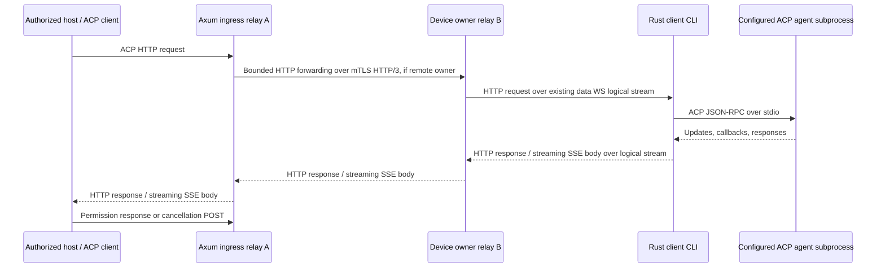

# ACP over HTTP through the device tunnel

Status: implementation design, researched 2026-09-09. Nothing in this document starts an agent today. ACP means **Agent Client Protocol**. A remote host will use the relay's HTTP endpoint to operate an explicitly exported agent supervised by the Rust client CLI.

## Compatibility target

Use stable **ACP v1** JSON-RPC messages. Its established local transport is newline-delimited UTF-8 JSON on a subprocess's stdin/stdout. The official transport page still describes Streamable HTTP as a draft. [ACP v1 transports](https://agentclientprotocol.com/protocol/v1/transports)

For the remote HTTP binding, target the upstream **Streamable HTTP & WebSocket Transport RFD**, using its last listed revision, **2026-05-04**, as the initial compatibility baseline. This is an experimental upstream transport, not a claim of a finalized standard. Prefer the official Rust `agent-client-protocol` and `agent-client-protocol-http` crates behind a narrow adapter. Pin exact dependency versions and the upstream transport source in the implementation PR; a package version is not an ACP wire version. [Transport RFD](https://agentclientprotocol.com/rfds/streamable-http-websocket-transport), [Rust SDK](https://github.com/agentclientprotocol/rust-sdk)

ACP v2 remains draft and changes prompt completion semantics. Keep it disabled until a separate version profile and fixtures exist; never interpret a v2 prompt acknowledgment as v1 turn completion. [ACP v2 announcement](https://agentclientprotocol.com/announcements/acp-v2-draft)

MCP provides tools/resources to agents; ACP controls an agent conversation, including updates and requests back to its client. Share bounded HTTP forwarding infrastructure with [MCP](mcp.md), but keep initialization, permissions, cancellation, session state, and compatibility tests separate. MCP-over-ACP is a separate optional upstream feature and is outside the first ACP milestone.

## Routing and ownership



The client CLI owns the ACP HTTP connection/session state, callback registry, and child process. Run its HTTP handler as an in-process Rust service against tunneled requests; **no inbound device port or loopback HTTP listener is required**. Reuse the SDK's Axum/Tower integration where its tested API permits this. A compatibility spike must demonstrate streaming request/response bodies without starting a listener.

Each HTTP exchange is one logical tunnel stream. An SSE GET keeps its stream open while POST exchanges use other streams. All payload bytes travel on the existing device data WebSocket; the control WebSocket carries admission, bounded cancellation metadata, and health only. Scheduled rotation preserves these streams. The device remains at two steady-state sockets, with the documented temporary third socket during rotation.

Use the [shared `http-forward/1` encoding](http-forwarding.md): bounded JSON request/response heads, raw body records, END, and the outer tunnel FIN/RESET. It fixes field/record sizes, directional ordering, path/header validation, streaming and failure behavior. Preserve HTTP boundaries independently of tunnel frame boundaries; backend credentials stay local. ACP lifecycle and session/callback state remain separate from that codec.

Ingress derives tenant/principal from host authentication. Owner forwarding carries canonical tenant, principal, device, service, grant version, epoch, request ID, and deadline in authenticated internal metadata. Ignore consumer-supplied internal identity headers. The owner validates its lease/fence; the CLI binds each HTTP request to that context and intersects the grant with local policy. See [cluster.md](cluster.md). Device-to-relay WebSockets use device mTLS; peer HTTP/3 uses relay mTLS; host HTTP uses its independent scoped bearer/API credentials. None substitutes for the others.

Keep one child per authorized ACP transport connection by default. Several sessions within it belong to one principal and one service/workspace policy. Never share a child between users merely because its executable and working directory match. Connection and session IDs are opaque routing identifiers, never credentials.

## Public HTTP contract

The selected service is the agent/workspace export. Its advertised endpoint is:

```text
/v1/devices/{device_id}/services/{service_id}/acp
```

The upstream draft baseline is:

| Exchange | Intended behavior |
| --- | --- |
| POST `initialize`, no connection header | JSON response, HTTP 200; server returns `Acp-Connection-Id` |
| GET with `Acp-Connection-Id` | Connection-scoped SSE for connection messages |
| GET also with `Acp-Session-Id` | Session-scoped SSE for that session |
| Other POST | HTTP 202; JSON-RPC result arrives on its GET stream |
| Session-scoped POST | Both identity headers; body session ID must agree |
| DELETE with connection header | HTTP 202; terminate the connection |

Use HTTP/2 for the external Streamable HTTP profile. POST uses `application/json`; GET accepts `text/event-stream`. The draft rejects batches with 501 and also offers a WebSocket upgrade on the same endpoint. External WebSocket compatibility can follow the HTTP milestone; it is independent of the mandatory device WebSockets. [Upstream HTTP binding](https://agentclientprotocol.com/rfds/streamable-http-websocket-transport)

Agent Tunnel policy adds authentication and bounded admission around that binding. Authenticate every request, SSE subscription, and status lookup, including renewed credentials for an existing connection. Bind connection/session ownership to the authenticated principal, tenant, device, service, and policy revision. Renewing a token cannot transfer a connection to a different principal. Revocation or token expiry closes its event streams and begins child cleanup.

Check content type, method shape, required headers, body/header consistency, negotiated capabilities, pending-request limits, and exact session ownership before dispatch. Return 400 for inconsistent routing, 401 for missing/invalid credentials, 404 for nonexistent or inaccessible connection/session, 406/415 for representation errors, 409 for conflicting live requests/subscribers, 413 for oversized messages, 429 for quota exhaustion, and 503 for offline/unavailable routes. Errors that occur after dispatch preserve an ambiguous outcome where appropriate.

Expose bounded service discovery metadata for `acpProtocolVersions`, `httpTransportProfile`, supported content/callback capabilities, limits, and an authorized workspace's agent-visible `cwd`. These are Agent Tunnel manifest fields, not additions to ACP's `initialize` response. Do not disclose host absolute paths beyond the granted export.

Start with a server-to-server host profile using Authorization headers. Browser access is a separate gate: explicit Origin allowlist, non-wildcard CORS, credential policy and CSRF tests, streaming fetch capable of headers, and no bearer tokens in URLs. Native EventSource's header limitations must not be solved with query-string secrets.

## A complete v1 conversation

These are original synthetic examples using the verified ACP v1 field shapes. Headers and HTTP status are outside the JSON-RPC payload. No custom JSON wrapper surrounds ACP messages.

Initialize the allowlisted export and open its connection GET before creating a session:

```json
{"jsonrpc":"2.0","id":"init-1","method":"initialize","params":{"protocolVersion":1,"clientCapabilities":{},"clientInfo":{"name":"tunnel-fixture","version":"0.1.0"}}}
```

The SDK negotiates capabilities and the bridge refuses an unsupported result version. Only advertise client filesystem, terminal, authentication-terminal, or elicitation capabilities when the host actually implements them and service policy permits them. An empty capability object in this example deliberately requests none of those optional surfaces. [Initialization](https://agentclientprotocol.com/protocol/v1/initialization)

After successful initialization, POST with the returned connection header:

```json
{"jsonrpc":"2.0","id":"new-1","method":"session/new","params":{"cwd":"/workspace/demo","mcpServers":[]}}
```

The connection GET receives:

```json
{"jsonrpc":"2.0","id":"new-1","result":{"sessionId":"session-demo"}}
```

`cwd` is the absolute agent-visible path of a configured workspace. It must match the service's allowed workspace; the host cannot select arbitrary paths. Start with empty consumer-supplied `mcpServers` and reject nonempty values, remote commands, environment overrides, and extra workspace roots. Later configured MCP attachments require their own policy and capability gate. [Session setup](https://agentclientprotocol.com/protocol/v1/session-setup)

Open the session GET with both headers before POSTing:

```json
{"jsonrpc":"2.0","id":"prompt-1","method":"session/prompt","params":{"sessionId":"session-demo","prompt":[{"type":"text","text":"List the synthetic fixture files."}]}}
```

The session GET can carry both updates and requests from the agent:

```json
{"jsonrpc":"2.0","method":"session/update","params":{"sessionId":"session-demo","update":{"sessionUpdate":"agent_message_chunk","content":{"type":"text","text":"Reading the fixture listing."}}}}
```

```json
{"jsonrpc":"2.0","id":"permission-1","method":"session/request_permission","params":{"sessionId":"session-demo","toolCall":{"toolCallId":"tool-1","title":"Read fixture directory"},"options":[{"optionId":"permit-one","name":"Allow once","kind":"allow_once"},{"optionId":"deny-one","name":"Reject once","kind":"reject_once"}]}}
```

The host POSTs its response to that same endpoint with both headers:

```json
{"jsonrpc":"2.0","id":"permission-1","result":{"outcome":{"outcome":"selected","optionId":"permit-one"}}}
```

Validate the response against the outstanding callback, principal, session, direction, and offered option. `allow_once` is an option kind, not the top-level response outcome. Tool titles/descriptions cannot grant access. Default policy requires an explicit allowed response; timeout/disconnect never means permission. [Permission contract](https://agentclientprotocol.com/protocol/v1/tool-calls)

The prompt's final response is delivered on the session GET:

```json
{"jsonrpc":"2.0","id":"prompt-1","result":{"stopReason":"end_turn"}}
```

To cancel, POST the notification below; it has no request ID:

```json
{"jsonrpc":"2.0","method":"session/cancel","params":{"sessionId":"session-demo"}}
```

The bridge resolves pending permission callbacks with `{"outcome":{"outcome":"cancelled"}}`, forwards cancellation, and waits for the original prompt response. Accept remaining updates until that response. A confirmed cancelled turn has `stopReason: "cancelled"`; a lost process cannot confirm cancellation. [Prompt lifecycle](https://agentclientprotocol.com/protocol/v1/prompt-turn)

Support `$/cancel_request` separately where the pinned SDK implements it, with direction-aware correlation. It does not replace `session/cancel`. [Request cancellation](https://agentclientprotocol.com/protocol/v1/cancellation)

## Correlation, callbacks, and operation outcomes

Scope JSON-RPC IDs by `(tenant, principal, device, service, connection, direction)`. Keep their string/number type. IDs need only be distinct while outstanding in their direction; identical host and agent IDs must coexist. Map each request to its session explicitly; responses often contain no `sessionId`. Session method callbacks return through POST and must not be mistaken for new invocations.

Maintain one bounded callback table per connection. The first valid response resolves a callback atomically; duplicate/late responses cannot repeat a decision. Route permission and supported elicitation requests to the host. Forward optional filesystem/terminal callbacks only when negotiated and explicitly permitted: those refer to the ACP client's environment, which is the remote host, not implicitly the enrolled device. Device VFS is a separate service. Default terminal/auth-terminal capabilities are disabled; never automatically execute agent-provided commands or open authentication URLs.

Use the existing Agent Tunnel operation facility for bridge outcomes, outside ACP:

```text
GET /v1/operations/{operation_id}
```

For JSON-RPC requests, generate an operation ID before dispatch and expose it in `X-Agent-Tunnel-Operation-Id` on the HTTP response. Persist/retain only the bounded outcome metadata promised by the shared operation store. Record request correlation, admission, dispatch, and terminal result separately. HTTP 202 means accepted by the bridge, not that an agent finished or committed an action.

States follow [protocol.md](protocol.md): `accepted`, `running`, `succeeded`, `failed`, `cancelled`, `outcome_unknown`. Store a sanitized error code and whether dispatch may have happened. `succeeded` describes the ACP request completing, not proof that every underlying tool succeeded. An ACP error or cancellation also cannot roll back earlier effects. Status lookup requires the original grant; an absent/expired record never proves the operation was not executed.

Do not retry POST automatically after forwarding might have begun, including initialization, prompt, session creation, permission response, or DELETE. JSON-RPC IDs are correlation IDs, not durable idempotency keys. A duplicate ID while still pending receives a conflict before dispatch; reuse after completion is legitimate ACP and cannot be treated as cross-restart deduplication. If the HTTP acknowledgment and operation ID were lost, report delivery uncertainty and end/reconcile the connection; never manufacture an exactly-once guarantee. GET/status may retry only under their documented lifecycle.

## Reconnect and failure policy

The initial HTTP profile has **no SSE Last-Event-ID replay**. Tunnel byte replay during a retained device stream is different and deduplicates before the HTTP handler. Ordinary data-socket rotation therefore leaves ACP connections, sessions, requests, callbacks, and GET streams intact.

Allow exactly one connection subscriber and one subscriber per active session. Reject a second with 409; do not silently replace or fan out. Require the connection GET within 10 seconds of initialization and a session GET within 10 seconds of its creation; reject session prompts until that subscriber is ready. Charge pre-subscription messages to the same bounded queues.

Once an established required SSE stream breaks, terminate that ACP transport connection in v0: refuse new prompts, resolve pending permissions as cancelled, request cancellation of active turns, close streams, and clean up the child. A reconnect must initialize anew. This conservative lifecycle prevents silent output gaps when the draft offers no resume cursor. An SDK's ability to reopen GET alone is not evidence that missing events were recovered. Record this policy in discovery and prove how the selected upstream client surfaces it.

Agent-native `session/load` or `session/resume` is optional application recovery, only with its negotiated capability and an authorized stored session/workspace mapping. A raw session ID from another connection is insufficient. First release can deny cross-connection loading until the agent's history store is proven to isolate users. Loading history never resubmits an ambiguous prompt.

If device control/owner state is lost, apply the tunnel's bounded resume/fencing policy. Do not restart a child to hide a transport failure. A recoverable retained stream can continue; a reset connection or lost process marks dispatched unresolved work `outcome_unknown`. Relay failover does not recreate lost HTTP request bodies, live SSE delivery, or agent memory. Redis peer records do not provide ACP persistence.

## CLI process policy and cleanup

An ACP service configuration will contain a stable service ID, absolute executable, fixed argument vector, local secret references, workspace/sandbox profile, allowed ACP methods/capabilities, maximum children/sessions, and deadlines. These are planned fields; existing example TOML does not implement them. The CLI's local export/disable/stop commands govern exposure. Host HTTP input cannot install agents, select an executable, add arguments, inject environment, or switch workspaces.

Run as the configured unprivileged identity. Use a dedicated child state directory per principal/connection and an explicit minimal environment; never inherit unrelated device secrets. Provider login is local provisioning, separate from host relay authentication. Permission callbacks are not a security sandbox: a coding agent may access files or execute commands itself. A restricted workspace guarantee requires a tested OS sandbox/container/VM profile with filesystem, process, and network restrictions. Until one exists, label that platform's ACP export as trusted-agent execution and do not claim filesystem confinement from `cwd` alone.

One supervisor task owns child startup, stdio, session/callback state, cancellation, and shutdown. Use bounded channels and a pure lifecycle model (`starting`, `ready`, `draining`, `stopped`, `failed`). A separate reader must keep handling agent callbacks while a prompt is pending; no mutex may remain held across arbitrary child/network I/O. Keep stdout protocol-only and drain stderr into a capped diagnostic sink, with payload logging off by default.

On shutdown, revocation, deadline expiry, subscriber loss, or disabled export: stop admission; cancel pending permissions/turns; allow a bounded grace period; close stdin; terminate the child process group/job; then kill and reap remaining descendants. Include platform-specific process-tree tests. A child crash closes the transport and invalidates live sessions; never automatically replay its input into a replacement child. Retain only scoped outcome metadata and remove temporary files/handles according to local policy.

## Initial bounds and diagnostics

These configurable starting values need load validation and must fit the tunnel's aggregate budgets:

| Limit | Starting value / behavior |
| --- | --- |
| ACP JSON message including one stdio line | 1 MiB; reject before unbounded reassembly |
| Sessions per ACP connection | 8; one active v1 prompt per session |
| Pending host requests / agent callbacks | 16 each per connection |
| Buffered ACP output across sessions | 2 MiB per connection, also charged to device/global budgets |
| Child startup / initialize | 10 seconds each |
| Permission response | 60 seconds, then cancel the prompt and pending permission |
| Prompt wall time | 30 minutes default; explicit policy override |
| Output credit stall | 30 seconds, then cancel/close; never drop an event and continue |
| Idle connection | 15 minutes without application activity; SSE heartbeats do not extend it |
| Cancellation / child exit grace | 10 seconds each, then forced cleanup |
| Outcome metadata retention | 10 minutes after terminal state, capped by tenant/global quotas |

Reserve bounded capacity for cancellation and permission replies so output backpressure cannot deadlock the bridge. Apply per-device/principal child limits before spawning. Cap stderr and never block child exit waiting for an unbounded log consumer.

Trace the HTTP request ID, operation ID, tenant/device/service, owner epoch, logical stream, ACP connection/session, request direction, method, queue age, dispatch boundary, and outcome. Do not log prompts, agent thought chunks, files, images, permission bodies, credentials, or raw stderr by default. Measure active children, pending permissions, request latency, output stall time, cancellation latency, restarts, and unknown outcomes without unbounded-ID metric labels.

## Implementation slices and acceptance gates

1. **Pin and prove the binding:** select the official Rust HTTP/core SDK releases and record immutable transport/schema sources. Run an official HTTP client against an in-process deterministic stdio agent through the handler. Verify exact SSE event encoding, connection headers, `session/new`/`load` response routing, 202 semantics, deletion, and unsupported profiles. Resolve RFD shorthand against the normative v1 schema; never copy its abbreviated `request_permission` example as a real method name.
2. **Pure lifecycle and supervisor:** test ID direction/type collisions, permission response races, session readiness, capability enforcement, one active prompt per session, deadlines, stderr floods, malformed/oversized stdout, child startup failure, and process-tree cleanup. Use synthetic fixtures with no model credentials.
3. **Real tunnel vertical slice:** official host HTTP client → Axum → rotating device WebSockets → in-process HTTP handler → fixture agent. Initialize, create sessions, prompt, stream, permission allow/reject/cancel, complete, and DELETE. Keep at least two sessions active through three rotations without lost updates, duplicate callbacks, repeated side effects, or extra device sockets.
4. **Cluster and isolation:** use three relays, force ingress to a non-owner, route POST and long-lived GET over mTLS HTTP/3, rotate peer keys, kill the owner, and revoke grants. Two users reuse identical ACP IDs; unauthorized sessions, forged internal identity headers, stale owners, and mismatched session headers must never reach another process.
5. **Failure and operability:** drop HTTP acknowledgments, break each SSE stream, stop consumers reading, exhaust quotas, deny callbacks, crash children after recorded fake side effects, and interrupt device control. Prove terminal/unknown states and no automatic prompt replay. Confirm packet/trace evidence shows HTTP/SSE uses the existing data socket, and that no local inbound port is open.

Release gates require real pinned SDK interoperability, bounded-memory evidence, clean CLI installation and process cleanup on each supported OS, and documented capability coverage. Rust validation remains `cargo fmt --all -- --check`, `cargo clippy --workspace --all-targets --locked -- -D warnings`, and `cargo test --workspace --locked`. Future live-agent smoke tests use dedicated workspaces/VMs with explicit credentials; no test controls the user's active desktop.

## Research provenance

The linked official pages were read on 2026-09-09. Source history exposed protocol commit `b4eddcd86937c972e65240e5199403f6d8a8cc2c` and SDK commit `7d8291d42236023c683bfc52f13d27746cda59ea`. The SDK commit explicitly distinguishes stable v1 builders from draft v2 APIs. These are observed source references, not a dependency lock or a claim that every immutable transport file was fetched. The first slice must pin and verify exact crate/schema/transport contents before implementation advertises compatibility. [Protocol history](https://github.com/agentclientprotocol/agent-client-protocol/commits/main), [SDK reference](https://github.com/agentclientprotocol/rust-sdk/commit/7d8291d42236023c683bfc52f13d27746cda59ea)
