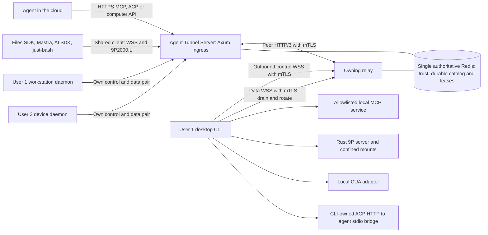

# Architecture

Status: revised implementation design, 2026-09-09. M1's authenticated multi-user echo tunnel and real-socket harness are implemented and locally verified; see [M1 evidence](m1-harness.md). Rotation, remote service adapters and multi-relay routing below remain planned. Normative tunnel/drain details live in [protocol.md](protocol.md), cluster trust/ownership in [cluster.md](cluster.md), and filesystem consumer semantics in [filesystem-api.md](filesystem-api.md).

Redis holds all M1 shared authorization and ownership state. The current device hash stores logically expiring owner fields without a TTL; distinct ephemeral lease namespaces are a target cluster layout. Same-dataset AOF restart is tested. Arbitrary backup rollback verification and automatic promotion require later recovery gates.

## Product boundary

An agent runs wherever its owner chooses, including the cloud. Each enrolled computer initiates outbound WSS connections to a relay. Consumers address an explicit device and service; no inbound port forwarding is required on the computer. The relay is a capability gateway, not the agent's memory, scheduler, model runtime, or conversation store.

The inspiration is a cloud agent with access to several enrolled machines ([source post](https://x.com/gakonst/status/2097279023764140358)). VM provisioning, mobile apps, desktop video streaming, and a durable agent harness are separate future integrations. The tunnel can serve host or VM devices without implementing a hypervisor.



The two-socket requirement applies to each device-to-relay tunnel. Consumers, a local CUA backend, and local MCP services have their own transports. During rotation there may be one control plus old and replacement data sockets for at most the configured overlap budget. See [decisions.md](decisions.md) for the strict-two-socket alternative.

## Components and language boundaries

| Component | Responsibility | Planned implementation |
| --- | --- | --- |
| `tunnel-core` | Validated configuration today; shared invariants, identifiers, errors later | Rust library |
| `tunnel-protocol` | Versioned framing, logical streams, credits, deterministic rotation machine | Future Rust crate |
| `tunnel-relay` | Axum ingress, mTLS device listener, HTTP/3 peers, enrollment, grants, routing, quotas | Rust binary; config-only today |
| `tunnel-client` | mTLS device identity, CLI, outbound reconnect, local policy, service/agent supervision | Rust binary; config-only today |
| `tunnel-mcp` | MCP HTTP/stdio bridge with explicit version profiles | Future Rust crate using RMCP |
| `tunnel-vfs` | 9P2000.L server, directory-handle-confined mount operations and bytes | Future Rust crate |
| `tunnel-cua` | Typed, authorized local CUA operations and desktop leases | Future Rust crate |
| `tunnel-http` / `tunnel-acp` | Bounded HTTP forwarding and CLI ACP HTTP-to-stdio lifecycle bridge | Future Rust modules/crates |
| `packages/client` | Shared filesystem endpoint/9P client with scoped lifecycle and errors | TypeScript package; **the codec, the descriptor, the authenticated upgrade, the session and the API exist** (task rows M4-10 and M4-13), and none of it has been run against an actual relay or device socket |
| `packages/files-sdk`, `packages/mastra`, `packages/just-bash`, `packages/ai-sdk` | Native framework adapters over one client API | Future TypeScript packages |

Start with a small workspace and split crates only when their milestone starts. Axum is the selected public HTTP/WebSocket server. Tokio, tokio-tungstenite, rustls and tracing are planned supporting libraries; HTTP/3 peers use a dedicated QUIC/H3 integration sharing typed services with Axum, not an assumption that Axum natively serves H3. See [runtime.md](runtime.md) for listener roles, TLS identity propagation, CLI commands, actor ownership and debugging. Pin and test the actual dependency combination before claiming support.

## Identity and multi-user model

Use stable opaque IDs. Names and paths are display data, never authorization evidence.

| Entity | Scope and lifecycle |
| --- | --- |
| Tenant | Isolation boundary; initially one personal tenant per user |
| User | Human identity keyed by identity-provider issuer and subject |
| Membership | User role within a tenant; supports future shared teams without conflating users with tenants |
| Device | Durable enrolled identity under exactly one tenant; survives disconnect and sleep |
| Service | Locally configured export under a device, with a type, version, and capability manifest |
| Consumer | An agent/app principal acting for a user with scoped grants |
| Grant | Subject + tenant + device + service + operations + constraints + expiry/revocation version |
| Connection epoch | One authenticated live ownership generation for a device; superseded epochs cannot dispatch work |
| Logical stream | Authorized consumer/service conversation independent of any data-socket generation |

One user can enroll many devices and run many consumers. Every lookup and cache key includes the tenant and device scope. Reused request IDs, identical filenames, and identical service names across tenants must remain isolated. v0 permits one active daemon ownership epoch per device; additional daemon instances require separate device identities or an explicit replacement flow.

Durable catalog and live presence are different records. An offline device remains discoverable to an authorized user with last-seen information, but invocations return `DEVICE_OFFLINE` with a retry hint. No offline side-effect queue in v0. The calling agent decides whether to wait, use another device, or request a new action.

## Enrollment and authorization

1. An authenticated user starts enrollment for their tenant. The relay issues a single-use, short-lived enrollment code scoped to that user and device creation operation.
2. The CLI creates its private key locally and obtains a role-constrained device certificate from the trusted enrollment authority. The first implementation supports operator-provisioned certificates; interactive code/CSR enrollment follows under the same trust rules. Private keys go to protected local storage and are never uploaded to Redis. The device cannot declare its own trusted tenant ID.
3. The CLI establishes the control WSS connection with mTLS. The relay validates its chain, role, identity, active key, expiry and revocation before HTTP/stream admission. It assigns an ownership epoch and a one-use data attachment ticket bound to device certificate identity/SPKI, tenant, owner, control epoch, generation and audience.
4. The data WSS connection independently performs mTLS using that device identity, then verifies and atomically consumes its attachment ticket. The ticket cannot replace certificate authentication. Peer relays use separate role-constrained mTLS identities over HTTP/3; device credentials cannot act as peers.
5. Consumers authenticate independently. The relay authorizes each API request and stream admission; the daemon checks every local operation against the bound grant and local policy. For opaque 9P streams, per-operation enforcement is in the Rust filesystem server. Effective access is the intersection of consumer grants and local exports.
6. Revoking a device, consumer, membership, or grant closes affected streams and prevents subsequent dispatch, including buffered/replayed work. A locally visible stop command can disable all exports immediately.

Use an external OIDC/OAuth provider for human/consumer login rather than building password or SMS authentication. Device authentication is mTLS, independent of those consumer tokens. Test with an ephemeral CA and synthetic issued identities; never add an insecure production fallback. Public exposure requires certified enrollment, revocation, peer trust and WSS flows.

Device credentials and consumer access tokens are separate. Validate issuer, audience, lifetime, and scope. Keep bearer material out of URLs, logs, traces, and command-line arguments. Rotation refreshes a transport generation; it neither renews user permission nor replaces credential rotation.

## Routing and service API

Planned consumer endpoints, subject to M1 contract review:

```text
GET  /v1/devices
GET  /v1/devices/{device_id}/services
POST /v1/devices/{device_id}/services/{service_id}/mcp
GET  /v1/devices/{device_id}/services/{service_id}/fs  (descriptor or WebSocket upgrade)
GET  /v1/devices/{device_id}/services/{service_id}/acp  (ACP connection events)
POST /v1/devices/{device_id}/services/{service_id}/acp  (ACP JSON-RPC)
DELETE /v1/devices/{device_id}/services/{service_id}/acp  (ACP connection teardown)
POST /v1/devices/{device_id}/services/{service_id}/computer/operations
GET  /v1/operations/{operation_id}
```

Every route derives tenant from authenticated context, then checks the grant for the addressed device/service. Operation status lookup is scoped to the original principal and grant. Directory enumeration and errors must not disclose another tenant's identifiers. Presence updates use a separate authenticated consumer event feed if needed; they do not add a third permanent device socket.

Filesystem consumers use the shared API client and native SDK adapters specified in [filesystem-api.md](filesystem-api.md) and [filesystem-adapters.md](filesystem-adapters.md). GET `/fs` without Upgrade returns the authenticated capability descriptor; upgrading that same URL with `agent-tunnel.9p.v1` starts binary 9P2000.L. Each session binds to one granted export and logical stream. Separate framework interfaces do not require separate filesystem wire protocols. The native Files SDK HTTP gateway is a distinct optional compatibility surface, not this WebSocket URL.

Authenticate Node filesystem consumers at discovery/upgrade using Authorization headers. Browser-cookie transport is a separately gated future profile; device CLI mTLS requirements do not make browser consumers present device certificates. 9P attach names and numeric user IDs cannot establish identity or change the root. Endpoint limits, capability revisions and paths follow the filesystem API contract.

9P tags correlate outstanding requests; fids represent server-side file handles. Both remain scoped to the consumer/mount session and survive scheduled device data-socket rotation through the stable logical stream. Consumer disconnect, control epoch loss, or process restart ends the mount session and invalidates its fids. Reconnect negotiates and attaches afresh, and ambiguous mutations fail explicitly without automatic replay. See [integrations.md](integrations.md) for operation mapping, limits, and error semantics.

Service registration advertises locally configured IDs and capabilities, not arbitrary upstream URLs or commands provided by consumers. The relay opens logical streams only to authorized registered exports. MCP payloads, file bytes, images, and computer-operation request bodies travel on the data socket. Control carries only lifecycle, bounded metadata, authorization changes, health, stream admission, and rotation coordination.

A generic service interface exposes capability discovery, open, chunk, finish, cancel, and status with bounded request metadata. MCP and ACP can share bounded HTTP request/response forwarding without sharing their protocol lifecycles. ACP HTTP terminates in the CLI's in-process handler, which supervises an allowlisted ACP stdio agent; see [acp.md](acp.md). No inbound local HTTP port or caller-selected executable is needed. The controlling host uses scoped consumer auth; each agent owns only its granted workspace and approved capabilities.

Every logical stream has its own ordered sequence space per direction; identity includes device/session/ownership context. Scheduled rotation freezes old-socket writers at immutable per-stream watermarks, drains acknowledged delivery through those fences, commits the prepared socket, and retires the old socket. Peer HTTP/3 stream ordering does not create global ordering across logical streams or authorize retries of application actions.

## Isolation and privileged operations

The deployment trusts the relay operator in v0: TLS protects both legs, but the relay terminates encryption and can inspect payloads. End-to-end encryption requires a separate audited key-distribution design and changes gateway inspection; it is not claimed here. Local allowlists remain mandatory even with a trusted relay.

VFS exports use named roots and read-only defaults. Enforce containment at the filesystem operation using directory handles and platform-specific protections; lexical normalization or `canonicalize` followed by ordinary open is insufficient against races. Test symlinks, hard links, reparse points, case folding, special files, and rename races. Unsupported platform guarantees fail closed. See [integrations.md](integrations.md) for just-bash compatibility tradeoffs.

Computer actions require a distinct grant from screenshots and files. Each desktop has one active input-controller lease and bounded operation queue so concurrent agents cannot interleave click/type sequences. Record ordering, cancellation, outcome, and lease expiry. Do not replay ambiguous click/type actions after a backend failure. Screen and clipboard data are sensitive payloads; payload logging is off by default.

Local MCP subprocesses use explicit executable/argument/environment allowlists. HTTP services use fixed local endpoint configuration, strict redirect restrictions, and no consumer-supplied upstream credentials. MCP, CUA, and filesystem adapters never infer permission from tool descriptions or returned content.

## Resource limits and observability

Enforce global, tenant, device, consumer, service, and stream budgets before allocation. Bound frames, message reassembly, replay storage, per-stream credits, pending opens, operation deadlines, and screenshot/file sizes. A fair data scheduler prevents one file transfer from monopolizing other streams. The control path has independent queues and rate limits; separate sockets alone do not prevent CPU starvation.

Emit structured audit events with principal, tenant, device, service, operation ID, grant version, start/end, outcome, and byte counts. Avoid raw paths, tool bodies, screenshots, and credentials in normal logs. Metrics cover live devices, socket generations, rotation latency/failures, backpressure, denied requests, queue age, and adapter latency. Avoid unbounded IDs as metric labels. Retention and encrypted audit storage are deployment configuration.

## Deployment and growth

The private alpha requires multiple Linux relay nodes and one authoritative Redis deployment. Redis holds the durable tenant/device/grant catalog and the signed peer-key directory in separate durable namespaces, while presence, owner leases and one-use tickets live in separate incarnation-scoped ephemeral namespaces. Durable catalog records do not use lease TTLs and remain valid when a deployment incarnation changes; ephemeral records never substitute for catalog authorization. A one-node echo fixture is an implementation step using these same boundaries. Catalog mutations affecting authorization commit before acknowledgment; authorization snapshots expire within five seconds and failed refresh stops new admission. If the authoritative Redis endpoint is unavailable or its role or restore state is ambiguous, services fail closed and remain unready. Redis AOF/fsync and backups are durability choices, not consensus or permission to promote another writer. See [cluster.md](cluster.md) for the authoritative trust and revocation bounds.

Public consumer traffic reaches Axum over HTTPS. Device control and data WebSockets perform mTLS at the Rust device listener; a load balancer must use TCP pass-through for this profile. Private relay-to-relay HTTP/3 runs on QUIC/UDP with separate peer mTLS. Verified ingress identity and bounded bytes are forwarded directly to the device's owner; arbitrary worker placement cannot be solved by a shared database alone.

The single authoritative Redis deployment stores the durable catalog, signed approved-public-key records, presence, owner leases and one-use tickets in separate namespaces; it never stores private keys or payloads. Deployment issuers, operator-installed roots and signed membership checkpoints establish trust independently of Redis: a signed peer key or a Redis key's presence can never bootstrap root trust. The initial coordination profile has one Redis primary with no automatic promotion; restart, restore, rollback or ambiguous primary identity requires quiescence and an externally approved new deployment incarnation. If that recovery proof is missing, relays remain unready and reject new admission. Owner failure creates fresh sessions and reports interruptions/unknown effects; durable catalog data does not recover lost stream buffers or agent memory.

Release Linux relay images plus macOS ARM64, Linux x86_64/ARM64, and Windows x86_64 device binaries as platform gates pass. Network compatibility does not imply CUA desktop support; publish adapter capability matrices separately.
