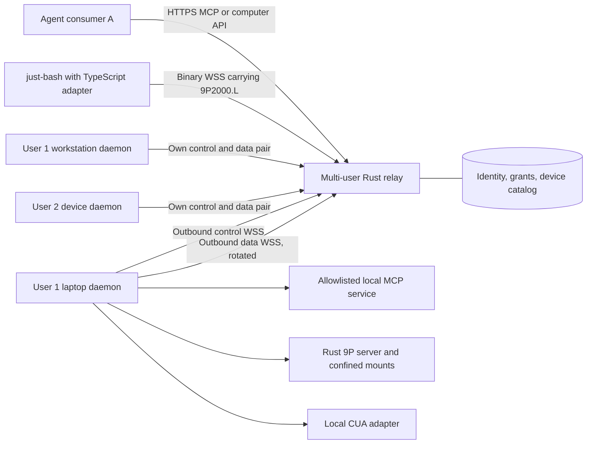

# Architecture

Status: initial design, 2026-09-09. Only configuration validation exists today. Normative tunnel details live in [protocol.md](protocol.md).

## Product boundary

An agent runs wherever its owner chooses, including the cloud. Each enrolled computer initiates outbound WSS connections to a relay. Consumers address an explicit device and service; no inbound port forwarding is required on the computer. The relay is a capability gateway, not the agent's memory, scheduler, model runtime, or conversation store.

The inspiration is a cloud agent with access to several enrolled machines ([source post](https://x.com/gakonst/status/2097279023764140358)). VM provisioning, mobile apps, desktop video streaming, and a durable agent harness are separate future integrations. The tunnel can serve host or VM devices without implementing a hypervisor.



The two-socket requirement applies to each device-to-relay tunnel. Consumers, a local CUA backend, and local MCP services have their own transports. During rotation there may be one control plus old and replacement data sockets for at most the configured overlap budget. See [decisions.md](decisions.md) for the strict-two-socket alternative.

## Components and language boundaries

| Component | Responsibility | Planned implementation |
| --- | --- | --- |
| `tunnel-core` | Validated configuration today; shared invariants, identifiers, errors later | Rust library |
| `tunnel-protocol` | Versioned framing, logical streams, credits, deterministic rotation machine | Future Rust crate |
| `tunnel-relay` | Enrollment, consumer auth, registry, grants, WS pairing, routing, quotas | Rust binary; config-only today |
| `tunnel-client` | Device identity, outbound reconnect, local policy, service supervision | Rust binary; config-only today |
| `tunnel-mcp` | MCP HTTP/stdio bridge with explicit version profiles | Future Rust crate using RMCP |
| `tunnel-vfs` | 9P2000.L server, directory-handle-confined mount operations and bytes | Future Rust crate |
| `tunnel-cua` | Typed, authorized local CUA operations and desktop leases | Future Rust crate |
| `packages/just-bash-fs` | Native `IFileSystem` implementation over binary WebSocket / 9P | Future TypeScript package |

Start with a small workspace and split crates when their milestone starts. Suggested network stack: Tokio for async tasks, Axum for relay HTTP/WS, tokio-tungstenite for the outbound client, rustls for TLS, tracing for diagnostics. These are design choices based on [upstream documentation](sources.md), not installed dependencies or a promise to use unverified latest versions. Pin selected dependencies in Cargo.lock and test feature/TLS/platform combinations in the network milestone.

## Identity and multi-user model

Use stable opaque IDs. Names and paths are display data, never authorization evidence.

| Entity | Scope and lifecycle |
| --- | --- |
| Tenant | Isolation boundary; initially one personal tenant per user |
| User | Human identity keyed by identity-provider issuer and subject |
| Membership | User role within a tenant; supports future shared teams without conflating users with tenants |
| Device | Durable enrolled identity under exactly one tenant; survives disconnect and sleep |
| Service | Locally configured export under a device, with a type, version, and capability manifest |
| Consumer | An agent/app principal acting for a user with scoped grants |
| Grant | Subject + tenant + device + service + operations + constraints + expiry/revocation version |
| Connection epoch | One authenticated live ownership generation for a device; superseded epochs cannot dispatch work |
| Logical stream | Authorized consumer/service conversation independent of any data-socket generation |

One user can enroll many devices and run many consumers. Every lookup and cache key includes the tenant and device scope. Reused request IDs, identical filenames, and identical service names across tenants must remain isolated. v0 permits one active daemon ownership epoch per device; additional daemon instances require separate device identities or an explicit replacement flow.

Durable catalog and live presence are different records. An offline device remains discoverable to an authorized user with last-seen information, but invocations return `DEVICE_OFFLINE` with a retry hint. No offline side-effect queue in v0. The calling agent decides whether to wait, use another device, or request a new action.

## Enrollment and authorization

1. An authenticated user starts enrollment for their tenant. The relay issues a single-use, short-lived enrollment code scoped to that user and device creation operation.
2. The daemon creates its device key locally. Enrollment binds the public identity to the tenant; private credentials go to the OS credential store or a restricted secret file. The device cannot declare its own trusted tenant ID.
3. After proving device identity, the daemon establishes the control socket. The relay assigns a connection epoch and supplies a one-use, short-lived data attachment ticket, bound to tenant, device, control epoch, data generation, and audience.
4. The data socket is admitted only after ticket verification and atomic consumption. Neither a caller-supplied device name nor a socket URL can grant routing access.
5. Consumers authenticate independently. Each operation is authorized at relay dispatch and again by local daemon policy. Effective access is the intersection of consumer grants and local exports.
6. Revoking a device, consumer, membership, or grant closes affected streams and prevents subsequent dispatch, including buffered/replayed work. A locally visible stop command can disable all exports immediately.

Use an external OIDC/OAuth provider for human login rather than building password or SMS authentication. v0 development can use operator-provisioned test identities in a loopback-only harness. Public relay exposure requires real enrollment, consumer tokens, revocation, and validated WSS. Choose the supported provider through the M1 integration spike, preserving a self-hosted option.

Device credentials and consumer access tokens are separate. Validate issuer, audience, lifetime, and scope. Keep bearer material out of URLs, logs, traces, and command-line arguments. Rotation refreshes a transport generation; it neither renews user permission nor replaces credential rotation.

## Routing and service API

Planned consumer endpoints, subject to M1 contract review:

```text
GET  /v1/devices
GET  /v1/devices/{device_id}/services
POST /v1/devices/{device_id}/services/{service_id}/mcp
GET  /v1/devices/{device_id}/services/{service_id}/fs  (WebSocket upgrade)
POST /v1/devices/{device_id}/services/{service_id}/computer/operations
GET  /v1/operations/{operation_id}
```

Every route derives tenant from authenticated context, then checks the grant for the addressed device/service. Operation status lookup is scoped to the original principal and grant. Directory enumeration and errors must not disclose another tenant's identifiers. Presence updates use a separate authenticated consumer event feed if needed; they do not add a third permanent device socket.

For filesystem access, just-bash uses a persistent authenticated consumer WebSocket to the relay. The proposed subprotocol `agent-tunnel.9p.v1` carries binary 9P2000.L messages. Each consumer socket binds to a single granted mount and its own logical stream through the device tunnel. No per-operation HTTP filesystem calls are required. Multiple remote mounts use separate consumer sessions, composed by just-bash's MountableFs. The data tunnel multiplexes those sessions alongside MCP and computer use.

Authenticate Node consumers at upgrade using Authorization headers. Browser consumers use a secure, same-site session cookie with strict Origin checks; a browser WebSocket cannot set arbitrary Authorization headers. Limit unauthenticated upgrades and never put bearer tokens in query strings. A separate browser deployment profile must pass CSRF/Origin tests before release. 9P attach names and numeric user IDs select only within the already-authorized mount and cannot establish identity. 9P provides filesystem semantics, not encryption or multi-tenant authentication.

9P tags correlate outstanding requests; fids represent server-side file handles. Both remain scoped to the consumer/mount session and survive scheduled device data-socket rotation through the stable logical stream. Consumer disconnect, control epoch loss, or process restart ends the mount session and invalidates its fids. Reconnect negotiates and attaches afresh, and ambiguous mutations fail explicitly without automatic replay. See [integrations.md](integrations.md) for operation mapping, limits, and error semantics.

Service registration advertises locally configured IDs and capabilities, not arbitrary upstream URLs or commands provided by consumers. The relay opens logical streams only to authorized registered exports. MCP payloads, file bytes, images, and computer-operation request bodies travel on the data socket. Control carries only lifecycle, bounded metadata, authorization changes, health, stream admission, and rotation coordination.

A generic service interface exposes capability discovery, open, chunk, finish, cancel, and status with bounded request metadata. New adapters can join without changing tunnel framing. Arbitrary TCP forwarding, arbitrary shell execution, and caller-selected local URLs are outside v0.

## Isolation and privileged operations

The deployment trusts the relay operator in v0: TLS protects both legs, but the relay terminates encryption and can inspect payloads. End-to-end encryption requires a separate audited key-distribution design and changes gateway inspection; it is not claimed here. Local allowlists remain mandatory even with a trusted relay.

VFS exports use named roots and read-only defaults. Enforce containment at the filesystem operation using directory handles and platform-specific protections; lexical normalization or `canonicalize` followed by ordinary open is insufficient against races. Test symlinks, hard links, reparse points, case folding, special files, and rename races. Unsupported platform guarantees fail closed. See [integrations.md](integrations.md) for just-bash compatibility tradeoffs.

Computer actions require a distinct grant from screenshots and files. Each desktop has one active input-controller lease and bounded operation queue so concurrent agents cannot interleave click/type sequences. Record ordering, cancellation, outcome, and lease expiry. Do not replay ambiguous click/type actions after a backend failure. Screen and clipboard data are sensitive payloads; payload logging is off by default.

Local MCP subprocesses use explicit executable/argument/environment allowlists. HTTP services use fixed local endpoint configuration, strict redirect restrictions, and no consumer-supplied upstream credentials. MCP, CUA, and filesystem adapters never infer permission from tool descriptions or returned content.

## Resource limits and observability

Enforce global, tenant, device, consumer, service, and stream budgets before allocation. Bound frames, message reassembly, replay storage, per-stream credits, pending opens, operation deadlines, and screenshot/file sizes. A fair data scheduler prevents one file transfer from monopolizing other streams. The control path has independent queues and rate limits; separate sockets alone do not prevent CPU starvation.

Emit structured audit events with principal, tenant, device, service, operation ID, grant version, start/end, outcome, and byte counts. Avoid raw paths, tool bodies, screenshots, and credentials in normal logs. Metrics cover live devices, socket generations, rotation latency/failures, backpressure, denied requests, queue age, and adapter latency. Avoid unbounded IDs as metric labels. Retention and encrypted audit storage are deployment configuration.

## Deployment and growth

M1 uses one long-running Linux relay process behind a TLS reverse proxy with WS upgrades, suitable idle timeouts, and streaming responses. Use SQLite migrations for the first durable catalog/grant store; keep ephemeral sockets and replay buffers in memory. Database mutations affecting authorization commit before acknowledgment. Relay restart fences all prior epochs; consumers receive explicit interruptions and devices reconnect with jitter.

Multiple users and devices work on this single node from the beginning. This is concurrency and isolation, not horizontal high availability.

M7 introduces PostgreSQL for durable shared state and a leased ownership registry for device-to-relay placement. Both sockets for an epoch reach its owner; consumer ingress forwards internally to that owner. All ownership changes use fencing tokens, and internal relay traffic is authenticated. Do not place one socket on an arbitrary worker and expect a shared database to transport its bytes. Owner failure resets affected streams unless an explicitly tested persistence/recovery protocol exists.

Release Linux relay images plus macOS ARM64, Linux x86_64/ARM64, and Windows x86_64 device binaries as platform gates pass. Network compatibility does not imply CUA desktop support; publish adapter capability matrices separately.
