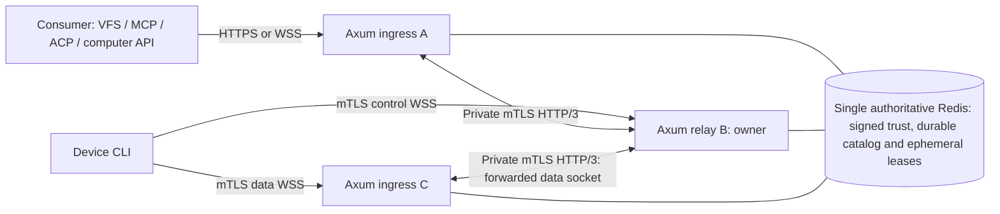

# Relay clustering, identity, and owner routing

Status: M7 implementation in progress, 2026-09-10. Component and synthetic
three-relay tests do not yet prove the complete production routing gate.
M1 implements Axum consumer HTTPS and device mTLS WebSockets; M7 adds signed
membership, owner routing/fencing, and the private HTTP/3 peer path. Automatic
Redis promotion, rollback detection, and production enrollment remain outside
the supported profile. See [M7 evidence](m7-verification.md).

The current M1 Redis layout keeps owner fields and their expiry in durable device hashes without a Redis TTL. Complete incarnation/run-ID checks and logical expiry make stale owner fields non-authoritative; separate TTL-bound ownership/presence/ticket namespaces below remain M7 work. Ordinary startup only verifies existing authority metadata. Explicit bootstrap/recovery requires operator approval, a new incarnation after a changed Redis run, and external reconciliation of catalog and revocation history. M1 verifies same-dataset AOF restart; it cannot detect arbitrary backup rollback or prove catalog freshness from an incarnation change alone.

## Decisions and deployment boundary

- The public web server is Axum. The Rust client CLI opens mutually authenticated TLS WebSockets to the device listener.
- Each relay additionally exposes a private HTTP/3 listener over QUIC with mutual TLS. HTTP/3 support is a separate transport adapter; do not assume Axum's ordinary server listener supplies it.
- The single authoritative Redis deployment is the only shared storage authority. Its durable catalog namespace stores tenants, memberships, identities, grants, device certificate registrations and revocation versions; separate ephemeral namespaces store signed-directory cache state, presence, owner leases and one-use tickets. Redis never carries private keys, file contents, screenshots, MCP/ACP bodies, or tunnel replay buffers.
- Relay serving configuration must use an authenticated `rediss://` Redis URL. The low-level catalog API remains transport-agnostic only so the disposable local test harness can use loopback plaintext Redis; `redis://` is rejected at the `tunnel-relay serve` configuration boundary and is not a production profile.
- Durable catalog records have no lease TTL and remain independent of deployment incarnation. Ephemeral ownership/presence/ticket records are TTL-bound and incarnation-scoped. There is no second shared storage service or per-node local catalog dependency in the supported profile.
- One relay owns a device connection epoch. Any public ingress can forward to that owner over HTTP/3. The owner alone pairs control/data attachments, admits streams, and coordinates rotation.
- Multiple relays, users, devices, and consumers are an initial product requirement. A single relay is a development configuration using the same interfaces.
- Initially support one authoritative Redis primary without automatic promotion. Relay failure is recoverable through fresh device sessions; transparent coordination-store failover is a separate safety gate.
- Cluster membership is operator authority. Device enrollment and user/service authorization are separate authorities; a relay certificate cannot enroll a device or substitute for a consumer grant.

The device still has two steady-state WebSockets and at most one replacement data socket during bounded rotation. HTTP/3 peer connections are shared infrastructure between servers. They do not add device sockets. Two peer segments can exist in an end-to-end operation: consumer ingress to owner, and device ingress to owner. Each segment routes directly to the owner; recursive forwarding is forbidden.

## Identity types and ownership

| Identity | Meaning and source |
| --- | --- |
| `deployment_id` | Operator-provisioned cluster trust domain; cannot be selected by a request. |
| `deployment_incarnation` | Operator-approved fencing namespace, supplied externally and persisted outside Redis; changes after uncertain coordination-store recovery. Durable catalog records are not incarnation-namespaced. |
| `node_id` | Stable opaque relay identity authorized by a deployment certificate and membership record. |
| `boot_id` | Fresh random identifier for one relay process; prevents a restarted process claiming its predecessor's live state. |
| `key_id` | Identifier for an explicitly authorized leaf public key; separate from node identity so keys can rotate. |
| `tenant_id`, `device_id` | Durable device authorization scope from the identity catalog; independent of node membership. |
| `epoch` | Increasing per-device owner generation within one deployment incarnation. |
| `session_id`, `generation` | Live tunnel session and data-socket generation described in the tunnel protocol. |

The full owner token is `(deployment_incarnation, tenant_id, device_id, node_id, boot_id, epoch, session_id)`. The epoch is not a distributed timestamp and must not wrap. Internal envelopes carry the complete owner token; the public binary frame remains bound to its authenticated session and existing epoch field. Consumers never receive private node addresses or registry credentials.

Public consumer admission permits are bounded per `(tenant_id, device_id)` owner scope as well as relay-globally. The scope is the same canonical tenant/device scope the durable catalog keys, the owner token and owner resolution already use: it is exactly the owner an admitted operation targets, its cardinality is bounded by the existing device limits, and a tenant cannot widen its own allowance by minting additional principals. A relay-global-only bound is not tenant isolation, because that permit is held for the whole operation round trip: one tenant's in-flight operations would refuse every other tenant's public request. The two bounds and their defaults are specified in [runtime.md](runtime.md).

The owner actor contains control and data bindings, rotation state, stream authorization, operation dispatch state, sequence/replay state, and quota accounting. An ingress actor can hold a socket and bounded forwarding buffers but cannot manufacture a replacement owner. Durable device records remain present when a lease or socket disappears. User listing is filtered through authorization before returning presence.

## Durable catalog and authorization freshness

Use the single authoritative Redis deployment in the first cluster milestone, accessed through a narrow typed repository interface. Keep the durable catalog, signed membership directory and ephemeral coordination namespaces separate. The durable catalog contains tenants, users and memberships, consumer/device identities, service exports, grants and revocation versions, and device certificate serial/key state. Catalog keys carry tenant/device scope and explicit monotonic revisions; catalog records have no lease TTL and survive a deployment-incarnation change. Ephemeral presence, owner leases and one-use ticket records are TTL-bound, include the current deployment incarnation, and are never used as catalog authorization. Local tests can use an in-process fake; tests claiming cluster behavior must use the single authoritative Redis profile.

An operator-authorized membership publisher can change authorized node keys and advance deployment incarnations. Ordinary relays can read those records but cannot grant themselves that authority. The publisher's signing key, issuing CA keys, and root verification bundle remain outside Redis and normal relay configuration. Redis stores signed authority records, never private keys, and a signed peer key or Redis key presence cannot bootstrap root trust.

Authorization changes commit before acknowledgment. Use tenant-qualified Redis key components, explicit uniqueness/version records, and one bounded atomic script or Redis Function for each cross-record revision update; never implement authorization with check-then-set client round trips. Perform policy evaluation against one consistent catalog revision. A concurrent removal cannot be lost through an unrelated grant edit. Schema/version migrations must support the negotiated rolling-upgrade window without dual authorities.

Planned authorization snapshots have a five-second maximum lifetime measured from the beginning of the authoritative Redis catalog read, never extended by a cache hit. Reconcile active device/consumer grants within that bound, and propagate version invalidations as acceleration hints. On a failed authoritative catalog refresh, stop new admission immediately and stop dispatch when the prior snapshot expires. A known revocation closes affected streams immediately. State this bounded propagation behavior in the public API documentation.

Before dispatch, the device's effective permission is the intersection of the bound grant, an unexpired catalog snapshot, current ownership confirmation, and local allowlists. Transport replay does not bypass a revoked grant. Already executing operations follow adapter-specific cancellation/outcome semantics. Durable catalog availability does not renew a failed ephemeral owner lease, and an ephemeral lease does not authorize work when the catalog policy snapshot expires.

### Device authorization confirmation

The device enforces this five-second authorization deadline independently of the longer ownership confirmation. A grant revision alone is insufficient. Each admitted logical stream has one frozen authorization context containing its principal, tenant/device/service, mount or capability scope, effective permission digest, and authorization revision. The initial `OPEN` may allocate a bounded pending context, but the device cannot dispatch an adapter request until that context receives the following confirmation.

1. The device creates `AUTHORIZATION_CHALLENGE` with the current owner token, context ID, frozen permission digest/revision, and a fresh 128-bit nonce. Record local monotonic `challenge_started_at` when creating the challenge, before any control queue wait. Keep at most one outstanding nonce per context; replacement retires the previous nonce permanently.
2. The owner verifies the exact context and current owner, then obtains an authoritative Redis catalog snapshot or an already cached snapshot whose original read-start deadline has not expired. At confirmation construction time, calculate `remaining_ms = max(0, floor((snapshot_valid_until - owner_now) / 1ms))`, where `snapshot_valid_until` is no later than `snapshot_read_started_at + 5s` and may be earlier for credential/grant expiry. A cache lookup, enqueue, or retry cannot reset that timestamp. Refresh the catalog when insufficient lifetime remains; never manufacture a five-second budget from response receipt.
3. Only if the frozen scope, permission digest, and revision still match, return `AUTHORIZATION_CONFIRMED` with that context, nonce, owner token, revision, and `remaining_ms` in `1..=5000`. A denied, changed, expired, failed, or unknown authorization read produces no positive confirmation. A known revocation sends `AUTHORIZATION_INVALIDATED` and closes the affected stream immediately.
4. The device accepts only its latest outstanding nonce for that still-live context and current owner. Compute `authorization_deadline = challenge_started_at + min(remaining_ms, 5000) milliseconds`. Discard a confirmation arriving at or after this deadline; retire the nonce on acceptance so duplicates cannot extend it. Anchoring at challenge creation conservatively includes request/response transit and queue delay, including when the catalog snapshot predates the challenge.
5. Check both authorization and ownership deadlines immediately before each local adapter dispatch, after every await/queue wait, and after any process suspension. This includes every decoded 9P request waiting in a buffer and each subsequent privileged step of a long-running adapter. At authorization expiry, mark the context stale, stop further dispatch, reset the affected stream with `AUTHORIZATION_STALE`, and discard buffered undispatched work. Already executing work is cancelled best effort and keeps an explicit known/unknown outcome. A late confirmation cannot revive the closed stream; reopening requires fresh authorization.

Refresh active contexts every two seconds with a bounded, staggered scheduler; a challenge times out after two seconds and its nonce is retired. An unanswered challenge never extends an earlier confirmation. Normal renewal is independent of data rotation and cannot broaden permissions or change frozen scope/revision. Any such change closes the stream and requires a newly authorized `OPEN`. Local policy removal invalidates the context immediately even if the relay's snapshot remains valid.

Each challenge, confirmation, or invalidation carries exactly one context and fits within 2 KiB of encoded control JSON. The bounded control decoder enforces that tighter limit before per-context allocation; the WebSocket receiver still enforces the overall 32 KiB control-message ceiling. There is no unbounded multi-message snapshot. Limit the roster to the negotiated active-stream ceiling, initially 64 contexts per device, one outstanding challenge per context, and 256 bytes of fixed renewal bookkeeping per entry (16 KiB total). Context descriptors already belong to bounded stream state. Outgoing confirmation/challenge queues hold at most 16 messages/32 KiB each direction; a full queue delays or fails refresh and never extends a deadline. The rate limit must support the 64-context/two-second cadence; enforce a separate bounded renewal class, initially 64 messages per second with a 16-message burst, without starving cancellation or rotation control.

Use monotonic durations on each endpoint; the formula requires no shared wall-clock timestamp. The underlying clocks must include suspend or invalidate all authorization confirmations on resume. Detect unsupported clock behavior and fail closed; bounded clock-rate error must be covered by the platform timing margin. Ordinary wall-clock correction cannot renew the monotonic deadline, and a wall-clock discontinuity affecting credential validity invalidates the context. The five-second authorization ceiling always takes precedence over a still-valid 20-second ownership permission.

## Redis durability, backup, and recovery

The operator recovery commands (`recovery-initialize`, `recovery-observe`, and `recover`) and their fail-closed ordering are specified in [recovery-cli.md](recovery-cli.md).

The initial profile uses one authoritative Redis primary for both durable catalog and ephemeral coordination, with separate key namespaces, retention, and access policies. Durable catalog entries (tenant, membership, device, credential, grant, service and revocation records) have no lease TTL and carry monotonic revisions. Presence, owner leases and one-use tickets are ephemeral, TTL-bound, and scoped by the current deployment_incarnation; they are never restored as authoritative state. The durable catalog namespace is independent of deployment incarnation so a new externally approved incarnation can fence old coordinators without erasing identity or authorization records.

Configure AOF/fsync and backup retention for the deployment's durability objective. The authoritative profile should use appendfsync always, aof-load-truncated no, and maxmemory-policy noeviction, together with tested backups. These are durability choices only: AOF/fsync settings, replica acknowledgments and backup success do not provide consensus, linearizable failover, or permission to promote another writer. Backups must be verified offline and must not mix partial catalog records, signed-directory state or incompatible schema versions. Do not treat ephemeral leases, presence, ticket nonces or replay buffers as recoverable state.

On restart, restore, rollback or any ambiguous primary identity, stop admission, enter fail-closed/unready service state, fence the old writer and relay processes, and do not serve new authorization from local catalog caches. Require operator quiescence and a newly supplied, externally approved deployment_incarnation, persist that approval outside Redis, load and verify the durable catalog and signed checkpoint, and require fresh relay/device sessions. If the old writer cannot be fenced or the restore cannot be verified, remain unavailable. There is no automatic promotion, dual-write compatibility path, or retained alternate storage dependency in this profile. The durable catalog does not make stream buffers persistent.

## Relay trust bootstrap and Redis key distribution

A public key in Redis is insufficient evidence that a machine belongs to this deployment or that Redis is the authority root. Redis distributes signed records whose authority was established elsewhere; the operator-installed root/checkpoint must already be trusted before any Redis key is accepted. TLS identity verification still uses normal certificate validation and proof of possession; never accept an arbitrary key merely because a Redis key exists.

The deployment installation provisions a trusted relay CA bundle, a membership-signing verification key, `deployment_id`, and private-network address policy through operator-controlled configuration. An existing issuer provisions each relay's private key/certificate via a protected enrollment workflow. Private keys stay on their node or in its secret store. CA and membership signing private keys are unavailable to normal relay processes.

The `tunnel-relay serve` cluster bootstrap accepts the membership signer trust
file as a bounded JSON document of the form
`{"keys":[{"key_id":"publisher-1","public_key":"..."}]}`. Each
`public_key` is a 64-character hex or unpadded URL-safe base64 encoding of 32
bytes. A direct `membership_signer_public_key_path` contains one such key (it
may also be exactly 32 raw bytes) and requires the matching
`membership_signer_key_id`; a named trust document is preferred when rotating
publishers. These files contain public verification material only and are
loaded before Redis records are considered. The
checkpoint authority trust path remains a PEM CA bundle for the HTTPS
authority and is independent from the Ed25519 membership signer keys.

Certificates must identify the deployment, node, and relay role using a documented SAN profile and appropriate client/server usage. Certificate names, validity, chain constraints, role, and allowed leaf SPKI SHA-256 digest must all match. A device-role certificate fails the peer listener even if it has a chain to another trusted deployment intermediate. Use distinct relay and device intermediates/listeners by default.

An operator-authorized membership publisher signs records using a standard signature implementation and an unambiguous, versioned canonical encoding. It publishes current records to Redis over authenticated TLS with an ACL restricted to the membership namespace. A relay may renew only its scoped presence and owner leases; it cannot authorize a new peer key. Public keys are public data, but unauthorized registry modification is an integrity incident.

| Signed membership field | Required interpretation |
| --- | --- |
| `schema_version`, `deployment_id`, `deployment_incarnation` | Exact recognized schema and configured deployment. |
| `node_id`, `record_version` | Authorized node and monotonic membership version within the incarnation. |
| `roles` | Explicit `relay_peer`; additional administrative permissions require separate policy. |
| `peer_endpoint`, `server_name` | Approved private HTTP/3 address and certificate name; never a caller-provided destination. |
| `keys[]` | At most current and next key, each with `key_id`, SPKI digest, activation, expiry, and revocation state. |
| `issued_at`, `not_before`, `expires_at` | Bounded signed validity; Redis TTL cannot extend it. |
| `publisher_key_id`, `signature` | Membership authority signature covering every field, including addresses and keys. |

Proposed limits: 16 KiB per record, 32 authorized nodes, 60-second record lifetime, refresh every 20 seconds, and one-second maximum accepted clock skew. These are planned policy defaults, not current TOML fields. Reject unsupported algorithms, duplicate fields, excess keys, unknown mandatory fields, and records beyond the validity ceiling before peer admission.

At startup, obtain a fresh nonce-bound signed checkpoint from the membership authority containing the deployment incarnation and a bounded map of authorized node IDs to current minimum record versions. Then load Redis records and verify them against that checkpoint. Persist the highest accepted versions in restricted local state; a lower version, equal version with different signed contents, or old incarnation fails closed. An unavailable checkpoint authority leaves a new process unready. This prevents a restarted verifier from treating an old signed Redis snapshot as fresh membership.

Pub/Sub events are invalidation hints, followed by authenticated reads and signature checks. Reconcile all active peers at least every five seconds and revalidate before each new request. Redis Pub/Sub can lose messages, so a missed event cannot indefinitely preserve authorization. [Redis Pub/Sub delivery semantics](https://redis.io/docs/latest/develop/pubsub/)

Do not renew trust freshness simply because a Redis read succeeds. The signed expiry remains the upper bound when the registry is stale or maliciously replaying still-valid records. Clock rollback, excessive skew, and an unreadable local checkpoint mark the node unready and stop new dispatch until verified recovery.

## Certificate and key lifecycle

Relay enrollment requires operator authorization and proof of possession of the requested private key. Never make “insert my public key into Redis” a public enrollment API. Bootstrap, issuance, and membership publication are separate, audited operations.

For planned rotation, authorize the next key before use, publish a signed record containing current and next keys, wait for verification convergence, and switch new handshakes to the next certificate. Retire the previous key after a configured overlap, initially ten minutes. Replace existing peer connections before the old key expires; keep at most one outgoing replacement connection per peer during a 30-second drain budget.

The membership record lifetime remains 60 seconds during the longer key overlap: the publisher must keep issuing fresh authorization. A key's presence in an older valid overlap record is not a reason to extend a connection past its current trust deadline. TLS 1.3 resumption tickets must be tied to the accepted node/key/version and invalidated on retirement or revocation. Disable peer resumption in the first profile if the stack cannot enforce that binding.

Revocation publishes a higher-version signed record removing the key or marking it revoked. Every observing node immediately rejects new requests and closes affected peer connections. With a connected registry, the target propagation interval is five seconds. Under lost updates or registry partitions, trust lasts no longer than the previous signed record's remaining 60-second lifetime plus the allowed one-second clock skew; this is a bounded revocation delay, not instantaneous revocation.

Both relays on a pooled HTTP/3 stream enforce the same signed trust deadline, so either side may reset or end the stream before the other side's invalidation dispatcher runs. Each relay attributes the first terminal cause from its own admission edge: a typed trust-expiry invalidation, or the admission's own monotonic deadline having passed before the peer reset or close was observed. Only the peer reset/close family is reclassified; `GOAWAY`, timeouts, limit and authentication failures keep their own classification, and nothing is reclassified before the deadline. The owner records that cause on a bounded, payload-free per-stream terminal latch (identifiers, owner fencing identity, cursors, carrier generation and a closed cause label; at most 32 entries, first transition only) before `STREAM_FORGET` reclaims the logical stream. A handler dropped immediately at the cancellation edge still enqueues that cause through its cleanup guard; the latch never keeps a stream alive, and a missing stream or session is never itself evidence of expiry.

Already executing device actions can outlive transport closure and follow adapter cancellation/outcome rules. A key compromise triggers operator review of affected grants and operation audit records. Removing a Redis key alone is not sufficient revocation because caches and signed records may remain valid.

Root or membership-signer rotation requires an operator-installed overlapping trust bundle and a new verified checkpoint, followed by old-root removal. A root downloaded only from Redis cannot replace a pinned root. Restoring a backup must not reset a locally observed version or deployment incarnation.

## Device CLI mTLS is a separate contract

Both control and data WSS handshakes require the CLI's device client certificate. Server certificate verification also remains mandatory. Consumer SDK requests use consumer credentials and grants; they do not need the device's private key. The private relay HTTP/3 certificate cannot authenticate as a device or an SDK consumer.

The first networking implementation can import operator-issued device credentials from an existing PKI and register their public identity in the catalog. It must still verify both WSS handshakes and revocation. The interactive enrollment flow below is planned product behavior; do not create a new custom CA implementation merely to complete the echo fixture.

Device enrollment starts through a distinct server-authenticated HTTPS bootstrap endpoint with an authenticated user's single-use, short-lived enrollment authorization. The CLI creates its private key locally and submits a CSR proving possession; the issuer binds the certificate to the catalog's tenant/device identity and device role. An unenrolled machine cannot already present its future device certificate, so this bootstrap exception is explicit and cannot open tunnels or invoke adapters.

Renewal requires a currently valid device certificate, fresh proof of possession, and a non-revoked device catalog record. Bind any new key to the same durable identity through an explicit rotation operation. Expired or revoked devices repeat the authorized enrollment/recovery workflow; no insecure fallback or automatically trusted replacement key. Certificate validity, serial, key version, and grant revocation are checked independently.

The device catalog, certificate registry, and grant versions are durable authorization state. Redis relay membership does not authorize devices. Revocation invalidates control ownership and all data tickets/streams; apply the five-second authorization snapshot ceiling above rather than depending only on a Pub/Sub event. Test the measured device authorization freshness limit alongside enrollment implementation.

The data attachment ticket additionally binds the validated device SPKI digest, tenant/device, owner token, data generation, audience, one-use nonce, and expiry. A device with a different valid certificate cannot consume it. Existing sessions freeze their authenticated key binding: key renewal requiring a changed SPKI starts a new control session and invalidates previous attachments after the documented handover.

Terminate device mTLS in the Rust device listener in the initial deployment. A public load balancer passes TLS through to that listener. External TLS termination requires a separately reviewed authenticated identity-forwarding deployment profile; plain forwarded certificate headers from the internet are never trusted. Separate hostnames/listeners may be needed for ordinary consumer HTTPS and mandatory device mTLS.

## Peer topology and HTTP/3 listener

Use bounded on-demand direct connections. Relay A opens one outgoing HTTP/3 connection to relay B when A needs to forward work; B may separately open one outgoing connection to A. Reuse each outgoing connection for many HTTP requests, and retire idle connections after 60 seconds. Limit simultaneous connection attempts per destination to one and aggregate attempts globally. Back off with jitter after failures.

At 32 nodes, the steady-state ceiling is 31 outgoing plus 31 incoming peer connections per node. Permit at most four additional key-rotation replacement connections per node across both directions, each subject to the 30-second drain budget; additional work returns overload before allocating payload queues. A fully connected deployment is the maximum observed topology, not a requirement to eagerly dial every peer at startup. There is no gossip routing or transitive trust.

Peer deployment requires private UDP reachability to each signed endpoint, initially configurable port 8443, QUIC connection-ID compatible network routing, and suitable stateful firewall/idle timeouts. Public device WSS continues to use TCP. The peer listener negotiates HTTP/3 with ALPN `h3` and TLS 1.3. QUIC uses TLS for authentication and key establishment; do not substitute a custom encryption layer. [RFC 9001](https://www.rfc-editor.org/rfc/rfc9001.html)

Disable 0-RTT for all peer requests and device operations. Early application data has replay considerations, and even apparently read-only peer routes can allocate sessions or consume tickets. Admission starts only after handshake authentication completes. [TLS 1.3 early-data security](https://www.rfc-editor.org/rfc/rfc8446.html#section-8)

Do not introduce an automatic HTTP/2 or plain-TCP fallback. A blocked HTTP/3 path is a typed deployment/routing failure, visible in readiness and diagnostics. A future fallback would need its own authenticated profile and tests. The public consumer API does not require browser HTTP/3 or WebSocket-over-HTTP/3 support.

## Internal request contract

HTTP/3 requests use reliable QUIC streams. Request and response bodies carry bounded, full-duplex framed bytes, with the receiver permitted to send response headers before the request body finishes. One long-lived forwarded public socket or consumer stream uses one HTTP request stream. This requires a real bidirectional streaming compatibility test before selecting the Rust HTTP/3 integration. HTTP/3 DATAGRAM extensions are not needed. [HTTP/3 message and stream mapping](https://www.rfc-editor.org/rfc/rfc9114.html)

| Private route | Purpose |
| --- | --- |
| `GET /internal/v1/health` | Authenticated version/readiness metadata, bounded response. |
| `POST /internal/v1/device/control` | Forward an authenticated control WebSocket to its selected owner. |
| `POST /internal/v1/device/data` | Forward one ticket-bound active or candidate data WebSocket. |
| `POST /internal/v1/streams` | Open and stream an authorized consumer service conversation to the device owner. |
| `POST /internal/v1/operations/status` | Resolve a scoped operation outcome without retrying its invocation. |

These are transport bridge routes, not arbitrary HTTP proxies. The request envelope has a version, request ID, source node/boot identity, destination owner token, tenant/device/service scope, principal and grant version, deadline, remaining hop count, and adapter metadata. Derive source identity from mTLS and compare it to the envelope. Reject a requested destination different from this authenticated owner.

The owner rechecks the durable authorization/grant snapshot and local owner state; mTLS authenticates the forwarding server, not the originating user. In the initial token-based consumer profile, forward the independently verifiable consumer access token only to the owner over mTLS; the owner validates issuer, gateway audience, expiry, and requested scope itself. A future browser-session profile must define its verifiable internal delegation separately. Never forward that consumer credential to the device. Only allowlisted request/response headers and content types cross service bridges; strip hop-by-hop, caller-forged internal, and upstream credential headers.

When public device mTLS terminates at an ingress different from the owner, forward an integrity-protected `DeviceAuthenticationContext` bound to that specific peer request: validated certificate identity, serial, SPKI digest, validity, ingress node, destination owner, and short expiry. The owner checks catalog authorization and ticket/key matching again. This delegates TLS identity verification to an authorized relay; it does not claim that the device's TLS handshake reached the owner end to end.

Before upgrade/admission, the ingress checks auth, quotas, and the owner route. Internally frame complete WebSocket messages with the fixed eight-byte prefix defined under resource limits below; preserve text/binary distinctions and close semantics. The complete forwarded binary WebSocket ceiling is 65,600 bytes, including the tunnel's 64-byte header and its 65,536-byte payload. This differs from the 65,536-byte limit for ordinary consumer byte chunks. Do not tunnel an unbounded raw HTTP header block. One successful admission response is followed by streaming frames and one terminal outcome; an HTTP 200 is not completion of an adapter operation.

The routing hop budget is exactly one. A peer receiving a request for a different owner returns `OWNER_CHANGED` with bounded authenticated routing metadata to the ingress; it never forwards onward. The relay never reselects an owner for a request, whether that request was admitted or not and whatever its method: one owner lookup produces one admission attempt, and an owner-admission failure ends the request with its typed outcome (`OWNER_CHANGED`, `PEER_UNAVAILABLE`, `PEER_UNTRUSTED` and so on) plus its execution certainty. This is deliberately stricter than the failure-policy allowance for one bounded safe-method reselection; no automatic reselection path exists in the relay, so nothing has to prove a request was safe to repeat. The only bridge across an owner change is a **consumer-driven** retry of a request whose outcome was `not_dispatched`: the consumer issues a fresh request, which performs a fresh authoritative owner lookup. After payload dispatch or an ambiguous admission response, neither the relay nor a reconnecting consumer can silently reopen a side-effecting operation.

A consumer names a service either by identifier or by service-type label. One shared resolver decides that mapping for every path that resolves a service: the public echo route, the public stream upgrade and the owner-side peer ingress. An identifier resolves only to that exact active echo service. A label resolves only when exactly one active service on the device carries that type; a label matching several active services is the explicit typed `409 SERVICE_AMBIGUOUS` / `not_dispatched` outcome before owner selection and before any request body is read, even when every candidate would be authorized. The listing routes resolve nothing and stay live, so a consumer can see both candidates and address one by identifier. The peer envelope carries only a resolved identifier, and the owner re-runs the same resolver on it, so a duplicate label cannot reach dispatch through any relay.

## Stream identity, ordering, and scheduled rotation

Each logical stream has a unique identity scoped to its device connection/session, plus an independent sequence in each direction. A physical WebSocket, QUIC connection, or HTTP/3 request-stream number is an attachment identity; none replaces the logical stream identity. Persist logical identity and sequence state in the retained owner/device actors through scheduled data-socket rotation. Do not infer a global order across independent streams.

Ingress forwarding preserves complete tunnel frames and their per-stream sequence fields. QUIC's ordered delivery applies only within one QUIC stream; it does not order arrivals across old/replacement data sockets, different peer connections, or consumer streams. The owner and connector apply the tunnel's per-stream sequencing, duplicate suppression, and credit accounting before adapter delivery.

Scheduled data rotation stays under the same owner and follows [protocol.md](protocol.md): prepare the replacement, quiesce each direction at an explicit per-stream watermark, drain and acknowledge old-socket work, commit handover, and retire the old socket within the configured overlap deadline. An ingress queue or peer-stream acknowledgment is not the required adapter-facing transport drain acknowledgment. Instrument which peer queue or stream watermark is preventing drain.

The retained M2 carrier-recovery path is narrower than owner or session reconnect. While the authenticated control socket and the same owner/connector actors remain live, it closes failed data carriers, keeps their connection IDs in the retained fence/history, and admits fresh generations under one immutable episode deadline. The first recovery attempt is immediate after its closure barrier; later attempts use the shared 100 ms and 200 ms gaps, with no more than three physical attempts. Each `RECOVERY_CLOSED` roster is the newly released per-attempt delta after the preceding authenticated closure pair, so historical IDs are not repeated on the wire even though they remain fenced.

Owner change is a different event: fresh ownership fencing and fresh sessions, with interruption/unknown outcomes as appropriate. Control-socket replacement, connector or relay process restart, owner migration, and recovery after retained-state expiry are also fresh-session boundaries; this in-session carrier path does not implement them. Do not claim that scheduled WebSocket drain or carrier recovery proves live migration of filesystem fids, ACP subprocesses, replay buffers, or other owner state to a new relay. Future migration would require an explicit adapter and ownership protocol.

## Atomic leases and device fencing

Use a Redis key hash tag derived from the canonical tenant/device scope for every key participating in an ownership script. Planned keys are `at:{scope}:owner`, `at:{scope}:epoch`, and bounded ticket nonce records. Include deployment incarnation in these ephemeral coordination keys; durable catalog keys must not be incarnation-namespaced. Never trust a raw consumer-provided key fragment. The initial profile uses one authoritative Redis primary; Redis Cluster topology and automatic promotion are not supported authority paths. Redis hash tags are retained only for a future explicitly redesigned deployment. [Redis Cluster key placement](https://redis.io/docs/latest/operate/oss_and_stack/reference/cluster-spec/#hash-tags)

Acquire, renew, compare-release, and ticket consumption are small atomic Lua scripts or Redis Functions with bounded work. Never implement a check-then-set across client round trips. An acquire observes an absent owner, increments a retained epoch counter, and installs the complete owner token and expiry. A reconnect to an existing owner follows explicit session replacement authorization; another process cannot simply overwrite its lease.

Renewal compares the complete owner token and current deployment incarnation before extending expiry. Release deletes only an exact matching token. A stale node cannot delete its successor's lease. Ticket consumption verifies its owner/key/generation binding and lease before a one-use state transition. Retain spent markers only until ticket expiry and enforce a per-device count cap. Atomic script execution is useful within one authority; it does not make asynchronous failover linearizable. [Redis scripting guarantees](https://redis.io/docs/latest/develop/programmability/eval-intro/)

An unknown acquire/renew result leaves the actor unready for dispatch. It can read back its exact token while sufficient verified lease lifetime remains; it must not assume success or acquire a competing token under another identity. Epoch counters are never expired during a deployment incarnation, and the Redis profile caps epochs at its signed 64-bit increment limit rather than wrapping. Exhaustion, missing previously established counters, Redis restart, or evidence of rollback enters coordination recovery.

Both halves of this contract are exercised against a real relay and a real
owner process by `verify-m7-owner-lease-expiry`. Pausing every relay Redis
socket leaves the relay unable to renew *or* release, so the owner hash
disappears only through its own expiry deadline; a direct unproxied catalog
handle observes that disappearance at or after the deadline carried in the
predecessor's claim, with at least one Redis socket still paused. The
predecessor's exact compare-and-release is then refused both immediately and
again once a successor holds the lease, and the successor resumes above a
retained epoch seeded over 2^53 rather than restarting at one. The gate proves
fencing and no-forward behaviour only; it is not a failover or HA claim, since
the successor is a fresh process started after the predecessor is joined.

An operator's fencing declaration is likewise not proof that no writer remains.
`m7_recovery_process` therefore lets a never-fenced writer move durable catalog
state after the operator observed its digest: the approval signed against that
earlier digest is refused with the bounded `CatalogDigestMismatch` diagnostic,
and after the corrected approval activates the candidate incarnation the same
still-connected writer is refused an ownership claim with the typed
`active deployment incarnation` conflict rather than only failing a fresh
connect-time check. Both refusals happen inside the same run as the measured
lifetime-plus-skew quiescence wait.

Proposed timing defaults:

| Policy | Default and behavior |
| --- | --- |
| Owner lease TTL | 30 seconds on the authoritative Redis instance. |
| Renewal interval | 10 seconds, serialized per device actor. |
| Owner safety margin | 5 seconds; usable local lease ends before Redis expiry. |
| Device dispatch permission | At most 20 seconds per successful challenge-bound lease confirmation. |
| Owner route cache | At most 5 seconds; an owner still validates every admission. |
| Registry RPC deadline | 2 seconds; timeout stops new admission immediately. |
| Maintenance authority work in flight | At most 64 sessions per relay actor; each 500 ms tick starts at most 64 minus the work still outstanding. |
| Graceful relay drain | 30 seconds maximum; no new device owners while draining. |

The relay's maintenance tick re-checks each session's device identity and renews its owner lease through the catalog's two dedicated maintenance lanes rather than the catalog lane. The tick never fans out one authority command per session: at most 64 sessions have maintenance work outstanding, renewals that are due are started before identity re-checks (oldest lease first), and identity re-checks rotate through the remaining sessions so each is visited within `ceil(sessions / 64)` ticks. With a 30 second lease renewed after 10 seconds, that keeps renewals ahead of the remaining lease up to roughly 1,200 sessions per relay; beyond that the identity re-check interval, not lease safety, degrades first, and the default `max_devices` of 1,024 stays inside the bound. A catalog lane does not serialize its callers, so the 2 second authority deadline measures the authority's reply and not the queue behind other sessions: a queueing delay can never surface as `AUTHORITY_UNAVAILABLE`. A reply genuinely later than 2 seconds still fails that session closed, reported with the `timeout` maintenance category, and a severed connection is reported as `redis_io`; the failed command is never replayed, and the lane re-verifies the same primary (same `run_id`) before its next command.

Compute the owner's local safe deadline from monotonic request-start time plus TTL minus safety margin, not response receipt. A late renewal response cannot manufacture a fresh 25 seconds of authority. Reject a response received after that deadline. Check the deadline immediately before every adapter dispatch and after every await or process suspension; a timer task alone is insufficient.

The connector also enforces short-lived dispatch authority. It sends a fresh lease-confirmation challenge and remembers its monotonic send time. The owner must atomically renew its exact lease after receiving that challenge and return the nonce, owner token, and bounded permission only after verified success. The connector accepts work only until its challenge-send time plus at most 20 seconds. This avoids extending old authority by delaying a response in a queue. Loss of confirmation stops new side effects even if the public socket stays open. Serialize and coalesce these renewals with the owner's normal renewal loop.

These timing arguments assume bounded clock rate error and expiry behavior. Use a monotonic clock that accounts for suspend, or invalidate authority after resume. Detect wall-clock steps affecting Redis/certificate expiry and enter recovery. Test long process pauses explicitly. Arbitrary clock jumps, malicious coordination storage, and two writable primaries are outside the single-authority lease proof.

An owner is not ready merely because acquisition succeeded. Complete device authentication, send the new owner token/epoch, receive the connector's fencing acknowledgement, and attach an authorized data socket. The connector atomically rejects its old owner before acknowledging the new one. Every subsequent control operation and data delivery checks the active token; a stale owner may not restart a stream under a new operation ID.

## Routing flows and failure behavior

Initial control arrival selects the ingress as owner when no lease exists and it has capacity. A different live owner receives the control connection through the direct peer route and decides whether the reconnect is permitted. The new ingress cannot unilaterally take over an unexpired lease. A redirect to a private peer URL is never returned to the CLI.

Data tickets are opaque random values with at least 256 bits of entropy. Their digests address bounded, short-lived registry records under the authenticated device scope; those records hold owner binding and one-use state. Include node ID and boot ID internally without exposing private addresses. Every ingress resolves this locator against verified membership, forwards to that exact owner, and lets the owner consume the ticket. A stale or reused ticket fails before stream-buffer allocation. Rotation candidates follow the same route and remain under the same owner.

A consumer request arriving anywhere authenticates, authorizes its target, and resolves the device owner. The owner repeats the admission check and creates the logical stream. Device control and data may be physically held by different ingress processes, but their state belongs to this one owner actor. Consumer and device ingress failure is therefore also a possible stream interruption; clustering does not make the edge sockets durable.

| Event | Required behavior |
| --- | --- |
| Peer connect fails before admission | Return `PEER_UNAVAILABLE`, `not_dispatched=true`; a bounded consumer-driven retry is allowed. The relay itself does not reselect an owner. |
| Peer stream fails after dispatch | Cancel best effort, retain available outcome, return an explicit interrupted/unknown result. |
| Owner lease renewal times out | Stop new admission immediately; stop dispatch by safe deadline and invalidate tickets. |
| Redis partition persists | Enter unready/draining state; close sessions by safe lease expiry. Cached membership cannot extend ownership. When connectivity returns, the catalog reconnects only to the same verified primary `run_id`, never replays the failed command, and readiness recovers in place; a changed `run_id` stays fail-closed recovery. |
| Membership verification expires | Reject peer work and close affected connections even if Redis presence is fresh. |
| Relay owner dies | Consumers receive interruption; device establishes a fresh fenced owner after lease expiry. No in-memory replay migration. |
| Device reconnects to a new owner | Reset adapter sessions whose recovery contract excludes owner change, including v0 filesystem fids. |
| Device certificate revoked | Stop ownership/admission and terminate both WSS legs plus forwarded peer streams. |
| UDP blocked or peer identity mismatches | Fail route readiness explicitly; never disable verification or downgrade transport. |
| Local lease expires while action runs | Stop further dispatch; best-effort cancel; completed external effects are not rolled back. |

Typed internal errors include `PEER_UNTRUSTED`, `PEER_UNAVAILABLE`, `OWNER_CHANGED`, `OWNER_EXPIRED`, `REGISTRY_UNAVAILABLE`, `AUTHORIZATION_STALE`, `RESOURCE_EXHAUSTED`, `DEADLINE_EXCEEDED`, and `OUTCOME_UNKNOWN`. Each contains scope, request/operation correlation, a retry hint, and execution certainty (`not_dispatched`, `dispatched`, or `unknown`). Public errors remove internal addresses and unauthorized identifiers.

## Coordination-store recovery limits

Redis replication is asynchronous and acknowledged writes can be lost across failover. `WAIT` improves acknowledgment of replication but does not turn Redis into a strongly consistent coordinator. A larger epoch from a failed primary can disappear, and two partitions can each appear authoritative. Do not describe CAS scripts, Redlock, replica acknowledgments, or Redis Cluster as a complete fencing proof. [Redis consistency limitations](https://redis.io/docs/latest/operate/oss_and_stack/reference/cluster-spec/), [WAIT guarantees](https://redis.io/docs/latest/commands/wait/)

The initial supported deployment therefore disables automatic Redis promotion for ownership. Persist Redis state and monitor primary process identity/role, but treat restart, restore, promotion, or ambiguous authority as a cluster-wide recovery event. All relay instances stop admitting work, disconnect/fence their device sessions, and become unready. A Redis topology change cannot automatically resume old leases.

The operator fences access to the old primary and quiesces every old relay incarnation before restarting service. Wait at least the maximum owner/device permission and membership trust lifetimes, including allowed clock skew, after fencing. If any old writer/relay cannot be fenced, remain unavailable. Issue a new deployment incarnation through the external membership authority, persist it outside Redis, obtain fresh checkpoints, and require all devices to establish fresh sessions. Restore only a verified durable catalog/signed-directory backup; do not restore live leases, presence, tickets or replay buffers. If the backup is incomplete or its role/incarnation is ambiguous, keep every service unready.

This supports a cluster of web servers while honestly retaining a coordination dependency. Automatic highly available ownership needs a separate design backed by a consensus/transactional fencing authority and device-enforced takeover proof. Redis can continue distributing keys and route caches in that design. That work must pass split-primary, stale-snapshot, and paused-owner tests before the supported topology expands.

## Bounded resources, cancellation, and operability

Each forwarding hop accounts for its own bounded buffers as well as the owner's end-to-end tunnel budget. A peer record has an eight-byte prefix: four-byte unsigned big-endian body length, one-byte record kind, one-byte flags (initially zero), and two reserved zero bytes. Recognized kinds distinguish a complete device data WebSocket message, complete device control text message, ordinary consumer byte chunk, and close. Reject unknown kinds/flags, nonzero reserved fields, and over-limit lengths before body allocation. WebSocket ping/pong handling remains at the ingress transport.

| Peer record kind | Maximum body | Maximum including eight-byte prefix |
| --- | ---: | ---: |
| Complete device data WebSocket message | 65,600 bytes = 64-byte tunnel header + 65,536-byte payload | 65,608 bytes |
| Complete device control text message | 32,768 bytes | 32,776 bytes |
| Ordinary consumer byte chunk | 65,536 bytes | 65,544 bytes |
| Close message | 125 bytes, including close code and bounded reason | 133 bytes |

Keep byte ceilings of 256 KiB (262,144 bytes) per peer stream and 8 MiB (8,388,608 bytes) per peer connection, with at most 128 concurrent request streams per peer. These budgets count encoded prefixes, queued bodies, and any in-progress reassembly reservation across both directions. A stream therefore holds at most three complete maximum-size data records (196,824 bytes); four would need 262,432 bytes and must block. A connection holds at most 127 such records (8,332,216 bytes); 128 would need 8,397,824 bytes and must block. The per-connection limit applies to the sum of all streams, not a full independent allocation for each stream.

Reserve the complete record's charged size before reading/allocating its body, even when HTTP/3 splits it across many reads. Moving an owned buffer between parser and queue transfers its charge; any extra copy is charged separately. HTTP/3 implementation buffers, request-envelope allocations, task metadata, and socket windows need separate bounded budgets under the deployment-wide memory ceiling. Control forwarding has its own queue/admission class and may hold at most 16 queued records within a 64 KiB encoded-byte ceiling, whichever is reached first; two maximum control records already exceed that byte ceiling. Renewal messages retain their tighter 2 KiB limit and 32 KiB directional queue caps above.

Read from an upstream body only when downstream credit and queue space exist. HTTP/3 flow control does not replace per-user/device limits or application credits. Reserve bounded room for terminal errors/cancellation; a saturated file transfer cannot prevent cancellation from being processed. Rate-limit rejected opens and authentication failures so they cannot exhaust tracing or CPU budgets.

Cancellation maps to the protocol's operation cancellation plus HTTP/3 stream cancellation/closure. Releasing buffers and ending an HTTP stream is not proof that a local write, ACP turn, MCP tool, or click stopped. The owner records terminal state when known and preserves the ambiguity when it is not. Do not retry a partially forwarded request body automatically.

Implement explicit state machines for peer trust, peer connection lifecycle, owner lease, forwarded stream, and tunnel rotation. Keep network handlers thin: parse bounded input, authenticate, call typed core operations, map errors. Use one owner actor per device, bounded channels, cancellation tokens, injected clocks/registry interfaces, and a task supervisor that joins children. Avoid shared mutable maps with authorization decisions spread across unrelated handlers.

Structured spans follow `ingress -> peer stream -> owner -> tunnel stream -> adapter operation`. Record deployment/node/boot, owner epoch, socket generation, peer key ID, trace/request/operation IDs, membership version, admission decision, queue bytes, lease remaining time, and closure cause. Hash or restrict tenant/device identifiers where required by audit policy. Never record keys' private material, tokens, certificate PEM bodies, raw paths, file bytes, prompts, screenshots, or arbitrary forwarded headers.

Metrics use bounded labels for state, error kind, and adapter. Include lease renewal latency/failure, ownership changes, stale-owner rejection, trust expiry, certificate rotation, peer RTT/reconnects, active streams, credit wait, buffer high-water marks, and unknown outcomes. Put node/device IDs in restricted traces or diagnostic snapshots, not unbounded metric labels.

Planned relay diagnostics expose redacted peer status, certificate fingerprints/expiry, membership freshness, owner counts and lease margin, UDP probe results, and resource limits. Planned client CLI diagnostics expose server certificate validation, device certificate expiry, current epoch/generation, reconnect cause, local exports, and recent operation status. Status commands are read-only and must not trigger desktop actions or mount writes.

## Implementation and acceptance gates

1. Freeze typed identity/envelope/error schemas and pure lease/rotation models. Property-test token comparison, expiry, ticket consumption, deadline handling, and bounded queues with an injected clock. Review the single-authority assumptions explicitly.
2. Build an Axum mTLS device listener and separate private HTTP/3 listener. Prove bidirectional bodies, cancellation, backpressure, handshake client authentication, ALPN, invalid-certificate rejection, and UDP deployment behavior with real sockets. Pin dependencies only after this spike.
3. Implement the membership issuer/publisher integration, signed Redis records, bootstrap checkpoints, least-privilege ACLs, renewal/revocation, and key overlap. Test forged keys, stale versions, equal-version conflicts, wrong deployment/role, publisher loss, expired records, and cache restart.
4. Add owner acquisition/CAS renewal/release and challenge-bound device fencing. Test duplicate daemon identity, stale boot IDs, lost replies, process pauses, clock/resume boundaries, lease partitions, registry restarts, and counter rollback. Fail closed on every uncertain authority path.
5. Connect three relay nodes, three devices across two users, and concurrent consumers. Force control, active data, replacement data, and consumer ingress onto different nodes. Prove direct owner routing, ticket one-use/key binding, isolation, the socket bound, and rotation through at least three generations.
6. Kill owner and ingress processes independently; partition UDP and Redis separately; saturate a file stream while cancelling an ACP/MCP fixture operation. Verify bounded memory, useful traces, explicit interruption, and no automatic replay of unknown side effects.
7. Exercise a staged key rotation, revoke a connected peer/device, miss all Pub/Sub hints, and restart from stale Redis/local snapshots. Measure connected and partitioned revocation bounds. Demonstrate the documented quiesce/incarnation recovery procedure.
8. Run rolling upgrades with negotiated versions, incompatible-peer rejection, `GOAWAY`, and bounded drains. Existing streams may end explicitly; do not require invisible migration of in-memory sessions. Keep the repository private and use only synthetic fixtures/disposable desktop VMs.

Additional boundary tests required before admission of real adapters:

- Forward a legal 65,600-byte data WebSocket message and a 32,768-byte control message byte-for-byte through different ingress and owner nodes. Test ordinary consumer chunks at 65,536 bytes, every eight-byte-prefix split, fragmented body reads, exact limits, limit-plus-one rejection before allocation, invalid record kind/flags, and bounded close reasons. Confirm the three-record stream and 127-record connection ceilings, prefix/copy accounting, and control-queue backpressure without truncating valid messages.
- Keep the Redis ownership confirmation healthy for 20 seconds while partitioning catalog reads or stopping authorization replies. Advance the device clock to the five-second authorization deadline with decoded 9P mutations and an ACP/MCP fixture action queued behind an await. None may begin after expiry; already dispatched work retains its actual/unknown outcome. A late reply must not revive the reset stream.
- Exercise fresh and nearly expired cached catalog snapshots, challenge queue delays, response queue delays, duplicate/stale nonces, out-of-order replies, owner changes, context reuse attempts, grant revision/scope changes, explicit revocation, and suspend/resume. Prove that every accepted deadline is at most challenge start plus returned remaining lifetime, never response receipt plus five seconds, and that refreshing one context cannot refresh another.
- Run all 64 authorization contexts while rotating saturated data sockets. Measure the two-second refresh cadence and bounded roster/control queues; delayed or dropped control traffic must fail closed rather than accumulate snapshot fragments or extend permissions. Verify prompt local-policy invalidation and rejection of oversized/multi-context confirmations before per-context allocation.

Cluster readiness requires valid local identity, a fresh membership checkpoint/record, verified coordination authority, reachable required peer routes, and capacity to honor limits. A liveness endpoint may remain healthy during a registry outage while readiness becomes false. The first release must publish measured limits and known interruption cases, not merely a three-process startup demonstration.
