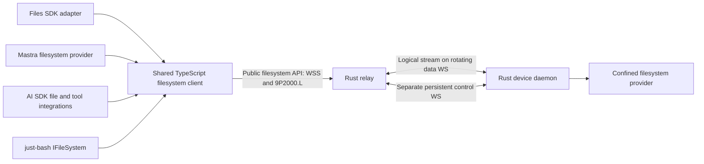

# Filesystem endpoint contract

Status: implementation specification, 2026-09-09; amended 2026-09-17 with the [confinement and capability model](#confinement-and-capability-model) and a numbered list of [implementation gates](#implementation-gates). **No endpoint, TypeScript client, or adapter exists yet.** Implementation gate 1 — the confined virtual path namespace, the capability and primitive authorization model, the negotiated limits, the payload-free error vocabulary and the descriptor — is implemented in `crates/tunnel-fs-core`, with the choices it pins listed under [Pinned in code (gate 1)](#pinned-in-code-gate-1); it is **implemented awaiting verification** (task row M4-07). Implementation gate 2 — the OS-confined resolver — is implemented in `crates/tunnel-fs-host`, with the choices it pins listed under [Pinned in code (gate 2)](#pinned-in-code-gate-2); it too is **implemented awaiting verification** (task row M4-08), exercised on macOS only, with the Linux `openat2` path compiled but never run and filesystem exports declared unsupported on Windows. Gates 3 to 6 are not started. This document defines M4; it takes precedence over earlier filesystem-specific sketches in other documents. The device tunnel invariants in [protocol.md](protocol.md) still apply.

Gate 1 is pure and performs no I/O, so it proves the **lexical** half of confinement only. It does not prove confinement against an operating system: symlinks, hard links, mount points and every TOCTOU race between resolving a path and acting on it are invisible to a crate that never opens a file, and are gate 2's obligation. Gate 2 now discharges that obligation against a real temporary filesystem, on one host; what it could not demonstrate there is named in its own residue rather than implied to be covered.

## Outcome and layers

Expose an enrolled computer's granted filesystem as an API that applications can use through Files SDK, Mastra, AI SDK, or just-bash. Applications select an endpoint and credential, then supply the appropriate adapter to their framework. They do not run another agent on the computer, mount a kernel filesystem, or hand remote shell scripts to the daemon.



The public API is a documented WebSocket/9P binding plus an authenticated capability descriptor. A shared client handles that wire protocol; framework adapters translate their native APIs. A bare endpoint URL cannot be passed to an unrelated SDK protocol and assumed compatible. The [adapter contracts](filesystem-adapters.md) identify supported entry points and explicitly distinguish Files SDK's own HTTP gateway protocol.

One consumer connection selects **one service export, one root, one grant context**. A service may represent a workspace directory, an isolated VM volume, or another confined provider. Give separate roots separate service IDs. Applications combine mounts at their framework layer. Every adapter can use a separate connection, or share an explicitly injected client for the same principal/export; never pool connections across users or grant contexts.

## Endpoint and discovery

Canonical endpoint example (synthetic):

```text
https://relay.example/v1/devices/device-123/services/workspace/fs
```

| Request to that endpoint | Response |
| --- | --- |
| Authenticated HTTPS GET, no Upgrade | JSON descriptor with `Content-Type: application/json` and `Cache-Control: no-store` |
| Authenticated WSS upgrade, subprotocol `agent-tunnel.9p.v1` | Binary 9P2000.L connection, after grant and device readiness checks |
| Other methods | 405; no JSON per-operation filesystem RPC at this URL |

The URL scheme becomes `wss:` for the upgrade; hostname, port, path, and authentication scope stay the same. Do not follow cross-origin redirects or trust an arbitrary WS URL returned in JSON. TLS certificate verification is mandatory outside the explicit loopback development harness. Do not use endpoint URL parameters for paths, tokens, root names, or user identity.

The descriptor has schema ID `agent-tunnel.fs.v1`. See [schema](contracts/filesystem-capabilities.schema.json) and [example](contracts/filesystem-capabilities.example.json). It reports the selected device/service IDs, opaque `grantRevision`, transport profile, live availability, root path policy, effective operations, semantic features, and enforced limits. It contains no host path, credential, host UID, or executable. It is informative, never an authorization credential.

Discovery reads the current authorized catalog; it can show `offline` for a previously enrolled device without claiming its backend is ready. Only an online device with a current capability manifest can admit a filesystem session. The upgrade rechecks authorization and snapshots effective capabilities/limits. Node clients send the descriptor's `grantRevision` as `X-Agent-Tunnel-Grant-Revision`; mismatch returns 409 `CAPABILITIES_CHANGED`, requiring a fresh descriptor. This check is in addition to authorization, not a replacement. An observed capability or grant change closes that session and requires fresh discovery; never silently broaden access. Cluster authorization snapshots have a maximum five-second lifetime from read start; failed refresh stops new admission and expired state stops dispatch, as specified in [cluster.md](cluster.md). Revocation is immediate once observed, with that documented propagation bound rather than a claim of instantaneous global invalidation.

### HTTP failures before upgrade

JSON errors use `{ "error": { "code": "...", "message": "...", "requestId": "..." } }`, without host details. Messages are diagnostic; callers branch on `code`.

| HTTP | Code and meaning |
| --- | --- |
| 401 | `UNAUTHENTICATED`; missing/invalid/expired consumer token; standard Bearer challenge |
| 404 | `EXPORT_NOT_FOUND`; nonexistent or undiscoverable device/service; same external response for both |
| 403 | `ACCESS_DENIED`; authenticated, discoverable export but requested operation/session permission is absent |
| 409 | `CAPABILITIES_CHANGED`; descriptor revision no longer matches; no filesystem work admitted |
| 429 | `RESOURCE_EXHAUSTED`; consumer/tenant/session admission limit; bounded `Retry-After` |
| 503 | `DEVICE_OFFLINE` or `BACKEND_UNAVAILABLE`; no filesystem session created |
| 400 / 426 | Invalid upgrade or unsupported subprotocol; report supported profile without credentials |

## Authentication and ownership

Node is the first certified runtime. Use an access-token supplier and a WebSocket implementation that can send Authorization on upgrade; native browser WebSocket cannot set that header. The supplier provides fresh tokens for explicit connects, without placing tokens in config files or logs. Validate consumer issuer, audience, expiry and grant scope independently of the device's own credentials. Token expiry ends the session; refreshing it requires fresh discovery/attachment and never silently resubmits a mutation.

A later browser profile uses same-site secure HttpOnly cookies and strict Origin checks at discovery and upgrade. It must supply equivalent grant-revision protection through a reviewed same-origin handshake. CORS alone is insufficient. Browser-cookie support, cross-origin embedding, and raw native browser WebSocket are **not** advertised in M4's first Node release.

The relay binds the stream to authenticated tenant/principal/device/service/grant revision. The Rust provider enforces the effective operation grant on every 9P dispatch and rechecks it after asynchronous queue waits. A read grant is not a write grant; filesystem access never implies desktop, clipboard, arbitrary process, or general network access. Membership/device/export revocation closes streams and stops dispatch of queued work. Already executing effects may have an unknown outcome; do not claim rollback.

### Primitive authorization and derived capabilities

The descriptor's high-level `operations` are **derived client capabilities**, not independently enforceable wire verbs. The server sees 9P primitives and their flags, not a trusted `copy` or `readFile` label. Compute each advertised method from all required primitive permissions and provider features; a custom 9P client receives the same restrictions. A grant allowing copy necessarily permits its underlying read/create/write actions. This profile cannot promise copy-only, grep-only or framework-only access.

| Primitive family | Required server policy checks |
| --- | --- |
| `Tversion`, `Tattach`, `Tflush`, `Tclunk` | Authenticated session, fixed export, quotas and lifecycle; cleanup cannot broaden authority |
| `Twalk` | Confined traversal; requires no capability, per the [recorded decision below](#twalk-and-its-disclosure). Every resolved fid retains export and permission context |
| `Tgetattr`, `Treaddir` | Granted `list`; a fid reached by walking does not carry metadata rights |
| `Treadlink` | Granted `read` **and** the `symlinks` feature |
| `Tlopen`, `Tlcreate`, `Tread`, `Twrite` | Decode `.L` flags explicitly: check read vs write access, create/exclusive/truncate/append permissions and node type before opening or changing anything; recheck fid rights and fresh authorization on each I/O |
| `Tmkdir`, `Tunlinkat`, `Tremove`, `Trenameat`, `Trename` | Granted create/remove/rename on relevant parent/source/destination; root confinement on both sides and no implicit cross-export move |
| `Tsetattr` | Validate the mask field by field; size changes require write/truncate authority, mode/time changes require their explicit permissions; reject unsupported ownership fields |
| `Tsymlink`, `Tlink` | Explicit link grant plus platform capability and confinement; default denied |
| Other opcodes/flags | Deny unless the negotiated profile specifies, implements and tests them |

Read-only policy denies every mutating opcode and flag, including `O_TRUNC` on open and size-changing `Tsetattr`. Reject unsupported combinations before backend dispatch. Stream-level admission is not enough: the connector enforces the independent authorization freshness confirmation from [cluster.md](cluster.md) after queue waits and immediately before each primitive side effect.

## 9P binding and lifecycle

1. After HTTP 101, first send `Tversion(tag=NOTAG, version="9P2000.L", msize<=65536)`. Wait for `Rversion` before further requests. M4 accepts negotiated `msize` from 256 to 65536 bytes, including 9P framing; reject smaller or different dialects.
2. Send `Tattach` for a fresh root fid, `afid=NOFID`, empty `uname`/`aname`, and `n_uname=NOUID`. Authentication has already occurred. The provider maps the session to its configured OS identity and virtual `/`; these fields cannot choose host identity or another export. Unexpected values fail. No custom `Tauth` bearer-token scheme.
3. Every consumer WebSocket binary message contains one complete length-prefixed 9P message. Reject text, inconsistent lengths, unsupported mandatory features, or excess allocations. WS fragmentation is reassembled under the same size limit. Disable per-message compression initially.
4. The relay forwards an ordered byte stream over the existing tunnel DATA frames; a 9P record may span those frames. The Rust provider and shared client enforce framing and `msize`. Do not create a second tunnel or socket for every file operation.
5. Fids and outstanding tags are session-local. Handle partial walks, short reads/writes, directory cookies, valid metadata masks, and `Tclunk` cleanup. Reserve `NOTAG`; do not reuse a tag until its response or completed flush lifecycle. Decode 64-bit fields as BigInt.
6. Close gracefully by cancelling pending operations according to 9P flush rules, clunking remaining fids within a deadline, and closing the consumer connection. Repeated `Tversion` after attachment is outside this profile; terminate rather than implicitly reset hidden adapter state.

Scheduled device data-socket rotation preserves this logical stream, fids, tags, and consumer WebSocket. One device still has two steady-state sockets and at most a temporary third during handover; consumer sockets are separate. A failed data socket can recover only while the same control owner and ordered stream state remain. Consumer loss, control-epoch change, grant expiry, or process restart invalidates the filesystem session. Explicit reconnect creates fresh fids and a new adapter session; no transparent reconnect retry of application operations.

`Tflush` is cancellation, not rollback. Respect a normal reply arriving before `Rflush`, and reserve the flushed tag until the flush response. A transport ACK only means transport delivery/retention. Neither ACK nor connection close proves a filesystem mutation succeeded, failed, or was durable.

## Shared client API

Proposed package: `@agent-tunnel/client` (name is a design placeholder, not a published dependency). Public entry point:

```ts
// Proposed API, not executable today.
const remote = await connectFilesystem({
  endpoint: 'https://relay.example/v1/devices/device-123/services/workspace/fs',
  token: async () => obtainConsumerAccessToken(),
});
try {
  const bytes = await remote.readFile('/notes.txt');
  // Supply remote to any one of the framework adapters.
} finally {
  await remote.close();
}
```

All network operations are asynchronous and accept `AbortSignal` plus a bounded deadline. Common methods below are the shared semantic contract; the precise framework signatures belong in their adapter packages. The client exposes its immutable effective descriptor and lifecycle state (`connecting`, `ready`, `closed`), never raw tokens or raw host paths. It offers explicit `close()`; a closed instance is not reusable and must not reconnect behind the caller's back.

| Shared method | Contract / 9P implementation |
| --- | --- |
| `readFile(path, options?)` | Bounded `Uint8Array`; open/read/clunk; default 16 MiB materialization ceiling, enforce while reading even if size grows |
| `readStream(path, options?)` | Async byte chunks with optional offset/length, backpressure, cancellation, exact short-read/EOF handling |
| `writeFile(path, bytes, options?)` | Create or truncate, no parent creation by default; `overwrite:false` uses exclusive create; not an atomic replacement |
| `writeStream(path, chunks, options?)` | Same semantics, bounded streaming; report acknowledged bytes on partial failure; no automatic replay |
| `appendFile(path, bytes, options?)` | Atomic append positioning per write if advertised; a multi-chunk append is not one transaction; never stat-then-write emulation |
| `stat(path, {followSymlinks?})` | BigInt size, scoped qid, valid fields, kind/mode/mtime and optional birth time; final-link behavior explicit |
| `readDirectory(path)` | Async immediate-child records using directory cookies; no snapshot or stable sort promise |
| `mkdir(path, {recursive?})` | Explicit parent creation; never interpret path as a host directory |
| `remove(path, {recursive?,force?})` | Nonrecursive by default; recursive traversal bounded; force suppresses only absence |
| `copy(source, destination, options?)` | Bounded composed read/write/traversal in one export; no server-side-copy or atomic-copy claim |
| `rename(source, destination, options?)` | Native in-export rename; cross-export operations reject `EXDEV`; do not substitute copy/delete |
| `chmod`, `utimes`, `symlink`, `link`, `readlink`, `realpath` | Implement only when advertised; unsupported operations fail rather than invent semantics |

The primitive required 9P mapping remains in [integrations.md](integrations.md). Extensions are negotiated separately; we do not alter 9P frame layout to smuggle JSON operation IDs, version tokens, arbitrary metadata, or framework objects into the baseline.

## Paths, consistency, and mutation semantics

The shared namespace is POSIX-style virtual `/`, independent of host OS. Canonical shared-client paths are absolute; adapters convert their relative paths/keys explicitly. No percent-decoding or Unicode normalization occurs on 9P path components. Reject NUL, backslash, control characters, drive/UNC path syntax, unsupported host filenames, and path length above the descriptor limit. The just-bash adapter retains its upstream pure lexical root-clamping behavior before calling the shared client. Object keys and Mastra relative paths reject parent traversal rather than inheriting that special shell behavior.

Absolute symlink targets refer to the exported virtual root, never host `/`. The provider performs descriptor-relative confinement at every operation, including link/rename races; lexical normalization is not confinement. Restricted providers may advertise no links. Special files, sockets, FIFOs, and device nodes remain denied. A writable exported inode also linked outside the root is a separate policy risk; write support requires a tested hard-link policy.

Report actual case behavior (`sensitive` or `insensitive-preserving`); do not lowercase keys or claim a case-sensitive object store on a case-insensitive host. File identity/metadata must not leak host inode, UID, or directory details. No persistent content/negative cache in the first release. Framework indexes are caller-owned derivatives of authorized reads, not a coherent copy of the live host.

Reads and directory enumeration observe a live filesystem. They are not a snapshot; concurrent host writers can change bytes or entries during an operation. Return available observed metadata; never invent an ETag or version ID that implies conditional-update safety. Birth time may be absent. Where an upstream interface requires a created date, document a modification-time fallback as an adapter compatibility convention, not actual birth-time evidence.

Overwrite, copy, recursive delete, and parent creation may partially apply. Native in-filesystem rename is the only baseline single namespace operation with backend atomicity; it is not a multi-file transaction or durability promise. `overwrite:false` must use exclusive creation, not an exists-then-create race. If a platform cannot provide required flags/semantics, advertise them unsupported. Plain close/write acknowledgment does not mean fsync; durable writes need a separately advertised and tested fsync feature.

Conditional mutation (`expectedMtime`, if-match, if-none-match except exclusive create), versioning, arbitrary object metadata, public/signed URLs, resumable uploads, server-side search, and locks are not baseline features. Reject corresponding requested semantics with `ENOTSUP` before mutation. Do not implement conditional writes using an unprotected stat/read followed by write. Future extensions need a separate wire contract and conformance gate.

Mastra has an explicitly selected adapter-only `mtimePolicy: 'check-before-write'` compatibility profile, described in [filesystem-adapters.md](filesystem-adapters.md). It reproduces Mastra's advisory timestamp preflight using ordinary stat and write, with an acknowledged race. It does not send a conditional-write operation, change `conditionalWrites: false`, or provide atomic compare-and-swap. The default adapter policy rejects timestamp conditions until the application deliberately selects that weaker upstream-compatible behavior.

## Confinement and capability model

This section is normative and settles what earlier sections gestured at. It governs the device-side provider; the adapters and the shared client inherit it and may not widen it.

### The virtual path namespace

A **virtual path** is an absolute POSIX-style path inside one export's root. Validation **rejects; it never rewrites.** No implementation may normalise, fold, percent-decode, Unicode-normalise, case-fold, or otherwise repair an attacker-supplied path. Anything a resolver would have to fix is refused instead. These are refused, each with its own diagnostic rule:

| Refused | Reason |
| --- | --- |
| The empty string, or any path not beginning with `/` | Relative paths cannot be resolved against a caller-chosen base |
| A `..` component, in any position | Parent traversal is refused, never resolved |
| A `.` component | A normaliser would fold it away; refusing keeps one path per file |
| An empty component, from a repeated or trailing `/` | Two spellings must not name one file |
| A NUL byte | Truncates the path in every C-string host API |
| A C0 control character or `DEL` | Terminal and log injection, and host ambiguity |
| A backslash | A separator on Windows hosts |
| A colon | Drive-letter syntax and NTFS alternate data streams |
| A component whose stem matches `CON`, `PRN`, `AUX`, `NUL`, `CONIN$`, `CONOUT$`, `COM0`–`COM9`, `COM¹`, `COM²`, `COM³`, `LPT0`–`LPT9`, `LPT¹`, `LPT²` or `LPT³`, ASCII-case-insensitively, **after trailing ASCII spaces are removed from the stem** | Reserved Windows devices, refused on **every** host so an export's namespace does not change meaning when the serving device changes operating system. The trim is load-bearing: `ntdll` strips trailing spaces from the stem before comparing, so `CON .txt` opens the console device. The superscript spellings are reserved by Microsoft alongside the ASCII-digit forms |
| A component ending in `.` or a space | Windows silently trims both, so two virtual paths would alias one host file |
| A path above the negotiated `maxPathBytes`, or a component above 255 UTF-8 bytes | Bounded before allocation |
| More components than the negotiated `maxPathComponents` | Bounded before allocation |

A component supplied to a path-building helper that itself contains a `/` is refused under its own rule, not reported as an empty component: it is several components, and calling it empty would misdescribe the input.

**Non-UTF-8 input is not this layer's gate.** A virtual path is a UTF-8 string by construction, so a byte sequence that is not valid UTF-8 cannot reach path validation at all. Rejecting it is the **codec's** obligation (implementation gate 3), which must refuse a 9P string that is not valid UTF-8 before it is ever decoded into a path, rather than replacing invalid bytes. A host filename that cannot be represented in UTF-8 produces the documented explicit result from the resolver; it is never transliterated.

Deliberate narrowings and acceptances, recorded as named limits rather than left implicit:

* The colon is legal in a POSIX filename and is refused anyway, for drive and alternate-data-stream syntax.
* `...`, and any other name ending in a dot or a space, is refused although POSIX permits it, because Windows trims both.
* `<`, `>`, `"`, `|`, `?` and `*` are **accepted** — they are legal POSIX filenames. A host that cannot represent one must produce an explicit documented error from the resolver rather than a silent substitution.
* Only C0 controls and `DEL` are refused. **C1 controls (U+0080–U+009F), the bidirectional overrides U+202A–U+202E and U+2066–U+2069, U+2028 and U+2029, and zero-width characters are accepted.** This is a deliberate narrowing of the injection rationale to the byte range that is hazardous in a C-string host API and a terminal escape. It means a filename can be constructed that renders misleadingly in a terminal or a UI; consumers that display filenames are responsible for their own rendering, and this is not treated as a confinement property.

Containment is decided component-wise, never by string prefix: `/ab` is not inside `/a`.

### Two spellings, one file

The provider reports the host's observed case behaviour in `root.caseSensitivity` and never assumes it.

**Gate 1 provides no collision key, deliberately.** An earlier draft exposed an ASCII case fold; it was removed, because no string comparison can decide these collisions and a key that is right most of the time reads as though the problem were solved. At least four distinct classes map two accepted virtual paths onto one host file, and gate 1 accepts both members of every pair:

| Class | Example pair | Where |
| --- | --- | --- |
| ASCII case | `/Dir/File.TXT`, `/dir/file.txt` | Case-insensitive volumes |
| Unicode case pairs | `/σ`, `/Σ`; `/straße`, `/STRASSE` | Case-insensitive volumes |
| NFC versus NFD | `/café`, `/cafe` + U+0301 | APFS, HFS+ |
| NTFS 8.3 short names | `/LONGFI~1.TXT`, `/longfilename.txt` | NTFS with 8.3 generation enabled |

The last is the same two-spellings-one-file hazard the refusal table exists to prevent, and it cannot be refused lexically: a short name is well-formed and indistinguishable from an ordinary name. All four are the resolver's obligation in gate 2, which must decide them by asking the host — anchored resolution plus file identity — rather than by comparing strings. On NTFS a provider may alternatively require 8.3 generation to be disabled on the exported volume and state that as a precondition.

### TOCTOU, symlinks and hard links

Lexical validation is **not** confinement. A validated virtual path means "this text cannot itself express an escape", never "this path is safe to open". The resolver must therefore:

1. Resolve every path component by anchored traversal from a retained root descriptor, never by concatenating text and calling a path-taking syscall. A path-taking syscall re-resolves the whole path and reintroduces every race. The anchoring mechanism is per host:
   * **Linux:** `openat2`. The `resolve` flag follows the `symlinks` feature and the two are mutually exclusive: `RESOLVE_NO_SYMLINKS` when `symlinks` is **off**, `RESOLVE_IN_ROOT` when it is **on**. `RESOLVE_BENEATH` is *not* usable with links enabled — it rejects an absolute symlink target with `EXDEV` rather than re-rooting it, so it cannot satisfy rule 3. Fall back to per-component `openat` with `O_NOFOLLOW` on kernels without `openat2`, re-checking the parent's identity after each step.
   * **macOS and other BSDs:** per-component `openat` with `O_NOFOLLOW`, with link targets re-rooted by the provider rather than by the kernel.  The provider bounds its own traversal, refusing a chain of more than 32 links with `ELOOP` so a cycle is refused by count rather than by hanging.
   * **Windows:** `NtCreateFile` with a `RootDirectory` handle and `FILE_OPEN_REPARSE_POINT`, which is the only anchoring primitive that does not re-resolve from a drive root.  `FILE_OPEN_REPARSE_POINT` surfaces junctions and volume mount points as reparse points rather than following them, so rule 5 and gate 2's mount-point obligation cover them on this host too. Windows device hosts are in scope for the product ([architecture.md](architecture.md)), so a gate-2 implementation that omits this must state that filesystem exports are unsupported on Windows rather than leaving the mechanism unnamed. **The gate-2 implementation takes that second option**, for the reason recorded under [Pinned in code (gate 2)](#pinned-in-code-gate-2): a Windows provider would need a different identity primitive for the 8.3 alias class, and anchoring alone would not give it one.
2. Act on the descriptor it resolved, not on the path it resolved from. Checking a path and then opening it by name is a TOCTOU bug regardless of how carefully the path was checked.
3. Deny symbolic links unless the `symlinks` feature is advertised: with the feature off, `Tsymlink` and `Treadlink` are refused and a link encountered during traversal fails the walk with `ELOOP` rather than being followed. With it on, resolve an absolute link target against the **exported virtual root**, never host `/`.
4. **Hard links.** "Deny hard links" is not directly implementable — a hard link is not observable during a path walk, since every directory entry is a link and the second one is indistinguishable from the first. The testable rule is therefore stated in terms of what *is* observable, `st_nlink` and file identity:
   * `Tlink` is refused unless the `hardLinks` feature is advertised. This is the only part that is a simple capability check.
   * With a write grant and `hardLinks` **off**, `OpenWrite`, `OpenTruncate` and size-changing `Tsetattr` are refused with `EPERM` on any regular file whose `st_nlink` is greater than 1 (directories always carry a link count of at least 2 and are not covered by this rule), because such an inode may also be linked outside the root and writing through it would be an escape no path check can see.
   * Reads of a multiply-linked inode are unaffected: the link count discloses nothing the grant does not already permit.
   * This is the "tested hard-link policy" that write support is conditional on. It is deliberately conservative — it refuses writes to legitimately multiply-linked files inside the root — and a provider that needs those writes must advertise `hardLinks` and prove containment by file identity instead.
5. Refuse special files, sockets, FIFOs and device nodes.
6. Recheck the grant after every asynchronous queue wait and immediately before each primitive side effect, per the [cluster contract](cluster.md).

Both rename endpoints, both link endpoints and every traversal are confined independently. There is no implicit cross-export move; a cross-export or cross-device operation is `EXDEV` and is never emulated by copy-and-delete.

### Capabilities

An operator grants exactly four capabilities: **read**, **write**, **list**, **delete**. The default is deny. There is no wildcard, no "all" value and no implicit grant; every capability a session holds was named individually. An export granting nothing admits no session at all, rather than admitting a session that can do nothing.

| Capability | Governs |
| --- | --- |
| `read` | File content and symbolic-link targets |
| `write` | Create, modify, truncate, and set metadata |
| `list` | Traverse for metadata, and enumerate directories |
| `delete` | Remove a name from a directory |

The server enforces **primitives**, not labels. Each 9P opcode family — with its `.L` flags decoded, so that `Tlopen` for reading, for writing, for truncation and on a directory are four separate decisions — requires a conjunction of capabilities. Notable consequences, each a deliberate decision:

* Enumerating a directory needs `list`, not `read`, so a grant that may list names cannot thereby read content; and `read` alone does not permit enumeration.
* `Trenameat` requires **both** `write` and `delete`: renaming away removes a name, and a grant that may create but not remove must not remove one by renaming it.
* The recursive operations `copy` and `remove` traverse directories, so both additionally require `list`. `remove` is therefore not available under `delete` alone, and `copy` is not available under read+write alone.
* Session lifecycle primitives (`Tversion`, `Tattach`, `Tflush`, `Tclunk`) require no capability, because a session exists only for a non-empty grant.
* `Tsymlink` and `Treadlink` additionally require the `symlinks` feature, `Tlink` the `hardLinks` feature and `Trenameat` the `atomicRename` feature. All are absent by default.

There is **no append-only or create-only capability**. `write` permits overwriting and truncating existing content. An export that must never destroy data cannot be expressed in this model and must not claim to be.

The **read-only profile is `read` + `list` together**, and that pair is what an integrator should configure. `read` alone is a valid grant — read-by-name, for a caller that knows its paths and must not enumerate — but it has no `stat`, so a Files SDK `head` or `exists` call has nothing to call. Do not reach for `read` alone expecting an ordinary read-only mount.

#### `Twalk` and its disclosure

`Twalk` requires no capability. This is a recorded decision with a named cost, not an oversight.

Requiring `list` to walk would make read-by-name impossible, because every open begins with a walk: a `read`-without-`list` grant could not reach any file at all, and the grant shape would be useless. The cost is that `Rwalk` returns qids, so a grant holding only `write` or only `delete` can probe whether a name exists and whether it is a file or a directory.

Those qids are the **only** metadata such a grant may observe. `Tgetattr` and `Treaddir` both require `list`, so size, times, mode, link count and directory contents remain unreachable, and a fid reached by walking carries no metadata rights. An export for which name-existence probing by a write-only or delete-only consumer is itself unacceptable must not issue such a grant.

The descriptor's `operations` are **derived**, never configured: an operation is advertised only when every primitive composing it is independently permitted. A grant allowing `copy` therefore necessarily allows plain reads and writes, and this profile cannot promise copy-only, grep-only or framework-only access. `root.readOnly` is likewise derived from the grant, so the advertised flag cannot disagree with what is enforced.

An empty grant derives an empty operation list. Discovery must answer `403 ACCESS_DENIED` for such an export rather than serving a descriptor that advertises nothing: an empty `operations` array must never reach a consumer as though it described a usable export.

### Payload-free diagnostics

No path, file name, file content, host path, host identity or credential may appear in a log line, a `Debug` rendering, an error message, a close reason or a descriptor. This is a construction rule, not a review rule: error types carry only static codes and field-free enums, and a validated path type has a redacting `Debug` and no `Display`, so its text leaves only through an explicit accessor. A caller already knows the path it asked for and correlates by request tag; repeating it in the error would put it into every rendering that touches it.

The errno vocabulary is closed. An unmapped host errno becomes `EINVAL` rather than being passed through, so a consumer's handling stays exhaustive and a host cannot disclose which of its own failure modes occurred.

## Errors, retries, and cancellation

Shared errors carry `code`, `operation`, virtual `path` when safe, `outcome`, `retryable`, and optional `bytesAcknowledged`. Outcomes are `not_started`, `failed`, `partial`, or `unknown`; a rejection after a previously confirmed partial chunk cannot become `not_started`. `bytesAcknowledged` is a lower bound confirmed by replies, not proof of final content or durable bytes.

Translate Linux `.L` errno to stable codes including `ENOENT`, `EACCES`, `EROFS`, `EEXIST`, `ENOTDIR`, `EISDIR`, `ENOTEMPTY`, `ELOOP`, `EXDEV`, `ENOTSUP`, `EFBIG`, and `EINVAL`. Separate transport/session errors (`SESSION_LOST`, `AUTH_EXPIRED`, `DEVICE_OFFLINE`, `RESOURCE_EXHAUSTED`, `DEADLINE_EXCEEDED`, `ABORTED`) from filesystem absence. Session loss during a potentially dispatched mutation carries `outcome: unknown`, irrespective of the user-facing code. `exists` converts only confirmed absence into false.

Do not automatically retry mutations, reads, or reconnect the shared client in the baseline. Retrying a read can also change a caller's observation; callers choose to start a new read explicitly. Transport-layer duplicate suppression within a live session remains permitted and does not replay a 9P request into the provider twice. SDK retry wrappers must be disabled or classify partial/unknown mutation errors as permanently nonretryable. Cancellation after dispatch never promises no side effect.

After upgrade use 9P errors for valid failed requests. Protocol violations close with WS 1002, authorization invalidation with 1008, shutdown with 1012, overload with 1013, and unexpected server failure with 1011. Close reasons contain only bounded sanitized identifiers. A close code alone cannot encode whether a mutation applied; the shared client classifies in-flight operations conservatively from its dispatch/reply history.

## Initial enforced limits

These are implementable starting defaults/ceilings for the first profile, not measured capacity claims. Negotiation may reduce them. Descriptor capabilities cannot exceed local policy or a tenant/global budget.

| Resource | Initial value |
| --- | ---: |
| Maximum 9P message including header (`msize`) | 65,536 bytes |
| Outstanding request tags / live fids per session | 64 / 256 |
| Queued encoded payload bytes per consumer | 1 MiB |
| Materialized file limit / concurrent internal materialization budget | 16 MiB / 32 MiB |
| Path length in UTF-8 / path components | 4,096 bytes / 256 |
| Recursive traversal entries / depth | 10,000 / 64 |
| Single 9P request default deadline | 30 seconds |
| Composite operation default / maximum deadline | 300 / 3,600 seconds |
| Idle session timeout with no requests or operations | 300 seconds |

Budget encoded bytes, pending promises, fids, traversal state, and adapter pagination state. Pause producers before allocation limits are reached; close/fail predictably when consumers cannot be bounded. Streaming bypasses the per-file materialization limit, not aggregate queues, grant byte quotas, or operation deadlines. Bound adapters that convert a stream to Buffer, Blob, text, or model content even when `head` claimed a smaller size. SDK/framework pools share a per-principal budget; every connection does not grant a fresh tenant quota.

The 32 MiB limit covers concurrent client/adapter-owned materialization buffers, conversion copies and retained caches. Release a reservation when the result's ownership transfers to the caller; if an adapter keeps a copy, that copy remains charged. Returned ordinary Uint8Array/Buffer/string values have no release API, so caller-retained results are outside this enforceable internal limit. Applications must bound their own result history. Sequential completed reads must not permanently consume the internal quota, and concurrent reads cannot each reserve the full limit independently. The descriptor field `maxTotalBufferedBytes` has this internal ownership meaning.

## Implementation gates

Six gates, in order. Each names what it must prove; a gate is not closed by code existing, and a later gate does not close an earlier one's residue. [The adapter plan](filesystem-adapters.md) gives per-framework delivery gates; [testing.md](testing.md) covers wire and failure fixtures.

1. **Contract and pure core.** The virtual path namespace, the capability/primitive/derived-operation model, the negotiated limits, the payload-free error vocabulary and the descriptor — with no I/O, no clock, no socket and no dependency. *Must prove:* every refused path class above is refused by its own rule and no accepted path can express an escape; every limit is exact at its boundary and refused one beyond, with no unlimited sentinel; capabilities default to deny and no advertised operation exceeds its primitive grant, exhaustively over every grant and feature set; no error rendering contains a path or content; the emitted descriptor reproduces the checked-in example byte for byte. *Cannot prove:* anything about a real filesystem.
2. **OS-confined resolver.** Anchored traversal on each supported host, symlink and hard-link policy, file identity, case-collision decisions taken from the host, and the special-file refusal. *Must prove:* escape attempts through symlinks, hard links, link cycles, mount points, cross-root rename and links changed concurrently with access all fail, against a real temporary filesystem, including a writer racing the resolver between resolution and use; the `st_nlink` write refusal of rule 4 above; and that each of the four two-spellings-one-file classes — ASCII case, Unicode case pairs, NFC/NFD and **NTFS 8.3 short names** — is decided by file identity rather than by string comparison, or that its precondition is enforced. This is where TOCTOU is proven; gate 1 cannot.
3. **9P2000.L codec and session state.** Bounded incremental encode/decode, `msize` negotiation, tags, fids, directory cookies, `Tflush`. *Must prove:* byte-exact golden fixtures shared with the TypeScript client, messages exactly at and one byte above `msize`, fuzzed incremental decoding that never over-allocates, and exhausted tag/fid quotas.
4. **Descriptor endpoint, upgrade and read provider over the real path.** The authenticated `GET`, the WSS upgrade at the same URL, grant-revision recheck, and a confined read-only provider reached through the relay and the device data socket. *Must prove:* the authorization matrix at descriptor, upgrade, attach and open-fid use; a cached descriptor never authorizes access; and a forged `Tattach` cannot exceed the grant.
5. **Write grants and partial failure.** Creates, truncation, append, rename, composite operations, and structured partial/unknown outcomes. *Must prove:* a read-only grant denies every mutating opcode and flag before backend dispatch; a failure injected after truncation, after a short write and after rename-before-reply reports its outcome accurately; and no ambiguous mutation is ever replayed.
6. **Shared client and native adapters.** `@agent-tunnel/client` plus the Files SDK, Mastra, just-bash and AI SDK Files adapters, end to end through the real endpoint and a rotating device tunnel. *Must prove:* each pinned published package passes against actual relay/device sockets. Compilation against a source interface or a fake in-memory adapter is insufficient to claim remote compatibility.

### Pinned in code (gate 1)

`crates/tunnel-fs-core` is dependency-free and performs no I/O. It pins these choices, each of which is a decision this document did not previously settle:

* The refused path classes and their per-class diagnostic rules. The table above is **unordered**; the checking order is fixed but different, and it is what determines which rule a path violating several of them reports. That order is: empty, then total byte length, then the leading separator, then a whole-path byte scan for NUL, backslash, colon and control characters, then per component — empty, component length, `.`, `..`, a contained separator, the component byte scan, trailing space or dot, reserved device stem — with the component count checked as components are consumed. So `\a` reports `PATH_NOT_ABSOLUTE` rather than `PATH_BACKSLASH`, and a 5,000-byte path containing `..` reports `PATH_TOO_LONG`.
* A 255-byte maximum path component. This is a fixed property of the namespace, matching the `NAME_MAX` every supported host provides, so it is not a negotiated limit and does not appear in the descriptor.
* The four capabilities, the 24 enforced primitives and their required capabilities, and the composition of all 17 derived client operations. `Tlopen` is split into read, directory, write and truncate decisions; directory enumeration needs `list`; rename needs `write` and `delete`; the recursive `copy` and `remove` compose their traversal primitives and so need `list` too.
* `Twalk` requiring no capability, with the qid disclosure that follows from it bounded and stated above.
* Close-code mapping. `DEVICE_OFFLINE` is 1012, because the export's backend is what went away; `ABORTED` maps to **no** close code, because cancelling one operation must not close a session carrying other outstanding tags. `maxMessageBytes` is deliberately not an `EFBIG` filesystem error: an over-`msize` frame is a framing violation answered with a 1002 close, never an `Rlerror`.
* Identifiers (`deviceId`, `serviceId`, `grantRevision`) are restricted to ASCII alphanumerics, `-`, `_` and `.`, which is narrower than the schema's length-only rule. That makes JSON escaping unnecessary, so the emitter cannot be the place a quote or control character escapes into the document.
* The three consistency rules the descriptor schema's `$comment` defers to runtime are made structurally impossible rather than checked: `availability`/`capabilityStatus` are one enum, `root.readOnly` is derived from the grant, and `operations` is derived from the primitives.
* Limit negotiation reduces only. Zero and `u64::MAX` are both refused for every field, so neither can be read as "no limit". Five cross-field rules are enforced: `msize` has a 256-byte floor, the consumer queue may not be smaller than one maximum-size message, one materialized file may not exceed the concurrent materialization budget, the default operation deadline may not exceed the maximum, and the single-request deadline may not exceed the operation default.
* `Outcome` is ordered and merges monotonically, so an operation observed as `partial` or `unknown` can never later be reported `not_started`.

**Residue, not covered by gate 1 and open:** every item in gate 2. Specifically, and each accepted by gate 1 rather than refused:

* All four two-spellings-one-file classes — ASCII case, Unicode case pairs, NFC/NFD, and **NTFS 8.3 short names** — which need file identity from the host. *Gate 2 closes the first three on a real filesystem by resolving both spellings and comparing host identity, and closes the fourth by declaring filesystem exports unsupported on Windows; see [Pinned in code (gate 2)](#pinned-in-code-gate-2).*
* Symlinks, hard links, `st_nlink`, mount points, special files and every TOCTOU race. *Gate 2 implements all of these against a real temporary filesystem on macOS. What remains open is the Linux `openat2` path, which is compiled but has never been run, and a real device node, which needs privilege this host does not have.*
* Non-UTF-8 input, which is the codec's gate (3), not this one's. **Still open.** Gate 2 refuses a symbolic-link target that is not valid UTF-8 with `EINVAL`, which is the resolver's own boundary, not the codec's.
* C1 controls, bidirectional overrides, U+2028/U+2029 and zero-width characters, accepted deliberately; a filename can therefore render misleadingly in a terminal or UI. **Still open, deliberately:** gate 2 changes nothing here, because it is a rendering property and not a confinement one.
* The `msize` framing itself and all 9P encoding; deadlines and clocks; quota accounting for queued, buffered and traversal state; and the `maxTotalBufferedBytes` ownership-transfer accounting, which is a client-side property with no representation here. **All still open**; gate 2 has no clock, no socket and no quota.

### Pinned in code (gate 2)

`crates/tunnel-fs-host` implements the OS-confined resolver. It depends on `tunnel-fs-core` and on `rustix`, already in this workspace for the M3 process-group work, whose `fs` feature is the maintained safe wrapper the no-`unsafe` rule requires for `openat`, `openat2`, `statat`, `readlinkat` and `fstat`; no new third-party crate is introduced. It pins these choices, each of which this document did not previously settle:

* **Windows is declared unsupported for filesystem exports, as a runtime refusal rather than a build failure.** The contract offered a choice between implementing the named `NtCreateFile` anchoring and stating the platform unsupported; this is the second. `unsupported_host_reason()` is the single place that says so; the `rustix` dependency and the three modules that read a host `Stat` or errno are `cfg(unix)`, so the crate still **compiles** on Windows and consists of that function alone. Discovery can therefore answer `403` for a filesystem export on such a host, and the workspace still builds and tests there. The reason is that anchoring is only half of what Windows needs: 8.3 short names alias every long name on a volume with generation enabled, so the two-spellings-one-file classes would have to be decided against a different identity primitive. A Windows device may still be enrolled and still export other services.
* **The per-component walk is the primary mechanism, not a fallback.** macOS and the BSDs use it; Linux uses `openat2` with the flag the feature selects and falls back to the same walk on `ENOSYS` or a seccomp `EPERM`. Only the walk has been exercised — macOS is the only host available — and the crate's own documentation says so rather than implying Linux coverage.
* **Ancestors are a stack of open directory descriptors.** `..` inside a *host symbolic-link target* pops that stack and never below the root, which is what re-rooting means without a kernel `RESOLVE_IN_ROOT`. A caller's own virtual path still refuses `..` and `.` lexically at gate 1; the resolver interprets them only in text the host wrote, and that distinction is new here.
* **The intent is applied in the resolving open.** `Intent::Write` opens `O_WRONLY` and deliberately never `O_TRUNC`: truncation is applied to the descriptor *after* the hard-link rule has permitted it, so a refused write cannot follow a truncation that already destroyed the content. Reopening the name to apply an intent would be exactly the TOCTOU bug the gate exists to remove.
* **Two guards cover the window between inspecting a name and opening it:** `O_NOFOLLOW` on the open, and a comparison of the opened descriptor's identity against the inspected one. Because that window is microseconds wide, a `race-window-hook` cargo feature — off by default, in no shipped build — lets a test step into it deliberately. **Only the file identity comparison is individually load-bearing.** Each `O_NOFOLLOW` and its sibling identity check mask one another, so they are proven in pairs: deleting both the directory open's `O_NOFOLLOW` and the directory identity check turns a test red, as does deleting both of the file pair, while any one of the three alone leaves every test green. That is measured, not inferred, and it is the honest form of the claim; "proven by deletion" does not apply to `O_NOFOLLOW` on its own. The Linux path's equivalent post-open check has **no** deletion evidence at all, because the hook has no call site there and no Linux host was available.
* **The `statat` before each open is a courtesy, not the decision.** It exists so a FIFO is never opened for reading and a device node is never opened at all; the authoritative kind and identity come from `fstat` on the descriptor. Deleting either special-file check alone leaves the tests green; deleting both turns them red.
* **Error decisions, all within the closed gate-1 vocabulary:** a special file is `ENOTSUP` (the profile does not implement it, as distinct from the host denying it); crossing a mount point, a macOS firmlink or a cross-filesystem bind mount is `EXDEV`, decided by comparing an entry's `st_dev` with the **root's** — not with its parent's, so a same-filesystem bind mount is not caught by this comparison and is left to `RESOLVE_NO_XDEV` on the Linux path; a link target that is not valid UTF-8 is `EINVAL`, and an empty one `ENOENT`. The three mount-boundary checks — before the directory open, before the file open, and after the directory open — likewise mask one another, and are proven by deleting all three together.
* **A component that changed under the resolver takes one uniform answer, `ENOENT`.** This is a decision, not just a mapping: the two opens are reached only after `statat` classified the entry, so `ELOOP` (a link appeared) and `ENOTDIR` (a directory stopped being one) can only mean the race, and both are folded in rather than returned. Returning them would let a racer learn *which* swap it had won. `EAGAIN` from `RESOLVE_IN_ROOT`'s own rename detection folds in for the same reason instead of falling through to `EINVAL`. A dedicated "you lost a race" code would disclose the host's concurrent activity to a caller the grant does not entitle to it.
* **A link target ending in `/` must name a directory.** Splitting the target on `/` and dropping empty parts would resolve `link -> file/` to a regular file, where POSIX and the host both answer `ENOTDIR`.
* **`EINTR` is retried, never reported.** The closed vocabulary has no code for a delivered signal, and mapping it to `EINVAL` would report one as a malformed request. Every host call here is short and restartable. This is the one guard with **no** test: the tests cannot deliver a signal inside a syscall, and its deletion leaves everything green.
* **The device boundary is decided before each open as well as after it.** Opening a file on a FUSE or network filesystem runs that filesystem's own open handler, so an export must not reach onto another device even for the instant it takes to refuse.
* **The Linux `openat2` path carries `RESOLVE_NO_XDEV | RESOLVE_NO_MAGICLINKS`** alongside the feature's flag. Without `NO_XDEV` a bind mount of an outside directory underneath a mount inside the root would be refused by the per-component walk and permitted here, because a final `st_dev` comparison cannot see a boundary that was crossed and crossed back. Its `O_PATH` result is upgraded through `/proc/self/fd` for a **directory** as well as a file, since an `O_PATH` directory descriptor answers `EBADF` to `getdents`; `/proc/self/fd` is probed once at construction and the per-component walk is used when it is missing, rather than reporting every read as a missing file on a host without `/proc`. Falling back — on `ENOSYS`, on a seccomp `EPERM`, or on a missing `/proc` — is **not** a weaker mechanism: it is the same walk macOS uses as its only mechanism, with the same anchoring, the same re-rooting and the same guards, and what it loses is the kernel taking the decisions in one syscall rather than any part of the confinement.
* **A host errno is translated by meaning, not through `FsErrorCode::from_errno`.** That function maps *Linux wire* numbers, which is what an `Rlerror` carries, and the hosts disagree: `ELOOP` is 62 on macOS and 40 on Linux, `ENOTEMPTY` 66 and 39. Using it on a host errno would mistranslate on every non-Linux host, and a test asserts precisely that.
* **Bounds:** 32 link hops, a per-resolution step budget of `maxPathComponents × 33`, a link target of at most `maxPathComponents` components, and an ancestor stack of at most `maxPathComponents`. The hop budget and the step budget are separate, so deleting the first still leaves a cycle refused by the second — a chain of 40 single-component links is what distinguishes them.
* **File identity is `(st_dev, st_ino)` widened to `i128`**, because `dev_t` is signed 32-bit on macOS and unsigned 64-bit on Linux. Neither number has an accessor, `Debug` is redacting and there is no `Display`, so a resolved handle cannot put a host detail into a log line. A 9P qid path is a 64-bit FNV-1a fold of the pair: equality is preserved exactly, the host numbers are not recoverable.
* **The hard-link rule covers exactly `OpenWrite`, `OpenTruncate` and `SetattrSize`.** `SetattrMode` and `SetattrTimes` are outside it, because changing a mode or a timestamp through a second link writes no content through it. Directories are excluded by *kind*, not by a link-count threshold, so the exclusion cannot drift as a directory gains children.
* **Collisions are decided by resolving both spellings and comparing identity.** The only verdicts a host may give are "one file" and "the second spelling does not exist"; "two different inodes" is the failure the class exists to catch. On this host's APFS volume all three testable classes — ASCII case, the Greek sigma pair, NFC versus NFD — answered *one file*, and that is recorded as an observation of this volume, not as a property of the profile.
* **The export root is the only caller-independent path opened by name**, once, at construction, from operator configuration — plus, on Linux, two fixed procfs spellings: `/proc/self/fd`, probed once to decide whether the `openat2` path is usable, and `/proc/self/fd/N`, which reopens a descriptor the resolver already holds and re-checks its identity afterwards. Neither contains a byte a caller supplied, and no caller-derived text reaches a path-taking syscall anywhere. Moving or replacing the root directory after construction cannot redirect the export.
* **Inspecting a file needs read permission on it**, on both hosts. The Linux path could have answered a metadata-only resolution from its `O_PATH` descriptor, but it now upgrades every descriptor so that `open_directory` can enumerate; the consequence is that `Intent::Inspect` on a mode-`000` regular file is `EACCES` there, exactly as it already was on the macOS walk. The hosts therefore agree, which is the property worth having here — but **gate 4 needs a metadata-only open that does not require read permission**, because `Tgetattr` is governed by `list`, not by `read`, and a `list`-only grant must be able to stat a file it may not read.

**Residue, not covered by gate 2 and open:** the Linux `openat2` path has never been **executed** — it is type-checked from the macOS host by `cargo clippy --all-targets --target x86_64-unknown-linux-gnu -- -D warnings`, which is what stands in for CI while hosted CI is billing-blocked, and a cross-target `clippy` is not a test run; the same command for `x86_64-pc-windows-msvc` checks the unsupported-host build. Full-workspace cross-target checking is not possible from this host — the other crates need a C cross-toolchain that is not installed — so the cross-checks cover `tunnel-fs-host` and its dependency only, which is the whole of what this branch changes. Further: a real character or block device node could not be created without privilege, so that refusal rests on the kind decision plus the FIFO and socket cases that were demonstrated; NTFS 8.3 is closed by declaration, not by test. `Treadlink`, `Tsymlink` and `Tlink` are authorized here but not executed; directory enumeration, create, unlink, mkdir and every `Tsetattr` but size belong to gates 4 and 5; the metadata-only open a `list`-without-`read` grant needs is gate 4's, as noted above; and the grant recheck after an asynchronous queue wait has no queue to wait on yet.
