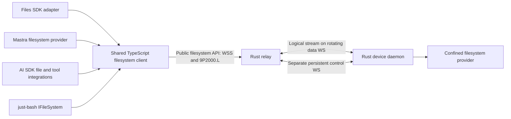

# Filesystem endpoint contract

Status: implementation specification, 2026-09-09. **No endpoint, TypeScript client, or adapter described here exists yet.** The Rust configuration starter remains the only runnable product code. This document defines M4; it takes precedence over earlier filesystem-specific sketches in other documents. The device tunnel invariants in [protocol.md](protocol.md) still apply.

## Outcome and layers

Expose an enrolled computer's granted filesystem as an API that applications can use through Files SDK, Mastra, AI SDK, or just-bash. Applications select an endpoint and credential, then supply the appropriate adapter to their framework. They do not run another agent on the computer, mount a kernel filesystem, or hand remote shell scripts to the daemon.



The public API is a documented WebSocket/9P binding plus an authenticated capability descriptor. A shared client handles that wire protocol; framework adapters translate their native APIs. A bare endpoint URL cannot be passed to an unrelated SDK protocol and assumed compatible. The [adapter contracts](filesystem-adapters.md) identify supported entry points and explicitly distinguish Files SDK's own HTTP gateway protocol.

One consumer connection selects **one service export, one root, one grant context**. A service may represent a workspace directory, an isolated VM volume, or another confined provider. Give separate roots separate service IDs. Applications combine mounts at their framework layer. Every adapter can use a separate connection, or share an explicitly injected client for the same principal/export; never pool connections across users or grant contexts.

## Endpoint and discovery

Canonical endpoint example (synthetic):

```text
https://relay.example/v1/devices/device-123/services/workspace/fs
```

| Request to that endpoint | Response |
| --- | --- |
| Authenticated HTTPS GET, no Upgrade | JSON descriptor with `Content-Type: application/json` and `Cache-Control: no-store` |
| Authenticated WSS upgrade, subprotocol `agent-tunnel.9p.v1` | Binary 9P2000.L connection, after grant and device readiness checks |
| Other methods | 405; no JSON per-operation filesystem RPC at this URL |

The URL scheme becomes `wss:` for the upgrade; hostname, port, path, and authentication scope stay the same. Do not follow cross-origin redirects or trust an arbitrary WS URL returned in JSON. TLS certificate verification is mandatory outside the explicit loopback development harness. Do not use endpoint URL parameters for paths, tokens, root names, or user identity.

The descriptor has schema ID `agent-tunnel.fs.v1`. See [schema](contracts/filesystem-capabilities.schema.json) and [example](contracts/filesystem-capabilities.example.json). It reports the selected device/service IDs, opaque `grantRevision`, transport profile, live availability, root path policy, effective operations, semantic features, and enforced limits. It contains no host path, credential, host UID, or executable. It is informative, never an authorization credential.

Discovery reads the current authorized catalog; it can show `offline` for a previously enrolled device without claiming its backend is ready. Only an online device with a current capability manifest can admit a filesystem session. The upgrade rechecks authorization and snapshots effective capabilities/limits. Node clients send the descriptor's `grantRevision` as `X-Agent-Tunnel-Grant-Revision`; mismatch returns 409 `CAPABILITIES_CHANGED`, requiring a fresh descriptor. This check is in addition to authorization, not a replacement. An observed capability or grant change closes that session and requires fresh discovery; never silently broaden access. Cluster authorization snapshots have a maximum five-second lifetime from read start; failed refresh stops new admission and expired state stops dispatch, as specified in [cluster.md](cluster.md). Revocation is immediate once observed, with that documented propagation bound rather than a claim of instantaneous global invalidation.

### HTTP failures before upgrade

JSON errors use `{ "error": { "code": "...", "message": "...", "requestId": "..." } }`, without host details. Messages are diagnostic; callers branch on `code`.

| HTTP | Code and meaning |
| --- | --- |
| 401 | `UNAUTHENTICATED`; missing/invalid/expired consumer token; standard Bearer challenge |
| 404 | `EXPORT_NOT_FOUND`; nonexistent or undiscoverable device/service; same external response for both |
| 403 | `ACCESS_DENIED`; authenticated, discoverable export but requested operation/session permission is absent |
| 409 | `CAPABILITIES_CHANGED`; descriptor revision no longer matches; no filesystem work admitted |
| 429 | `RESOURCE_EXHAUSTED`; consumer/tenant/session admission limit; bounded `Retry-After` |
| 503 | `DEVICE_OFFLINE` or `BACKEND_UNAVAILABLE`; no filesystem session created |
| 400 / 426 | Invalid upgrade or unsupported subprotocol; report supported profile without credentials |

## Authentication and ownership

Node is the first certified runtime. Use an access-token supplier and a WebSocket implementation that can send Authorization on upgrade; native browser WebSocket cannot set that header. The supplier provides fresh tokens for explicit connects, without placing tokens in config files or logs. Validate consumer issuer, audience, expiry and grant scope independently of the device's own credentials. Token expiry ends the session; refreshing it requires fresh discovery/attachment and never silently resubmits a mutation.

A later browser profile uses same-site secure HttpOnly cookies and strict Origin checks at discovery and upgrade. It must supply equivalent grant-revision protection through a reviewed same-origin handshake. CORS alone is insufficient. Browser-cookie support, cross-origin embedding, and raw native browser WebSocket are **not** advertised in M4's first Node release.

The relay binds the stream to authenticated tenant/principal/device/service/grant revision. The Rust provider enforces the effective operation grant on every 9P dispatch and rechecks it after asynchronous queue waits. A read grant is not a write grant; filesystem access never implies desktop, clipboard, arbitrary process, or general network access. Membership/device/export revocation closes streams and stops dispatch of queued work. Already executing effects may have an unknown outcome; do not claim rollback.

### Primitive authorization and derived capabilities

The descriptor's high-level `operations` are **derived client capabilities**, not independently enforceable wire verbs. The server sees 9P primitives and their flags, not a trusted `copy` or `readFile` label. Compute each advertised method from all required primitive permissions and provider features; a custom 9P client receives the same restrictions. A grant allowing copy necessarily permits its underlying read/create/write actions. This profile cannot promise copy-only, grep-only or framework-only access.

| Primitive family | Required server policy checks |
| --- | --- |
| `Tversion`, `Tattach`, `Tflush`, `Tclunk` | Authenticated session, fixed export, quotas and lifecycle; cleanup cannot broaden authority |
| `Twalk`, `Tgetattr`, `Treaddir`, `Treadlink` | Confined traversal and granted metadata/list/read-link permissions; every resolved fid retains export and permission context |
| `Tlopen`, `Tlcreate`, `Tread`, `Twrite` | Decode `.L` flags explicitly: check read vs write access, create/exclusive/truncate/append permissions and node type before opening or changing anything; recheck fid rights and fresh authorization on each I/O |
| `Tmkdir`, `Tunlinkat`, `Tremove`, `Trenameat`, `Trename` | Granted create/remove/rename on relevant parent/source/destination; root confinement on both sides and no implicit cross-export move |
| `Tsetattr` | Validate the mask field by field; size changes require write/truncate authority, mode/time changes require their explicit permissions; reject unsupported ownership fields |
| `Tsymlink`, `Tlink` | Explicit link grant plus platform capability and confinement; default denied |
| Other opcodes/flags | Deny unless the negotiated profile specifies, implements and tests them |

Read-only policy denies every mutating opcode and flag, including `O_TRUNC` on open and size-changing `Tsetattr`. Reject unsupported combinations before backend dispatch. Stream-level admission is not enough: the connector enforces the independent authorization freshness confirmation from [cluster.md](cluster.md) after queue waits and immediately before each primitive side effect.

## 9P binding and lifecycle

1. After HTTP 101, first send `Tversion(tag=NOTAG, version="9P2000.L", msize<=65536)`. Wait for `Rversion` before further requests. M4 accepts negotiated `msize` from 256 to 65536 bytes, including 9P framing; reject smaller or different dialects.
2. Send `Tattach` for a fresh root fid, `afid=NOFID`, empty `uname`/`aname`, and `n_uname=NOUID`. Authentication has already occurred. The provider maps the session to its configured OS identity and virtual `/`; these fields cannot choose host identity or another export. Unexpected values fail. No custom `Tauth` bearer-token scheme.
3. Every consumer WebSocket binary message contains one complete length-prefixed 9P message. Reject text, inconsistent lengths, unsupported mandatory features, or excess allocations. WS fragmentation is reassembled under the same size limit. Disable per-message compression initially.
4. The relay forwards an ordered byte stream over the existing tunnel DATA frames; a 9P record may span those frames. The Rust provider and shared client enforce framing and `msize`. Do not create a second tunnel or socket for every file operation.
5. Fids and outstanding tags are session-local. Handle partial walks, short reads/writes, directory cookies, valid metadata masks, and `Tclunk` cleanup. Reserve `NOTAG`; do not reuse a tag until its response or completed flush lifecycle. Decode 64-bit fields as BigInt.
6. Close gracefully by cancelling pending operations according to 9P flush rules, clunking remaining fids within a deadline, and closing the consumer connection. Repeated `Tversion` after attachment is outside this profile; terminate rather than implicitly reset hidden adapter state.

Scheduled device data-socket rotation preserves this logical stream, fids, tags, and consumer WebSocket. One device still has two steady-state sockets and at most a temporary third during handover; consumer sockets are separate. A failed data socket can recover only while the same control owner and ordered stream state remain. Consumer loss, control-epoch change, grant expiry, or process restart invalidates the filesystem session. Explicit reconnect creates fresh fids and a new adapter session; no transparent reconnect retry of application operations.

`Tflush` is cancellation, not rollback. Respect a normal reply arriving before `Rflush`, and reserve the flushed tag until the flush response. A transport ACK only means transport delivery/retention. Neither ACK nor connection close proves a filesystem mutation succeeded, failed, or was durable.

## Shared client API

Proposed package: `@agent-tunnel/client` (name is a design placeholder, not a published dependency). Public entry point:

```ts
// Proposed API, not executable today.
const remote = await connectFilesystem({
  endpoint: 'https://relay.example/v1/devices/device-123/services/workspace/fs',
  token: async () => obtainConsumerAccessToken(),
});
try {
  const bytes = await remote.readFile('/notes.txt');
  // Supply remote to any one of the framework adapters.
} finally {
  await remote.close();
}
```

All network operations are asynchronous and accept `AbortSignal` plus a bounded deadline. Common methods below are the shared semantic contract; the precise framework signatures belong in their adapter packages. The client exposes its immutable effective descriptor and lifecycle state (`connecting`, `ready`, `closed`), never raw tokens or raw host paths. It offers explicit `close()`; a closed instance is not reusable and must not reconnect behind the caller's back.

| Shared method | Contract / 9P implementation |
| --- | --- |
| `readFile(path, options?)` | Bounded `Uint8Array`; open/read/clunk; default 16 MiB materialization ceiling, enforce while reading even if size grows |
| `readStream(path, options?)` | Async byte chunks with optional offset/length, backpressure, cancellation, exact short-read/EOF handling |
| `writeFile(path, bytes, options?)` | Create or truncate, no parent creation by default; `overwrite:false` uses exclusive create; not an atomic replacement |
| `writeStream(path, chunks, options?)` | Same semantics, bounded streaming; report acknowledged bytes on partial failure; no automatic replay |
| `appendFile(path, bytes, options?)` | Atomic append positioning per write if advertised; a multi-chunk append is not one transaction; never stat-then-write emulation |
| `stat(path, {followSymlinks?})` | BigInt size, scoped qid, valid fields, kind/mode/mtime and optional birth time; final-link behavior explicit |
| `readDirectory(path)` | Async immediate-child records using directory cookies; no snapshot or stable sort promise |
| `mkdir(path, {recursive?})` | Explicit parent creation; never interpret path as a host directory |
| `remove(path, {recursive?,force?})` | Nonrecursive by default; recursive traversal bounded; force suppresses only absence |
| `copy(source, destination, options?)` | Bounded composed read/write/traversal in one export; no server-side-copy or atomic-copy claim |
| `rename(source, destination, options?)` | Native in-export rename; cross-export operations reject `EXDEV`; do not substitute copy/delete |
| `chmod`, `utimes`, `symlink`, `link`, `readlink`, `realpath` | Implement only when advertised; unsupported operations fail rather than invent semantics |

The primitive required 9P mapping remains in [integrations.md](integrations.md). Extensions are negotiated separately; we do not alter 9P frame layout to smuggle JSON operation IDs, version tokens, arbitrary metadata, or framework objects into the baseline.

## Paths, consistency, and mutation semantics

The shared namespace is POSIX-style virtual `/`, independent of host OS. Canonical shared-client paths are absolute; adapters convert their relative paths/keys explicitly. No percent-decoding or Unicode normalization occurs on 9P path components. Reject NUL, backslash, control characters, drive/UNC path syntax, unsupported host filenames, and path length above the descriptor limit. The just-bash adapter retains its upstream pure lexical root-clamping behavior before calling the shared client. Object keys and Mastra relative paths reject parent traversal rather than inheriting that special shell behavior.

Absolute symlink targets refer to the exported virtual root, never host `/`. The provider performs descriptor-relative confinement at every operation, including link/rename races; lexical normalization is not confinement. Restricted providers may advertise no links. Special files, sockets, FIFOs, and device nodes remain denied. A writable exported inode also linked outside the root is a separate policy risk; write support requires a tested hard-link policy.

Report actual case behavior (`sensitive` or `insensitive-preserving`); do not lowercase keys or claim a case-sensitive object store on a case-insensitive host. File identity/metadata must not leak host inode, UID, or directory details. No persistent content/negative cache in the first release. Framework indexes are caller-owned derivatives of authorized reads, not a coherent copy of the live host.

Reads and directory enumeration observe a live filesystem. They are not a snapshot; concurrent host writers can change bytes or entries during an operation. Return available observed metadata; never invent an ETag or version ID that implies conditional-update safety. Birth time may be absent. Where an upstream interface requires a created date, document a modification-time fallback as an adapter compatibility convention, not actual birth-time evidence.

Overwrite, copy, recursive delete, and parent creation may partially apply. Native in-filesystem rename is the only baseline single namespace operation with backend atomicity; it is not a multi-file transaction or durability promise. `overwrite:false` must use exclusive creation, not an exists-then-create race. If a platform cannot provide required flags/semantics, advertise them unsupported. Plain close/write acknowledgment does not mean fsync; durable writes need a separately advertised and tested fsync feature.

Conditional mutation (`expectedMtime`, if-match, if-none-match except exclusive create), versioning, arbitrary object metadata, public/signed URLs, resumable uploads, server-side search, and locks are not baseline features. Reject corresponding requested semantics with `ENOTSUP` before mutation. Do not implement conditional writes using an unprotected stat/read followed by write. Future extensions need a separate wire contract and conformance gate.

Mastra has an explicitly selected adapter-only `mtimePolicy: 'check-before-write'` compatibility profile, described in [filesystem-adapters.md](filesystem-adapters.md). It reproduces Mastra's advisory timestamp preflight using ordinary stat and write, with an acknowledged race. It does not send a conditional-write operation, change `conditionalWrites: false`, or provide atomic compare-and-swap. The default adapter policy rejects timestamp conditions until the application deliberately selects that weaker upstream-compatible behavior.

## Errors, retries, and cancellation

Shared errors carry `code`, `operation`, virtual `path` when safe, `outcome`, `retryable`, and optional `bytesAcknowledged`. Outcomes are `not_started`, `failed`, `partial`, or `unknown`; a rejection after a previously confirmed partial chunk cannot become `not_started`. `bytesAcknowledged` is a lower bound confirmed by replies, not proof of final content or durable bytes.

Translate Linux `.L` errno to stable codes including `ENOENT`, `EACCES`, `EROFS`, `EEXIST`, `ENOTDIR`, `EISDIR`, `ENOTEMPTY`, `ELOOP`, `EXDEV`, `ENOTSUP`, `EFBIG`, and `EINVAL`. Separate transport/session errors (`SESSION_LOST`, `AUTH_EXPIRED`, `DEVICE_OFFLINE`, `RESOURCE_EXHAUSTED`, `DEADLINE_EXCEEDED`, `ABORTED`) from filesystem absence. Session loss during a potentially dispatched mutation carries `outcome: unknown`, irrespective of the user-facing code. `exists` converts only confirmed absence into false.

Do not automatically retry mutations, reads, or reconnect the shared client in the baseline. Retrying a read can also change a caller's observation; callers choose to start a new read explicitly. Transport-layer duplicate suppression within a live session remains permitted and does not replay a 9P request into the provider twice. SDK retry wrappers must be disabled or classify partial/unknown mutation errors as permanently nonretryable. Cancellation after dispatch never promises no side effect.

After upgrade use 9P errors for valid failed requests. Protocol violations close with WS 1002, authorization invalidation with 1008, shutdown with 1012, overload with 1013, and unexpected server failure with 1011. Close reasons contain only bounded sanitized identifiers. A close code alone cannot encode whether a mutation applied; the shared client classifies in-flight operations conservatively from its dispatch/reply history.

## Initial enforced limits

These are implementable starting defaults/ceilings for the first profile, not measured capacity claims. Negotiation may reduce them. Descriptor capabilities cannot exceed local policy or a tenant/global budget.

| Resource | Initial value |
| --- | ---: |
| Maximum 9P message including header (`msize`) | 65,536 bytes |
| Outstanding request tags / live fids per session | 64 / 256 |
| Queued encoded payload bytes per consumer | 1 MiB |
| Materialized file limit / concurrent internal materialization budget | 16 MiB / 32 MiB |
| Path length in UTF-8 / path components | 4,096 bytes / 256 |
| Recursive traversal entries / depth | 10,000 / 64 |
| Single 9P request default deadline | 30 seconds |
| Composite operation default / maximum deadline | 300 / 3,600 seconds |
| Idle session timeout with no requests or operations | 300 seconds |

Budget encoded bytes, pending promises, fids, traversal state, and adapter pagination state. Pause producers before allocation limits are reached; close/fail predictably when consumers cannot be bounded. Streaming bypasses the per-file materialization limit, not aggregate queues, grant byte quotas, or operation deadlines. Bound adapters that convert a stream to Buffer, Blob, text, or model content even when `head` claimed a smaller size. SDK/framework pools share a per-principal budget; every connection does not grant a fresh tenant quota.

The 32 MiB limit covers concurrent client/adapter-owned materialization buffers, conversion copies and retained caches. Release a reservation when the result's ownership transfers to the caller; if an adapter keeps a copy, that copy remains charged. Returned ordinary Uint8Array/Buffer/string values have no release API, so caller-retained results are outside this enforceable internal limit. Applications must bound their own result history. Sequential completed reads must not permanently consume the internal quota, and concurrent reads cannot each reserve the full limit independently. The descriptor field `maxTotalBufferedBytes` has this internal ownership meaning.

## Implementation boundary and acceptance

Implement in this order: descriptor/auth admission → Rust confined 9P read provider → shared client/lifecycle/bytes/errors → framework read adapters → explicit writes/partial failures → cross-framework and cross-platform conformance. [The adapter plan](filesystem-adapters.md) gives per-framework delivery gates; [testing.md](testing.md) covers wire and failure fixtures. A framework is supported only after its pinned published package passes against actual relay/device sockets. Compilation against a source interface or a fake in-memory adapter is insufficient to claim remote compatibility.
