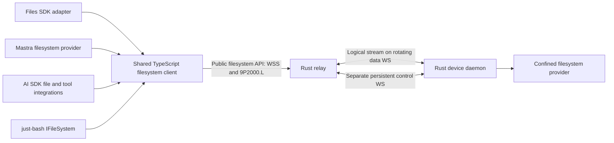

# Filesystem endpoint contract

Status: implementation specification, 2026-09-09; amended 2026-09-17 with the [confinement and capability model](#confinement-and-capability-model) and a numbered list of [implementation gates](#implementation-gates). **No adapter exists yet, and the TypeScript client is a codec only** — `packages/client/src/ninep/` reads gate 3's fixtures as an independent second implementation (task row M4-10) and is not yet a client: it has no descriptor fetch, no WebSocket, no `connectFilesystem` and no lifecycle. Implementation gate 1 — the confined virtual path namespace, the capability and primitive authorization model, the negotiated limits, the payload-free error vocabulary and the descriptor — is implemented in `crates/tunnel-fs-core`, with the choices it pins listed under [Pinned in code (gate 1)](#pinned-in-code-gate-1); it is **implemented awaiting verification** (task row M4-07). Implementation gate 2 — the OS-confined resolver — is implemented in `crates/tunnel-fs-host`, with the choices it pins listed under [Pinned in code (gate 2)](#pinned-in-code-gate-2); it too is **implemented awaiting verification** (task row M4-08), exercised on macOS only, with the Linux `openat2` path compiled but never run and filesystem exports declared unsupported on Windows. Implementation gate 3 — the 9P2000.L codec and the session state machine — is implemented in `crates/tunnel-fs-ninep`, with the choices it pins listed under [Pinned in code (gate 3)](#pinned-in-code-gate-3); it too is **implemented awaiting verification** (task row M4-09), and it is pure: no socket, no clock, no filesystem, so everything it proves is about bytes and state rather than about a running endpoint. Implementation gate 4 — the descriptor endpoint, the WSS upgrade, the dispatcher and the read path — is implemented across `crates/tunnel-relay/src/http/fs.rs`, the new `crates/tunnel-fs-provider`, `crates/tunnel-client/src/fs_export.rs` and a new `metadata` module in `crates/tunnel-fs-host`, with the choices it pins listed under [Pinned in code (gate 4)](#pinned-in-code-gate-4); it too is **implemented awaiting verification** (task row M4-11), and it is the first gate with a socket: it is exercised against a real three-relay cluster, a real Redis catalog and a real device connector, but only at the relay that owns the device, and it enforces no clock. Gate 5 is not started. Gate 6 is **started, codec only** — an independent TypeScript 9P2000.L codec that reads gate 3's fixtures (task row M4-10, **implemented awaiting verification**). That is one of the seven components [filesystem-adapters.md](filesystem-adapters.md) lists, and not a whole one: the shared client's descriptor, transport, lifecycle, bytes and limits are absent, and none of the four native adapters exists. This document defines M4; it takes precedence over earlier filesystem-specific sketches in other documents. The device tunnel invariants in [protocol.md](protocol.md) still apply.

Gate 1 is pure and performs no I/O, so it proves the **lexical** half of confinement only. It does not prove confinement against an operating system: symlinks, hard links, mount points and every TOCTOU race between resolving a path and acting on it are invisible to a crate that never opens a file, and are gate 2's obligation. Gate 2 now discharges that obligation against a real temporary filesystem, on one host; what it could not demonstrate there is named in its own residue rather than implied to be covered.

## Outcome and layers

Expose an enrolled computer's granted filesystem as an API that applications can use through Files SDK, Mastra, AI SDK, or just-bash. Applications select an endpoint and credential, then supply the appropriate adapter to their framework. They do not run another agent on the computer, mount a kernel filesystem, or hand remote shell scripts to the daemon.



The public API is a documented WebSocket/9P binding plus an authenticated capability descriptor. A shared client handles that wire protocol; framework adapters translate their native APIs. A bare endpoint URL cannot be passed to an unrelated SDK protocol and assumed compatible. The [adapter contracts](filesystem-adapters.md) identify supported entry points and explicitly distinguish Files SDK's own HTTP gateway protocol.

One consumer connection selects **one service export, one root, one grant context**. A service may represent a workspace directory, an isolated VM volume, or another confined provider. Give separate roots separate service IDs. Applications combine mounts at their framework layer. Every adapter can use a separate connection, or share an explicitly injected client for the same principal/export; never pool connections across users or grant contexts.

## Endpoint and discovery

Canonical endpoint example (synthetic):

```text
https://relay.example/v1/devices/device-123/services/workspace/fs
```

| Request to that endpoint | Response |
| --- | --- |
| Authenticated HTTPS GET, no Upgrade | JSON descriptor with `Content-Type: application/json` and `Cache-Control: no-store` |
| Authenticated WSS upgrade, subprotocol `agent-tunnel.9p.v1` | Binary 9P2000.L connection, after grant and device readiness checks |
| Other methods | 405; no JSON per-operation filesystem RPC at this URL |

The URL scheme becomes `wss:` for the upgrade; hostname, port, path, and authentication scope stay the same. Do not follow cross-origin redirects or trust an arbitrary WS URL returned in JSON. TLS certificate verification is mandatory outside the explicit loopback development harness. Do not use endpoint URL parameters for paths, tokens, root names, or user identity.

The descriptor has schema ID `agent-tunnel.fs.v1`. See [schema](contracts/filesystem-capabilities.schema.json) and [example](contracts/filesystem-capabilities.example.json). It reports the selected device/service IDs, opaque `grantRevision`, transport profile, live availability, root path policy, effective operations, semantic features, and enforced limits. It contains no host path, credential, host UID, or executable. It is informative, never an authorization credential.

Discovery reads the current authorized catalog; it can show `offline` for a previously enrolled device without claiming its backend is ready. Only an online device with a current capability manifest can admit a filesystem session. The upgrade rechecks authorization and snapshots effective capabilities/limits. Node clients send the descriptor's `grantRevision` as `X-Agent-Tunnel-Grant-Revision`; mismatch returns 409 `CAPABILITIES_CHANGED`, requiring a fresh descriptor. This check is in addition to authorization, not a replacement. An observed capability or grant change closes that session and requires fresh discovery; never silently broaden access. Cluster authorization snapshots have a maximum five-second lifetime from read start; failed refresh stops new admission and expired state stops dispatch, as specified in [cluster.md](cluster.md). Revocation is immediate once observed, with that documented propagation bound rather than a claim of instantaneous global invalidation.

### HTTP failures before upgrade

JSON errors use `{ "error": { "code": "...", "message": "...", "requestId": "..." } }`, without host details. Messages are diagnostic; callers branch on `code`.

| HTTP | Code and meaning |
| --- | --- |
| 401 | `UNAUTHENTICATED`; missing/invalid/expired consumer token; standard Bearer challenge |
| 404 | `EXPORT_NOT_FOUND`; nonexistent or undiscoverable device/service; same external response for both |
| 403 | `ACCESS_DENIED`; authenticated, discoverable export but requested operation/session permission is absent |
| 409 | `CAPABILITIES_CHANGED`; descriptor revision no longer matches; no filesystem work admitted |
| 429 | `RESOURCE_EXHAUSTED`; consumer/tenant/session admission limit; bounded `Retry-After` |
| 503 | `DEVICE_OFFLINE` or `BACKEND_UNAVAILABLE`; no filesystem session created |
| 400 / 426 | Invalid upgrade or unsupported subprotocol; report supported profile without credentials |

## Authentication and ownership

Node is the first certified runtime. Use an access-token supplier and a WebSocket implementation that can send Authorization on upgrade; native browser WebSocket cannot set that header. The supplier provides fresh tokens for explicit connects, without placing tokens in config files or logs. Validate consumer issuer, audience, expiry and grant scope independently of the device's own credentials. Token expiry ends the session; refreshing it requires fresh discovery/attachment and never silently resubmits a mutation.

A later browser profile uses same-site secure HttpOnly cookies and strict Origin checks at discovery and upgrade. It must supply equivalent grant-revision protection through a reviewed same-origin handshake. CORS alone is insufficient. Browser-cookie support, cross-origin embedding, and raw native browser WebSocket are **not** advertised in M4's first Node release.

The relay binds the stream to authenticated tenant/principal/device/service/grant revision. The Rust provider enforces the effective operation grant on every 9P dispatch and rechecks it after asynchronous queue waits. A read grant is not a write grant; filesystem access never implies desktop, clipboard, arbitrary process, or general network access. Membership/device/export revocation closes streams and stops dispatch of queued work. Already executing effects may have an unknown outcome; do not claim rollback.

### Primitive authorization and derived capabilities

The descriptor's high-level `operations` are **derived client capabilities**, not independently enforceable wire verbs. The server sees 9P primitives and their flags, not a trusted `copy` or `readFile` label. Compute each advertised method from all required primitive permissions and provider features; a custom 9P client receives the same restrictions. A grant allowing copy necessarily permits its underlying read/create/write actions. This profile cannot promise copy-only, grep-only or framework-only access.

| Primitive family | Required server policy checks |
| --- | --- |
| `Tversion`, `Tattach`, `Tflush`, `Tclunk` | Authenticated session, fixed export, quotas and lifecycle; cleanup cannot broaden authority |
| `Twalk` | Confined traversal; requires no capability, per the [recorded decision below](#twalk-and-its-disclosure). Every resolved fid retains export and permission context |
| `Tgetattr`, `Treaddir` | Granted `list`; a fid reached by walking does not carry metadata rights |
| `Treadlink` | Granted `read` **and** the `symlinks` feature |
| `Tlopen`, `Tlcreate`, `Tread`, `Twrite` | Decode `.L` flags explicitly: check read vs write access, create/exclusive/truncate/append permissions and node type before opening or changing anything; recheck fid rights and fresh authorization on each I/O |
| `Tmkdir`, `Tunlinkat`, `Tremove`, `Trenameat`, `Trename` | Granted create/remove/rename on relevant parent/source/destination; root confinement on both sides and no implicit cross-export move |
| `Tsetattr` | Validate the mask field by field; size changes require write/truncate authority, mode/time changes require their explicit permissions; reject unsupported ownership fields |
| `Tsymlink`, `Tlink` | Explicit link grant plus platform capability and confinement; default denied |
| Other opcodes/flags | Deny unless the negotiated profile specifies, implements and tests them |

Read-only policy denies every mutating opcode and flag, including `O_TRUNC` on open and size-changing `Tsetattr`. Reject unsupported combinations before backend dispatch. Stream-level admission is not enough: the connector enforces the independent authorization freshness confirmation from [cluster.md](cluster.md) after queue waits and immediately before each primitive side effect.

## 9P binding and lifecycle

1. After HTTP 101, first send `Tversion(tag=NOTAG, version="9P2000.L", msize<=65536)`. Wait for `Rversion` before further requests. M4 accepts negotiated `msize` from 256 to 65536 bytes, including 9P framing; reject smaller or different dialects.
2. Send `Tattach` for a fresh root fid, `afid=NOFID`, empty `uname`/`aname`, and `n_uname=NOUID`. Authentication has already occurred. The provider maps the session to its configured OS identity and virtual `/`; these fields cannot choose host identity or another export. Unexpected values fail. No custom `Tauth` bearer-token scheme.
3. Every consumer WebSocket binary message contains one complete length-prefixed 9P message. Reject text, inconsistent lengths, unsupported mandatory features, or excess allocations. WS fragmentation is reassembled under the same size limit. Disable per-message compression initially.
4. The relay forwards an ordered byte stream over the existing tunnel DATA frames; a 9P record may span those frames. The Rust provider and shared client enforce framing and `msize`. Do not create a second tunnel or socket for every file operation.
5. Fids and outstanding tags are session-local. Handle partial walks, short reads/writes, directory cookies, valid metadata masks, and `Tclunk` cleanup. Reserve `NOTAG`; do not reuse a tag until its response or completed flush lifecycle. Decode 64-bit fields as BigInt.
6. Close gracefully by cancelling pending operations according to 9P flush rules, clunking remaining fids within a deadline, and closing the consumer connection. Repeated `Tversion` after attachment is outside this profile; terminate rather than implicitly reset hidden adapter state.

Scheduled device data-socket rotation preserves this logical stream, fids, tags, and consumer WebSocket. One device still has two steady-state sockets and at most a temporary third during handover; consumer sockets are separate. A failed data socket can recover only while the same control owner and ordered stream state remain. Consumer loss, control-epoch change, grant expiry, or process restart invalidates the filesystem session. Explicit reconnect creates fresh fids and a new adapter session; no transparent reconnect retry of application operations.

`Tflush` is cancellation, not rollback. Respect a normal reply arriving before `Rflush`, and reserve the flushed tag until the flush response. A transport ACK only means transport delivery/retention. Neither ACK nor connection close proves a filesystem mutation succeeded, failed, or was durable.

## Shared client API

Proposed package: `@agent-tunnel/client` (name is a design placeholder, not a published dependency). Public entry point:

```ts
// Proposed API, not executable today.
const remote = await connectFilesystem({
  endpoint: 'https://relay.example/v1/devices/device-123/services/workspace/fs',
  token: async () => obtainConsumerAccessToken(),
});
try {
  const bytes = await remote.readFile('/notes.txt');
  // Supply remote to any one of the framework adapters.
} finally {
  await remote.close();
}
```

All network operations are asynchronous and accept `AbortSignal` plus a bounded deadline. Common methods below are the shared semantic contract; the precise framework signatures belong in their adapter packages. The client exposes its immutable effective descriptor and lifecycle state (`connecting`, `ready`, `closed`), never raw tokens or raw host paths. It offers explicit `close()`; a closed instance is not reusable and must not reconnect behind the caller's back.

| Shared method | Contract / 9P implementation |
| --- | --- |
| `readFile(path, options?)` | Bounded `Uint8Array`; open/read/clunk; default 16 MiB materialization ceiling, enforce while reading even if size grows |
| `readStream(path, options?)` | Async byte chunks with optional offset/length, backpressure, cancellation, exact short-read/EOF handling |
| `writeFile(path, bytes, options?)` | Create or truncate, no parent creation by default; `overwrite:false` uses exclusive create; not an atomic replacement |
| `writeStream(path, chunks, options?)` | Same semantics, bounded streaming; report acknowledged bytes on partial failure; no automatic replay |
| `appendFile(path, bytes, options?)` | Atomic append positioning per write if advertised; a multi-chunk append is not one transaction; never stat-then-write emulation |
| `stat(path, {followSymlinks?})` | BigInt size, scoped qid, valid fields, kind/mode/mtime and optional birth time; final-link behavior explicit |
| `readDirectory(path)` | Async immediate-child records using directory cookies; no snapshot or stable sort promise |
| `mkdir(path, {recursive?})` | Explicit parent creation; never interpret path as a host directory |
| `remove(path, {recursive?,force?})` | Nonrecursive by default; recursive traversal bounded; force suppresses only absence |
| `copy(source, destination, options?)` | Bounded composed read/write/traversal in one export; no server-side-copy or atomic-copy claim |
| `rename(source, destination, options?)` | Native in-export rename; cross-export operations reject `EXDEV`; do not substitute copy/delete |
| `chmod`, `utimes`, `symlink`, `link`, `readlink`, `realpath` | Implement only when advertised; unsupported operations fail rather than invent semantics |

The primitive required 9P mapping remains in [integrations.md](integrations.md). Extensions are negotiated separately; we do not alter 9P frame layout to smuggle JSON operation IDs, version tokens, arbitrary metadata, or framework objects into the baseline.

## Paths, consistency, and mutation semantics

The shared namespace is POSIX-style virtual `/`, independent of host OS. Canonical shared-client paths are absolute; adapters convert their relative paths/keys explicitly. No percent-decoding or Unicode normalization occurs on 9P path components. Reject NUL, backslash, control characters, drive/UNC path syntax, unsupported host filenames, and path length above the descriptor limit. The just-bash adapter retains its upstream pure lexical root-clamping behavior before calling the shared client. Object keys and Mastra relative paths reject parent traversal rather than inheriting that special shell behavior.

Absolute symlink targets refer to the exported virtual root, never host `/`. The provider performs descriptor-relative confinement at every operation, including link/rename races; lexical normalization is not confinement. Restricted providers may advertise no links. Special files, sockets, FIFOs, and device nodes remain denied. A writable exported inode also linked outside the root is a separate policy risk; write support requires a tested hard-link policy.

Report actual case behavior (`sensitive` or `insensitive-preserving`); do not lowercase keys or claim a case-sensitive object store on a case-insensitive host. File identity/metadata must not leak host inode, UID, or directory details. No persistent content/negative cache in the first release. Framework indexes are caller-owned derivatives of authorized reads, not a coherent copy of the live host.

Reads and directory enumeration observe a live filesystem. They are not a snapshot; concurrent host writers can change bytes or entries during an operation. Return available observed metadata; never invent an ETag or version ID that implies conditional-update safety. Birth time may be absent. Where an upstream interface requires a created date, document a modification-time fallback as an adapter compatibility convention, not actual birth-time evidence.

Overwrite, copy, recursive delete, and parent creation may partially apply. Native in-filesystem rename is the only baseline single namespace operation with backend atomicity; it is not a multi-file transaction or durability promise. `overwrite:false` must use exclusive creation, not an exists-then-create race. If a platform cannot provide required flags/semantics, advertise them unsupported. Plain close/write acknowledgment does not mean fsync; durable writes need a separately advertised and tested fsync feature.

Conditional mutation (`expectedMtime`, if-match, if-none-match except exclusive create), versioning, arbitrary object metadata, public/signed URLs, resumable uploads, server-side search, and locks are not baseline features. Reject corresponding requested semantics with `ENOTSUP` before mutation. Do not implement conditional writes using an unprotected stat/read followed by write. Future extensions need a separate wire contract and conformance gate.

Mastra has an explicitly selected adapter-only `mtimePolicy: 'check-before-write'` compatibility profile, described in [filesystem-adapters.md](filesystem-adapters.md). It reproduces Mastra's advisory timestamp preflight using ordinary stat and write, with an acknowledged race. It does not send a conditional-write operation, change `conditionalWrites: false`, or provide atomic compare-and-swap. The default adapter policy rejects timestamp conditions until the application deliberately selects that weaker upstream-compatible behavior.

## Confinement and capability model

This section is normative and settles what earlier sections gestured at. It governs the device-side provider; the adapters and the shared client inherit it and may not widen it.

### The virtual path namespace

A **virtual path** is an absolute POSIX-style path inside one export's root. Validation **rejects; it never rewrites.** No implementation may normalise, fold, percent-decode, Unicode-normalise, case-fold, or otherwise repair an attacker-supplied path. Anything a resolver would have to fix is refused instead. These are refused, each with its own diagnostic rule:

| Refused | Reason |
| --- | --- |
| The empty string, or any path not beginning with `/` | Relative paths cannot be resolved against a caller-chosen base |
| A `..` component, in any position | Parent traversal is refused, never resolved |
| A `.` component | A normaliser would fold it away; refusing keeps one path per file |
| An empty component, from a repeated or trailing `/` | Two spellings must not name one file |
| A NUL byte | Truncates the path in every C-string host API |
| A C0 control character or `DEL` | Terminal and log injection, and host ambiguity |
| A backslash | A separator on Windows hosts |
| A colon | Drive-letter syntax and NTFS alternate data streams |
| A component whose stem matches `CON`, `PRN`, `AUX`, `NUL`, `CONIN$`, `CONOUT$`, `COM0`–`COM9`, `COM¹`, `COM²`, `COM³`, `LPT0`–`LPT9`, `LPT¹`, `LPT²` or `LPT³`, ASCII-case-insensitively, **after trailing ASCII spaces are removed from the stem** | Reserved Windows devices, refused on **every** host so an export's namespace does not change meaning when the serving device changes operating system. The trim is load-bearing: `ntdll` strips trailing spaces from the stem before comparing, so `CON .txt` opens the console device. The superscript spellings are reserved by Microsoft alongside the ASCII-digit forms |
| A component ending in `.` or a space | Windows silently trims both, so two virtual paths would alias one host file |
| A path above the negotiated `maxPathBytes`, or a component above 255 UTF-8 bytes | Bounded before allocation |
| More components than the negotiated `maxPathComponents` | Bounded before allocation |

A component supplied to a path-building helper that itself contains a `/` is refused under its own rule, not reported as an empty component: it is several components, and calling it empty would misdescribe the input.

**Non-UTF-8 input is not this layer's gate.** A virtual path is a UTF-8 string by construction, so a byte sequence that is not valid UTF-8 cannot reach path validation at all. Rejecting it is the **codec's** obligation (implementation gate 3), which must refuse a 9P string that is not valid UTF-8 before it is ever decoded into a path, rather than replacing invalid bytes. A host filename that cannot be represented in UTF-8 produces the documented explicit result from the resolver; it is never transliterated. *Gate 3 discharges the inward half — every `string[s]` in the profile is required to be valid UTF-8 and is otherwise refused by field — and pins the outward half as a gate-4 obligation, because that conversion happens where an `OsStr` becomes a `String`. The documented explicit result for an unrepresentable **directory entry** is that the whole `Treaddir` fails with `EINVAL`: see [Pinned in code (gate 3)](#pinned-in-code-gate-3).*

Deliberate narrowings and acceptances, recorded as named limits rather than left implicit:

* The colon is legal in a POSIX filename and is refused anyway, for drive and alternate-data-stream syntax.
* `...`, and any other name ending in a dot or a space, is refused although POSIX permits it, because Windows trims both.
* `<`, `>`, `"`, `|`, `?` and `*` are **accepted** — they are legal POSIX filenames. A host that cannot represent one must produce an explicit documented error from the resolver rather than a silent substitution.
* Only C0 controls and `DEL` are refused. **C1 controls (U+0080–U+009F), the bidirectional overrides U+202A–U+202E and U+2066–U+2069, U+2028 and U+2029, and zero-width characters are accepted.** This is a deliberate narrowing of the injection rationale to the byte range that is hazardous in a C-string host API and a terminal escape. It means a filename can be constructed that renders misleadingly in a terminal or a UI; consumers that display filenames are responsible for their own rendering, and this is not treated as a confinement property.

Containment is decided component-wise, never by string prefix: `/ab` is not inside `/a`.

### Two spellings, one file

The provider reports the host's observed case behaviour in `root.caseSensitivity` and never assumes it.

**Gate 1 provides no collision key, deliberately.** An earlier draft exposed an ASCII case fold; it was removed, because no string comparison can decide these collisions and a key that is right most of the time reads as though the problem were solved. At least four distinct classes map two accepted virtual paths onto one host file, and gate 1 accepts both members of every pair:

| Class | Example pair | Where |
| --- | --- | --- |
| ASCII case | `/Dir/File.TXT`, `/dir/file.txt` | Case-insensitive volumes |
| Unicode case pairs | `/σ`, `/Σ`; `/straße`, `/STRASSE` | Case-insensitive volumes |
| NFC versus NFD | `/café`, `/cafe` + U+0301 | APFS, HFS+ |
| NTFS 8.3 short names | `/LONGFI~1.TXT`, `/longfilename.txt` | NTFS with 8.3 generation enabled |

The last is the same two-spellings-one-file hazard the refusal table exists to prevent, and it cannot be refused lexically: a short name is well-formed and indistinguishable from an ordinary name. All four are the resolver's obligation in gate 2, which must decide them by asking the host — anchored resolution plus file identity — rather than by comparing strings. On NTFS a provider may alternatively require 8.3 generation to be disabled on the exported volume and state that as a precondition.

### TOCTOU, symlinks and hard links

Lexical validation is **not** confinement. A validated virtual path means "this text cannot itself express an escape", never "this path is safe to open". The resolver must therefore:

1. Resolve every path component by anchored traversal from a retained root descriptor, never by concatenating text and calling a path-taking syscall. A path-taking syscall re-resolves the whole path and reintroduces every race. The anchoring mechanism is per host:
   * **Linux:** `openat2`. The `resolve` flag follows the `symlinks` feature and the two are mutually exclusive: `RESOLVE_NO_SYMLINKS` when `symlinks` is **off**, `RESOLVE_IN_ROOT` when it is **on**. `RESOLVE_BENEATH` is *not* usable with links enabled — it rejects an absolute symlink target with `EXDEV` rather than re-rooting it, so it cannot satisfy rule 3. Fall back to per-component `openat` with `O_NOFOLLOW` on kernels without `openat2`, re-checking the parent's identity after each step.
   * **macOS and other BSDs:** per-component `openat` with `O_NOFOLLOW`, with link targets re-rooted by the provider rather than by the kernel.  The provider bounds its own traversal, refusing a chain of more than 32 links with `ELOOP` so a cycle is refused by count rather than by hanging.
   * **Windows:** `NtCreateFile` with a `RootDirectory` handle and `FILE_OPEN_REPARSE_POINT`, which is the only anchoring primitive that does not re-resolve from a drive root.  `FILE_OPEN_REPARSE_POINT` surfaces junctions and volume mount points as reparse points rather than following them, so rule 5 and gate 2's mount-point obligation cover them on this host too. Windows device hosts are in scope for the product ([architecture.md](architecture.md)), so a gate-2 implementation that omits this must state that filesystem exports are unsupported on Windows rather than leaving the mechanism unnamed. **The gate-2 implementation takes that second option**, for the reason recorded under [Pinned in code (gate 2)](#pinned-in-code-gate-2): a Windows provider would need a different identity primitive for the 8.3 alias class, and anchoring alone would not give it one.
2. Act on the descriptor it resolved, not on the path it resolved from. Checking a path and then opening it by name is a TOCTOU bug regardless of how carefully the path was checked.
3. Deny symbolic links unless the `symlinks` feature is advertised: with the feature off, `Tsymlink` and `Treadlink` are refused and a link encountered during traversal fails the walk with `ELOOP` rather than being followed. With it on, resolve an absolute link target against the **exported virtual root**, never host `/`.
4. **Hard links.** "Deny hard links" is not directly implementable — a hard link is not observable during a path walk, since every directory entry is a link and the second one is indistinguishable from the first. The testable rule is therefore stated in terms of what *is* observable, `st_nlink` and file identity:
   * `Tlink` is refused unless the `hardLinks` feature is advertised. This is the only part that is a simple capability check.
   * With a write grant and `hardLinks` **off**, `OpenWrite`, `OpenTruncate` and size-changing `Tsetattr` are refused with `EPERM` on any regular file whose `st_nlink` is greater than 1 (directories always carry a link count of at least 2 and are not covered by this rule), because such an inode may also be linked outside the root and writing through it would be an escape no path check can see.
   * Reads of a multiply-linked inode are unaffected: the link count discloses nothing the grant does not already permit.
   * This is the "tested hard-link policy" that write support is conditional on. It is deliberately conservative — it refuses writes to legitimately multiply-linked files inside the root — and a provider that needs those writes must advertise `hardLinks` and prove containment by file identity instead.
5. Refuse special files, sockets, FIFOs and device nodes.
6. Recheck the grant after every asynchronous queue wait and immediately before each primitive side effect, per the [cluster contract](cluster.md).

Both rename endpoints, both link endpoints and every traversal are confined independently. There is no implicit cross-export move; a cross-export or cross-device operation is `EXDEV` and is never emulated by copy-and-delete.

### Capabilities

An operator grants exactly four capabilities: **read**, **write**, **list**, **delete**. The default is deny. There is no wildcard, no "all" value and no implicit grant; every capability a session holds was named individually. An export granting nothing admits no session at all, rather than admitting a session that can do nothing.

| Capability | Governs |
| --- | --- |
| `read` | File content and symbolic-link targets |
| `write` | Create, modify, truncate, and set metadata |
| `list` | Traverse for metadata, and enumerate directories |
| `delete` | Remove a name from a directory |

The server enforces **primitives**, not labels. Each 9P opcode family — with its `.L` flags decoded, so that `Tlopen` for reading, for writing, for truncation and on a directory are four separate decisions — requires a conjunction of capabilities. Notable consequences, each a deliberate decision:

* Enumerating a directory needs `list`, not `read`, so a grant that may list names cannot thereby read content; and `read` alone does not permit enumeration.
* `Trenameat` requires **both** `write` and `delete`: renaming away removes a name, and a grant that may create but not remove must not remove one by renaming it.
* The recursive operations `copy` and `remove` traverse directories, so both additionally require `list`. `remove` is therefore not available under `delete` alone, and `copy` is not available under read+write alone.
* Session lifecycle primitives (`Tversion`, `Tattach`, `Tflush`, `Tclunk`) require no capability, because a session exists only for a non-empty grant.
* `Tsymlink` and `Treadlink` additionally require the `symlinks` feature, `Tlink` the `hardLinks` feature and `Trenameat` the `atomicRename` feature. All are absent by default.

There is **no append-only or create-only capability**. `write` permits overwriting and truncating existing content. An export that must never destroy data cannot be expressed in this model and must not claim to be.

The **read-only profile is `read` + `list` together**, and that pair is what an integrator should configure. `read` alone is a valid grant — read-by-name, for a caller that knows its paths and must not enumerate — but it has no `stat`, so a Files SDK `head` or `exists` call has nothing to call. Do not reach for `read` alone expecting an ordinary read-only mount.

#### `Twalk` and its disclosure

`Twalk` requires no capability. This is a recorded decision with a named cost, not an oversight.

Requiring `list` to walk would make read-by-name impossible, because every open begins with a walk: a `read`-without-`list` grant could not reach any file at all, and the grant shape would be useless. The cost is that `Rwalk` returns qids, so a grant holding only `write` or only `delete` can probe whether a name exists and whether it is a file or a directory.

Those qids are the **only** metadata such a grant may observe. `Tgetattr` and `Treaddir` both require `list`, so size, times, mode, link count and directory contents remain unreachable, and a fid reached by walking carries no metadata rights. An export for which name-existence probing by a write-only or delete-only consumer is itself unacceptable must not issue such a grant.

The descriptor's `operations` are **derived**, never configured: an operation is advertised only when every primitive composing it is independently permitted. A grant allowing `copy` therefore necessarily allows plain reads and writes, and this profile cannot promise copy-only, grep-only or framework-only access. `root.readOnly` is likewise derived from the grant, so the advertised flag cannot disagree with what is enforced.

An empty grant derives an empty operation list. Discovery must answer `403 ACCESS_DENIED` for such an export rather than serving a descriptor that advertises nothing: an empty `operations` array must never reach a consumer as though it described a usable export.

### Payload-free diagnostics

No path, file name, file content, host path, host identity or credential may appear in a log line, a `Debug` rendering, an error message, a close reason or a descriptor. This is a construction rule, not a review rule: error types carry only static codes and field-free enums, and a validated path type has a redacting `Debug` and no `Display`, so its text leaves only through an explicit accessor. A caller already knows the path it asked for and correlates by request tag; repeating it in the error would put it into every rendering that touches it.

The errno vocabulary is closed. An unmapped host errno becomes `EINVAL` rather than being passed through, so a consumer's handling stays exhaustive and a host cannot disclose which of its own failure modes occurred.

## Errors, retries, and cancellation

Shared errors carry `code`, `operation`, virtual `path` when safe, `outcome`, `retryable`, and optional `bytesAcknowledged`. Outcomes are `not_started`, `failed`, `partial`, or `unknown`; a rejection after a previously confirmed partial chunk cannot become `not_started`. `bytesAcknowledged` is a lower bound confirmed by replies, not proof of final content or durable bytes.

Translate Linux `.L` errno to stable codes including `ENOENT`, `EACCES`, `EROFS`, `EEXIST`, `ENOTDIR`, `EISDIR`, `ENOTEMPTY`, `ELOOP`, `EXDEV`, `ENOTSUP`, `EFBIG`, and `EINVAL`. Separate transport/session errors (`SESSION_LOST`, `AUTH_EXPIRED`, `DEVICE_OFFLINE`, `RESOURCE_EXHAUSTED`, `DEADLINE_EXCEEDED`, `ABORTED`) from filesystem absence. Session loss during a potentially dispatched mutation carries `outcome: unknown`, irrespective of the user-facing code. `exists` converts only confirmed absence into false.

Do not automatically retry mutations, reads, or reconnect the shared client in the baseline. Retrying a read can also change a caller's observation; callers choose to start a new read explicitly. Transport-layer duplicate suppression within a live session remains permitted and does not replay a 9P request into the provider twice. SDK retry wrappers must be disabled or classify partial/unknown mutation errors as permanently nonretryable. Cancellation after dispatch never promises no side effect.

After upgrade use 9P errors for valid failed requests. Protocol violations close with WS 1002, authorization invalidation with 1008, shutdown with 1012, overload with 1013, and unexpected server failure with 1011. Close reasons contain only bounded sanitized identifiers. A close code alone cannot encode whether a mutation applied; the shared client classifies in-flight operations conservatively from its dispatch/reply history.

## Initial enforced limits

These are implementable starting defaults/ceilings for the first profile, not measured capacity claims. Negotiation may reduce them. Descriptor capabilities cannot exceed local policy or a tenant/global budget.

| Resource | Initial value |
| --- | ---: |
| Maximum 9P message including header (`msize`) | 65,536 bytes |
| Outstanding request tags / live fids per session | 64 / 256 |
| Queued encoded payload bytes per consumer | 1 MiB |
| Materialized file limit / concurrent internal materialization budget | 16 MiB / 32 MiB |
| Path length in UTF-8 / path components | 4,096 bytes / 256 |
| Recursive traversal entries / depth | 10,000 / 64 |
| Single 9P request default deadline | 30 seconds |
| Composite operation default / maximum deadline | 300 / 3,600 seconds |
| Idle session timeout with no requests or operations | 300 seconds |

Budget encoded bytes, pending promises, fids, traversal state, and adapter pagination state. Pause producers before allocation limits are reached; close/fail predictably when consumers cannot be bounded. Streaming bypasses the per-file materialization limit, not aggregate queues, grant byte quotas, or operation deadlines. Bound adapters that convert a stream to Buffer, Blob, text, or model content even when `head` claimed a smaller size. SDK/framework pools share a per-principal budget; every connection does not grant a fresh tenant quota.

The 32 MiB limit covers concurrent client/adapter-owned materialization buffers, conversion copies and retained caches. Release a reservation when the result's ownership transfers to the caller; if an adapter keeps a copy, that copy remains charged. Returned ordinary Uint8Array/Buffer/string values have no release API, so caller-retained results are outside this enforceable internal limit. Applications must bound their own result history. Sequential completed reads must not permanently consume the internal quota, and concurrent reads cannot each reserve the full limit independently. The descriptor field `maxTotalBufferedBytes` has this internal ownership meaning.

## Implementation gates

Six gates, in order. Each names what it must prove; a gate is not closed by code existing, and a later gate does not close an earlier one's residue. [The adapter plan](filesystem-adapters.md) gives per-framework delivery gates; [testing.md](testing.md) covers wire and failure fixtures.

1. **Contract and pure core.** The virtual path namespace, the capability/primitive/derived-operation model, the negotiated limits, the payload-free error vocabulary and the descriptor — with no I/O, no clock, no socket and no dependency. *Must prove:* every refused path class above is refused by its own rule and no accepted path can express an escape; every limit is exact at its boundary and refused one beyond, with no unlimited sentinel; capabilities default to deny and no advertised operation exceeds its primitive grant, exhaustively over every grant and feature set; no error rendering contains a path or content; the emitted descriptor reproduces the checked-in example byte for byte. *Cannot prove:* anything about a real filesystem.
2. **OS-confined resolver.** Anchored traversal on each supported host, symlink and hard-link policy, file identity, case-collision decisions taken from the host, and the special-file refusal. *Must prove:* escape attempts through symlinks, hard links, link cycles, mount points, cross-root rename and links changed concurrently with access all fail, against a real temporary filesystem, including a writer racing the resolver between resolution and use; the `st_nlink` write refusal of rule 4 above; and that each of the four two-spellings-one-file classes — ASCII case, Unicode case pairs, NFC/NFD and **NTFS 8.3 short names** — is decided by file identity rather than by string comparison, or that its precondition is enforced. This is where TOCTOU is proven; gate 1 cannot.
3. **9P2000.L codec and session state.** Bounded incremental encode/decode, `msize` negotiation, tags, fids, directory cookies, `Tflush`. *Must prove:* byte-exact golden fixtures shared with the TypeScript client, messages exactly at and one byte above `msize`, fuzzed incremental decoding that never over-allocates, and exhausted tag/fid quotas.
4. **Descriptor endpoint, upgrade and read provider over the real path.** The authenticated `GET`, the WSS upgrade at the same URL, grant-revision recheck, and a confined read-only provider reached through the relay and the device data socket. *Must prove:* the authorization matrix at descriptor, upgrade, attach and open-fid use; a cached descriptor never authorizes access; and a forged `Tattach` cannot exceed the grant.
5. **Write grants and partial failure.** Creates, truncation, append, rename, composite operations, and structured partial/unknown outcomes. *Must prove:* a read-only grant denies every mutating opcode and flag before backend dispatch; a failure injected after truncation, after a short write and after rename-before-reply reports its outcome accurately; and no ambiguous mutation is ever replayed.
6. **Shared client and native adapters.** `@agent-tunnel/client` plus the Files SDK, Mastra, just-bash and AI SDK Files adapters, end to end through the real endpoint and a rotating device tunnel. *Must prove:* each pinned published package passes against actual relay/device sockets. Compilation against a source interface or a fake in-memory adapter is insufficient to claim remote compatibility. *Started, codec only:* `packages/client/src/ninep/` is an independent TypeScript 9P2000.L codec that reads gate 3's checked-in fixtures and closes that part of gate 3's residue, as recorded under [Pinned in code (gate 3)](#pinned-in-code-gate-3). A codec is not a client, and this is one of the seven components the adapter plan lists. *Still to come:* `connectFilesystem`, the descriptor fetch and its `grantRevision` header, the authenticated WSS upgrade, the session state machine and lifecycle on the consumer side, the bytes and limits of the [shared client API](#shared-client-api), shared fuzzing of one corpus against both codecs with accepted values compared, and all four native adapters against their pinned published packages over actual relay and device sockets.

### Pinned in code (gate 1)

`crates/tunnel-fs-core` is dependency-free and performs no I/O. It pins these choices, each of which is a decision this document did not previously settle:

* The refused path classes and their per-class diagnostic rules. The table above is **unordered**; the checking order is fixed but different, and it is what determines which rule a path violating several of them reports. That order is: empty, then total byte length, then the leading separator, then a whole-path byte scan for NUL, backslash, colon and control characters, then per component — empty, component length, `.`, `..`, a contained separator, the component byte scan, trailing space or dot, reserved device stem — with the component count checked as components are consumed. So `\a` reports `PATH_NOT_ABSOLUTE` rather than `PATH_BACKSLASH`, and a 5,000-byte path containing `..` reports `PATH_TOO_LONG`.
* A 255-byte maximum path component. This is a fixed property of the namespace, matching the `NAME_MAX` every supported host provides, so it is not a negotiated limit and does not appear in the descriptor.
* The four capabilities, the 24 enforced primitives and their required capabilities, and the composition of all 17 derived client operations. `Tlopen` is split into read, directory, write and truncate decisions; directory enumeration needs `list`; rename needs `write` and `delete`; the recursive `copy` and `remove` compose their traversal primitives and so need `list` too.
* `Twalk` requiring no capability, with the qid disclosure that follows from it bounded and stated above.
* Close-code mapping. `DEVICE_OFFLINE` is 1012, because the export's backend is what went away; `ABORTED` maps to **no** close code, because cancelling one operation must not close a session carrying other outstanding tags. `maxMessageBytes` is deliberately not an `EFBIG` filesystem error: an over-`msize` frame is a framing violation answered with a 1002 close, never an `Rlerror`.
* Identifiers (`deviceId`, `serviceId`, `grantRevision`) are restricted to ASCII alphanumerics, `-`, `_` and `.`, which is narrower than the schema's length-only rule. That makes JSON escaping unnecessary, so the emitter cannot be the place a quote or control character escapes into the document.
* The three consistency rules the descriptor schema's `$comment` defers to runtime are made structurally impossible rather than checked: `availability`/`capabilityStatus` are one enum, `root.readOnly` is derived from the grant, and `operations` is derived from the primitives.
* Limit negotiation reduces only. Zero and `u64::MAX` are both refused for every field, so neither can be read as "no limit". Five cross-field rules are enforced: `msize` has a 256-byte floor, the consumer queue may not be smaller than one maximum-size message, one materialized file may not exceed the concurrent materialization budget, the default operation deadline may not exceed the maximum, and the single-request deadline may not exceed the operation default.
* `Outcome` is ordered and merges monotonically, so an operation observed as `partial` or `unknown` can never later be reported `not_started`.

**Residue, not covered by gate 1 and open:** every item in gate 2. Specifically, and each accepted by gate 1 rather than refused:

* All four two-spellings-one-file classes — ASCII case, Unicode case pairs, NFC/NFD, and **NTFS 8.3 short names** — which need file identity from the host. *Gate 2 closes the first three on a real filesystem by resolving both spellings and comparing host identity, and closes the fourth by declaring filesystem exports unsupported on Windows; see [Pinned in code (gate 2)](#pinned-in-code-gate-2).*
* Symlinks, hard links, `st_nlink`, mount points, special files and every TOCTOU race. *Gate 2 implements all of these against a real temporary filesystem on macOS. What remains open is the Linux `openat2` path, which is compiled but has never been run, and a real device node, which needs privilege this host does not have.*
* Non-UTF-8 input, which is the codec's gate (3), not this one's. **Closed by gate 3 on the way in:** every `string[s]` in the profile is refused unless it is valid UTF-8, by field and without substitution, and that applies to a reply stream as much as a request stream — `Rreadlink`'s target and the names inside an `Rreaddir` block included. Gate 2's own `EINVAL` for a symbolic-link target that is not valid UTF-8 remains the resolver's boundary, and the two do not overlap: one refuses bytes that arrived, the other bytes the host wrote. **The outward direction is a gate-4 obligation, stated under [Pinned in code (gate 3)](#pinned-in-code-gate-3):** gate 3's types make a lossy conversion inexpressible, but the conversion itself happens where an `OsStr` becomes a `String`.
* C1 controls, bidirectional overrides, U+2028/U+2029 and zero-width characters, accepted deliberately; a filename can therefore render misleadingly in a terminal or UI. **Still open, deliberately:** neither gate 2 nor gate 3 changes anything here, because it is a rendering property and not a confinement one. Gate 3 accepts them too — they are valid UTF-8, and the codec's rule is about encoding, not about which code points a name may contain.
* The `msize` framing itself and all 9P encoding. **Closed by gate 3** as a pure codec: the boundaries, the incremental decoder, the tag and fid quotas and the session lifecycle. What that cannot close is everything needing a socket or a clock — real WebSocket fragmentation and text-frame refusal, tunnel DATA-frame interleaving, and `msize` against the outer tunnel-frame limit — which is gate 4's. *Gate 4 closes the socket half: text frames are refused and both decode entry points run on the real path, one at each end. It closes **none** of the clock half, and per-message compression is off because nothing enables it rather than because the handshake refuses it; see [Pinned in code (gate 4)](#pinned-in-code-gate-4).*
* Deadlines and clocks; quota accounting for queued, buffered and traversal state; and the `maxTotalBufferedBytes` ownership-transfer accounting, which is a client-side property with no representation here. **Still open after gate 4**, which has a socket but no clock: it ends a session at the consumer token's expiry and enforces the traversal-entry budget on a `Treaddir` resume, and enforces no request, operation or idle deadline and no queued- or buffered-byte budget.

### Pinned in code (gate 2)

`crates/tunnel-fs-host` implements the OS-confined resolver. It depends on `tunnel-fs-core` and on `rustix`, already in this workspace for the M3 process-group work, whose `fs` feature is the maintained safe wrapper the no-`unsafe` rule requires for `openat`, `openat2`, `statat`, `readlinkat` and `fstat`; no new third-party crate is introduced. It pins these choices, each of which this document did not previously settle:

* **Windows is declared unsupported for filesystem exports, as a runtime refusal rather than a build failure.** The contract offered a choice between implementing the named `NtCreateFile` anchoring and stating the platform unsupported; this is the second. `unsupported_host_reason()` is the single place that says so; the `rustix` dependency and the three modules that read a host `Stat` or errno are `cfg(unix)`, so the crate still **compiles** on Windows and consists of that function alone. Discovery can therefore answer `403` for a filesystem export on such a host, and the workspace still builds and tests there. The reason is that anchoring is only half of what Windows needs: 8.3 short names alias every long name on a volume with generation enabled, so the two-spellings-one-file classes would have to be decided against a different identity primitive. A Windows device may still be enrolled and still export other services.
* **The per-component walk is the primary mechanism, not a fallback.** macOS and the BSDs use it; Linux uses `openat2` with the flag the feature selects and falls back to the same walk on `ENOSYS` or a seccomp `EPERM`. Only the walk has been exercised — macOS is the only host available — and the crate's own documentation says so rather than implying Linux coverage.
* **Ancestors are a stack of open directory descriptors.** `..` inside a *host symbolic-link target* pops that stack and never below the root, which is what re-rooting means without a kernel `RESOLVE_IN_ROOT`. A caller's own virtual path still refuses `..` and `.` lexically at gate 1; the resolver interprets them only in text the host wrote, and that distinction is new here.
* **The intent is applied in the resolving open.** `Intent::Write` opens `O_WRONLY` and deliberately never `O_TRUNC`: truncation is applied to the descriptor *after* the hard-link rule has permitted it, so a refused write cannot follow a truncation that already destroyed the content. Reopening the name to apply an intent would be exactly the TOCTOU bug the gate exists to remove.
* **Two guards cover the window between inspecting a name and opening it:** `O_NOFOLLOW` on the open, and a comparison of the opened descriptor's identity against the inspected one. Because that window is microseconds wide, a `race-window-hook` cargo feature — off by default, in no shipped build — lets a test step into it deliberately. **Only the file identity comparison is individually load-bearing.** Each `O_NOFOLLOW` and its sibling identity check mask one another, so they are proven in pairs: deleting both the directory open's `O_NOFOLLOW` and the directory identity check turns a test red, as does deleting both of the file pair, while any one of the three alone leaves every test green. That is measured, not inferred, and it is the honest form of the claim; "proven by deletion" does not apply to `O_NOFOLLOW` on its own. The Linux path's equivalent post-open check has **no** deletion evidence at all, because the hook has no call site there and no Linux host was available.
* **The `statat` before each open is a courtesy, not the decision.** It exists so a FIFO is never opened for reading and a device node is never opened at all; the authoritative kind and identity come from `fstat` on the descriptor. Deleting either special-file check alone leaves the tests green; deleting both turns them red.
* **Error decisions, all within the closed gate-1 vocabulary:** a special file is `ENOTSUP` (the profile does not implement it, as distinct from the host denying it); crossing a mount point, a macOS firmlink or a cross-filesystem bind mount is `EXDEV`, decided by comparing an entry's `st_dev` with the **root's** — not with its parent's, so a same-filesystem bind mount is not caught by this comparison and is left to `RESOLVE_NO_XDEV` on the Linux path; a link target that is not valid UTF-8 is `EINVAL`, and an empty one `ENOENT`. The three mount-boundary checks — before the directory open, before the file open, and after the directory open — likewise mask one another, and are proven by deleting all three together.
* **A component that changed under the resolver takes one uniform answer, `ENOENT`.** This is a decision, not just a mapping: the two opens are reached only after `statat` classified the entry, so `ELOOP` (a link appeared) and `ENOTDIR` (a directory stopped being one) can only mean the race, and both are folded in rather than returned. Returning them would let a racer learn *which* swap it had won. `EAGAIN` from `RESOLVE_IN_ROOT`'s own rename detection folds in for the same reason instead of falling through to `EINVAL`. A dedicated "you lost a race" code would disclose the host's concurrent activity to a caller the grant does not entitle to it.
* **A link target ending in `/` must name a directory.** Splitting the target on `/` and dropping empty parts would resolve `link -> file/` to a regular file, where POSIX and the host both answer `ENOTDIR`.
* **`EINTR` is retried, never reported.** The closed vocabulary has no code for a delivered signal, and mapping it to `EINVAL` would report one as a malformed request. Every host call here is short and restartable. This is the one guard with **no** test: the tests cannot deliver a signal inside a syscall, and its deletion leaves everything green.
* **The device boundary is decided before each open as well as after it.** Opening a file on a FUSE or network filesystem runs that filesystem's own open handler, so an export must not reach onto another device even for the instant it takes to refuse.
* **The Linux `openat2` path carries `RESOLVE_NO_XDEV | RESOLVE_NO_MAGICLINKS`** alongside the feature's flag. Without `NO_XDEV` a bind mount of an outside directory underneath a mount inside the root would be refused by the per-component walk and permitted here, because a final `st_dev` comparison cannot see a boundary that was crossed and crossed back. Its `O_PATH` result is upgraded through `/proc/self/fd` for a **directory** as well as a file, since an `O_PATH` directory descriptor answers `EBADF` to `getdents`; `/proc/self/fd` is probed once at construction and the per-component walk is used when it is missing, rather than reporting every read as a missing file on a host without `/proc`. Falling back — on `ENOSYS`, on a seccomp `EPERM`, or on a missing `/proc` — is **not** a weaker mechanism: it is the same walk macOS uses as its only mechanism, with the same anchoring, the same re-rooting and the same guards, and what it loses is the kernel taking the decisions in one syscall rather than any part of the confinement.
* **A host errno is translated by meaning, not through `FsErrorCode::from_errno`.** That function maps *Linux wire* numbers, which is what an `Rlerror` carries, and the hosts disagree: `ELOOP` is 62 on macOS and 40 on Linux, `ENOTEMPTY` 66 and 39. Using it on a host errno would mistranslate on every non-Linux host, and a test asserts precisely that.
* **Bounds:** 32 link hops, a per-resolution step budget of `maxPathComponents × 33`, a link target of at most `maxPathComponents` components, and an ancestor stack of at most `maxPathComponents`. The hop budget and the step budget are separate, so deleting the first still leaves a cycle refused by the second — a chain of 40 single-component links is what distinguishes them.
* **File identity is `(st_dev, st_ino)` widened to `i128`**, because `dev_t` is signed 32-bit on macOS and unsigned 64-bit on Linux. Neither number has an accessor, `Debug` is redacting and there is no `Display`, so a resolved handle cannot put a host detail into a log line. A 9P qid path is a 64-bit FNV-1a fold of the pair: equality is preserved exactly, the host numbers are not recoverable.
* **The hard-link rule covers exactly `OpenWrite`, `OpenTruncate` and `SetattrSize`.** `SetattrMode` and `SetattrTimes` are outside it, because changing a mode or a timestamp through a second link writes no content through it. Directories are excluded by *kind*, not by a link-count threshold, so the exclusion cannot drift as a directory gains children.
* **Collisions are decided by resolving both spellings and comparing identity.** The only verdicts a host may give are "one file" and "the second spelling does not exist"; "two different inodes" is the failure the class exists to catch. On this host's APFS volume all three testable classes — ASCII case, the Greek sigma pair, NFC versus NFD — answered *one file*, and that is recorded as an observation of this volume, not as a property of the profile.
* **The export root is the only caller-independent path opened by name**, once, at construction, from operator configuration — plus, on Linux, two fixed procfs spellings: `/proc/self/fd`, probed once to decide whether the `openat2` path is usable, and `/proc/self/fd/N`, which reopens a descriptor the resolver already holds and re-checks its identity afterwards. Neither contains a byte a caller supplied, and no caller-derived text reaches a path-taking syscall anywhere. Moving or replacing the root directory after construction cannot redirect the export.
* **Inspecting a file needs read permission on it**, on both hosts. The Linux path could have answered a metadata-only resolution from its `O_PATH` descriptor, but it now upgrades every descriptor so that `open_directory` can enumerate; the consequence is that `Intent::Inspect` on a mode-`000` regular file is `EACCES` there, exactly as it already was on the macOS walk. The hosts therefore agree, which is the property worth having here — but **gate 4 needs a metadata-only open that does not require read permission**, because `Tgetattr` is governed by `list`, not by `read`, and a `list`-only grant must be able to stat a file it may not read. *Closed by `ExportRoot::metadata` in this crate's `metadata` module, which resolves the parent by the ordinary anchored walk and then answers from one `statat` with `AT_SYMLINK_NOFOLLOW` relative to that descriptor: the file itself is never opened, so a mode-`000` regular file answers metadata where `Intent::Inspect` answers `EACCES`, and a test asserts both halves so the second is evidence rather than a coincidence.*

*Two of gate 2's forward-looking notes are now answered by gate 3 rather than still waiting on gate 4: the codec presents a validated `VirtualPath` for every request, so no caller-derived wire string reaches the resolver; and `Tgetattr` is classified from the `list`-governed `Getattr` primitive, which is where the metadata-only open gate 2 named becomes a concrete gate-4 obligation rather than a general worry.*

**Residue, not covered by gate 2 and open:** the Linux `openat2` path has never been **executed** — it is type-checked from the macOS host by `cargo clippy --all-targets --target x86_64-unknown-linux-gnu -- -D warnings`, which is what stands in for CI while hosted CI is billing-blocked, and a cross-target `clippy` is not a test run; the same command for `x86_64-pc-windows-msvc` checks the unsupported-host build. Full-workspace cross-target checking is not possible from this host — the other crates need a C cross-toolchain that is not installed — so the cross-checks cover `tunnel-fs-host` and its dependency only, which is the whole of what this branch changes. Further: a real character or block device node could not be created without privilege, so that refusal rests on the kind decision plus the FIFO and socket cases that were demonstrated; NTFS 8.3 is closed by declaration, not by test. `Treadlink`, `Tsymlink` and `Tlink` are authorized here but not executed; directory enumeration, create, unlink, mkdir and every `Tsetattr` but size belong to gates 4 and 5; the metadata-only open a `list`-without-`read` grant needs is gate 4's, as noted above — **now closed**, by a `statat` on an anchored parent descriptor rather than by an open at all, in this crate's own `metadata` module; and the grant recheck after an asynchronous queue wait has no queue to wait on yet — **now closed by gate 4**, which has one.

### Pinned in code (gate 3)

`crates/tunnel-fs-ninep` implements the 9P2000.L codec and the session state machine. It depends only on `tunnel-fs-core`; there is no serializer, no async runtime, no clock, no socket and no filesystem in it, and no test in it opens a file or a port. Every byte of the wire format is written and read by hand, so the layout and the refusals are pinned by construction rather than by a library's configuration. It pins these choices, each of which this document did not previously settle:

* **The message set is 41 types, and every other opcode is refused in one of two ways.** `Rlerror`, and the request/reply pairs for the twenty primitives in the [primitive authorization table](#primitive-authorization-and-derived-capabilities), are what this profile speaks. A **known** 9P or 9P2000.L opcode outside it — `Tstatfs`, `Tmknod`, `Txattrwalk`, `Txattrcreate`, `Tfsync`, `Tlock`, `Tgetlock`, `Tauth`, and the plain-9P2000 `Topen`/`Tcreate`/`Tstat`/`Twstat`/`Rerror` a client that negotiated the wrong dialect would send — is `MessageTypeNotInProfile`; anything else is `UnknownMessageType`. The distinction is static protocol knowledge, so it discloses nothing about the export, and it tells an implementer whether it mistyped an opcode or reached for one the profile denies. `Tauth` is in the first list deliberately: the contract says there is no custom `Tauth` bearer-token scheme, and an export that answered `Tauth` at all would advertise an authentication path that does not exist.
* **Non-UTF-8 is settled here on the way in, by refusal and never by substitution.** Every `string[s]` the codec *decodes* must be valid UTF-8; otherwise the frame is refused with the field named. There is no `from_utf8_lossy` anywhere in the crate — a U+FFFD substitution would turn one host name into a different one and hand gate 2 a path naming a file the caller never asked for. The rule covers a reply stream as much as a request stream, so `Rreadlink`'s target and the names inside an `Rreaddir` block are refused on arrival like any request name. The `data` of `Tread`, `Rread` and the `Rreaddir` block itself are raw bytes and are deliberately not text-checked: they are file content and a packed record array, not text.
* **On the way out this crate makes a lossy conversion inexpressible rather than performing the refusal**, and the distinction is worth stating exactly because the first draft of this section overstated it. `Rreadlink` and a directory entry take a `String`, so there is no API here through which a non-UTF-8 host name could be encoded at all — but the conversion from the host's bytes is gate 4's, where an `OsStr` becomes a `String`, and that is where the refusal is taken. **The policy is pinned rather than left open, because the two available answers differ in what they hide:** an entry whose host name is not representable in UTF-8 fails the **whole** `Treaddir` with `EINVAL`; it is not skipped. Skipping silently hides a file from a caller that believes it received the entire listing, which is the same silent-substitution failure the refuse-never-repair rule exists to prevent; refusing costs one unrepresentable name making its directory unlistable, and that cost is accepted. [testing.md](testing.md) requires "the documented explicit result", and the explicit result is the error — the same answer gate 2 already gives for a symbolic-link target that is not valid UTF-8.
* **Two decode entry points, because the profile has two transports with different rules.** `decode_exact` is the consumer WebSocket rule — exactly one complete 9P message per binary message, so two packed into one are `TrailingBytes` and half of one is `TruncatedBody`, at every cut. `FrameDecoder` is the relay and device rule — an ordered byte stream over tunnel DATA frames, where a record may span frames and several may share one. Conflating them is the bug [testing.md](testing.md) warns about, so they are separate functions rather than one with a flag.
* **The `msize` boundaries, and the order the three size checks are taken in.** 255 is refused, 256 is accepted, 65,536 is accepted, 65,537 is *reduced* to 65,536; negotiation is `min(offered, maximum)` and never raises. A declared frame size is checked against the seven-byte header floor, then the absolute 65,536 ceiling, then the negotiated `msize` — in that fixed order, so one input has one answer. The visible consequence: at `msize` 65,536 a frame one byte above reports the **ceiling** rather than the negotiated bound, because it is over both.
* **An unsupported dialect terminates the session rather than replying `Rversion` with `version = "unknown"`.** That is a departure from plain 9P and it is deliberate: the WebSocket subprotocol `agent-tunnel.9p.v1` selected the dialect before a byte of 9P was sent, so a `Tversion` naming another one is not a negotiation step but a peer that ignored the handshake. Offering it a retry would also mean accepting a second `Tversion`, which this profile does not.
* **Every framing failure is answered by closing with 1002 and is never an `Rlerror`.** Gate 1 pinned that for an over-`msize` frame; this generalises it for the same reason in every case — the tag that would have to correlate an `Rlerror` is part of the frame that failed to decode, so there is nothing trustworthy to answer on. The decoder's first error is **latched**: a stream that produced one framing violation has no trustworthy boundary to resynchronise on, and a well-formed frame arriving after one is not decoded.
* **State-machine refusals split three ways, and the split is the point.** A refusal a correct client can recover from is an `Rlerror` that keeps the session: an unknown or wrongly-used fid, a flag the profile denies, a path the namespace refuses, a primitive the grant does not permit — and the **fid** quota, which is recoverable by clunking and whose code gate 1 already chose (`LimitField::MaxFids` renders `EINVAL`). The **tag** quota closes with 1013 instead, because reserving a tag is what makes a reply correlatable: a request beyond the tag quota cannot be answered by an `Rlerror` carrying the very tag the quota just refused. Everything that makes the session's own state ambiguous — out-of-order messages, a repeated `Tversion` or `Tattach`, an unsupported dialect, an `msize` below the floor, forbidden `Tattach` fields, every tag misuse — closes with 1002.
* **`NOTAG` is required by `Tversion` and forbidden everywhere else**, on encode as well as decode, and the version handshake occupies **no** tag slot. Both halves matter: a `Tversion` with an ordinary tag would occupy a slot the handshake has no way to release, and any other message on `NOTAG` could never be flushed or correlated.
* **State is applied on the reply, never on the request.** A `Twalk` does not bind `newfid`; the `Rwalk` does, and only for a walk that arrived — a **partial** walk binds nothing and releases its reservation. A `Tlopen` does not mark a fid open; the `Rlopen` does. Mutating on the request and rolling back on failure would mean a failed walk had briefly bound a fid a concurrent request could have used. A `newfid` is nonetheless **reserved** at request time, so two concurrent `Twalk`s cannot claim one number and the quota counts work already in flight. A walk in place (`newfid == fid`) reserves nothing and spends no quota.
* **A reservation lives exactly as long as its request, and a flushed tag is held until its *last* flush is answered.** Both were review findings about the fid quota gate 4 relies on to cap open descriptors. A reservation is released by *every* way a request can end — a reply, an `Rlerror`, and an `Rflush`, which releases the flushed request's reservation along with its tag; without the last, a flushed `Twalk` or `Tattach` stranded its target fid for the life of the session, neither bound (so unclunkable) nor free (so unwalkable). 9P allows **several** flushes of one request, so a tag records the *set* of flushes outstanding against it and is released only when the last of them is answered; releasing on the first would let the client re-issue on that tag and then let the second `Rflush` silently cancel the new request. Release is keyed on **membership** in that set, which is what makes a re-issued request — carrying no flushes of its own — impossible for a stale `Rflush` to match. A flush **cancelled** rather than answered — by being itself flushed — is likewise removed from its victim's set, and a flush is identified by the *pair* (a live tag whose `Tflush` names this victim) rather than by its tag number. Both halves are needed and each was a separate defect: a stale number left in a set, plus a liveness test that accepted any outstanding tag of that number, let a client re-issue the number as a flush of something else and pin the original tag for the life of the session — reserved, un-reissuable, releasable by nothing, and repeatable until `maxInflightRequests` was exhausted one slot at a time. Cancelling a flush does **not** release its victim the way answering one does, because the victim's own request may still be outstanding; the one victim it must still collect is one held *only* for the cancelled flush whose own reply has already arrived. An `Rlerror` to a `Tflush` counts as a cancellation for the same reason — it says the flush did not happen, so releasing the victim on it would cancel a request on the strength of a cancellation that failed. 9P answers `Tflush` only with `Rflush`, so that case is unreachable in practice; it is decided rather than documented as impossible.
* **A fid *number* is not a fid: each binding carries a generation, and a reply is applied only to the binding it was admitted against.** A client may clunk a fid and walk a different file to the same number while a request naming the old binding is still outstanding. Keying "apply nothing if the fid is gone" on the number alone let that late reply land on the new binding — marking a file open that was never opened, or moving it elsewhere. No authority is gained (every `Tread`/`Twrite` is re-checked by primitive, and both paths were validated), but this session's path and gate 4's descriptor for that fid would disagree, so the stamp is checked instead of the number. It is exported, because **gate 4 must key its cached descriptor on the same generation**: a descriptor resolved for generation *n* must not be reused once the number carries *n + 1*. *Closed by gate 4, for the release as well as the lookup: a second late `Rclunk` cannot close the descriptor of whatever the client has since walked to that number.* The rule covers every apply path that touches fid state, the one that **deletes** included: two `Tclunk`s of one fid can be outstanding, the first reply frees the number for a fresh walk, and without the stamp the second deleted the new binding — the client's live fid vanishing while gate 4 still held a descriptor for it. Because a fid can also simply be clunked, a reply for a binding that has gone **applies nothing and retires its tag** rather than failing: a reply is not a request, so there is no `Rlerror` to answer it with.
* **The "one `Tversion`, one `Tattach`" rules are enforced against a pipelined client, not only a sequential one.** Both phases move when the *reply* arrives, so the phase alone would let two `Tversion`s land before either was answered — the second silently overwriting what the first negotiated — and two `Tattach`s bind two root fids. A `Tversion` is refused while a negotiation is pending, and a `Tattach` while one is outstanding.
* **A reply is checked against its request's own bounds.** `Rread` and `Rreaddir` may not carry more bytes than the `count` asked for, `Rwrite` may not acknowledge more than the `Twrite` carried, and an `Rwalk` with no qids for a non-empty `Twalk` is refused — 9P answers an error reply when the first element fails, and reading a zero-qid `Rwalk` as a successful clone would bind a fid to a path that was never walked. This is the same class as the `Rwalk`-longer-than-its-`Twalk` rule above; a short read or a short write remains ordinary and is not an error.
* **`Tclunk` and `Tremove` release their fid on either answer**, which is 9P's own rule and is recorded here rather than left to be discovered: a client that had to guess whether a failed clunk left a fid behind would leak fids against its own quota.
* **A second `Tversion` terminates in every phase, not only after attach.** The contract says repeated `Tversion` after attachment is outside the profile; this widens it to the whole session, because one export, one root and one grant context leave nothing a renegotiation could change. Exactly one `Tattach` per session, for the same reason. `Tattach` refuses any `afid` but `NOFID`, any non-empty `uname` or `aname`, and any `n_uname` but `NONUNAME` — those fields cannot choose a host identity or another export, so a value in them is a request the profile has no way to honour.
* **`Twalk` is bounded at 16 names (9P's `MAXWELEM`)**, on encode and on decode, and the decoded count is checked **before** a single element is reserved, so a declared count cannot drive an allocation. An `Rwalk` with more qids than its `Twalk` named is a malformed reply.
* **A `count[4]` must leave room for its own framing.** A `Tread` asking for exactly `msize` bytes is refused, because the `Rread` carrying them would be `msize + 11`. Silently shortening the reply instead would be indistinguishable to the caller from a short read at end of file.
* **A qid's `type[1]` is restricted to `QTFILE`, `QTDIR` and `QTSYMLINK`, and a bit outside that is refused rather than masked off.** Masking would let a peer's claim about a node silently disappear. The `Rlerror` errno vocabulary is likewise closed in **both** directions: a provider may not widen it on the way out, and a client may not be made to handle a code outside gate 1's fourteen.
* **The `.L` flag masks, each refusing rather than ignoring what it does not implement.** `Tlopen` accepts the access mode, `O_TRUNC`, `O_APPEND`, `O_DIRECTORY` and `O_NOFOLLOW` and nothing else — `O_NOFOLLOW` is in the set because gate 2's resolver applies it unconditionally, so honouring a client that asks for it is not a widening but already true; `O_CREAT` and `O_EXCL` are refused because creation is `Tlcreate`. A read-only open carrying `O_TRUNC` or `O_APPEND`, a writable or truncating `O_DIRECTORY`, and the invalid access mode 3 are all refused. `Tsetattr`'s mask excludes `uid`, `gid` and `ctime`, which is how "reject unsupported ownership fields" is enforced, and an **empty** mask is refused too: a `Tsetattr` that changes nothing would be answered `Rsetattr`, reporting a mutation that did not happen. `Tunlinkat` accepts only `AT_REMOVEDIR`. `Tgetattr`'s `request_mask` is bounded and may not be zero. The numeric values are **Linux's**, written out rather than taken from a libc binding, so a macOS build and a Linux build agree byte for byte — the same reason gate 2 refuses to translate a host errno through `FsErrorCode::from_errno`.
* **Opening is a two-step classification, and the codec can only take the first step.** A directory is named by the fid, not by the flag word, so `Tlopen` read-only without `O_DIRECTORY` classifies from flags alone as `OpenRead`. The session re-runs the decision with the kind the fid's qid reports, which makes it `OpenDir`; **gate 4 must do the same with what the resolver reports**, or a `read`-without-`list` grant could open a directory that `Treaddir` would then refuse, and the two decisions would disagree. *Closed by gate 4, and the two are distinguishable only by a node that changed kind since the walk: the test walks to a file, replaces the name with a directory, and requires the refusal.* `Tremove` splits the same way — on a directory it carries the same authority as `Tunlinkat` with `AT_REMOVEDIR`.
* **The `Rreaddir` payload is an inner array with its own strictness.** Records are `qid[13] offset[8] type[1] name[s]` with no count of their own; a block that ends part-way through a record is malformed, and the `type[1]` byte is **required to agree** with the qid rather than one being preferred — two sources that can disagree is one too many. Entries are packed whole or left out entirely, because a partial record is unparseable and dropping its tail would invent a name. The `offset` is an opaque cookie and nothing here interprets or orders by it.
* **The interfaces to the neighbouring gates, defined but not wired.** To gate 2: `RequestPaths` hands the resolver already-validated `VirtualPath`s — one for a node, an origin and a destination for a walk, a parent and a child for a create or remove, and an **independent pair** for a rename or a link, because the contract confines both endpoints separately. No raw wire string ever reaches the resolver. To gate 4: `Session::request` returns the exact gate-1 `Primitive`s a request needs, with the flags already decoded, and the session checks them against its grant **before** a tag is taken or a fid reserved, so a refused request costs the session nothing. It **cannot** check freshness — a machine with no clock and no queue has neither event to hook — so the recheck after an asynchronous queue wait and immediately before each side effect remains gate 4's, and this is only its static half. *Gate 4 has a queue and takes both rechecks in it; the clock behind `fresh` is the connector's, which is where `docs/cluster.md` puts the five-second deadline arithmetic.*
* **Golden fixtures are checked in as hex, one file per message, with an index and a README stating the format.** They live in `crates/tunnel-fs-ninep/fixtures/` and are compared byte for byte in both directions, with an assertion that every message type in the profile has one. A `#[ignore]`d regeneration test is the only way to rewrite them, so an ordinary run cannot overwrite the evidence it checks. They carry names with two-byte and four-byte code points and 64-bit values above 2^32, so a TypeScript client that counted UTF-16 units or used a `number` would fail against them rather than in production.

**Residue, not covered by gate 3 and open:**

* **The fixtures have now been read by a second implementation, and that much of this residue is closed.** It was opened as "shared with the TypeScript client only in the sense that they exist, are checked in and are documented — no second implementation has read them". An independent TypeScript 9P2000.L codec in `packages/client/src/ninep/`, written from the protocol definition and this contract rather than transliterated from the Rust, now reads all 43 fixtures **in place** from the crate's own directory and agrees with them in both directions: every fixture decodes to the fields the fixture README and this document say it carries, re-encodes byte for byte, and encodes byte for byte from a hand-written expectation table alone, so a decoder bug on that side cannot cancel an encoder bug. It also checks, independently, the boundaries pinned above that need no socket — `msize` negotiation and the fixed order of the three size checks, the `count[4]` framing rule at the limit and one beyond for `Tread`, `Treaddir` and `Rwrite`, `MAXWELEM`, `NOTAG`, the 215 non-profile opcodes, all 256 qid type bytes, the closed fourteen-code errno vocabulary, the `.L` flag and mask sets, the UTF-8 refusal by field, and malformed-frame rejection; plus field-layout tests independent of the fixtures, because `Rgetattr`'s `uid` and `gid` are both 1000 in the corpus and a transposition between two same-valued fields is invisible to a fixture comparison on **either** side.

**Two disagreements were found. One was wire-visible, and it is the more important of the two.** The TypeScript first checked the `.L` flag and mask sets inside its codec, where every failure is a framing failure answered with a 1002 close. Gate 3 puts those checks in the session, not the codec: a `Tlopen` carrying `O_CREAT` decodes cleanly and is answered `Rlerror` on its own tag with the session preserved, which is what this document's own three-way split of state-machine refusals requires — "a flag the profile denies" is named there among the refusals a correct client can recover from. **Gate 3 is right**, and the TypeScript would have closed a session carrying other outstanding tags; it now decodes the flag and mask words as opaque integers and takes those decisions in a separately typed, `Rlerror`-answerable layer. **The second disagreement was a diagnostic only:** the TypeScript classified `Tlerror` (6) and `Terror` (106) as known-but-not-in-profile opcodes, where `KNOWN_OUTSIDE_PROFILE` holds 25 entries and omits both. The Rust is right again — 6 and 106 are reserved numbering slots beside `Rlerror` (7) and `Rerror` (107), not messages a peer can send — and the TypeScript was aligned to it. Both codecs refuse such a frame and both close 1002, so nothing on the wire differed there.

Four defects were found in the TypeScript and none in this crate or in the fixtures. Two are worth recording here because they bound what the first round of this cross-check actually proved: the `count[4]` rule was **documented and unenforced** on the TypeScript side — its helper existed and was never called, so a `Tread` with `count` 0xffffffff decoded at `msize` 4096 — and its writer truncated out-of-range integers silently, so an expectation wrong *above* a field's width would still have matched the fixture. Both are fixed and tested through the real entry points.

**What remains open here is the rest of the requirement, and it is not small:** [testing.md](testing.md) asks for *fuzzing* the same corpus against both codecs and comparing accepted values, and this is not that. It is a fixed corpus plus the contract's named boundaries, checked on each side separately; no input is generated, and the two codecs are never run against one another's output on anything outside the 43. That, and everything below, stays gate 6's.
* **Everything needing a socket.** Real WebSocket fragmentation and reassembly, refusing text frames, disabling per-message compression, `msize` against the outer tunnel-frame limit, and interleaving across tunnel DATA frames. The split-tolerance evidence here is over byte chunks in memory, which is the right property but not the same experiment.
* **Everything needing a clock.** The 30-second request deadline, the composite operation deadlines, the 300-second idle-session timeout, and the queued-byte and buffered-byte budgets. The decoder bounds what it retains by `msize` and by nothing else.
* **`Tflush` against a real pending operation.** The tag reservation, the original reply arriving before `Rflush`, several flushes of one tag in either order — the tag being held until the **last** is answered, a re-issued tag being immune to a stale `Rflush`, a flush cancelled by being itself flushed leaving its victim's set, and an answered tag held only by such a cancelled flush being collected — and a flush of an unknown tag are all proven as state transitions; that no original response is *delivered* after a completed flush needs a dispatcher, and is gate 4's. **A named gate-4 obligation follows from that:** a provider reply arriving *after* its `Rflush` names a tag this machine has already released, which it answers with a 1002 close — the right answer for a peer inventing a tag and the wrong one for an ordinary flush race, and the machine cannot tell them apart. The dispatcher owns the distinction and must drop a reply whose tag it flushed rather than feeding it to the session. *Closed by gate 4, which leaves the victim in its queue and marks it rather than removing it: removing it would model only the case where the flush wins the race, and the obligation is about the other one.*
* **One guard has no test and is kept anyway**, recorded the way gate 2 records its `EINTR` retry: a reserved walk checks that its reservation is still present before binding, and nothing can reach that check, because every path that releases a reservation releases its tag in the same step. It is defensive against a future caller that separates them.
* **Whether an authorized request succeeds.** This machine says which primitives a request needs and which paths it names; it never resolves, opens, reads or writes, and every refusal it can produce is `not_started`. Partial and unknown mutation outcomes are gate 5's.
* **Fids and tags across a scheduled data-socket rotation**, consumer loss and control-epoch change. The machine forgets everything on `close`, which is the correct end state, but nothing here exercises a rotation.
* **Three guards are green alone**, measured rather than assumed, and each is recorded as *not* individually load-bearing rather than counted among the singles: the declared-count check before a counted payload is copied is masked by the reader's own bound; the reply-type match in `complete` is masked by the effect/reply pairing in `apply_effect`; and a flush's pair identity is masked by its victim's set staying accurate, since a cancelled flush that leaves the set leaves no stale number for a reused tag to be mistaken for. The last two are each proven as a **pair** with the guard that masks them.

### Pinned in code (gate 4)

Implementation gate 4 is the descriptor endpoint, the WSS upgrade, the dispatcher and the **read** path. It spans four crates and both ends of the tunnel: `crates/tunnel-relay/src/http/fs.rs` is the endpoint, `crates/tunnel-fs-provider` is the dispatcher between gate 3's session machine and gate 2's resolver, `crates/tunnel-client/src/fs_export.rs` is the connector's side of the logical stream, and `crates/tunnel-fs-host`'s new `metadata` module is gate 2's crate discharging the two obligations that are decisions about the host. **No new third-party crate is introduced**, and the provider crate has no async runtime, no socket, no HTTP and no serializer: its clock and its live authorization both arrive through one `Authority` trait, so its own tests need neither a relay nor a Redis. It pins these choices, each of which this document did not previously settle:

* **The filesystem endpoint answers the contract's JSON error body, and it is the only route in the relay that does.** Every other route answers the flat `{code, execution, message, retryable?, retryAfterMs?}` shape with its own code vocabulary (`UNAUTHORIZED`, `DEVICE_NOT_FOUND`, `SERVICE_AMBIGUOUS`, …). This endpoint answers `{"error": {"code", "message", "requestId"}}` with the vocabulary tabulated above — `UNAUTHENTICATED`, `EXPORT_NOT_FOUND`, `ACCESS_DENIED`, `CAPABILITIES_CHANGED`, `RESOURCE_EXHAUSTED`, `DEVICE_OFFLINE`, `BACKEND_UNAVAILABLE`, plus `METHOD_NOT_ALLOWED`, `SUBPROTOCOL_REQUIRED` and `INVALID_UPGRADE` for the three cases the table describes but does not name. **This is a decision with a cost, not an oversight.** The alternative was to amend this document to the relay's existing shape; a client contract that already names its codes, and that a TypeScript client will branch on, is the worse of the two things to change. The two vocabularies never mix: a filesystem response carries no `execution`, and no other route carries `error`. The `requestId` is a fresh UUID per response, carries nothing about the request, and exists so a consumer's report correlates with the relay's own logs.
* **`fs:connect` admits the session; the four capabilities are four separate grant operations.** The consumer token scope and the grant operation that admit a filesystem session at all are one name, `fs:connect`, and it is deliberately **not** one of the four capabilities. A session-admitting scope that also meant `read` would make a `list`-without-`read` grant unable to open a session — and that grant shape is one the capability model requires to work. The capabilities are `fs:read`, `fs:write`, `fs:list` and `fs:delete`, each named individually in the grant, with no wildcard and no implication. An operation outside those five contributes nothing.
* **Two service capabilities are required on a filesystem service record, and their absence has two different answers.** `fs_case_sensitivity` (`sensitive` or `insensitive-preserving`) is **required**: this document says the provider reports the host's observed case behaviour and never assumes it, so a relay that guessed would be inventing it, and an export that did not declare it is one this relay cannot describe — `404 EXPORT_NOT_FOUND`, the same answer an `http-forward` service naming no profile already gets. `fs_host_supported: false` is `403 ACCESS_DENIED`: it is the channel through which gate 2's one-function declaration that filesystem exports are unsupported on Windows reaches a relay, which does not know the device's operating system.
* **An empty derived grant is `403`, and it is a different 403 from a missing one.** A grant carrying `fs:connect` and no capability is authenticated, discoverable and authorized, and still admits nothing: discovery answers `403 ACCESS_DENIED` rather than serving a descriptor with an empty `operations` array. That is gate 1's `admits_session` applied at the endpoint.
* **The upgrade rechecks authorization rather than trusting the descriptor, and the grant-revision check is in addition to it.** `X-Agent-Tunnel-Grant-Revision` is compared against the revision the catalog read returns, at **both** the descriptor and the upgrade; a mismatch is `409 CAPABILITIES_CHANGED` before any filesystem work is admitted. A **missing** header matches, because the header is how a client that read a descriptor proves it; a client that never read one has nothing to be stale about. An empty header does not match.
* **The device→relay direction carries a record framing; the consumer direction does not.** The consumer WebSocket rule is one complete 9P message per binary message, and the relay enforces it with gate 3's own `decode_exact` before a byte is forwarded, so a text frame, two messages packed into one and half of one all close 1002 and are never an `Rlerror`. The device reassembles the ordered tunnel stream with gate 3's `FrameDecoder`. Both of gate 3's two decode entry points are therefore exercised on the real path, at opposite ends, which is what they were made two functions for. The device→relay direction is a sequence of `kind[1] length[4] payload[length]` records, for exactly one reason: **a session ends with a close code decided on the device**, by the dispatcher that holds the grant, and there is no 9P message that means "close with 1008". `kind = 1` is one complete 9P message the relay forwards without re-decoding; `kind = 2` carries one byte naming a gate-1 `SessionErrorCode`. Inventing a 9P opcode for it would put a non-profile message on the wire; letting the relay guess from a transport RESET would lose the distinction between 1002, 1008 and 1013. The decoder is bounded before allocation and its first violation is **latched**, and the latched error keeps naming the violation that happened rather than a second code that would hide it.
* **The shared service resolver's refusals are re-rendered by status, not by code.** The resolver that every consumer route uses answers in the relay's own shape, and this URL answers in the contract's; translating by status is what keeps the two vocabularies from leaking into one another while preserving the distinction a caller needs — a catalog this relay could not read is not the same answer as an export that does not exist, and collapsing both to `404` would tell a consumer its export was gone when the relay had simply been unable to look. `409 SERVICE_AMBIGUOUS` becomes `404 EXPORT_NOT_FOUND`, deliberately: this document reserves `409` at this URL for `CAPABILITIES_CHANGED`, and a label matching several live services names no single export.
* **The relay enforces the absolute ceiling; the negotiated `msize` is the provider's.** The relay is not a party to the version handshake, so it bounds a consumer message by the profile's 65,536-byte ceiling and leaves the negotiated bound to the provider, which is where `Rversion` was decided. A frame inside the ceiling but above the negotiated `msize` is therefore refused by the device rather than by the relay, with the same 1002 close.
* **Gate 4 admits a filesystem session only at the relay that owns the device.** A consumer reaching a non-owner relay is answered `503 BACKEND_UNAVAILABLE` naming `DEVICE_NOT_OWNED_HERE`, where `http-forward/1` would forward it over the peer hop. The hop is not the difficulty — the peer envelope already carries a `required_scope` and would take this one unchanged — but a bounded, credited 9P stream across it is its own piece of evidence, and claiming it from an untested path would be worse than naming it. Discovery still answers for a device owned elsewhere, and reports it `online`: the device is connected, and this gate simply does not admit its session here.
* **The five obligations gate 3 handed this gate, each discharged in one named place.**
  * **`Tlopen` is re-classified with the resolver's kind**, not with the flags and not with the qid the session recorded at walk time. Gate 3's session already re-runs `open_primitives` with the kind the fid's *qid* reports, which is what the walk saw; that is not the same thing, because the node can have changed kind since. The only experiment that separates the two is to walk to a **file**, so the session records `QTFILE` and classifies a read-only open as `OpenRead`, then replace the name with a **directory** before the open: a `read`-without-`list` grant must then be refused, because `Treaddir` would refuse it and the two decisions may not disagree. That is the test, and the provider counts both the re-classification and the refusal.
  * **A reply whose tag the dispatcher flushed is dropped**, never handed to `Session::complete`, which would read it as an invented tag and close 1002. The victim is deliberately **left in the queue and marked** rather than removed: removing it would model only the case where the flush wins the race, and the obligation is about the other one. Nothing is performed either way, because the drop happens before the host is touched. **Only a victim still in the queue is marked**, and that is load-bearing rather than an optimisation: gate 3's session releases a flushed tag when its `Rflush` is answered, so the client may immediately re-issue that number, and marking a victim this dispatcher had already answered would silently drop the *new* request's reply.
  * **The resolved-descriptor cache is keyed by fid *generation***, which is what gate 3 exported `FidState::generation` for. A clunk and a re-walk to the same number leave the previous binding's descriptor unusable: a read on the re-bound number is refused rather than answered from the previous file's bytes. The release is keyed the same way, so a second late `Rclunk` cannot close the descriptor of whatever the client has since walked to that number.
  * **The outward `OsStr` refusal** is taken in `tunnel_fs_host::metadata`, at the one place a host name becomes a `String`, and this gate turns it into a failed `Treaddir` rather than a skipped entry — the policy gate 3 pinned. **A special file is a different case and *is* skipped**, deliberately: the profile refuses a FIFO, a socket or a device node at every other operation, the `type[1]` byte of an `Rreaddir` record has no spelling for one, and its absence from a listing therefore *agrees* with every other answer a caller could get about it, where an unrepresentable name's absence would not. An entry removed between `readdir` and `statat` is likewise skipped, because a live filesystem is what this document says enumeration observes.
  * **The metadata-only open is not an open.** `ExportRoot::metadata` resolves the **parent** by the ordinary anchored walk and asks the host about the final component relative to that descriptor, in one `statat` with `AT_SYMLINK_NOFOLLOW`. A mode-`000` regular file therefore answers metadata where `Intent::Inspect` answers `EACCES`, and a `list`-without-`read` grant can stat a file it may not read. The authority is still a descriptor this crate resolved — the parent's — and the final component is named relative to it in one syscall that cannot re-resolve an earlier one. What the caller loses is the ability to *act* on the result, and `Tgetattr` needs none.
* **The two rechecks this document assigns to gate 4 are taken together, after the queue wait and immediately before the host call**, in that order: the grant **revision** first, because a moved revision closes the session rather than refusing one request; then **freshness**, which closes it too; then each primitive against the **live** grant, which refuses the one request. The third is belt and braces beside the first and is the cheaper of the two to be wrong about. A moved revision and an expired snapshot both close 1008. The provider holds no `Authorization`: it reads one through a trait every time, because a provider that remembered one would answer a queued request against the authorization the request arrived under, which is the exact failure the recheck exists to prevent.
* **There is a queue, and that is why the recheck has somewhere to happen.** `Provider::accept` admits a request and enqueues it; `Provider::step` performs it. Only the version handshake and `Tflush` are answered inline, because neither touches the host. A dispatcher that performed every request inside `accept` would have no queue wait to recheck after, and the contract's rule would be satisfied only by coincidence.
* **Writes are refused whatever the grant says.** `Tlcreate`, `Twrite`, `Tmkdir`, `Tunlinkat`, `Tremove`, `Trename`, `Trenameat`, `Tsetattr`, `Tsymlink` and `Tlink` are all refused in gate 4, under a full read/write/list/delete grant, against a real export, with the file verified unchanged afterwards. **The refusal is taken at three different layers and the code says which**: `EPERM` from gate 1's capability table for `Tsymlink` and `Tlink`, whose features this profile does not advertise; `EINVAL` from gate 3's session for a fid used in a way its state forbids — a `Twrite` needs a fid open for writing and gate 4 will not open one, so a read-only grant rejects the mutating flag before any backend access; and `ENOTSUP` from this dispatcher for a mutation that reached it. A write grant configured against this build is advertised and then refused, which is honest; implementing half of one would not be.
* **`Rgetattr` discloses no host identity.** `uid` and `gid` are zero, always; `ino` is gate 2's 64-bit fold of `(st_dev, st_ino)`, the same value the qid carries; `rdev` is zero because this profile serves no device node. The `valid` mask is intersected with `P9_GETATTR_BASIC`, so a bit is never set for a field there is no value for — a provider that set `btime` and reported zero would be reporting a birth time of 1970 as a birth time.
* **The `Treaddir` cookie is a position in the reader, not the host's `d_off`.** The obvious implementation would hand back the host's own directory offset, but `d_off` and `seekdir` are not available on every host this profile serves: `rustix` exposes `DirEntry::offset` on Linux and the Solarish systems and **not on Apple**, which is the only host gate 2 has ever run on. A cookie that existed on one host and not another would make the wire protocol's behaviour depend on the serving operating system, which is what the namespace rules exist to prevent. So the cookie counts servable entries since the reader's last rewind; resuming where the reader already is costs nothing, and resuming anywhere else rewinds and re-reads under the caller's traversal-entry budget. An entry that does not fit its block is **pushed back** rather than dropped or re-sought: dropping it would invent an end of directory, and re-seeking would re-read the whole directory once per page.
* **`Tread` on an open directory never returns bytes.** Gate 3's session refuses it first, as a wrongly-used fid (`ENOTDIR`), so the dispatcher's own `EISDIR` is unreachable in practice. Both are recorded rather than one being removed: what matters is that no directory byte is ever served as file content, and the refusal happening a layer earlier than expected is worth saying rather than papering over.
* **The connector narrows and never widens.** The four capabilities arrive in the OPEN's bounded `fs_capabilities` metadata — four names and a comma, neither a path nor a credential — and the device **intersects** them with the operator's own `[exports.<service>.fs]` allowlist. A relay can narrow this export and cannot widen it, which is this document's local-allowlist rule rather than a duplicate of the relay's check. A capability name the device does not know is **ignored rather than refused**, which is the one place this profile is deliberately lenient: the list is forward-compatible, a capability this build cannot enforce is one it must treat as absent, and refusing the session instead would make adding a capability a breaking change for every older device.
* **The filesystem stream reuses the `http-forward/1` carrier exactly**, at both ends: the owner actor's stream state, its buffering and credit release, its parked writes, its independent half-closes and its terminal handling are properties of a raw bidirectional logical stream and not of HTTP. What differs is three things and they are named: the grant operation the admission requires, the `fs_9p` operation the OPEN names, and the capability list it carries. Duplicating the carrier for 9P would mean two implementations of the rules [protocol.md](protocol.md) states once.

**Residue, not covered by gate 4 and open:**

* **The cross-relay hop.** A consumer must reach the owning relay; every other relay answers `503`. The three-relay cluster is real and the gate proves the refusal, but a 9P session across the peer hop is not implemented and not tested.
* **Deadlines and clocks, still.** Gate 3 recorded them as open and gate 4 closes only one: the consumer token's expiry ends the session. The 30-second single-request deadline, the composite operation deadlines, the 300-second idle-session timeout and the queued- and buffered-byte budgets are **not enforced**. The bounds that do hold are structural — `msize` on every frame, the tag and fid quotas, the carrier's own credit and replay limits, and the traversal-entry budget on a `Treaddir` resume — and none of them is a clock. `maxTotalBufferedBytes` is a client-side ownership property with no representation here at all.
* **The host call is made inline on the exchange task.** Every call the provider makes is one bounded `openat`, `statat`, `pread` or `getdents` against a local filesystem, so the stall is short — but it is a stall, and on a network or FUSE filesystem it would not be short. Moving the step onto a blocking pool needs the provider's state split across an await point, which is gate 5's shape.
* **Rotation.** Fids and tags across a scheduled data-socket rotation, consumer loss and control-epoch change are untested for a filesystem session. The carrier is the one `http-forward/1` rotation evidence already covers, which is a reason to expect it to work and not evidence that it does.
* **WebSocket fragmentation and compression.** Per-message compression is off because nothing enables it — `axum`'s WebSocket does not negotiate `permessage-deflate` in this build — rather than because the handshake refuses it, and that is a weaker statement than the contract's "disable per-message compression initially". Valid WebSocket-level fragmentation of one 9P message is reassembled by the transport under the same size limit and is not separately exercised.
* **Everything gate 5 owns**: writes, creates, removes, renames, `Tsetattr`, composite operations, and the partial and unknown outcomes they need. Every refusal gate 4 can produce is still `not_started`.
* **Everything gate 6 owns**: `@agent-tunnel/client`, the four adapters, and fuzzing gate 3's golden corpus against a second implementation.
* **The Linux `openat2` path has still never been executed**, and NTFS 8.3 is still closed by declaration. Gate 4 changes neither.
