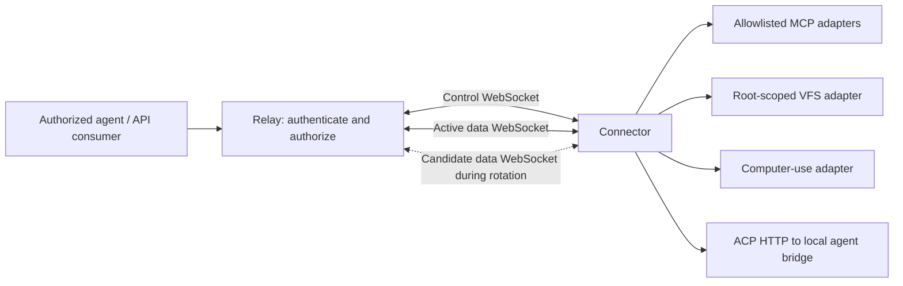
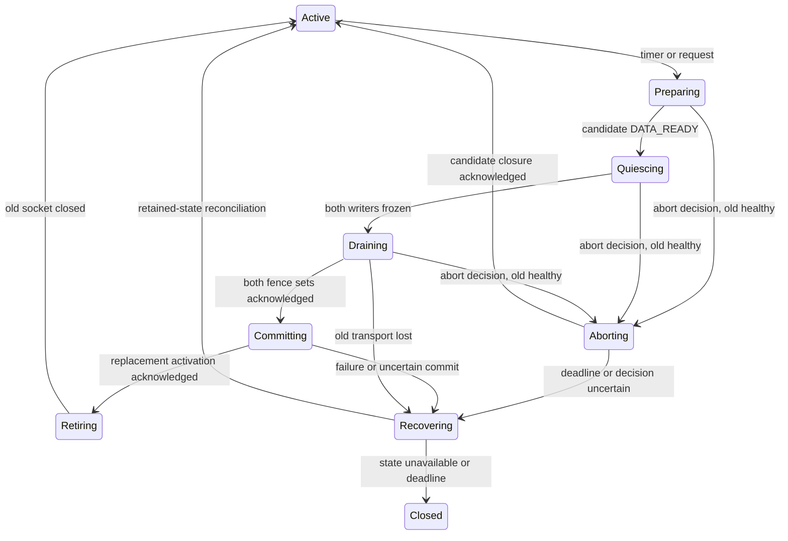

# Tunnel protocol and data socket rotation

Status: the full rotation and recovery protocol below is the M2 design. M1 implements the bounded codec and the finite echo profile described here; its acceptance result is recorded in [m1-harness.md](m1-harness.md).

## M1 finite echo profile

M1 negotiates `m1-control-data`, `authorization-challenge`, and `echo`. It uses exactly one control and one data socket. Each admitted logical stream starts each direction at sequence 1. A request is one DATA frame followed by FIN; the response contains one or two DATA frames (at most 65,536 request bytes plus a 256-byte device canary), followed by FIN. The relay completes the HTTP result only after receiving the response FIN. ACKs are cumulative transport receipt evidence and cannot acknowledge a sequence not assigned by the sender.

M1 rejects gapped or duplicate DATA/FIN, DATA after FIN, and stale session/generation/context fields. It has no replay, rotation, reconnect, or resume feature. A correctly sequenced RESET can abort an open direction; the finite profile rejects RESET after that direction's FIN. Control CANCEL remains available for a pending operation. A queued-frame authorization deadline failure interrupts the socket pair, since silently dropping an assigned frame would create a sequence gap. A fresh connection establishes new session/stream identities. M2 must implement the richer FIN/RESET, duplicate fingerprint, retained terminal, and replay rules below before generic adapters or rotation use them.

## Connection model

A **connector** runs on a computer and opens outbound connections to the **relay**. Each online connector has two WebSockets in steady state:

1. A control WebSocket for authentication, capability discovery, stream creation, cancellation, heartbeats, configuration and rotation coordination.
2. A binary data WebSocket multiplexing the payloads of all admitted logical streams.

Data rotation briefly requires one additional data WebSocket. The maximum is therefore **two steady-state sockets, three during a bounded transition**, per connector. The default rotation interval is five minutes, configurable per connector within relay policy. An exact two-socket maximum would require closing the old data socket before establishing its replacement, producing a delivery pause. That is a different policy and is not the proposed v0 default.

A stream belongs to an authenticated connector session, not to a particular physical data socket. Rotating a socket does not restart an in-flight MCP exchange, a file transfer, or a computer-use operation. Tunnel sessions are internal transport state and do not imply that every MCP protocol version has an MCP session identifier.

Consumer-facing protocols are separate from this internal transport. The planned Axum relay provides authorized MCP, filesystem, computer-use and [ACP HTTP](acp.md) gateways. The [filesystem API](filesystem-api.md) uses authenticated HTTP GET discovery and a 9P2000.L WebSocket data endpoint, with explicit SDK adapters for supported consumers. A native Files SDK HTTP gateway is deferred; HTTP discovery does not imply native compatibility with that SDK. Consumer WebSockets and relay-to-relay HTTP/3 connections are outside the connector's control/data socket count. Consumers do not receive connector credentials or internal data-attachment tickets.

Connectors require no inbound public ports on the controlled computer. A durable per-account cloud environment can host an authorized consumer or the relay, but durability of that environment does not itself make transport or application operations durable.

## Identity, ownership and routing

These identifiers have different meanings:

| Identifier | Meaning |
| --- | --- |
| `tenant_id` | Authorization and quota boundary; a personal account may have its own tenant. |
| `principal_id` | Authenticated user or service account acting within a tenant. |
| `connector_id` | Registered computer/connector identity; stable across reconnects. |
| `session_id` | Random identifier for one live connector session. |
| `epoch` | Monotonically increasing per-device ownership fencing value within the deployment incarnation; see the full owner token in [cluster.md](cluster.md). |
| `generation` | Monotonically increasing data attachment attempt within an epoch; failed attempts consume a generation. |
| `connection_id` | Random 128-bit identifier for one physical control or data WebSocket, bound to its session, epoch, role and, for data, generation. |
| `stream_id` | Relay-allocated logical stream identifier, unique within a session and never reused there; stable through data rotation. |
| `direction` | Explicit endpoint role: `relay_to_connector` or `connector_to_relay`; never inferred from which cluster node received a frame. |
| `operation_id` | Application request identity used to track completion and side effects. |

The relay derives tenant and principal from validated credentials. A client-supplied tenant, connector or stream identifier is never sufficient authorization. Every consumer request is authorized for its tenant, target connector, adapter and operation. One user can control several connectors; several users can receive grants to the same connector; unrelated tenants remain isolated. Concurrent consumers have independent stream and operation identities.

Only one control owner is active for a connector at a time. A replacement connection with valid reconnect credentials acquires a greater epoch atomically. Frames, tickets and control messages from an earlier epoch are rejected, including messages from a previously partitioned connection that becomes reachable again. An unrelated second process presenting the same connector identity must receive an explicit conflict unless the replacement policy and credentials authorize takeover; it must not silently split ownership.

Cluster ownership is part of the first usable core. Both device sockets route to the same session owner, directly or through authenticated relay peers. [Cluster design](cluster.md) defines HTTP/3 peer mTLS, Redis-distributed server public-key records, ownership leases and fencing. Peer authentication does not grant tenant access or replace stream admission. The owner serializes stream and rotation state; an ingress proxy must not originate independent sequence numbers. Owner process loss ends its in-memory sessions; Redis durable-catalog persistence does not provide transport continuity.

## Bootstrap and attachment

1. The Rust CLI connector establishes the control WSS connection with **mutual TLS**: verify the relay server certificate and present an enrolled device client certificate. The relay verifies its trust chain, identity, validity and revocation before WebSocket upgrade. See [runtime and CLI design](runtime.md). HTTP headers claiming a certificate identity are not an authentication substitute.
2. `HELLO` advertises supported protocol major/minor versions, connector identity and supported transport features. The relay authenticates and negotiates a common version before allocating stream resources.
3. `WELCOME` returns the session, epoch, negotiated limits, heartbeat policy, effective rotation policy and an opaque reconnect credential. It also returns a short-lived, single-use attachment ticket for the initial data generation.
4. The connector opens every initial, candidate and recovery data WSS connection using mTLS with the same enrolled device identity. An authorization header carries the attachment ticket. The owner consumes it atomically, verifying expiry and binding to tenant, connector, device certificate public-key fingerprint, session, epoch, generation, connection ID and intended data endpoint. The ticket supplements mTLS; neither alone authorizes a data attachment.
5. The relay reports `DATA_READY` on the control channel after the attachment is accepted. It accepts streams only once an active data socket is ready.

Attachment tickets cannot create a control session, select a different tenant or generation, or be reused. A reconnect credential also supplements device mTLS and must match the original active device credential binding; it never bypasses certificate verification or revocation. Tickets and reconnect credentials are redacted from logs. Retry after an ambiguous attachment failure closes the uncertain transport before a fresh attachment attempt with a new ticket, generation and connection ID.

## Control messages

Control messages use bounded UTF-8 JSON WebSocket messages for initial inspectability. Every message has `type`, a unique `message_id`, and, after bootstrap, `session_id` and `epoch`. Request/reply pairs use `reply_to`. Unknown required fields or unsupported message kinds yield a structured protocol error; optional extension fields can be ignored only as negotiated by version policy.

| Message family | Purpose |
| --- | --- |
| `HELLO`, `WELCOME`, `ERROR` | Authentication, version and limit negotiation. |
| `CAPABILITIES` | Advertise adapter identifiers and supported operations, subject to relay authorization. |
| `OPEN`, `OPENED`, `REJECTED` | Admit a stream with its adapter, operation identity, metadata and initial flow-control windows. |
| `STREAM_FORGET` | Owner-ordered reclamation of terminal stream/tombstone state, serialized with drain snapshots. |
| `CANCEL`, `CANCELLED`, `RESULT_STATUS` | Best-effort cancellation and explicit operation lifecycle status. |
| `PING`, `PONG` | Check control health independently of data traffic. |
| Authorization challenge/confirmation | Independent, delay-safe device grant freshness with a five-second ceiling; see [cluster.md](cluster.md). |
| Ownership challenge/confirmation | Challenge-bound lease confirmation and connector dispatch permission, as specified in [cluster.md](cluster.md); distinct from a heartbeat. |
| `ROTATE_REQUEST`, `ROTATE_PREPARE`, `DATA_READY` | Request rotation, authorize one candidate and establish its readiness. |
| `ROTATE_QUIESCE`, `ROTATE_FROZEN`, `ROTATE_DRAINED` | Freeze stream admission/writers, exchange immutable per-direction fences and prove both old directions drained. |
| `ROTATE_COMMIT`, `ROTATE_COMMITTED` | Select the already-drained replacement and acknowledge activation. |
| `ROTATE_RETIRE`, `ROTATE_RETIRED`, `ROTATE_COMPLETE` | Close the old transport, report closure and finish the attempt. |
| `ROTATE_ABORT`, `ROTATE_ABORTED` | Discard an uncommitted candidate and acknowledge coordinated old-socket resumption. |
| `RESUME`, `RESUMED` | Reconcile retained stream sequence state after a recoverable connection loss. |
| `GOAWAY` | Stop admitting new streams and begin bounded shutdown. |

`OPEN` names an advertised adapter and an allowed operation, not an arbitrary local executable, filesystem root or network URL. The connector independently enforces its local allowlist. Adapter metadata is bounded and validated before work starts.

Control-plane state changes are idempotent for an identical `message_id` within a bounded retention period. A reused identifier with different contents is a protocol error. The relay is the only rotation coordinator: the connector may request rotation, but cannot independently commit a competing generation.

Every rotation message also identifies `rotation_id`, owner, epoch, old/new generation and old/new connection ID. Acknowledgements apply only to that exact attempt and phase. Encode 64-bit control counters as decimal strings so consumers cannot lose precision through JSON numbers. Bounded tombstones reject stale messages after an attempt finishes; expired context requires explicit recovery, never inference from a reused ID.

## Proposed binary data framing

Each WebSocket binary message contains exactly one tunnel frame. WebSocket-level fragmentation is handled by the WebSocket library before tunnel parsing. Reject text frames and malformed lengths on the data socket. Compression is disabled initially to avoid uncontrolled decompression costs and cross-request compression state.

The proposed v1 header is 64 bytes, with unsigned integers in network byte order:

| Offset | Bytes | Field |
| --- | ---: | --- |
| 0 | 4 | Magic `ATUN` |
| 4 | 1 | Protocol major version |
| 5 | 1 | Frame kind: `DATA`, `FIN`, `ACK`, `WINDOW_UPDATE` or `RESET` |
| 6 | 2 | Negotiated flags |
| 8 | 2 | Header length, initially 64 |
| 10 | 2 | Reserved; zero |
| 12 | 8 | Session epoch |
| 20 | 8 | Data generation |
| 28 | 8 | Stream ID |
| 36 | 8 | Sequence number, or zero for unsequenced housekeeping frames |
| 44 | 8 | Cumulative acknowledgement of the opposite direction |
| 52 | 8 | Absolute cumulative byte limit for the opposite direction; meaningful on `WINDOW_UPDATE` |
| 60 | 4 | Payload length |

The data WebSocket is already bound to a session and connection ID by mTLS and its attachment ticket; no user-provided routing field can change that binding. Header epoch and generation must match the receiving socket's binding. The physical connection ID stays in authenticated attachment/control state and diagnostics rather than expanding every data header.

`DATA`, `FIN` and `RESET` are sequenced independently in each direction of each stream, starting at one. The exact ordered-delivery/deduplication key is **`(session_id, stream_id, direction, sequence)`**. Epoch, data generation and connection ID validate the carrier; they do not create a fresh sequence space. A retained stream's counters never reset during rotation, data recovery or an explicitly supported control resume. Stream 7's sequence 10 has no ordering relationship to stream 8's sequence 10, or to sequence 10 in its opposite direction. There is no global data ordering across streams.

A `FIN` consumes a sequence number and half-closes its direction after all preceding data. The receiver delivers contiguous frames to the adapter only once, holds bounded gaps, and never delivers data after `FIN`. Track `last_emitted`, `peer_acked`, `recv_contiguous` and `delivered_contiguous` separately per stream/direction. Retain sequence metadata through the corresponding drain/replay window. Stream identifiers and counters never wrap; exhaustion produces an explicit scoped error. A duplicate sequence with different content or terminal meaning is a protocol error while its comparison state is retained; a sequence already delivered can never be dispatched again.

`ACK` acknowledges the greatest contiguous sequence retained by the receiver or already handed to the adapter; a reset tombstone can instead acknowledge bytes deliberately discarded under that explicit terminal state. It does **not** acknowledge successful application execution or durable storage. Duplicate/delayed ACKs cannot decrease progress; an ACK of an unsent sequence is a protocol error. `RESET` terminates adapter delivery without undoing a submitted operation. It consumes one sequence, participates in fences/ACK/replay, and may follow FIN solely to reset the stream; no DATA/FIN follows either terminal state. At most one RESET is emitted per direction. FIN has no payload; RESET carries one unsigned 16-bit reason code in network byte order and uses reserved terminal-frame capacity, not application byte credit. Its frame count and bytes still count against hard session limits, so exhausted credit cannot prevent bounded termination or create unlimited RESET traffic.

Local reset stops adapter work immediately, retains a tombstone and accounts for any pre-reset in-flight peer frames in sequence as terminal discard. Receipt of peer RESET initiates local RESET if none has been emitted/queued; this closes both sequence directions without an endless reset exchange. Local cancellation may stop work before its queued RESET is transmitted. Terminal state and receive cursors remain until both directions' outstanding frames are accounted for. Only the owner initiates reclamation using `STREAM_FORGET`, carrying final cursor/terminal evidence. The connector retains even zero-frame REJECTED tombstones until that ordered message; it validates the evidence before releasing state. The owner serializes FORGET with QUIESCE and excludes an entry from a snapshot only when its FORGET precedes QUIESCE. An active drain/replay reference prohibits reclamation.

`WINDOW_UPDATE` advertises an absolute cumulative DATA payload byte limit, scoped to stream and direction. Only increases extend credit; duplicate and delayed updates are harmless. A sender counts newly sequenced DATA bytes against that limit across all generations, while replay consumes no additional credit and terminal frames use the reserved capacity above. The receiver grants additional credit when adapter consumption releases buffer capacity, within the session-wide budget. Initial limits are exchanged during stream admission. Counters never wrap; exhausting their range closes the stream explicitly.

Application encodings are negotiated by adapter capability. MCP, filesystem and computer-use operations keep their own schemas; large objects use bounded data frames. The filesystem WebSocket profile carries ordered 9P2000.L bytes. ACP's HTTP binding uses [http-forward/1](http-forwarding.md) and the application bridge defined in [acp.md](acp.md), preserving its request bodies and response streams without making application JSON-RPC IDs into tunnel sequence IDs. WebSocket frame boundaries do not imply application message boundaries. Every adapter defines bounded reassembly, request/response correspondence and terminal results.

### Filesystem profile: 9P2000.L over WebSocket

One authorized consumer filesystem WebSocket maps to one logical, bidirectional tunnel stream and one Rust 9P server session for a selected filesystem export. The tunnel's existing binary header remains unchanged: 9P length-prefixed records are opaque payload bytes that may span tunnel frames. The adapter uses 9P's own little-endian framing inside those payloads; the outer tunnel header remains network byte order. Negotiate and enforce a bounded 9P `msize` before accepting other requests, and bound both record reassembly and the number of outstanding tags. See the [upstream 9P message format](https://9fans.github.io/plan9port/man/man9/intro.html).

The consumer authenticates to the gateway before opening the filesystem stream. The authorized export is selected at admission; a 9P `uname`, `aname` or caller-chosen path cannot confer access to a different tenant or filesystem root. The local Rust server enforces root confinement and operation permissions independently of the relay. File paths, names, attributes and file contents travel on the data channel as 9P records, not as unbounded control messages.

9P fids, request tags and negotiated session state belong to the logical filesystem session and remain intact through scheduled data socket rotation. The relay neither duplicates `Tattach` nor reconstructs fids during cutover. Tunnel sequence deduplication prevents replayed transport frames from dispatching the same 9P record twice within the retained session. An operation's internal identity is separate from a reusable 9P tag.

The first filesystem profile restores no fids across a consumer WebSocket reconnect, control-session reconnect or adapter/connector/relay process restart: terminate that filesystem session, fail pending calls explicitly and create a fresh 9P session. Generic tunnel resume support must not silently opt the filesystem adapter into stronger recovery guarantees. Replacement of a failed data socket may preserve the filesystem session only while the same control owner and all ordered stream state are retained.

`Tflush` requests cancellation of an outstanding request; neither transport cancellation nor a flush response promises to roll back a filesystem mutation that already happened. Honor a normal response that arrives before `Rflush`, including any state changes it confirms, and do not reuse the original request tag until `Rflush` arrives. The server must preserve these [upstream flush ordering semantics](https://9fans.github.io/plan9port/man/man9/flush.html). If a write or rename outcome becomes ambiguous after a transport or process failure, the just-bash adapter reports that ambiguity and does not blindly resubmit the operation in the new session. Compatibility tests must cover flushing in-flight operations, tag reuse, fid lifetime and reads/writes spanning rotations.

## Rotation state machine

Use monotonic time. Initial policy values are a 300-second rotation interval, a 10-second candidate attachment deadline and a 30-second total overlap deadline measured from the start of the candidate WebSocket connection attempt, including its handshake. Configuration must satisfy `0 < handshake_timeout < overlap_timeout < rotation_interval` and relay limits; the negotiated effective values are visible in `WELCOME`. Scheduling jitter, if enabled, is explicit in that policy. Timer-driven rotation, configuration changes and operator requests all enter the same state machine. The repository's initial configuration scaffold validates these values; the state machine described here remains planned implementation work.

Both endpoints enforce a local monotonic deadline; the coordinator starts its budget when issuing preparation, conservatively before the dial, and the connector starts no later than beginning its dial. Messages carry remaining budget, never an extension or a wall-clock comparison. Quiescing, draining, committing and the old WebSocket close handshake all share the original overlap budget.

| State | Live sockets | Transition |
| --- | --- | --- |
| `Connecting` | Control plus at most one connecting data socket | Initial `DATA_READY` enters `Active(g)`. |
| `Active(g)` | Control + data `g` | Allocate one fresh generation `n > g`; enter `Preparing(g,n)`. |
| `Preparing(g,n)` | Control + old data + at most one candidate | Old data serves streams; candidate readiness permits quiescing, not payload cutover. |
| `Quiescing(g,n)` | Control + both data sockets | Freeze OPEN admission and both old sequenced-frame writers; exchange immutable stream fences. |
| `Draining(g,n)` | Control + both data sockets | Receive and ACK through every old-socket fence in both directions; candidate carries no sequenced frames. |
| `Committing(g,n)` | Control + both data sockets | Only after both drain proofs, select `n` and obtain its activation acknowledgement. |
| `Retiring(g,n)` | Control + new data + closing old data | New data serves retained streams while the old transport closes within the original deadline. |
| `Active(n)` | Control + data `n` | Old transport is gone and the rotation attempt is complete. |
| `Aborting(g,n)` | Control + old data + closing candidate | A known uncommitted attempt returns to `Active(g)` only after both endpoints release candidate resources. |
| `Recovering` | At most one control and two data transports | Freeze admission, reconcile retained stream state or explicitly fail affected operations. |
| `Closed` | None | Lease expires, authentication fails, shutdown completes or recovery is impossible. |

### Scheduled handover: prepare, fence, drain, commit, retire

1. **Prepare.** The owner issues `ROTATE_PREPARE` with one fresh generation, connection ID and single-use ticket. Repeated requests coalesce. Old data remains active while the candidate completes mTLS, attachment and readiness. Candidate readiness alone never authorizes DATA/FIN/RESET.
2. **Quiesce admission.** The owner's session state machine serializes `OPEN` admission with `ROTATE_QUIESCE`. It pauses new OPEN requests and fixes a `snapshot_id` and bounded stream roster containing all live, pending-admission and unreclaimed terminal entries. OPEN already sent is ordered before QUIESCE on control; the connector must account for it even if OPENED is in flight. Unknown or missing roster entries fail the attempt. New requests wait in the existing bounded admission queue or receive retryable overload.
3. **Freeze each writer.** Each endpoint stops accepting additional old-generation DATA/FIN/RESET into its writer. It finishes already queued old frames and flushes that writer before reporting `ROTATE_FROZEN`; no sequenced frame can be emitted on old after this local barrier unless the coordinator explicitly aborts the attempt. New adapter output, including a later FIN/RESET, stays bounded and applies backpressure until activation or abort. For each roster entry, FROZEN records the local direction's `last_emitted` fence, zero if none, including any emitted FIN/RESET. Both immutable fence sets reference the same snapshot and rotation attempt.
4. **Drain both directions.** Receivers continue accepting old frames through the advertised peer fences. ACKs, credit updates, heartbeats and cancellation remain responsive; they do not extend deadlines. A control FROZEN marker can arrive before old data, so it is not a drain proof. Each receiver sends `ROTATE_DRAINED` only when its contiguous receive cursor reaches every peer fence. DRAINED carries the snapshot/peer-fence reference and corresponding cumulative ACK cursors. The sender validates these against its emitted state. The owner requires both DRAINED proofs and acknowledgement of every sequence through both fence sets. There can be no gap below a fence. Neither endpoint sends sequenced frames on the candidate during drain.
5. **Commit.** The owner records the decision for this attempt in its live session state, enables candidate reception and sends `ROTATE_COMMIT` referencing both drain proofs. The connector validates the phase and proofs, activates candidate reception, sends `ROTATE_COMMITTED`, then resumes its writer on `n`. The relay resumes its writer only after that acknowledgement. New sequences follow the old fences without resetting counters; FIN already emitted remains terminal. A scheduled successful drain requires **no replay** of the drained prefix.
6. **Retire.** The owner sends `ROTATE_RETIRE`. Both sides close the old WebSocket and send `ROTATE_RETIRED` identifying its connection ID only when their old transport is closed. WebSocket Close/Close acknowledgement maps to transport retirement, never to stream FIN or operation completion. `ROTATE_COMPLETE` ends the attempt after retirement evidence; deadline-forced closure is recorded distinctly. Long-lived streams, fids, HTTP responses and operations continue on `n` without reopening their adapters. No next candidate is admitted while old transport resources remain.

All stream entries, including cancelled/reset tombstones, stay in the drain roster until that attempt completes. Cancellation can stop adapter delivery while the transport still receives and accounts for old bytes in order. A stream's FIN or cancellation must not remove an unacknowledged prefix from the snapshot. Final-state reclamation requires both directions' outstanding frames to be accounted for and no drain/replay reference; admission stops when the negotiated tracked-entry cap is full. Roster and fence messages must fit both the entry cap and the control-message byte cap. There is no unbounded snapshot pagination.

**Drained means a transport prefix is safely retained, delivered or terminally discarded at the receiver.** It does not require adapter consumption, durable storage, HTTP completion or the end of a long-running operation. Drain moves the transport boundary of an open stream; it does not wait for that stream to close. ACKs and application completion remain separate.

### Abort, deadline and loss during handover

- **Known uncommitted attempt, old healthy:** only the owner chooses `ROTATE_ABORT`. Close the candidate and retain all stream counters/credits. The owner enables old reception before issuing ABORT; the connector enables old reception, fully releases its candidate transport resources, replies `ROTATE_ABORTED`, then resumes old writes. The owner leaves Aborting and resumes old writes only after that acknowledgement and its own candidate closure. No fresh attachment begins earlier. This explicitly releases the attempt's freeze; bytes already emitted stay in the same sequence space. A later attempt uses a fresh generation/snapshot and newly measured fences. An abort never rewinds cursors or reuses identities, and must complete before the original deadline.
- **Commit uncertain:** a connector timeout is not permission to resume old writes. If COMMIT may be in flight or the control connection is unavailable, remain quiesced and enter recovery. The owner's serialized decision prevents both ABORT and COMMIT for one attempt. A stale message cannot change that decision; an accepted commit is never rolled back to `g`.
- **Old transport fails before drain completes:** do not declare a successful drain or discard an unacknowledged prefix. Close failed/candidate transports as needed to preserve the socket bound and enter retained-state recovery with a fresh greater generation. The original overlap deadline still retires the abandoned attempt.
- **Committed replacement fails:** retire the old transport within the deadline; never promote it again. Recover with a fresh greater generation and retained stream cursors, or fail explicitly.
- **Absolute overlap deadline:** after commit, forcibly close any old transport still lingering. An unfinished abort or drain cannot resume old at timeout: force-close both attempt data transports and enter retained-state recovery with a fresh greater generation, or fail. No slow stream, retransmission, close handshake or duplicate message extends the budget. A candidate attachment failure before this deadline may still complete a safe coordinated abort.

Retained-state recovery exchanges each stream/direction's last emitted sequence, cumulative receive/ACK state, terminal state and credit counters before enabling payload admission. Receiver progress must not be lower than any ACK the sender has already observed; missing receipt/deduplication state prevents safe resume. Replay **only** the missing range above the reconciled contiguous receive cursor through the sender's last emitted sequence, from retained bounded buffers, using original stream IDs/sequences and the new carrier epoch/generation. Duplicate arrivals never dispatch an adapter record again and replay consumes no new logical credit. Missing retained bytes, conflicting terminal state or exhausted recovery deadlines fail affected streams, with `outcome_unknown` where side effects may have occurred.

Repeated failures use bounded exponential backoff with jitter and expose a degraded state. They cannot accumulate sockets, payloads or tickets, or silently reset the last successful rotation timestamp. Recovery is a distinct protocol path; it is not a shortcut around the scheduled drain gate.

Rotation limits socket lifetime; it is not a substitute for authorization expiry or application credential rotation. Revoking a user grant, connector credential or capability takes effect independently of the five-minute timer.

## Delivery guarantees and side effects

Transport sequence tracking provides ordered, duplicate-suppressed delivery within a retained live session. It cannot provide exactly-once execution across process crashes or ambiguous application failures.

Track application operations separately using states such as `accepted`, `running`, `succeeded`, `failed`, `cancelled` and `outcome_unknown`. A terminal result identifies the operation and is retained for a bounded lookup period. An adapter can offer stronger retry guarantees only when it implements durable idempotency or a verifiable reconciliation mechanism.

For example, a click may have happened just before the connector crashed. A filesystem write may have reached disk before its result was lost. A generic MCP tool may have sent an email. The relay must report `outcome_unknown` where appropriate and must not automatically resubmit these operations under a new operation ID. A transport ACK does not resolve that ambiguity.

Read-only calls may be retried according to adapter policy. Non-idempotent calls require explicit application retry authorization or an adapter-specified idempotency key and deduplication guarantee. Cancelling a request is best effort and cannot reverse completed external effects.

## Failure and reconnect behavior

| Failure | Intended behavior |
| --- | --- |
| Candidate fails before commit | Coordinate abort and preserve old stream cursors if the old socket is healthy; uncertain decision enters recovery. |
| Active data socket fails while control is healthy | Stop payload admission, authorize a replacement generation and resume from retained sequence state. |
| Control socket is lost | Stop admitting operations and initiating new side effects; pause delivery from the data channel and fence stale traffic when a new epoch is acquired. Already executing adapter work follows its cancellation policy. |
| Control reconnect succeeds within retention window | With the same owner process and retained state, authenticate, acquire a greater epoch, replace attachments and reconcile bounded sequence/terminal state. Resume only adapters whose explicit contract permits an epoch change; the v0 filesystem mount ends instead. Owner change requires fresh sessions. |
| Lease or resume retention expires | Close data sockets, release bounded transport resources and expose terminal or unknown operation status as available. A later connection creates a fresh session. |
| Connector process restarts | A fresh session is required in v0. Surface unknown outcomes for in-flight side-effecting operations; do not pretend in-memory sequence state survived. |
| Session-owner relay process restarts or loses its fenced lease | Its sessions end; a new owner requires a fresh session. Other owners continue subject to cluster routing/lease health. No cross-owner transport replay is promised. |
| Duplicate/stale socket attaches | Reject before binding or allocating stream buffers. |
| Malformed/oversized data | Reject before payload allocation where possible; reset the scoped stream or close the connection for framing/authentication violations. |

Control recovery must preserve the total socket bound: close the old control transport before establishing its replacement; close any rotation candidate before establishing replacement data sockets. A valid new epoch invalidates old-generation tickets and sockets. Whether to retain an existing operation result is separate from whether its old transport remains authorized.

Heartbeats and timeouts are independent of rotation. Proposed defaults are a control heartbeat every 20 seconds and loss detection after 60 seconds without a valid response. A heartbeat does not renew ownership: the earlier owner-lease/connector dispatch-permission deadline in [cluster.md](cluster.md) fences work even if the socket remains reachable. The maximum retention interval, data replacement deadline and operation deadlines are explicit policy values. A stalled peer cannot keep a session or a privileged operation alive by sending unrelated bytes.

## Flow control and fairness

WebSocket transport backpressure alone is insufficient when many logical streams share one connection. Enforce both per-stream receive credit and a session-wide outstanding byte cap. Charge queued frames, quiesced new writes, reorder buffers and replay buffers to the same bounded memory budget. Candidate sockets do not receive a second full budget. Pausing data admission during drain must not pause reserved bounded capacity for ACKs, cancellation and rotation control.

Proposed starting limits, to validate through load testing:

| Resource | Initial limit |
| --- | ---: |
| Data frame payload | 64 KiB |
| Control message | 32 KiB |
| Concurrent streams per connector session | 64 |
| Tracked stream entries, including pending admission and terminal tombstones | 128, also subject to the control-message byte cap |
| Per-stream outstanding payload | 1 MiB |
| Session-wide outstanding payload across both directions | 8 MiB |
| Simultaneous rotation candidates per connector | 1 |

Also require configurable per-tenant/per-principal connector counts, stream admission and operation rates, aggregate bandwidth, maximum queued bytes, idle lifetimes and global memory limits. Reject excess work with a retryable overload response before starting side effects. Limits have hard ceilings even if a peer advertises larger values.

Schedule stream traffic fairly, with bounded priority for latency-sensitive actions. Large file transfers and screenshots cannot starve MCP replies or cancellation messages. Control queues themselves are bounded and rate-limited so control traffic cannot bypass quotas. A blocked adapter eventually exhausts its stream's credit, not the whole process's memory.

## Versioning and observability

Negotiate a common protocol major version during bootstrap; incompatible majors fail before data attachment. Minor versions add explicitly negotiated capabilities and optional fields. Reserved frame fields and unknown required flags are rejected until a version defines them. Keep protocol fixtures under source control and test supported version pairs.

Structured logs identify tenant, connector, owner, session, epoch, generation, connection ID, rotation ID, stream, direction and operation without recording secrets or payloads by default. Emit one event per state transition with its reason, negotiated deadline and outstanding fence/ACK counts. Record quiesce/drain/commit/retirement duration, forced old-socket closures, missing sequence ranges, replay bytes, duplicate frames, credit-blocked time, bounded queue use and unknown outcomes. Keep high-cardinality identifiers in traces/logs, not metric labels. Audit authorization decisions and computer-use/write operations separately. State-machine snapshots expose counters and phase history, never raw file, screenshot or tool content.

## Testable invariants

1. A connected connector has one control and one active data socket in steady state, with no more than one candidate data socket during transition.
2. Overlap never exceeds its configured deadline; repeated rotation requests cannot extend it.
3. Attachment attempt generations and acquired epoch values strictly increase; aborted attempts are not reused and stale owners cannot submit work after fencing.
4. A ticket attaches exactly once to its authorized tenant, connector, device certificate public key, session, epoch, generation and connection ID; it cannot replace mTLS or be exchanged for control access.
5. A frame cannot address a stream belonging to another connector or tenant, even when numerical stream IDs coincide.
6. Each `(session, stream, direction)` has its own persistent sequence space and delivers payloads in order at most once; changing physical sockets or generations cannot reset it or impose cross-stream ordering.
7. A long-lived stream can span multiple successful rotations without reopening the adapter operation or changing its operation ID.
8. Scheduled handover admits no candidate DATA/FIN/RESET before both drain proofs; recovery replays only missing retained ranges without new credit, duplicate delivery or excess memory.
9. Missing ACKs, sequence gaps, a slow receiver and repeated disconnects cannot grow buffers beyond negotiated limits.
10. An old socket cannot be held open by a stalled long-lived stream; bounded recovery produces either continuity or an explicit failure.
11. Transport acknowledgement is never reported as successful application completion; ambiguous side effects produce `outcome_unknown`.
12. Control loss stops new admission, and reconnect cannot create two concurrent owners or duplicate an operation under a new identity.
13. Unsupported versions, malformed frames, expired tickets and unauthorized operations fail before adapter invocation.
14. Many authorized users and connectors can operate concurrently while cross-tenant routing and capability access remain denied.
15. No old DATA/FIN/RESET is emitted after that writer's freeze until an explicit coordinated abort; new sequenced frames remain bounded/backpressured until activation or abort.
16. Commit requires both complete immutable fence sets and cumulative receipt through every fence, including pending-OPEN, half-closed and cancelled/reset entries; a control marker alone is insufficient.
17. Old transport retirement and its WebSocket close acknowledgement do not close logical streams or claim application completion. Drain does not wait for long-lived operations to finish.
18. An uncertain/accepted commit cannot roll back to old. Timeout either coordinates safe abort, retires an already-drained old socket, or enters explicit bounded recovery/failure.

Validate these with pure state-machine/property tests, parser fuzzing, deterministic clocks, real-WebSocket integration tests and fault injection before/after every state transition. Race OPEN/OPENED, FIN, RESET/CANCEL, duplicate drain messages, ACK loss, candidate failure and control loss against freeze/commit. Delay control and data independently to prove that a FROZEN marker cannot hide a data gap. Test abort after quiesce followed by a new attempt with greater fences, all 128 tracked entries, exhausted queue credit, missing replay buffers, stale connection IDs and lost close acknowledgements.

End-to-end tests keep MCP requests, a checksummed file transfer, a streamed ACP HTTP response and a fake computer-use command stream active across repeated short-interval rotations, then inject stalled reads, duplicate frames, owner loss and process termination. Test each adapter's recovery restrictions separately; transport resume never silently strengthens its guarantees. An instrumented side-effect adapter must prove recovery cannot execute an ambiguous command twice.
