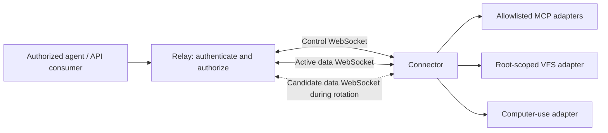

# Tunnel protocol and data socket rotation

Status: proposed v0 design. This document specifies intended behavior and acceptance tests; it does not describe a completed implementation. Wire constants and defaults remain subject to the first protocol implementation and review.

## Connection model

A **connector** runs on a computer and opens outbound connections to the **relay**. Each online connector has two WebSockets in steady state:

1. A control WebSocket for authentication, capability discovery, stream creation, cancellation, heartbeats, configuration and rotation coordination.
2. A binary data WebSocket multiplexing the payloads of all admitted logical streams.

Data rotation briefly requires one additional data WebSocket. The maximum is therefore **two steady-state sockets, three during a bounded transition**, per connector. The default rotation interval is five minutes, configurable per connector within relay policy. An exact two-socket maximum would require closing the old data socket before establishing its replacement, producing a delivery pause. That is a different policy and is not the proposed v0 default.

A stream belongs to an authenticated connector session, not to a particular physical data socket. Rotating a socket does not restart an in-flight MCP exchange, a file transfer, or a computer-use operation. Tunnel sessions are internal transport state and do not imply that every MCP protocol version has an MCP session identifier.

Consumer-facing protocols are separate from this internal transport. The relay may expose an MCP Streamable HTTP endpoint, a binary filesystem WebSocket for just-bash, or a computer-use gateway; those APIs open authorized logical streams to the chosen connector. The proposed filesystem wire protocol is 9P2000.L. The just-bash consumer WebSocket is a separate agent-to-relay connection and is not counted in the computer's control/data socket pair. Consumers do not receive connector credentials or internal data-attachment tickets.

Connectors require no inbound public ports on the controlled computer. A durable per-account cloud environment can host an authorized consumer or the relay, but durability of that environment does not itself make transport or application operations durable.

## Identity, ownership and routing

These identifiers have different meanings:

| Identifier | Meaning |
| --- | --- |
| `tenant_id` | Authorization and quota boundary; a personal account may have its own tenant. |
| `principal_id` | Authenticated user or service account acting within a tenant. |
| `connector_id` | Registered computer/connector identity; stable across reconnects. |
| `session_id` | Random identifier for one live connector session. |
| `epoch` | Monotonically increasing fencing value for the current control owner of that session. |
| `generation` | Monotonically increasing data socket generation within an epoch. |
| `stream_id` | Unique logical stream identifier within a session; never reused in that session. |
| `operation_id` | Application request identity used to track completion and side effects. |

The relay derives tenant and principal from validated credentials. A client-supplied tenant, connector or stream identifier is never sufficient authorization. Every consumer request is authorized for its tenant, target connector, adapter and operation. One user can control several connectors; several users can receive grants to the same connector; unrelated tenants remain isolated. Concurrent consumers have independent stream and operation identities.

Only one control owner is active for a connector at a time. A replacement connection with valid reconnect credentials acquires a greater epoch atomically. Frames, tickets and control messages from an earlier epoch are rejected, including messages from a previously partitioned connection that becomes reachable again. An unrelated second process presenting the same connector identity must receive an explicit conflict unless the replacement policy and credentials authorize takeover; it must not silently split ownership.

The first release uses one relay process and an in-memory session registry. That process supports many tenants, users, connectors and streams. Horizontal deployment requires a shared lease/fencing design and routing all sockets of a connector to their session owner; that is a later milestone. A relay process restart terminates v0 sessions rather than claiming durable recovery.

## Bootstrap and attachment

1. The connector establishes WSS with certificate verification. Authenticate using the chosen standard credential mechanism; do not put bearer credentials in a query string.
2. `HELLO` advertises supported protocol major/minor versions, connector identity and supported transport features. The relay authenticates and negotiates a common version before allocating stream resources.
3. `WELCOME` returns the session, epoch, negotiated limits, heartbeat policy, effective rotation policy and an opaque reconnect credential. It also returns a short-lived, single-use attachment ticket for the initial data generation.
4. The connector opens the data WebSocket using an authorization header supported by the Rust client. The relay consumes the ticket atomically, verifying its expiry and binding to the connector, tenant, session, epoch, generation and intended data endpoint.
5. The relay reports `DATA_READY` on the control channel after the attachment is accepted. It accepts streams only once an active data socket is ready.

Attachment tickets cannot create a control session, select a different tenant or generation, or be reused. Tickets and reconnect credentials are redacted from logs. Replay after an ambiguous attachment failure obtains a new ticket; it does not assume a consumed ticket remains usable.

## Control messages

Control messages use bounded UTF-8 JSON WebSocket messages for initial inspectability. Every message has `type`, a unique `message_id`, and, after bootstrap, `session_id` and `epoch`. Request/reply pairs use `reply_to`. Unknown required fields or unsupported message kinds yield a structured protocol error; optional extension fields can be ignored only as negotiated by version policy.

| Message family | Purpose |
| --- | --- |
| `HELLO`, `WELCOME`, `ERROR` | Authentication, version and limit negotiation. |
| `CAPABILITIES` | Advertise adapter identifiers and supported operations, subject to relay authorization. |
| `OPEN`, `OPENED`, `REJECTED` | Admit a stream with its adapter, operation identity, metadata and initial flow-control windows. |
| `CANCEL`, `CANCELLED`, `RESULT_STATUS` | Best-effort cancellation and explicit operation lifecycle status. |
| `PING`, `PONG` | Check control health independently of data traffic. |
| `ROTATE_REQUEST`, `ROTATE_PREPARE`, `DATA_READY` | Request rotation, authorize one candidate and establish its readiness. |
| `ROTATE_COMMIT`, `ROTATE_COMMITTED`, `ROTATE_COMPLETE` | Select the next generation, acknowledge sender cutover and retire the old generation. |
| `ROTATE_ABORT` | Discard an uncommitted candidate; never undo an accepted commit. |
| `RESUME`, `RESUMED` | Reconcile retained stream sequence state after a recoverable connection loss. |
| `GOAWAY` | Stop admitting new streams and begin bounded shutdown. |

`OPEN` names an advertised adapter and an allowed operation, not an arbitrary local executable, filesystem root or network URL. The connector independently enforces its local allowlist. Adapter metadata is bounded and validated before work starts.

Control-plane state changes are idempotent for an identical `message_id` within a bounded retention period. A reused identifier with different contents is a protocol error. The relay is the only rotation coordinator: the connector may request rotation, but cannot independently commit a competing generation.

## Proposed binary data framing

Each WebSocket binary message contains exactly one tunnel frame. WebSocket-level fragmentation is handled by the WebSocket library before tunnel parsing. Reject text frames and malformed lengths on the data socket. Compression is disabled initially to avoid uncontrolled decompression costs and cross-request compression state.

The proposed v1 header is 64 bytes, with unsigned integers in network byte order:

| Offset | Bytes | Field |
| --- | ---: | --- |
| 0 | 4 | Magic `ATUN` |
| 4 | 1 | Protocol major version |
| 5 | 1 | Frame kind: `DATA`, `FIN`, `ACK`, `WINDOW_UPDATE` or `RESET` |
| 6 | 2 | Negotiated flags |
| 8 | 2 | Header length, initially 64 |
| 10 | 2 | Reserved; zero |
| 12 | 8 | Session epoch |
| 20 | 8 | Data generation |
| 28 | 8 | Stream ID |
| 36 | 8 | Sequence number, or zero for unsequenced housekeeping frames |
| 44 | 8 | Cumulative acknowledgement of the opposite direction |
| 52 | 8 | Absolute cumulative byte limit for the opposite direction; meaningful on `WINDOW_UPDATE` |
| 60 | 4 | Payload length |

The data WebSocket is already bound to a session by its attachment ticket; no user-provided routing field can change that binding. Header epoch and generation must also match the receiving socket's binding.

`DATA` and `FIN` are sequenced independently in each direction of each stream, starting at one. A `FIN` consumes a sequence number and represents a half-close after all preceding data. The receiver delivers contiguous frames to the adapter only once, holds bounded gaps, and never delivers data after that direction's `FIN`. Overflow, conflicting stream state or sequence exhaustion terminates the affected stream or session according to the error scope. Stream identifiers and sequence values never wrap.

`ACK` acknowledges the greatest contiguous sequence retained by the receiver or already handed to the adapter. It does **not** acknowledge successful application execution or durable storage. Duplicate or delayed ACKs cannot decrease recorded progress; an ACK of an unsent sequence is a protocol error. `RESET` terminates the stream and does not imply that a previously submitted operation was undone.

`WINDOW_UPDATE` advertises an absolute cumulative byte limit, scoped to stream and direction. Only increases extend credit; duplicate and delayed updates are harmless. A sender counts newly sequenced payload bytes against that limit across all generations, while replay of an existing sequence consumes no additional credit. The receiver grants additional credit when adapter consumption releases buffer capacity, within the session-wide budget. Initial limits are exchanged during stream admission. Counters never wrap; exhausting their range closes the stream explicitly.

Application encodings are negotiated by adapter capability. MCP messages and computer-use commands keep their own schemas; binary file content, screenshots and other large objects use data frames. The filesystem adapter carries an ordered 9P2000.L byte stream, including all 9P metadata and file bytes. The tunnel does not infer application message boundaries from WebSocket boundaries. An adapter must define its own bounded record encoding, request/response correspondence and terminal result.

### Filesystem profile: 9P2000.L over WebSocket

One authorized consumer filesystem WebSocket maps to one logical, bidirectional tunnel stream and one Rust 9P server session for a selected filesystem export. The tunnel's existing binary header remains unchanged: 9P length-prefixed records are opaque payload bytes that may span tunnel frames. The adapter uses 9P's own little-endian framing inside those payloads; the outer tunnel header remains network byte order. Negotiate and enforce a bounded 9P `msize` before accepting other requests, and bound both record reassembly and the number of outstanding tags. See the [upstream 9P message format](https://9fans.github.io/plan9port/man/man9/intro.html).

The consumer authenticates to the gateway before opening the filesystem stream. The authorized export is selected at admission; a 9P `uname`, `aname` or caller-chosen path cannot confer access to a different tenant or filesystem root. The local Rust server enforces root confinement and operation permissions independently of the relay. File paths, names, attributes and file contents travel on the data channel as 9P records, not as unbounded control messages.

9P fids, request tags and negotiated session state belong to the logical filesystem session and remain intact through scheduled data socket rotation. The relay neither duplicates `Tattach` nor reconstructs fids during cutover. Tunnel sequence deduplication prevents replayed transport frames from dispatching the same 9P record twice within the retained session. An operation's internal identity is separate from a reusable 9P tag.

The first filesystem profile restores no fids across a consumer WebSocket reconnect, control-session reconnect or adapter/connector/relay process restart: terminate that filesystem session, fail pending calls explicitly and create a fresh 9P session. Generic tunnel resume support must not silently opt the filesystem adapter into stronger recovery guarantees. Replacement of a failed data socket may preserve the filesystem session only while the same control owner and all ordered stream state are retained.

`Tflush` requests cancellation of an outstanding request; neither transport cancellation nor a flush response promises to roll back a filesystem mutation that already happened. Honor a normal response that arrives before `Rflush`, including any state changes it confirms, and do not reuse the original request tag until `Rflush` arrives. The server must preserve these [upstream flush ordering semantics](https://9fans.github.io/plan9port/man/man9/flush.html). If a write or rename outcome becomes ambiguous after a transport or process failure, the just-bash adapter reports that ambiguity and does not blindly resubmit the operation in the new session. Compatibility tests must cover flushing in-flight operations, tag reuse, fid lifetime and reads/writes spanning rotations.

## Rotation state machine

Use monotonic time. Initial policy values are a 300-second rotation interval, a 10-second candidate attachment deadline and a 30-second total overlap deadline measured from the start of the candidate WebSocket connection attempt, including its handshake. Configuration must satisfy `0 < handshake_timeout < overlap_timeout < rotation_interval` and relay limits; the negotiated effective values are visible in `WELCOME`. Scheduling jitter, if enabled, is explicit in that policy. Timer-driven rotation, configuration changes and operator requests all enter the same state machine. The repository's initial configuration scaffold validates these values; the state machine described here remains planned implementation work.

| State | Live sockets | Transition |
| --- | --- | --- |
| `Connecting` | Control plus at most one connecting data socket | Initial `DATA_READY` enters `Active(g)`. |
| `Active(g)` | Control + data `g` | Due timer or request creates one candidate ticket and enters `Preparing(g,g+1)`. |
| `Preparing(g,g+1)` | Control + old data + at most one candidate | Old data continues serving streams. Candidate readiness allows commit; failure or deadline aborts the candidate. |
| `Switching(g,g+1)` | Control + both data sockets | Relay commits `g+1`; both senders switch new frames to it, reconcile ACKs and replay unacknowledged old frames. |
| `Active(g+1)` | Control + data `g+1` | Both sides have acknowledged cutover and all old outstanding frames are acknowledged; relay retires `g`. |
| `Recovering` | Control and/or replacement sockets within the same bounded policy | Reconcile retained stream state or explicitly fail affected operations. |
| `Closed` | None | Lease expires, authentication fails, shutdown completes or recovery is impossible. |

Detailed cutover rules:

1. Only one candidate exists per connector. Repeated requests coalesce; they cannot create additional candidates or extend the existing overlap deadline.
2. The relay sends `ROTATE_PREPARE` with a monotonically greater generation and single-use ticket. Both endpoints continue sending on the current generation while the candidate connects.
3. After candidate readiness, the relay records `g+1` as the selected generation in its session state and sends `ROTATE_COMMIT`. At that point the relay sends new frames only on `g+1`. The connector makes the same switch when it receives the commit, then replies `ROTATE_COMMITTED`.
4. During this brief asymmetric interval, receivers accept frames from both authorized generations. Per-stream sequence numbers, not physical arrival order, govern delivery. Replay keeps the original stream and sequence numbers but uses the receiving socket's new generation in the frame header.
5. Each sender replays unacknowledged frames from the old socket over the new socket. ACK reconciliation and replay are bounded by negotiated memory and credit limits; replay does not consume additional logical stream credit for bytes already charged to that sequence.
6. After both senders have switched and every old outstanding sequence is acknowledged, the relay sends `ROTATE_COMPLETE` and closes the old data socket. Long-lived streams remain open on the new socket.
7. The overlap deadline is absolute. Before commit, expiry closes the candidate and leaves the old socket active. After commit, expiry closes the old socket and continues reconciliation on the new socket; streams whose retained state cannot be recovered fail explicitly. A stalled stream cannot keep an old socket alive indefinitely.

An accepted commit is never rolled back to an older generation. Candidate failure after commit enters recovery with a fresh, greater generation. Repeated failures trigger bounded exponential backoff with jitter and an observable degraded state; they must not accumulate sockets, unacknowledged payloads or tickets. Failed rotation attempts do not silently reset the last successful rotation timestamp.

Rotation limits socket lifetime; it is not a substitute for authorization expiry or application credential rotation. Revoking a user grant, connector credential or capability takes effect independently of the five-minute timer.

## Delivery guarantees and side effects

Transport sequence tracking provides ordered, duplicate-suppressed delivery within a retained live session. It cannot provide exactly-once execution across process crashes or ambiguous application failures.

Track application operations separately using states such as `accepted`, `running`, `succeeded`, `failed`, `cancelled` and `outcome_unknown`. A terminal result identifies the operation and is retained for a bounded lookup period. An adapter can offer stronger retry guarantees only when it implements durable idempotency or a verifiable reconciliation mechanism.

For example, a click may have happened just before the connector crashed. A filesystem write may have reached disk before its result was lost. A generic MCP tool may have sent an email. The relay must report `outcome_unknown` where appropriate and must not automatically resubmit these operations under a new operation ID. A transport ACK does not resolve that ambiguity.

Read-only calls may be retried according to adapter policy. Non-idempotent calls require explicit application retry authorization or an adapter-specified idempotency key and deduplication guarantee. Cancelling a request is best effort and cannot reverse completed external effects.

## Failure and reconnect behavior

| Failure | Intended behavior |
| --- | --- |
| Candidate fails before commit | Abort candidate, keep current data socket, report the failure and retry with backoff. |
| Active data socket fails while control is healthy | Stop payload admission, authorize a replacement generation and resume from retained sequence state. |
| Control socket is lost | Stop admitting operations and initiating new side effects; pause delivery from the data channel and fence stale traffic when a new epoch is acquired. Already executing adapter work follows its cancellation policy. |
| Control reconnect succeeds within retention window | Authenticate, acquire a greater epoch, replace data attachments and exchange bounded per-stream sequence/terminal state before resuming. Retained logical streams keep their identities. |
| Lease or resume retention expires | Close data sockets, release bounded transport resources and expose terminal or unknown operation status as available. A later connection creates a fresh session. |
| Connector process restarts | A fresh session is required in v0. Surface unknown outcomes for in-flight side-effecting operations; do not pretend in-memory sequence state survived. |
| Relay process restarts | All v0 sessions end. Consumers reconnect and query any available adapter-level operation status; no cross-restart transport replay is promised. |
| Duplicate/stale socket attaches | Reject before binding or allocating stream buffers. |
| Malformed/oversized data | Reject before payload allocation where possible; reset the scoped stream or close the connection for framing/authentication violations. |

Control recovery must preserve the total socket bound: close the old control transport before establishing its replacement; close any rotation candidate before establishing replacement data sockets. A valid new epoch invalidates old-generation tickets and sockets. Whether to retain an existing operation result is separate from whether its old transport remains authorized.

Heartbeats and timeouts are independent of rotation. Proposed defaults are a control heartbeat every 20 seconds and loss detection after 60 seconds without a valid response. The maximum retention interval, data replacement deadline and operation deadlines are explicit policy values. A stalled peer cannot keep a session or a privileged operation alive by sending unrelated bytes.

## Flow control and fairness

WebSocket transport backpressure alone is insufficient when many logical streams share one connection. Enforce both per-stream receive credit and a session-wide outstanding byte cap. Charge queued frames, reorder buffers and replay buffers to the same bounded memory budget. Candidate sockets do not receive a second full budget.

Proposed starting limits, to validate through load testing:

| Resource | Initial limit |
| --- | ---: |
| Data frame payload | 64 KiB |
| Control message | 32 KiB |
| Concurrent streams per connector session | 64 |
| Per-stream outstanding payload | 1 MiB |
| Session-wide outstanding payload across both directions | 8 MiB |
| Simultaneous rotation candidates per connector | 1 |

Also require configurable per-tenant/per-principal connector counts, stream admission and operation rates, aggregate bandwidth, maximum queued bytes, idle lifetimes and global memory limits. Reject excess work with a retryable overload response before starting side effects. Limits have hard ceilings even if a peer advertises larger values.

Schedule stream traffic fairly, with bounded priority for latency-sensitive actions. Large file transfers and screenshots cannot starve MCP replies or cancellation messages. Control queues themselves are bounded and rate-limited so control traffic cannot bypass quotas. A blocked adapter eventually exhausts its stream's credit, not the whole process's memory.

## Versioning and observability

Negotiate a common protocol major version during bootstrap; incompatible majors fail before data attachment. Minor versions add explicitly negotiated capabilities and optional fields. Reserved frame fields and unknown required flags are rejected until a version defines them. Keep protocol fixtures under source control and test supported version pairs.

Structured logs and metrics identify tenant, connector, session, epoch, generation, stream and operation without recording secrets or file/screenshot/tool payloads by default. Record rotation start/commit/completion, attempt duration, overlap duration, candidate failures, old socket closures, replay bytes, deduplicated frames, sequence gaps, time spent credit-blocked, queue bytes and unknown outcomes. Audit authorization decisions and computer-use/write operations separately from transport diagnostics.

## Testable invariants

1. A connected connector has one control and one active data socket in steady state, with no more than one candidate data socket during transition.
2. Overlap never exceeds its configured deadline; repeated rotation requests cannot extend it.
3. Committed generation and acquired epoch values strictly increase, and stale owners cannot submit work after fencing.
4. A ticket attaches exactly once to its authorized tenant, connector, session, epoch and generation, and cannot be exchanged for control access.
5. A frame cannot address a stream belonging to another connector or tenant, even when numerical stream IDs coincide.
6. Each direction of a retained stream delivers sequenced payloads in order and at most once, including duplicates received on both data sockets.
7. A long-lived stream can span multiple successful rotations without reopening the adapter operation or changing its operation ID.
8. Frames replayed after cutover do not create additional logical credit, duplicate application delivery or exceed memory budgets.
9. Missing ACKs, sequence gaps, a slow receiver and repeated disconnects cannot grow buffers beyond negotiated limits.
10. An old socket cannot be held open by a stalled long-lived stream; bounded recovery produces either continuity or an explicit failure.
11. Transport acknowledgement is never reported as successful application completion; ambiguous side effects produce `outcome_unknown`.
12. Control loss stops new admission, and reconnect cannot create two concurrent owners or duplicate an operation under a new identity.
13. Unsupported versions, malformed frames, expired tickets and unauthorized operations fail before adapter invocation.
14. Many authorized users and connectors can operate concurrently while cross-tenant routing and capability access remain denied.

Validate these with pure state-machine/property tests, parser fuzzing, deterministic clock tests, real-WebSocket integration tests and fault injection at every rotation transition. End-to-end tests should keep MCP requests, a checksummed large file transfer and a fake computer-use command stream active through repeated short-interval rotations, then repeat with dropped frames, duplicate delivery, stalled reads, control reconnects and process termination. Test the current MCP transport profile separately from any explicitly supported legacy profile; legacy session behavior must not become a transport-wide assumption. Use an instrumented fake side-effect adapter to prove that recovery does not silently execute an ambiguous command twice.
